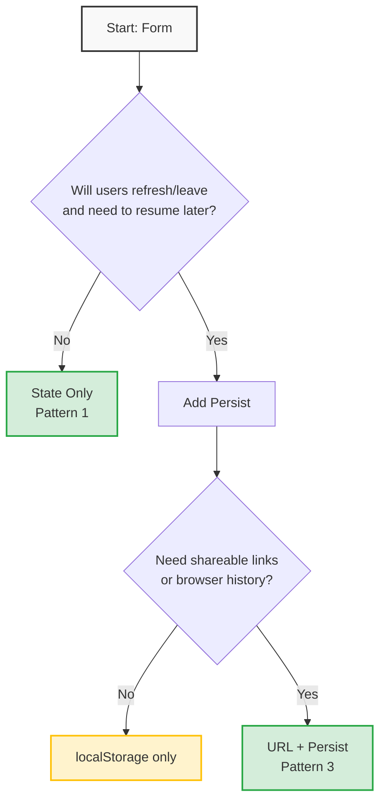

> 💡 **Transparency Note**  
> This series includes examples from `@nexus-state/form`, a library I maintain. I include it to demonstrate an atom-based architectural approach, but I recommend evaluating all tools based on your specific project needs. All patterns shown are framework-agnostic and applicable to any solution.

> 🎓 **What you'll learn in this part:**
>
> - How to build multi-step forms (wizards) with proper state management
> - Implement dynamic forms with conditional fields and schema-driven logic
> - Handle form arrays (repeatable field groups) efficiently
> - Apply accessibility best practices to advanced patterns

> 🧪 **Try it yourself:**  
> [Open StackBlitz Demo](https://stackblitz.com/edit/vitejs-vite-nqzdkeqr)

> 🔗 **Series Roadmap:**
>
> | Part  | Topic                                | Status                        |
> | ----- | ------------------------------------ | ----------------------------- |
> | **1** | Foundations & Core Patterns          | ✅ Published                  |
> | **2** | UX, Accessibility & Performance      | ✅ Published                  |
> | **3** | Multi-step, Dynamic & Array Patterns | ✅ Published ← _you are here_ |
> | **4** | Async Validation & Persistence       | 📅 Planned                    |
> | **5** | Building a Visual Form Builder       | 📅 Planned                    |
> | **6** | Creating a Validation DSL (Finale)   | 📅 Planned                    |
>
> 💡 _New parts published weekly. [Follow @eustatos](https://dev.to/eustatos) to get notified!_

## Introduction

In [Part 1](./react-forms-deep-dive-part-1-foundations-core-patterns), we explored the foundational concepts: Controlled vs. Uncontrolled approaches, validation strategies, schema-based validation, and core architectural patterns.

In [Part 2](./react-forms-deep-dive-part-2-ux-accessibility-performance), we delved into User Experience, Accessibility, and Performance: error handling, WAI-ARIA attributes, keyboard navigation, and performance optimization techniques.

Now, it's time to tackle **Advanced Patterns**. These are the complex scenarios you'll encounter in real-world applications:

- **Multi-step Forms** (wizards) — Breaking down long processes into digestible steps.
- **Dynamic Forms** — Forms that adapt their structure based on user input.
- **Form Arrays** — Managing lists of repeating field groups.

These patterns are crucial for building robust applications like user registration, checkout flows, surveys, and profile management systems. We'll explore how to implement them effectively while maintaining good UX, accessibility, and performance.

---

## 1. Multi-step Forms (Wizards)

Multi-step forms, often called wizards, divide a longer form into several distinct steps. This approach significantly enhances the user experience by reducing cognitive load and perceived complexity.

### Understanding Multi-step Forms

**Definition:**
A form split into sequential, logical sections, where the user completes one step before proceeding to the next.

**Common Use Cases:**

- **User Registration:** Personal info → Account setup → Preferences
- **Checkout Process:** Cart review → Shipping details → Payment method
- **Surveys/Polls:** Demographics → Experience → Feedback
- **Onboarding:** Basic settings → Advanced config → Confirmation

**Benefits:**

- ✅ **Reduced Cognitive Load:** Users focus on a smaller set of fields at a time.
- ✅ **Higher Conversion Rates:** Fewer users abandon shorter, focused steps.
- ✅ **Logical Grouping:** Related fields are presented together.
- ✅ **Progress Indication:** Users understand how far along they are.
- ✅ **Modular Validation:** Each step can be validated independently.

### Pattern 1: State-based Approach

The current step is managed within the component's local React state.

**React Hook Form Example:**

```tsx
import { useForm, SubmitHandler } from 'react-hook-form';
import { zodResolver } from '@hookform/resolvers/zod';
import { z } from 'zod';

// Define schemas for each step
const step1Schema = z.object({
  name: z.string().min(2, "Name must be at least 2 characters"),
  email: z.string().email("Please enter a valid email address"),
});

const step2Schema = z.object({
  address: z.string().min(5, "Address must be at least 5 characters"),
  city: z.string().min(2, "City must be at least 2 characters"),
  zipCode: z.string().regex(/^\d{5}$/, "Zip code must be 5 digits"),
});

const step3Schema = z.object({
  cardNumber: z.string().regex(/^\d{16}$/, "Card number must be 16 digits"),
  cvv: z.string().regex(/^\d{3,4}$/, "CVV must be 3 or 4 digits"),
});

// Union of all schemas for final submission
const fullSchema.merge(step2Schema).merge(step3Schema);
type FormData = z.infer<typeof fullSchema>;

function MultiStepForm() {
  const [step, setStep] = useState(1);

  const {
    register,
    handleSubmit,
    trigger,
    formState: { errors, isSubmitting },
  } = useForm<FormData>({
    mode: 'onChange', // Trigger validation on change
    resolver: zodResolver(
      step === 1 ? step1Schema :
      step === 2 ? step2Schema :
      step3Schema
    ),
  });

  const validateCurrentStep = async (): Promise<boolean> => {
    const fieldsToValidate = Object.keys(
      step === 1 ? step1Schema.shape :
      step === 2 ? step2Schema.shape :
      step3Schema.shape
    );
    return await trigger(fieldsToValidate, { shouldFocus: true });
  };

  const onNext = async () => {
    const isValid = await validateCurrentStep();
    if (isValid && step < 3) {
      setStep(step + 1);
    }
  };

  const onPrev = () => {
    if (step > 1) {
      setStep(step - 1);
    }
  };

  const onSubmit: SubmitHandler<FormData> = async (data) => {
    console.log("Final form data:", data);
    // Submit logic here...
  };

  return (
    <form onSubmit={handleSubmit(onSubmit)}>
      <ProgressIndicator current={step} total={3} />

      {step === 1 && (
        <Step1 register={register} errors={errors} onNext={onNext} />
      )}
      {step === 2 && (
        <Step2
          register={register}
          errors={errors}
          onNext={onNext}
          onPrev={onPrev}
        />
      )}
      {step === 3 && (
        <Step3
          register={register}
          errors={errors}
          onPrev={onPrev}
          isSubmitting={isSubmitting}
        />
      )}
    </form>
  );
}

// Individual step component
function Step1({ register, errors, onNext }: { register: any; errors: any; onNext: () => void }) {
  return (
    <div className="step">
      <h2>Step 1: Personal Information</h2>

      <div className="form-field">
        <label htmlFor="name">Full Name</label>
        <input
          id="name"
          {...register('name')}
          aria-invalid={!!errors.name}
          aria-describedby={errors.name ? "name-error" : undefined}
        />
        {errors.name && (
          <span id="name-error" className="error" role="alert">
            {errors.name.message}
          </span>
        )}
      </div>

      <div className="form-field">
        <label htmlFor="email">Email Address</label>
        <input
          id="email"
          type="email"
          {...register('email')}
          aria-invalid={!!errors.email}
          aria-describedby={errors.email ? "email-error" : undefined}
        />
        {errors.email && (
          <span id="email-error" className="error" role="alert">
            {errors.email.message}
          </span>
        )}
      </div>

      <button type="button" onClick={onNext}>
        Next →
      </button>
    </div>
  );
}

// Step2 and Step3 would follow similar patterns...
```

**Pros:**

- ✅ Straightforward to implement.
- ✅ Full control over navigation and state transitions.
- ✅ Easy to integrate conditional logic.

**Cons:**

- ❌ Data is lost on page refresh.
- ❌ Cannot share a link to a specific step.
- ❌ Browser history back/forward buttons don't navigate steps.

### Pattern 2: URL-based Approach

The current step is reflected in the URL, typically using query parameters or route segments.

**Example with React Router:**

```tsx
import { useSearchParams, useNavigate } from 'react-router-dom';

function MultiStepFormWithRouter() {
  const [searchParams, setSearchParams] = useSearchParams();
  const navigate = useNavigate();
  const stepParam = searchParams.get('step');
  const step = stepParam ? parseInt(stepParam, 10) : 1;

  const goToStep = (newStep: number) => {
    setSearchParams({ step: newStep.toString() });
  };

  const onNext = async () => {
    const isValid = await validateCurrentStep(); // Assume this exists
    if (isValid && step < 3) {
      goToStep(step + 1);
    }
  };

  const onPrev = () => {
    if (step > 1) {
      goToStep(step - 1);
    }
  };

  // Ensure step is within bounds and valid
  useEffect(() => {
    if (isNaN(step) || step < 1 || step > 3) {
      goToStep(1); // Redirect to first step if invalid
    }
  }, [step]);

  // ... rest of the component logic using `step` from URL
}
```

**Pros:**

- ✅ URL persists through page refreshes (step visible in address bar).
- ✅ Allows sharing links directly to a specific step.
- ✅ Integrates naturally with browser history (back/forward buttons).
- ✅ Better for SEO if steps are distinct routes.

**Cons:**

- ❌ More complex to implement due to routing concerns.
- ❌ Requires careful validation to prevent jumping to unauthorized steps.
- ❌ Adds dependency on a routing library.
- ⚠️ **Important:** Form *data* still requires separate persistence (e.g., `localStorage`). See Pattern 3 below.

> ⚠️ **Critical UX Note: URL Sync Requires Data Persistence**
>
> Using URL parameters without data persistence creates a broken user experience:
>
> 1. **Data Loss:** URL shows `?step=3` but all form data is lost on page refresh.
> 2. **Misleading State:** User sees they're on step 3, but the form is empty.
> 3. **Broken Validation:** User can't reach the "saved" step because previous steps now require re-entering data.
>
> **Always pair URL sync with `localStorage`/`sessionStorage` or server-side persistence** when implementing multi-step forms in production. These two mechanisms work in tandem:
> - **URL** handles navigation, sharing, and browser history.
> - **Persist** preserves user progress and form data.

### Accessibility-Focused Progress Indicator

An accessible progress indicator is crucial for conveying the overall process to all users, especially those using screen readers.

```tsx
function ProgressIndicator({
  current,
  total,
}: {
  current: number;
  total: number;
}) {
  const percentage = Math.round((current / total) * 100);

  return (
    <nav aria-label="Form progress">
      <ol className="progress-steps">
        {Array.from({ length: total }, (_, i) => {
          const stepNumber = i + 1;
          const isComplete = stepNumber < current;
          const isCurrent = stepNumber === current;
          const isFuture = stepNumber > current;

          return (
            <li
              key={i}
              className={`step ${isComplete ? 'complete' : ''} ${
                isCurrent ? 'current' : ''
              } ${isFuture ? 'future' : ''}`}
              aria-current={isCurrent ? 'step' : undefined}
            >
              <div className="step-container">
                <span className="step-number" aria-hidden="true">
                  {isComplete ? '✓' : stepNumber}
                </span>
                <span className="step-label">Step {stepNumber}</span>
              </div>
            </li>
          );
        })}
      </ol>
      {/* Optional: Aria-live region for screen reader updates */}
      <span className="sr-only" aria-live="polite">
        Step {current} of {total} ({percentage}% complete)
      </span>
    </nav>
  );
}
```

### Pattern 3: URL + Persistence (Recommended for Production)

The URL-based approach becomes truly powerful when combined with data persistence. This pattern ensures that both the current step *and* the form data survive page refreshes.

**Complete Example with React Router + localStorage:**

```tsx
import { useSearchParams, useNavigate } from 'react-router-dom';
import { useEffect, useState } from 'react';

const STORAGE_KEY = 'checkoutFormData';
const STORAGE_STEP_KEY = 'checkoutFormStep';

function MultiStepFormWithPersist() {
  const [searchParams, setSearchParams] = useSearchParams();
  const navigate = useNavigate();
  const stepParam = searchParams.get('step');
  const step = stepParam ? parseInt(stepParam, 10) : 1;
  
  // Load saved data on mount
  const [formData, setFormData] = useState(() => {
    const savedData = localStorage.getItem(STORAGE_KEY);
    const savedStep = localStorage.getItem(STORAGE_STEP_KEY);
    
    return {
      ...initialData, // Your default form values
      ...(savedData ? JSON.parse(savedData) : {}),
    };
  });
  
  // Save data and step on every change
  useEffect(() => {
    localStorage.setItem(STORAGE_KEY, JSON.stringify(formData));
    localStorage.setItem(STORAGE_STEP_KEY, step.toString());
  }, [formData, step]);
  
  // Validate step bounds and prevent jumping to unauthorized steps
  useEffect(() => {
    const maxReachableStep = calculateMaxReachableStep(formData);
    
    if (isNaN(step) || step < 1 || step > 3) {
      goToStep(1);
    } else if (step > maxReachableStep) {
      // Don't allow jumping to unvalidated steps
      goToStep(maxReachableStep);
    }
  }, [step]);
  
  const goToStep = (newStep: number) => {
    setSearchParams({ step: newStep.toString() });
  };
  
  const validateCurrentStep = async (): Promise<boolean> => {
    // Your validation logic here
    return true;
  };
  
  const onNext = async () => {
    const isValid = await validateCurrentStep();
    if (isValid && step < 3) {
      goToStep(step + 1);
    }
  };
  
  const onPrev = () => {
    if (step > 1) {
      goToStep(step - 1);
    }
  };
  
  const handleSubmit = async (data: FormData) => {
    // Submit to server
    await submitToServer(data);
    
    // Clear storage on successful submission
    localStorage.removeItem(STORAGE_KEY);
    localStorage.removeItem(STORAGE_STEP_KEY);
  };
  
  // Calculate maximum step user can access based on completed validation
  const calculateMaxReachableStep = (data: FormData): number => {
    let maxStep = 1;
    if (isStep1Valid(data)) maxStep = 2;
    if (isStep2Valid(data)) maxStep = 3;
    if (isStep3Valid(data)) maxStep = 4;
    return maxStep;
  };
  
  return (
    <form onSubmit={handleSubmit(formData)}>
      <ProgressIndicator current={step} total={3} />
      
      {step === 1 && (
        <Step1 
          data={formData.step1} 
          onChange={(data) => setFormData({ ...formData, step1: data })}
          onNext={onNext} 
        />
      )}
      {step === 2 && (
        <Step2 
          data={formData.step2} 
          onChange={(data) => setFormData({ ...formData, step2: data })}
          onNext={onNext}
          onPrev={onPrev}
        />
      )}
      {step === 3 && (
        <Step3 
          data={formData.step3} 
          onChange={(data) => setFormData({ ...formData, step3: data })}
          onPrev={onPrev}
        />
      )}
    </form>
  );
}
```

**Benefits of Combined Approach:**

| Feature | URL Only | URL + Persist |
|---------|----------|---------------|
| Step survives refresh | ✅ | ✅ |
| **Data** survives refresh | ❌ | ✅ |
| Shareable link to step | ✅ | ✅ |
| Browser history works | ✅ | ✅ |
| Resume from exact state | ❌ | ✅ |
| Prevents step jumping | ⚠️ Manual | ✅ Validated |

**Best Practices:**

1. **Always validate step transitions** — Don't allow jumping to step 3 if step 2 is invalid.
2. **Clear storage on successful submission** — Prevent stale data from persisting.
3. **Consider session vs. local storage** — `sessionStorage` clears on tab close (more secure), `localStorage` persists longer.
4. **Handle sensitive data carefully** — Don't store passwords or payment info in localStorage.
5. **Sync URL and storage atomically** — Update both in the same `useEffect` to avoid desync.

**When to Use:**

- ✅ **E-commerce checkout** — Users may refresh or navigate away mid-process.
- ✅ **Long onboarding flows** — Multi-session completion is common.
- ✅ **Complex applications** — Where users expect to resume work.
- ❌ **Simple contact forms** — Single-step forms don't need this complexity.

### The `@nexus-state/form` Approach

`@nexus-state/form` provides built-in utilities for managing complex form state, including multi-step workflows.

```tsx
import { createMultiStepForm } from '@nexus-state/form';
import { useAtom } from 'jotai'; // Or your chosen atom library
import { z } from 'zod';

// Define schemas for each step
const schemas = {
  step1: z.object({
    name: z.string().min(2),
    email: z.string().email(),
  }),
  step2: z.object({
    address: z.string().min(5),
    city: z.string().min(2),
  }),
  step3: z.object({
    cardNumber: z.string().regex(/^\d{16}$/),
    cvv: z.string().regex(/^\d{3,4}$/),
  }),
};

// Create the form atom
const formAtom = createMultiStepForm(schemas, {
  step1: { name: '', email: '' },
  step2: { address: '', city: '' },
  step3: { cardNumber: '', cvv: '' },
});

function MultiStepFormNexus() {
  const [formState, formActions] = useAtom(formAtom);

  const handleNext = async () => {
    const result = await formActions.nextStep();
    if (!result.success) {
      console.log('Validation errors:', result.errors);
      // Optionally, focus the first error field
    }
  };

  const handlePrev = () => {
    formActions.prevStep();
  };

  const handleSubmit = async () => {
    const result = await formActions.submit();
    if (result.success) {
      console.log('All data:', result.data);
    } else {
      console.error('Submission errors:', result.errors);
    }
  };

  return (
    <form>
      <ProgressIndicator
        current={formState.currentStep}
        total={formState.totalSteps}
      />

      {formState.currentStep === 1 && (
        <Step1Nexus formActions={formActions} formState={formState} />
      )}
      {formState.currentStep === 2 && (
        <Step2Nexus formActions={formActions} formState={formState} />
      )}
      {formState.currentStep === 3 && (
        <Step3Nexus formActions={formActions} formState={formState} />
      )}

      <div className="navigation-buttons">
        {formState.currentStep > 1 && (
          <button type="button" onClick={handlePrev}>
            ← Previous
          </button>
        )}

        {formState.currentStep < formState.totalSteps ? (
          <button type="button" onClick={handleNext}>
            Next →
          </button>
        ) : (
          <button type="button" onClick={handleSubmit}>
            Submit
          </button>
        )}
      </div>
    </form>
  );
}

// Example step component using nexus-state
function Step1Nexus({ formActions, formState }: any) {
  const {
    register,
    formState: { errors },
  } = useForm({
    defaultValues: formState.steps.step1,
    mode: 'onChange',
  });

  // Sync local form state with global atom state
  useEffect(() => {
    const subscription = formActions.subscribe((newState) => {
      reset(newState.steps.step1);
    });
    return subscription.unsubscribe;
  }, [reset]); // Assuming reset comes from useForm

  return (
    <div className="step">
      <h2>Step 1: Personal Information</h2>
      {/* Register fields using RHF hooks */}
      <div className="form-field">
        <label htmlFor="name">Name</label>
        <input
          id="name"
          {...register('name', { required: 'Name is required' })}
          onChange={(e) =>
            formActions.updateField('step1', 'name', e.target.value)
          }
        />
        {errors.name && <span className="error">{errors.name.message}</span>}
      </div>
      {/* ... other fields */}
    </div>
  );
}
```

**Pros of `@nexus-state/form`:**

- ✅ Built-in state management for steps and data.
- ✅ Automatic validation per step.
- ✅ Facilitates complex debugging and state inspection (Time Travel).
- ✅ Reduces boilerplate code significantly.

---

## Choosing Your Approach: Libraries vs. Patterns

Before comparing options, it's important to distinguish between **tools** (libraries you import) and **strategies** (architectural patterns you implement).

- **Libraries** handle form state management and validation.
- **Persistence patterns** determine how form data survives page refreshes and enables navigation.

You can combine **any library** with **any persistence pattern** based on your project needs.

### Table 1: Form Libraries Comparison

| Feature                     | React Hook Form (RHF)                   | `@nexus-state/form`                                |
| --------------------------- | --------------------------------------- | -------------------------------------------------- |
| Built-in Multi-step Support | ❌ Manual                               | ✅ Built-in                                        |
| State Management            | `useState` for step, `useForm` for data | `useAtom` for entire form state                    |
| Validation per Step         | `resolver` switch, `trigger()`          | `formActions.nextStep()` validates current step    |
| Progress Tracking           | Manual state (`step`)                   | `formState.currentStep`, `formState.totalSteps`    |
| Data Persistence            | Manual (e.g., localStorage)             | ✅ Automatic within atom                           |
| Navigation                  | Manual `setStep` calls                  | `formActions.nextStep()`, `formActions.prevStep()` |
| Boilerplate                 | High                                    | Low                                                |

### Table 2: Persistence Strategies Comparison

| Feature                   | State Only (Pattern 1) | URL Sync (Pattern 2) | URL + Persist (Pattern 3) |
| ------------------------- | ---------------------- | -------------------- | ------------------------- |
| Step survives refresh     | ❌ No                  | ✅ Yes (URL only)    | ✅ Yes                    |
| **Data** survives refresh | ❌ No                  | ❌ No                | ✅ Yes                    |
| Shareable link to step    | ❌ No                  | ✅ Yes               | ✅ Yes                    |
| Browser history works     | ❌ No                  | ✅ Yes               | ✅ Yes                    |
| Resume from exact state   | ❌ No                  | ❌ No                | ✅ Yes                    |
| Prevents step jumping     | ⚠️ Manual             | ⚠️ Manual            | ✅ Validated              |
| Implementation complexity | Low                    | Medium               | High                      |
| Best for                  | Simple internal forms  | Read-only wizards    | Production checkout flows |

---

## Recommended Combinations

> 💡 **Note:** These are **starting points, not prescriptions**. Your specific requirements (data criticality, user expectations, technical constraints) should drive the final decision.

### Quick Decision Guide

Before looking at specific use cases, ask yourself:

1. **Will users abandon and resume later?** → Yes = Need Persist
2. **Is form data critical (payment, legal, medical)?** → Yes = Need Persist
3. **Do users need to share links to specific steps?** → Yes = Need URL
4. **Is this a simple internal tool (<10 fields, single session)?** → Yes = State Only OK
5. **Will users likely refresh/navigate away mid-form?** → Yes = Need Persist

### Common Use Case Patterns

| Use Case                      | Library              | Persistence Pattern      | Why                                                                 |
| ----------------------------- | -------------------- | ------------------------ | ------------------------------------------------------------------- |
| **Contact form**              | React Hook Form      | State Only               | Simple, 3-5 fields, no need to persist                              |
| **Internal survey**           | React Hook Form      | State Only **or** URL + Persist | **<10 fields:** State OK. **Long survey:** Add persist for resilience |
| **User onboarding**           | `@nexus-state/form`  | URL + Persist            | Multi-session, users expect to resume over days/weeks               |
| **E-commerce checkout**       | Any library          | URL + Persist            | Critical: don't lose cart data on refresh; legal/financial data     |
| **Shareable configuration**   | Any library          | URL + Persist            | Users need to share links to specific steps                         |
| **Admin wizard (internal)**   | React Hook Form      | URL Sync **or** URL + Persist | **If data loss is acceptable:** URL only. **If not:** Add persist   |
| **Multi-page application**    | Any library          | URL + Persist + Backend  | Critical workflows need server-side persistence as backup           |
| **Healthcare/Patient intake** | Any library          | URL + Persist + Backend  | Legal/compliance requirements; data loss is not acceptable          |

### Decision Flow



> 💡 **How to read this flow:**
> - **Green boxes** = Recommended for production (data survives refresh)
> - **Yellow box** = Works, but data lost on refresh
> - Start at the top and follow the decisions based on your requirements

> 💡 **Key Takeaway:** For production multi-step forms where users might refresh, navigate away, or need to resume later, **always combine URL sync with data persistence** (Pattern 3). This works with any form library.

---

## 2. Dynamic Forms

Dynamic forms adapt their structure based on user input. Fields, sections, or even validation rules can appear, disappear, or change depending on selections made earlier in the form.

### Understanding Dynamic Forms

**Definition:**
Forms whose structure, content, or validation logic changes dynamically based on user interactions or data.

**Common Use Cases:**

- **Conditional Questions:** "Do you have a driver's license?" → Show license number field.
- **Product Configuration:** Options depend on selected model or category.
- **Search Filters:** Additional filters appear based on primary category.
- **Multi-type Forms:** Different fields based on "Request Type" dropdown.

**Benefits:**

- ✅ **Contextual Relevance:** Only shows necessary fields.
- ✅ **Simplified UI:** Hides complexity until needed.
- ✅ **Improved Data Quality:** Reduces irrelevant input.

### Pattern 1: Conditional Rendering

The most straightforward approach using `useEffect` or direct conditional logic in JSX.

```tsx
import { useForm, useWatch } from 'react-hook-form';

function DynamicForm() {
  const {
    register,
    control,
    watch,
    formState: { errors },
  } = useForm();

  // Watch specific fields to trigger re-renders
  const vehicleType = useWatch({ control, name: 'vehicleType' });
  const hasInsurance = useWatch({ control, name: 'hasInsurance' });

  return (
    <form>
      <div className="form-field">
        <label htmlFor="vehicleType">Vehicle Type</label>
        <select id="vehicleType" {...register('vehicleType')}>
          <option value="">Select type...</option>
          <option value="car">Car</option>
          <option value="boat">Boat</option>
          <option value="motorcycle">Motorcycle</option>
        </select>
      </div>

      {/* Conditional field based on vehicleType */}
      {(vehicleType === 'car' || vehicleType === 'motorcycle') && (
        <div className="form-field">
          <label htmlFor="wheels">Number of Wheels</label>
          <input
            id="wheels"
            type="number"
            {...register('wheels', {
              required: vehicleType
                ? 'Wheels required for selected type'
                : false,
              min: { value: 2, message: 'Must have at least 2 wheels' },
              max: {
                value: 4,
                message: 'Cars/motorcycles usually have 2-4 wheels',
              },
            })}
            aria-invalid={!!errors.wheels}
            aria-describedby={errors.wheels ? 'wheels-error' : undefined}
          />
          {errors.wheels && (
            <span id="wheels-error" className="error" role="alert">
              {errors.wheels.message}
            </span>
          )}
        </div>
      )}

      {/* Another conditional field */}
      {vehicleType === 'boat' && (
        <div className="form-field">
          <label htmlFor="length">Length (in feet)</label>
          <input
            id="length"
            type="number"
            {...register('length', {
              required: 'Length required for boats',
              min: { value: 10, message: 'Boats must be at least 10 feet' },
            })}
            aria-invalid={!!errors.length}
            aria-describedby={errors.length ? 'length-error' : undefined}
          />
          {errors.length && (
            <span id="length-error" className="error" role="alert">
              {errors.length.message}
            </span>
          )}
        </div>
      )}

      {/* Nested conditionality */}
      <div className="form-field">
        <label>
          <input type="checkbox" {...register('hasInsurance')} />I have
          insurance
        </label>
      </div>

      {hasInsurance && (
        <div className="form-field">
          <label htmlFor="insuranceProvider">Insurance Provider</label>
          <input
            id="insuranceProvider"
            {...register('insuranceProvider', {
              required: hasInsurance ? 'Insurance provider required' : false,
            })}
            aria-invalid={!!errors.insuranceProvider}
            aria-describedby={
              errors.insuranceProvider ? 'insurance-error' : undefined
            }
          />
          {errors.insuranceProvider && (
            <span id="insurance-error" className="error" role="alert">
              {errors.insuranceProvider.message}
            </span>
          )}
        </div>
      )}

      <button type="submit">Submit</button>
    </form>
  );
}
```

### Pattern 2: Schema-driven

For more complex forms, defining the structure and conditions declaratively in a schema can be more maintainable.

```tsx
interface FieldConfig {
  name: string;
  type: 'text' | 'number' | 'select' | 'checkbox' | 'radio';
  label: string;
  options?: Array<{ value: string; label: string }>;
  visible?: (formData: Record<string, any>) => boolean;
  required?: boolean | ((formData: Record<string, any>) => boolean);
  validation?: any; // Could be a Zod schema or Yup schema
  dependencies?: string[]; // Fields this one depends on for visibility/validation
}

const dynamicFormSchema: FieldConfig[] = [
  {
    name: 'vehicleType',
    type: 'select',
    label: 'Vehicle Type',
    options: [
      { value: 'car', label: 'Car' },
      { value: 'boat', label: 'Boat' },
      { value: 'motorcycle', label: 'Motorcycle' },
    ],
    required: true,
  },
  {
    name: 'wheels',
    type: 'number',
    label: 'Number of Wheels',
    visible: (values) => ['car', 'motorcycle'].includes(values.vehicleType),
    required: (values) => ['car', 'motorcycle'].includes(values.vehicleType),
    validation: { min: 2, max: 4 },
    dependencies: ['vehicleType'], // This fieldType'
  },
  {
    name: 'length',
    type: 'number',
    label: 'Length (ft)',
    visible: (values) => values.vehicleType === 'boat',
    required: (values) => values.vehicleType === 'boat',
    validation: { min: 10 },
    dependencies: ['vehicleType'],
  },
  {
    name: 'hasInsurance',
    type: 'checkbox',
    label: 'I have insurance',
  },
  {
    name: 'insuranceProvider',
    type: 'text',
    label: 'Insurance Provider',
    visible: (values) => !!values.hasInsurance,
    required: (values) => !!values.hasInsurance,
    dependencies: ['hasInsurance'],
  },
];

function SchemaDrivenDynamicForm({ schema }: { schema: FieldConfig[] }) {
  const [formData, setFormData] = useState<Record<string, any>>({});
  const [errors, setErrors] = useState<Record<string, string>>({});

  // Calculate which fields are currently visible based on the schema and current data
  const visibleFields = useMemo(() => {
    return schema.filter((field) => !field.visible || field.visible(formData));
  }, [formData, schema]);

  const handleChange = (name: string, value: any) => {
    setFormData((prev) => ({
      ...prev,
      [name]: value,
    }));
  };

  const validate = () => {
    const newErrors: Record<string, string> = {};

    schema.forEach((field) => {
      // Only validate if the field is currently visible
      if (!visibleFields.some((vf) => vf.name === field.name)) {
        return;
      }

      const value = formData[field.name];
      const isRequired =
        typeof field.required === 'function'
          ? field.required(formData)
          : field.required;

      if (isRequired && (!value || String(value).trim() === '')) {
        newErrors[field.name] = `${field.label} is required.`;
      }

      // Add more specific validation based on 'validation' property
      if (field.validation && value !== undefined && value !== '') {
        if (field.validation.min && value < field.validation.min) {
          newErrors[field.name] = `Must be at least ${field.validation.min}.`;
        }
        if (field.validation.max && value > field.validation.max) {
          newErrors[field.name] =
            `Must be no more than ${field.validation.max}.`;
        }
      }
    });

    setErrors(newErrors);
    return Object.keys(newErrors).length === 0;
  };

  const handleSubmit = (e: React.FormEvent) => {
    e.preventDefault();
    const isValid = validate();
    if (isValid) {
      console.log('Form Data:', formData);
    }
  };

  return (
    <form onSubmit={handleSubmit}>
      {visibleFields.map((field) => {
        const isRequired =
          typeof field.required === 'function'
            ? field.required(formData)
            : field.required;

        return (
          <div key={field.name} className="form-field">
            <label htmlFor={field.name}>
              {field.label}
              {isRequired && <span className="required-indicator">*</span>}
            </label>

            {field.type === 'select' ? (
              <select
                id={field.name}
                value={formData[field.name] || ''}
                onChange={(e) => handleChange(field.name, e.target.value)}
              >
                <option value="">Select...</option>
                {field.options?.map((opt) => (
                  <option key={opt.value} value={opt.value}>
                    {opt.label}
                  </option>
                ))}
              </select>
            ) : field.type === 'checkbox' ? (
              <label>
                <input
                  type="checkbox"
                  checked={!!formData[field.name]}
                  onChange={(e) => handleChange(field.name, e.target.checked)}
                />
                {field.label}
              </label>
            ) : (
              <input
                id={field.name}
                type={field.type}
                value={formData[field.name] ?? ''}
                onChange={(e) => handleChange(field.name, e.target.value)}
              />
            )}

            {errors[field.name] && (
              <span className="error" role="alert">
                {errors[field.name]}
              </span>
            )}
          </div>
        );
      })}
      <button type="submit">Submit</button>
    </form>
  );
}
```

### The Hidden Field Data Loss Problem

When working with dynamic forms, a critical issue arises: **what happens to a field's value when it becomes hidden?**

#### Why This Matters

Consider this scenario:

```
1. User selects "Car" → shows "Number of Wheels" field
2. User enters "4" in "Number of Wheels"
3. User changes selection to "Boat" → "Number of Wheels" hides
4. ❌ Problem A: Value is cleared immediately (data loss)
5. User changes back to "Car" → "Number of Wheels" reappears
6. ❌ Problem B: Field is now empty — user must re-enter data
```

**This creates several problems:**

| Problem | Client-Side Impact | Server-Side Impact |
|---------|-------------------|-------------------|
| **Data loss on hide** | User frustration, must re-enter data | N/A (data never sent) |
| **Validation skipped** | Hidden field with invalid value → form submits with errors | Server receives invalid data, rejects request |
| **Dependent fields break** | Field B depends on hidden Field A → B validates against wrong data | Server validation logic differs from client |
| **Partial data submission** | Form submits without hidden field values | Backend expects complete data, gets `undefined` |

#### Real-World Example: Broken Validation

```tsx
// ❌ BAD: Validation assumes field always exists
const schema = z.object({
  vehicleType: z.string(),
  wheels: z.number().min(2), // Required even when hidden!
  length: z.number().min(10), // Required even when hidden!
});

// User flow:
// 1. Selects "Car" → enters wheels: 4
// 2. Switches to "Boat" → wheels field hides, value cleared
// 3. Submits form
// 4. Client validation: passes (wheels not validated when hidden)
// 5. Server validation: ❌ FAILS (wheels is required but undefined)
```

#### The Correct Approach: Conditional Validation + Data Preservation

```tsx
// ✅ GOOD: Validation matches visibility logic
const schema = z.object({
  vehicleType: z.string(),
  wheels: z.number().min(2).optional(), // Optional when hidden
  length: z.number().min(10).optional(), // Optional when hidden
});

// Preserve data even when hidden
const [formData, setFormData] = useState({
  vehicleType: '',
  wheels: undefined, // Keep value, don't clear
  length: undefined,
});

// Only validate visible fields
const validateVisibleFields = (data, visibleFields) => {
  const errors = {};
  
  if (visibleFields.includes('wheels') && data.wheels) {
    if (data.wheels < 2) errors.wheels = 'Minimum 2 wheels';
  }
  
  if (visibleFields.includes('length') && data.length) {
    if (data.length < 10) errors.length = 'Minimum 10 feet';
  }
  
  return errors;
};
```

### Recommended Strategy: Send Only Changed Fields

**Core Principle:**

> Send only what the user changed. Visibility is a UI concern; dirty state is a data concern.

This means:
- **Track which fields were modified** (dirty checking)
- **Send only dirty fields** to the server
- **Visibility doesn't matter** — a changed field is sent whether visible or hidden

#### Why This Strategy?

| Alternative | Problem |
|-------------|---------|
| Send all fields | Wastes bandwidth, may send stale data |
| Send only visible fields | Loses user input if they changed then hid |
| Send nothing for hidden | Loses legitimate changes |

#### Implementation: Dirty Checking

```tsx
function DynamicForm() {
  const [values, setValues] = useState({
    vehicleType: 'car',
    wheels: undefined,
    length: undefined,
  });
  
  // Track which fields were modified
  const [dirty, setDirty] = useState<Record<string, boolean>>({});
  
  const handleChange = (field: string, value: any) => {
    setValues(prev => ({ ...prev, [field]: value }));
    setDirty(prev => ({ ...prev, [field]: true })); // ← Mark as changed
  };
  
  const handleSubmit = async () => {
    // ✅ Send ONLY dirty fields
    const payload = Object.fromEntries(
      Object.entries(values).filter(([key]) => dirty[key])
    );
    
    // Example: { vehicleType: 'boat', length: 15 }
    // wheels not included if user never changed it
    
    await fetch('/api/vehicle-form', {
      method: 'PATCH',
      headers: { 'Content-Type': 'application/json' },
      body: JSON.stringify(payload),
    });
  };
  
  // ... render logic
}
```

#### Decision Matrix

| Field State | Dirty | Visible | Send on Submit? | Why |
|-------------|-------|---------|-----------------|-----|
| User never touched | ❌ No | ✅ Yes | ❌ No | No change to save |
| User never touched | ❌ No | ❌ No | ❌ No | No change |
| User changed | ✅ Yes | ✅ Yes | ✅ Yes | User confirmed |
| User changed, then hid | ✅ Yes | ❌ No | ✅ Yes | User changed it (default) |

> 💡 **"Changed then Hidden" Case:**
>
> If user entered a value, then hid the field — we still send it. They explicitly changed the data. If they wanted to "undo", they should clear the field before hiding.
>
> For critical workflows, you can add a confirmation dialog or make this configurable per field.

### Server-Side Requirements

For this strategy to work, your server must support **partial updates**:

#### PATCH Endpoint (Recommended)

```typescript
// Server (Node.js/Express + Zod):
app.patch('/api/vehicle/:id', async (req, res) => {
  const { id } = req.params;
  const updates = req.body; // Partial data: { vehicleType: 'boat', length: 15 }
  
  // Fetch current state from DB
  const current = await db.vehicle.findUnique({ where: { id } });
  
  // Merge: current + updates
  const merged = { ...current, ...updates };
  
  // Validate merged result with conditional logic
  const schema = z.object({
    vehicleType: z.enum(['car', 'boat', 'motorcycle']),
    wheels: z.number().min(2).optional(),
    length: z.number().min(10).optional(),
  }).refine((data) => {
    if (data.vehicleType === 'car' && !data.wheels) return false;
    if (data.vehicleType === 'boat' && !data.length) return false;
    return true;
  });
  
  const result = schema.safeParse(merged);
  
  if (!result.success) {
    return res.status(400).json({ errors: result.error.errors });
  }
  
  // Save and return updated record
  const updated = await db.vehicle.update({ where: { id }, data: merged });
  res.json(updated);
});
```

#### Why Not PUT?

| Method | Semantics | Works with Dirty Checking? |
|--------|-----------|---------------------------|
| **PATCH** | Partial update | ✅ Yes — sends only changes |
| **PUT** | Full replacement | ❌ No — requires all fields |

If you only have PUT endpoints, you'll need to send complete state. In that case, use the "Preserve All" approach and let the server ignore irrelevant fields.

### Legacy API Constraints

> 💡 **If your server doesn't support PATCH:**
>
> - **Option A:** Send all fields, server ignores irrelevant (requires flexible backend)
> - **Option B:** Clear hidden fields before submit (loses some data)
>
> These are workarounds. The recommended approach is dirty checking + PATCH.

### Best Practices for Dynamic Forms

1.  **Track Dirty State:** Use dirty checking to know what actually changed, not just what's visible.

2.  **Validate Conditionally:** Only validate fields that are relevant based on current form state (both client and server).

3.  **Use PATCH Endpoints:** Design your API to accept partial updates. This aligns with the dirty checking strategy.

4.  **Preserve Data on Hide:** Don't clear field values when hiding — you'll need them if the field reappears or for submission.

5.  **Accessibility:** Use `aria-hidden` on container elements that are visually hidden to prevent screen readers from accessing them.

    ```tsx
    <div
      style={{ display: isVisible ? 'block' : 'none' }}
      aria-hidden={!isVisible}
    >
      <input {...register('conditionalField')} />
    </div>
    ```

6.  **Clear Labels:** Ensure labels clearly indicate the relationship between conditional fields and their parent conditions (e.g., "Insurance Provider (required if insured)").

---

## 3. Form Arrays

Form Arrays allow users to manage lists adding, removing, and editing multiple entries within a single form.

### Understanding Form Arrays

**Definition:**
Groups of form fields that can be repeated dynamically, allowing users to add or remove sets of related data.

**Common Use Cases:**

- **Contact Lists:** Multiple email addresses, phone numbers.
- **Skills/Interests:** Adding/removing skill tags.
- **Order Items:** Adding/removing products in a shopping cart form.
- **Work History/Education:** Multiple job or school entries.

### React Hook Form: `useFieldArray`

RHF provides a powerful hook specifically for managing dynamic lists of fields.

**Basic Example:**

```tsx
import { useForm, useFieldArray } from 'react-hook-form';

interface FormData {
  emails: { value: string }[];
}

function EmailListForm() {
  const {
    register,
    control,
    handleSubmit,
    formState: { errors },
  } = useForm<FormData>({
    defaultValues: {
      emails: [{ value: '' }], // Start with one empty field
    },
  });

  const { fields, append, remove } = useFieldArray({
    control,
    name: 'emails',
  });

  const onSubmit = (data: FormData) => {
    console.log('Emails:', data.emails);
  };

  return (
    <form onSubmit={handleSubmit(onSubmit)}>
      <h2>Email Addresses</h2>
      {fields.map((field, index) => (
        <div key={field.id} className="array-item">
          {' '}
          {/* Use field.id for key! */}
          <div className="form-field">
            <label htmlFor={`emails.${index}.value`}>Email {index + 1}</label>
            <input
              id={`emails.${index}.value`}
              {...register(`emails.${index}.value`, {
                required: 'Email is required',
                pattern: {
                  value: /^[A-Z0-9._%+-]+@[A-Z0-9.-]+\.[A-Z]{2,}$/i,
                  message: 'Invalid email address',
                },
              })}
              aria-invalid={!!errors.emails?.[index]?.value}
              aria-describedby={
                errors.emails?.[index]?.value
                  ? `email-${index}-error`
                  : undefined
              }
            />
            {errors.emails?.[index]?.value && (
              <span id={`email-${index}-error`} className="error" role="alert">
                {errors.emails[index]?.value?.message}
              </span>
            )}
          </div>
          {fields.length > 1 && ( // Prevent removal of last item
            <button type="button" onClick={() => remove(index)}>
              Remove
            </button>
          )}
        </div>
      ))}

      <button type="button" onClick={() => append({ value: '' })}>
        + Add Email
      </button>

      <button type="submit">Submit</button>
    </form>
  );
}
```

### Common Operations with `useFieldArray`

The hook provides several utility functions:

- `append(value)`: Add a new item to the end.
- `prepend(value)`: Add a new item to the beginning.
- `insert(index, value)`: Insert a new item at a specific index.
- `remove(index)`: Remove an item at a specific index.
- `swap(indexA, indexB)`: Swap two items.
- `move(from, to)`: Move an item from one index to another.
- `update(index, value)`: Update an item at a specific index.

### Complex Example: Work Experience

```tsx
interface Experience {
  company: string;
  position: string;
  startDate: string;
  endDate: string;
  current: boolean;
  description: string;
}

interface FormData {
  experiences: Experience[];
}

function WorkExperienceForm() {
  const {
    register,
    control,
    watch,
    handleSubmit,
    formState: { errors },
  } = useForm<FormData>({
    defaultValues: {
      experiences: [
        {
          company: '',
          position: '',
          startDate: '',
          endDate: '',
          current: false,
          description: '',
        },
      ],
    },
  });

  const { fields, append, remove } = useFieldArray({
    control,
    name: 'experiences',
  });

  const onSubmit = (data: FormData) => {
    console.log('Experiences:', data.experiences);
  };

  return (
    <form onSubmit={handleSubmit(onSubmit)}>
      <h2>Work Experience</h2>

      {fields.map((field, index) => {
        // Watch the 'current' field for this specific entry
        const isCurrent = watch(`experiences.${index}.current`);

        return (
          <div key={field.id} className="experience-item">
            {' '}
            {/* Use field.id! */}
            <h3>Experience {index + 1}</h3>
            <div className="form-field">
              <label htmlFor={`experiences.${index}.company`}>Company *</label>
              <input
                id={`experiences.${index}.company`}
                {...register(`experiences.${index}.company`, {
                  required: 'Company is required',
                })}
                aria-invalid={!!errors.experiences?.[index]?.company}
                aria-describedby={
                  errors.experiences?.[index]?.company
                    ? `exp-${index}-company-error`
                    : undefined
                }
              />
              {errors.experiences?.[index]?.company && (
                <span
                  id={`exp-${index}-company-error`}
                  className="error"
                  role="alert"
                >
                  {errors.experiences[index]?.company?.message}
                </span>
              )}
            </div>
            <div className="form-field">
              <label htmlFor={`experiences.${index}.position`}>
                Position *
              </label>
              <input
                id={`experiences.${index}.position`}
                {...register(`experiences.${index}.position`, {
                  required: 'Position is required',
                })}
                aria-invalid={!!errors.experiences?.[index]?.position}
                aria-describedby={
                  errors.experiences?.[index]?.position
                    ? `exp-${index}-pos-error`
                    : undefined
                }
              />
              {errors.experiences?.[index]?.position && (
                <span
                  id={`exp-${index}-pos-error`}
                  className="error"
                  role="alert"
                >
                  {errors.experiences[index]?.position?.message}
                </span>
              )}
            </div>
            <div className="form-field">
              <label htmlFor={`experiences.${index}.startDate`}>
                Start Date *
              </label>
              <input
                id={`experiences.${index}.startDate`}
                type="date"
                {...register(`experiences.${index}.startDate`, {
                  required: 'Start date is required',
                })}
                aria-invalid={!!errors.experiences?.[index]?.startDate}
                aria-describedby={
                  errors.experiences?.[index]?.startDate
                    ? `exp-${index}-start-error`
                    : undefined
                }
              />
              {errors.experiences?.[index]?.startDate && (
                <span
                  id={`exp-${index}-start-error`}
                  className="error"
                  role="alert"
                >
                  {errors.experiences[index]?.startDate?.message}
                </span>
              )}
            </div>
            <div className="form-field">
              <label>
                <input
                  type="checkbox"
                  {...register(`experiences.${index}.current`)}
                />
                I currently work here
              </label>
            </div>
            {!isCurrent && ( // Conditionally render end date
              <div className="form-field">
                <label htmlFor={`experiences.${index}.endDate`}>
                  End Date *
                </label>
                <input
                  id={`experiences.${index}.endDate`}
                  type="date"
                  {...register(`experiences.${index}.endDate`, {
                    required: !isCurrent ? 'End date is required' : false,
                  })}
                  aria-invalid={!!errors.experiences?.[index]?.endDate}
                  aria-describedby={
                    errors.experiences?.[index]?.endDate
                      ? `exp-${index}-end-error`
                      : undefined
                  }
                />
                {errors.experiences?.[index]?.endDate && (
                  <span
                    id={`exp-${index}-end-error`}
                    className="error"
                    role="alert"
                  >
                    {errors.experiences[index]?.endDate?.message}
                  </span>
                )}
              </div>
            )}
            <div className="form-field">
              <label htmlFor={`experiences.${index}.description`}>
                Description
              </label>
              <textarea
                id={`experiences.${index}.description`}
                {...register(`experiences.${index}.description`)}
                rows={4}
              />
            </div>
            {fields.length > 1 && ( // Prevent deletion of the last item
              <button type="button" onClick={() => remove(index)}>
                Remove Experience
              </button>
            )}
          </div>
        );
      })}

      <button
        type="button"
        onClick={() =>
          append({
            company: '',
            position: '',
            startDate: '',
            endDate: '',
            current: false,
            description: '',
          })
        }
      >
        + Add Experience
      </button>

      <button type="submit">Submit</button>
    </form>
  );
}
```

### Best Practices for Form Arrays

1.  **Always Use `field.id` as Key:** Never use the `index` as the `key` prop when mapping over `fields`. RHF generates a unique `id` for each field. Using `index` can break React's reconciliation process when items are added, removed, or reordered.

    ```tsx
    // ✅ Correct
    {
      fields.map((field, index) => <div key={field.id}>...</div>);
    }

    // ❌ Incorrect
    {
      fields.map((field, index) => <div key={index}>...</div>);
    }
    ```

2.  **Prevent Removing Last Item:** Often, you want at least one item in the array. Disable the "remove" button if `fields.length <= 1`.

3.  **Handle Validation Errors:** Access validation errors for array items using the nested path (e.g., `errors.items?.[index]?.value`).

4.  **Accessibility for Add/Remove:** Clearly label add/remove buttons (e.g., "Remove Experience 2"). Consider using `aria-describedby` to link buttons to the group they affect.

### `@nexus-state/form` Approach for Arrays

While `@nexus-state/form` doesn't have a direct equivalent to `useFieldArray` in its public API as shown in the draft, its atom-based nature allows for fine-grained control over complex nested state, including arrays. The core concept involves creating atoms that manage the array state itself, enabling efficient updates and inspections.

---

## Conclusion & What's Next

In this third part, we've explored three essential advanced form patterns:

- **Multi-step Forms:** We covered state-based and URL-based approaches, the importance of an accessible progress indicator, and how `@nexus-state/form` simplifies the process.
- **Dynamic Forms:** We looked at conditional rendering and schema-driven patterns, emphasizing data preservation, conditional validation, and accessibility.
- **Form Arrays:** We learned how to manage repeating field groups using RHF's `useFieldArray`, focusing on correct key usage and validation.

These patterns are fundamental for building sophisticated, user-friendly forms. Remember that regardless of the complexity, principles from Part 2 (Accessibility, UX, Performance) remain paramount.

### Coming Up in the Series

**Part 4: Async Validation & Persistence**  
→ Deep dive into cross-field validation, debouncing strategies for server-side checks, auto-saving, and integrating with data fetching libraries like TanStack Query.

**Part 5: Building a Visual Form Builder**  
→ Architecting a schema-driven builder, implementing drag-and-drop UI, managing a component registry, and exporting configurations to code.

**Part 6: Creating a Validation DSL (Finale)**  
→ Designing a custom Domain Specific Language for validation rules, implementing a parser, and connecting it to our form state management.

## Resources & Further Reading

### Documentation

- [React Hook Form: useFieldArray](https://react-hook-form.com/api/usefieldarray)
- [Smashing Magazine: Better Form Design - One Thing Per Page](https://www.smashingmagazine.com/2017/05/better-form-design-one-thing-per-page/)
- [WAI-ARIA Authoring Practices](https://www.w3.org/WAI/ARIA/apg/)

### Tools

- [StackBlitz Demo](https://stackblitz.com/edit/vitejs-vite-nqzdkeqr) — Interactive playground
- [Zod](https://zod.dev/) • [Yup](https://github.com/jquense/yup)
- [axe-core](https://github.com/dequelabs/axe-core) — Accessibility testing

> 💬 **Feedback welcome!**  
> Found an error? Have a suggestion? Open an issue on [GitHub](https://github.com/eustatos/nexus-state/issues) or leave a comment below. Let's build better forms together.
