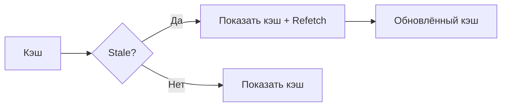
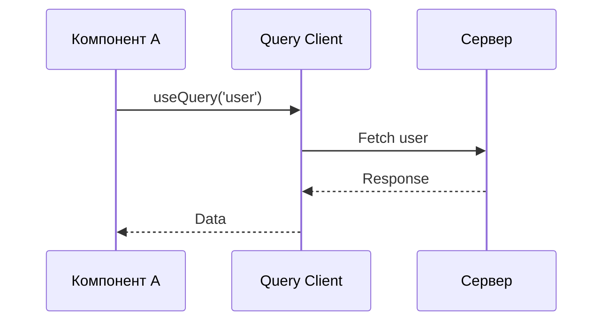
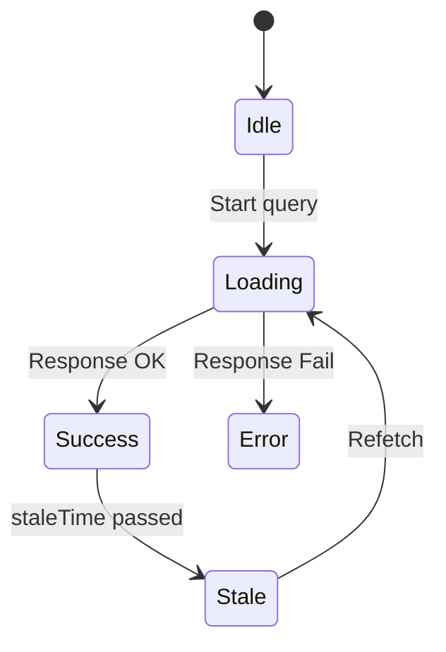
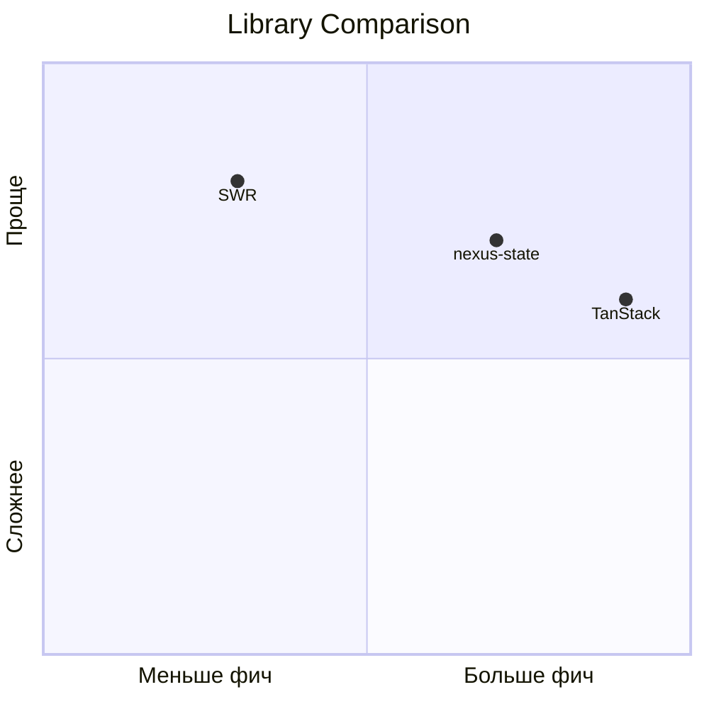

# Фаза 3: Написание черновика

**Длительность:** 4 недели (20 рабочих дней)  
**Статус:** ⏳ Pending

---

## ⏱️ Оценка времени

| Компонент | Время | Примечания |
|-----------|-------|------------|
| **Инфраструктура примеров** | ~8 часов | Gist (5) + CodeSandbox (4) + GitHub Repo (2) |
| **Написание Части 1** | ~36 часов | 7,200 слов |
| **Написание Части 2** | ~34 часа | 7,800 слов |
| **Диаграммы Mermaid** | ~6 часов | 13 диаграмм |
| **Иллюстрации SVG/PNG** | ~3 часа | 3 иллюстрации |
| **Интеграция и тесты** | ~6 часов | Ссылки, проверка, бейджи |
| **Ревью и правки** | ~20 часов | 5 дней |
| **Итого** | **~113 часов** | ~28 рабочих дней |

---

## 🎯 Цели фазы

1. Написать полный черновик Части 1
2. Написать полный черновик Части 2
3. Подготовить все примеры кода
4. Создать черновики иллюстраций
5. Создать инфраструктуру для примеров (Gist + CodeSandbox)

---

## 📋 Задачи

### 3.1. Написание Части 1 (Теория)

| # | Раздел | Объём (слов) | Длительность | Статус |
|---|--------|--------------|--------------|--------|
| 1 | Введение | 300-400 | 2 часа | ⬜ Todo |
| 2 | Server State vs Client State | 500-600 | 3 часа | ⬜ Todo |
| 3 | Query Caching | 800-1000 | 4 часа | ⬜ Todo |
| 4 | Request Deduplication | 400-500 | 2 часа | ⬜ Todo |
| 5 | Background Refetching | 600-700 | 3 часа | ⬜ Todo |
| 6 | React Suspense | 1000-1200 | 5 часов | ⬜ Todo |
| 7 | Infinite Queries | 800-1000 | 4 часа | ⬜ Todo |
| 8 | Optimistic Updates | 600-700 | 3 часа | ⬜ Todo |
| 9 | Mutations & Invalidation | 700-800 | 3 часа | ⬜ Todo |
| 10 | Prefetching Strategies | 800-1000 | 4 часа | ⬜ Todo |
| 11 | Error Handling | 600-700 | 3 часа | ⬜ Todo |
| 12 | Anti-patterns | 500-600 | 2 часа | ⬜ Todo |
| 13 | Заключение | 200-300 | 1 час | ⬜ Todo |
| | **Итого** | **~7000** | **~36 часов** | |

### 3.2. Написание Части 2 (Практика)

| # | Раздел | Объём (слов) | Длительность | Статус |
|---|--------|--------------|--------------|--------|
| 1 | Введение + Критерии | 400-500 | 2 часа | ⬜ Todo |
| 2 | Сравнительная матрица | 300-400 | 2 часа | ⬜ Todo |
| 3 | TanStack Query раздел | 1200-1500 | 6 часов | ⬜ Todo |
| 4 | SWR раздел | 1000-1200 | 5 часов | ⬜ Todo |
| 5 | @nexus-state/query раздел | 1200-1500 | 6 часов | ⬜ Todo |
| 6 | Apollo Client раздел | 800-1000 | 4 часа | ⬜ Todo |
| 7 | RTK Query раздел | 800-1000 | 4 часа | ⬜ Todo |
| 8 | Итоговое сравнение | 600-800 | 3 часа | ⬜ Todo |
| 9 | Рекомендации по выбору | 400-500 | 2 часа | ⬜ Todo |
| | **Итого** | **~7500** | **~34 часа** | |

### 3.3. Подготовка примеров кода

| # | Пример | Библиотеки | Файл | Статус |
|---|--------|------------|------|--------|
| 1 | Basic Query | Все 5 | `examples/01-basic-query/` | ⬜ Todo |
| 2 | Suspense Query | Все 5 | `examples/02-suspense/` | ⬜ Todo |
| 3 | Infinite Query (cursor) | Все 5 | `examples/03-infinite-cursor/` | ⬜ Todo |
| 4 | Infinite Query (offset) | Все 5 | `examples/04-infinite-offset/` | ⬜ Todo |
| 5 | Deduplication Demo | 3 основные | `examples/05-deduplication/` | ⬜ Todo |
| 6 | Refetch Strategies | Все 5 | `examples/06-refetch/` | ⬜ Todo |
| 7 | Optimistic Update | Все 5 | `examples/07-optimistic/` | ⬜ Todo |
| 8 | Mutation + Invalidation | Все 5 | `examples/08-mutation/` | ⬜ Todo |
| 9 | Prefetching Demo | Все 5 | `examples/09-prefetch/` | ⬜ Todo |
| 10 | Error Handling | Все 5 | `examples/10-error-handling/` | ⬜ Todo |

---

### 3.3.1. Инфраструктура для примеров (Вариант C: Гибридный)

**Формат:** GitHub Gist + CodeSandbox + GitHub Repo (для сложных примеров)  
**GitHub организация:** github.com/eustatos

**Сегментация по сложности:**

| Тип | Строк | Формат | Количество | Примеры |
|-----|-------|--------|------------|---------|
| **Простые** | <50 | GitHub Gist | 5 | Basic Query, Deduplication, Refetch, Error Handling, Anti-patterns |
| **Средние** | 50-200 | CodeSandbox | 4 | Suspense, Infinite Query, Optimistic Update, Prefetching |
| **Сложные** | >200 | GitHub Repo + CS | 2 | @nexus-state Full Demo, Library Comparison |

---

#### 📌 GitHub Gist Collection (Простые примеры)

| # | Задача | Длительность | Статус | Примечания |
|---|--------|--------------|--------|------------|
| 1 | Создать GitHub Gist Collection | 30 мин | ⬜ Todo | Организация: eustatos |
| 2 | Создать 5 Gist для Part 1 | 45 мин | ⬜ Todo | По одному на паттерн |
| 3 | Создать 3 Gist для Part 2 | 30 мин | ⬜ Todo | Для простых библиотек |
| 4 | Добавить README с навигацией | 30 мин | ⬜ Todo | Ссылки на все Gist + CodeSandbox |
| 5 | Добавить ссылки на статью | 15 мин | ⬜ Todo | В каждый Gist |

**Структура Collection:**
```
gist.github.com/eustatos/
├── Data Fetching Patterns 2026 (Part 1)
│   ├── 01-basic-query.tsx
│   ├── 02-query-lifecycle.tsx
│   ├── 03-deduplication.tsx
│   ├── 04-refetch-strategies.tsx
│   └── 05-error-handling.tsx
└── Library Comparison 2026 (Part 2)
    ├── 01-tanstack-query.tsx
    ├── 02-swr.tsx
    └── 03-rtk-query.tsx
```

---

#### 🧪 CodeSandbox Sandbox (Средние примеры)

| # | Задача | Длительность | Статус | Примечания |
|---|--------|--------------|--------|------------|
| 1 | Создать sandbox: Suspense Query | 30 мин | ⬜ Todo | TanStack + SWR |
| 2 | Создать sandbox: Infinite Query | 30 мин | ⬜ Todo | TanStack + @nexus-state |
| 3 | Создать sandbox: Optimistic Update | 30 мин | ⬜ Todo | TanStack + @nexus-state |
| 4 | Создать sandbox: Prefetching Demo | 30 мин | ⬜ Todo | @nexus-state (уникальные фичи) |
| 5 | Зафиксировать версии зависимостей | 30 мин | ⬜ Todo | package.json для каждого |
| 6 | Добавить README с ссылкой на статью | 30 мин | ⬜ Todo | В каждый sandbox |
| 7 | Протестировать все sandbox | 1 час | ⬜ Todo | Проверить работу |

**Список CodeSandbox:**
| № | Название | URL | Библиотеки | Статус |
|---|----------|-----|------------|--------|
| 1 | Suspense Query Comparison | [ссылка] | TanStack, SWR | ⬜ Todo |
| 2 | Infinite Query Demo | [ссылка] | TanStack, @nexus-state | ⬜ Todo |
| 3 | Optimistic Updates Demo | [ссылка] | TanStack, @nexus-state | ⬜ Todo |
| 4 | Prefetching Strategies Demo | [ссылка] | @nexus-state | ⬜ Todo |

**Формат каждого sandbox:**
```
sandbox-root/
├── src/
│   ├── examples/
│   │   ├── 01-basic-query.tsx
│   │   └── ...
│   └── App.tsx (переключатель примеров)
├── package.json (фиксированные версии)
└── README.md (ссылка на статью)
```

---

#### 🗂️ GitHub Репозитории (Сложные примеры)

**Организация:** github.com/eustatos

##### Репозиторий 1: article-nexus-state-query-demo

| # | Задача | Длительность | Статус | Примечания |
|---|--------|--------------|--------|------------|
| 1 | Создать репозиторий | 15 мин | ⬜ Todo | eustatos/article-nexus-state-query-demo |
| 2 | Добавить структуру проекта | 30 мин | ⬜ Todo | Multi-example структура |
| 3 | Добавить все примеры @nexus-state | 1.5 часа | ⬜ Todo | 5+ примеров |
| 4 | Настроить .codesandbox/tasks.json | 30 мин | ⬜ Todo | Для CodeSandbox import |
| 5 | Добавить README с навигацией | 30 мин | ⬜ Todo | Ссылки на статью + CodeSandbox |
| 6 | Добавить LICENSE (MIT) | 10 мин | ⬜ Todo | Стандартная лицензия |
| 7 | Добавить ISSUE_TEMPLATE | 20 мин | ⬜ Todo | Для вопросов по примерам |
| 8 | Настроить CodeSandbox import | 30 мин | ⬜ Todo | Связь с GitHub |
| 9 | Протестировать работу | 30 мин | ⬜ Todo | Проверить всё |

**Структура репозитория:**
```
github.com/eustatos/article-nexus-state-query-demo/
├── src/
│   ├── examples/
│   │   ├── 01-basic-query/
│   │   │   ├── App.tsx
│   │   │   └── README.md
│   │   ├── 02-suspense/
│   │   ├── 03-infinite/
│   │   ├── 04-prefetch/
│   │   ├── 05-optimistic/
│   │   └── 06-devtools/
│   ├── App.tsx (переключатель примеров)
│   └── main.tsx
├── package.json (фиксированные версии)
├── README.md (ссылка на статью + CodeSandbox)
├── .codesandbox/
│   └── tasks.json
└── .github/
    └── ISSUE_TEMPLATE/
        └── example-question.md
```

**CodeSandbox URL:**
```
codesandbox.io/s/github/eustatos/article-nexus-state-query-demo
```

---

##### Репозиторий 2: article-data-fetching-comparison

| # | Задача | Длительность | Статус | Примечания |
|---|--------|--------------|--------|------------|
| 1 | Создать репозиторий | 15 мин | ⬜ Todo | eustatos/article-data-fetching-comparison |
| 2 | Добавить структуру проекта | 30 мин | ⬜ Todo | Multi-library структура |
| 3 | Добавить примеры для 5 библиотек | 2 часа | ⬜ Todo | TanStack, SWR, @nexus-state, Apollo, RTK |
| 4 | Настроить .codesandbox/tasks.json | 30 мин | ⬜ Todo | Для CodeSandbox import |
| 5 | Добавить README со сравнением | 45 мин | ⬜ Todo | Таблицы + ссылки |
| 6 | Добавить LICENSE (MIT) | 10 мин | ⬜ Todo | Стандартная лицензия |
| 7 | Добавить ISSUE_TEMPLATE | 20 мин | ⬜ Todo | Для вопросов по сравнению |
| 8 | Настроить CodeSandbox import | 30 мин | ⬜ Todo | Связь с GitHub |
| 9 | Протестировать работу | 30 мин | ⬜ Todo | Проверить всё |

**Структура репозитория:**
```
github.com/eustatos/article-data-fetching-comparison/
├── src/
│   ├── tanstack-query/
│   │   ├── examples/
│   │   │   ├── 01-basic/
│   │   │   ├── 02-suspense/
│   │   │   └── 03-infinite/
│   │   └── App.tsx
│   ├── swr/
│   ├── nexus-state-query/
│   ├── apollo-client/
│   └── rtk-query/
├── package.json
├── README.md (сравнение библиотек + статья)
├── .codesandbox/
│   └── tasks.json
└── .github/
    └── ISSUE_TEMPLATE/
        └── comparison-question.md
```

**CodeSandbox URL:**
```
codesandbox.io/s/github/eustatos/article-data-fetching-comparison
```

---

#### 📂 Локально в репозитории (Архив)

| # | Задача | Длительность | Статус | Примечания |
|---|--------|--------------|--------|------------|
| 1 | Создать директорию examples/ | 15 мин | ⬜ Todo | `/articles/data-fetching-2026/examples/` |
| 2 | Скопировать все примеры | 30 мин | ⬜ Todo | Из Gist, CodeSandbox, GitHub repo |
| 3 | Добавить README | 30 мин | ⬜ Todo | Навигация, инструкции |
| 4 | Добавить package.json | 15 мин | ⬜ Todo | Для запуска локально |
| 5 | Настроить тесты | 1 час | ⬜ Todo | Проверка работоспособности |

**Структура директории:**
```
articles/data-fetching-2026/
├── README.md (ссылки на Gist + CodeSandbox + GitHub)
├── part1-theory-examples/
│   ├── 01-basic-query/
│   ├── 02-query-lifecycle/
│   └── ...
├── part2-practice-examples/
│   ├── 01-tanstack-query/
│   ├── 02-swr/
│   └── ...
└── scripts/
    └── test-examples.js (автотесты)
```

---

#### 🔗 Интеграция в статью

| # | Задача | Длительность | Статус | Примечания |
|---|--------|--------------|--------|------------|
| 1 | Вставить ссылки на Gist после примеров | 30 мин | ⬜ Todo | В оба черновика |
| 2 | Добавить бейджи CodeSandbox | 30 мин | ⬜ Todo | «Try on CodeSandbox» |
| 3 | Добавить бейджи GitHub Repo | 30 мин | ⬜ Todo | «View on GitHub» |
| 4 | Создать раздел «Все примеры» в конце | 30 мин | ⬜ Todo | Сводная таблица ссылок |
| 5 | Добавить QR-коды для мобильных | 30 мин | ⬜ Todo | Для печатной версии |
| 6 | Проверить все ссылки | 30 мин | ⬜ Todo | Перед публикацией |

**Пример вставки в статью:**
```markdown
### Basic Query

```tsx
const { data, isLoading } = useQuery(['users'], fetchUsers);
```

[▶️ Try on CodeSandbox](ссылка) | [📄 View on Gist](ссылка) | [🔍 View on GitHub](ссылка)
```

**Примеры бейджей:**
```markdown
[](ссылка)
[](ссылка)
```

---

#### ✅ Чек-лист для примеров

При создании каждого примера:

- [ ] **Код работает:** Протестировано в CodeSandbox / локально
- [ ] **Версии зафиксированы:** package.json с конкретными версиями
- [ ] **Есть описание:** README или комментарий в начале файла
- [ ] **Есть ссылка на статью:** Обратная связь
- [ ] **Минимум зависимостей:** Только необходимое
- [ ] **TypeScript типы:** Если применимо
- [ ] **Комментарии:** Для сложных мест
- [ ] **Ссылка в статье:** В соответствующем разделе
- [ ] **LICENSE добавлен:** Для GitHub repo
- [ ] **ISSUE_TEMPLATE добавлен:** Для GitHub repo

---

#### 📚 Ресурсы

- [GitHub Gist](https://gist.github.com/) — создание Gist
- [CodeSandbox](https://codesandbox.io/) — создание sandbox
- [CodeSandbox GitHub Integration](https://codesandbox.io/docs/git) — импорт из GitHub
- [CodeSandbox Buttons](https://codesandbox.io/docs/buttons) — бейджи для статьи
- [GitHub Templates](https://docs.github.com/en/repositories/creating-and-managing-repositories/creating-a-template-repository) — шаблоны репозиториев

### 3.4. Создание диаграмм и иллюстраций

**Формат:** Mermaid.js (приоритет) + SVG/PNG для сложных UI

**Преимущества Mermaid:**
- ✅ Версионируется вместе с кодом (текстовый формат)
- ✅ Легко обновлять и поддерживать
- ✅ Рендерится на GitHub, Habr, Dev.to
- ✅ Доступно для скринридеров

**Гайдлайн по выбору формата:**

| Тип визуализации | Формат | Пример |
|------------------|--------|--------|
| **Поток данных** | Mermaid flowchart | Stale-while-revalidate, Deduplication flow |
| **Последовательность** | Mermaid sequenceDiagram | Request lifecycle, Optimistic update flow |
| **Состояния** | Mermaid stateDiagram | Suspense lifecycle, Query states |
| **Временная шкала** | Mermaid gantt/timeline | TTL, Refetch intervals |
| **Сравнение** | Mermaid quadrantChart | Library comparison radar |
| **UI макеты** | SVG/PNG | Infinite scroll UI, Pagination controls |
| **Сложные схемы** | SVG/PNG | Architecture diagrams с иконками |

---

#### Диаграммы для Части 1 (Теория)

| # | Диаграмма | Тип Mermaid | Раздел | Статус |
|---|-----------|-------------|--------|--------|
| 1 | Stale-while-revalidate flow | `flowchart LR` | Query Caching | ⬜ Todo |
| 2 | Query lifecycle states | `stateDiagram-v2` | Basic Query Pattern | ⬜ Todo |
| 3 | Deduplication timeline | `sequenceDiagram` | Request Deduplication | ⬜ Todo |
| 4 | Refetch triggers | `flowchart TD` | Background Refetching | ⬜ Todo |
| 5 | Suspense lifecycle | `stateDiagram-v2` | React Suspense | ⬜ Todo |
| 6 | Infinite pagination flow | `flowchart LR` | Infinite Queries | ⬜ Todo |
| 7 | Optimistic update flow | `sequenceDiagram` | Optimistic Updates | ⬜ Todo |
| 8 | Mutation state machine | `stateDiagram-v2` | Mutations | ⬜ Todo |
| 9 | Prefetch strategies comparison | `quadrantChart` | Prefetching | ⬜ Todo |
| 10 | Error handling flow | `flowchart TD` | Error Handling | ⬜ Todo |

#### Диаграммы для Части 2 (Практика)

| # | Диаграмма | Тип Mermaid | Раздел | Статус |
|---|-----------|-------------|--------|--------|
| 1 | Library feature comparison | `quadrantChart` | Сравнительная матрица | ⬜ Todo |
| 2 | Bundle size comparison | `barChart` | Технические характеристики | ⬜ Todo |
| 3 | Learning curve comparison | `xyChart` | Decision Guide | ⬜ Todo |

---

#### Примеры Mermaid для использования

**Flowchart (поток данных):**


**SequenceDiagram (последовательность):**


**StateDiagram (состояния):**


**QuadrantChart (сравнение):**


---

#### Иллюстрации SVG/PNG (когда Mermaid не подходит)

| # | Иллюстрация | Формат | Файл | Статус |
|---|-------------|--------|------|--------|
| 1 | Infinite scroll UI mockup | PNG | `images/infinite-ui.*` | ⬜ Todo |
| 2 | Prefetch hover visualization | PNG/GIF | `images/prefetch-hover.*` | ⬜ Todo |
| 3 | DevTools screenshot | PNG | `images/devtools-screenshot.*` | ⬜ Todo |

---

#### Чек-лист для диаграмм

При создании каждой диаграммы:

- [ ] **Читаемость:** Текст на диаграмме читается без увеличения
- [ ] **Контраст:** Цвета различимы для людей с дальтонизмом
- [ ] **Описание:** Есть alt-текст / описание для скринридеров
- [ ] **Контекст:** Диаграмма подписана и имеет номер
- [ ] **Ссылка:** В тексте статьи есть ссылка на диаграмму
- [ ] **Формат:** Mermaid предпочтён там, где это возможно

---

#### Ресурсы для создания диаграмм

- [Mermaid Live Editor](https://mermaid.live/) — онлайн-редактор
- [Mermaid Documentation](https://mermaid.js.org/) — документация
- [Mermaid Examples](https://github.com/mermaid-js/mermaid/blob/develop/docs/syntaxReference.md) — примеры синтаксиса

### 3.5. Сравнительные таблицы

| # | Таблица | Формат | Файл | Статус |
|---|---------|--------|------|--------|
| 1 | API Comparison | Markdown | `tables/api-comparison.md` | ⬜ Todo |
| 2 | Bundle Size | Markdown | `tables/bundle-size.md` | ⬜ Todo |
| 3 | Features Matrix | Markdown | `tables/features-matrix.md` | ⬜ Todo |
| 4 | Learning Curve | Markdown | `tables/learning-curve.md` | ⬜ Todo |
| 5 | Decision Guide | Markdown | `tables/decision-guide.md` | ⬜ Todo |

---

## 📁 Структура папок черновика

```
phase-03-drafting/
├── part1-theory/
│   ├── draft-v1.md
│   ├── draft-v2.md
│   └── final.md
├── part2-practice/
│   ├── draft-v1.md
│   ├── draft-v2.md
│   └── final.md
├── examples/
│   ├── 01-basic-query/
│   ├── 02-suspense/
│   ├── ...
│   └── README.md
├── diagrams/
│   ├── mermaid/
│   │   ├── 01-stale-while-revalidate.mmd
│   │   ├── 02-query-lifecycle.mmd
│   │   ├── 03-deduplication-flow.mmd
│   │   ├── ...
│   │   └── README.md
│   └── images/
│       ├── infinite-ui.png
│       ├── prefetch-hover.gif
│       └── devtools-screenshot.png
├── tables/
│   ├── api-comparison.md
│   ├── bundle-size.md
│   ├── features-matrix.md
│   ├── learning-curve.md
│   └── decision-guide.md
└── notes.md
```

**Примечание:** Файлы `.mmd` содержат исходный код Mermaid диаграмм. При экспорте в статью копируется текстовое содержимое блока ```mermaid.

---

## 📅 Ежедневный план (пример)

### Неделя 1: Подготовка инфраструктуры

| День | Задача | Цель | Метрика |
|------|--------|------|---------|
| **Пн** | GitHub Gist Collection | 8 Gist создано | ✅ |
| **Вт** | CodeSandbox: Suspense + Infinite | 2 sandbox готово | ✅ |
| **Ср** | CodeSandbox: Optimistic + Prefetch | 2 sandbox готово | ✅ |
| **Чт** | GitHub Repo 1: nexus-state-demo | Repo создано, примеры добавлены | ✅ |
| **Пт** | GitHub Repo 2: comparison | Repo создано, примеры добавлены | ✅ |
| **Сб** | CodeSandbox import + тесты | Все sandbox работают | ✅ |
| **Вс** | Отдых | — | — |

**Итого Неделя 1:** ~8 часов, инфраструктура готова

---

### Неделя 2: Часть 1 (Теория)

| День | Задача | Цель | Метрика |
|------|--------|------|---------|
| **Пн** | Введение + Раздел 1-2 | 1,400 слов | ✅ Черновик |
| **Вт** | Раздел 3-4 | 1,000 слов | ✅ Черновик |
| **Ср** | Раздел 5-6 | 1,300 слов | ✅ Черновик |
| **Чт** | Раздел 7-8 | 1,500 слов | ✅ Черновик |
| **Пт** | Раздел 9-12 | 2,000 слов | ✅ Черновик |
| **Сб** | Заключение + вычитка | 700 слов + правки | ✅ Черновик готов |
| **Вс** | Отдых | — | — |

**Итого Неделя 2:** ~7,200 слов, черновик Части 1 готов

---

### Неделя 3: Часть 2 (Практика)

| День | Задача | Цель | Метрика |
|------|--------|------|---------|
| **Пн** | Методология + Введение + Раздел 1 | 1,200 слов | ✅ Черновик |
| **Вт** | Раздел 2 (TanStack) | 1,500 слов | ✅ Черновик |
| **Ср** | Раздел 3-4 (SWR, Nexus) | 2,700 слов | ✅ Черновик |
| **Чт** | Раздел 5-6 (Apollo, RTK) | 2,000 слов | ✅ Черновик |
| **Пт** | Раздел 7-8 + Заключение + Feedback | 2,100 слов | ✅ Черновик |
| **Сб** | Вычитка + таблицы | Правки | ✅ Черновик готов |
| **Вс** | Отдых | — | — |

**Итого Неделя 3:** ~7,800 слов, черновик Части 2 готов

---

### Неделя 4: Финализация

| День | Задача | Цель | Метрика |
|------|--------|------|---------|
| **Пн** | Самопроверка Часть 1 | Исправить ошибки | ✅ |
| **Вт** | Самопроверка Часть 2 | Исправить ошибки | ✅ |
| **Ср** | Техническое ревью | Проверка кода | ✅ |
| **Чт** | Редакторская правка | Стиль, грамматика | ✅ |
| **Пт** | Финальная вычитка | Обе части | ✅ Готово к публикации |

---

## ✅ Deliverables

### Основные

- [ ] Полный черновик Части 1 (~7,200 слов)
- [ ] Полный черновик Части 2 (~7,800 слов)
- [ ] 10 рабочих примеров кода
- [ ] 13 диаграмм Mermaid (10 для Части 1, 3 для Части 2)
- [ ] 3 иллюстрации SVG/PNG (UI mockups, скриншоты)
- [ ] 5 сравнительных таблиц
- [ ] Файл с заметками и идеями

### Инфраструктура примеров

- [ ] GitHub Gist Collection (8 Gist, eustatos)
- [ ] CodeSandbox (4 sandbox)
- [ ] GitHub Repo: article-nexus-state-query-demo (eustatos)
- [ ] GitHub Repo: article-data-fetching-comparison (eustatos)
- [ ] Локальные копии в репозитории
- [ ] Все ссылки интегрированы в статью
- [ ] Бейджи CodeSandbox + GitHub добавлены
- [ ] Раздел «Все примеры» создан

---

## 🚪 Definition of Done

### Черновики

- [ ] Обе части написаны полностью
- [ ] Все примеры кода работают (протестированы)
- [ ] Диаграммы Mermaid созданы и вставлены в текст
- [ ] SVG/PNG иллюстрации созданы для UI сценариев
- [ ] Все диаграммы имеют подписи и описания
- [ ] Таблицы заполнены данными
- [ ] Черновик вычитан на наличие опечаток
- [ ] Логические переходы между разделами гладкие
- [ ] Форматирование Mermaid проверено на mermaid.live

### Инфраструктура

- [ ] Все Gist созданы и опубликованы (eustatos)
- [ ] Все CodeSandbox работают
- [ ] Версии зависимостей зафиксированы
- [ ] GitHub repo: article-nexus-state-query-demo создано
- [ ] GitHub repo: article-data-fetching-comparison создано
- [ ] CodeSandbox import настроен для обоих repo
- [ ] LICENSE (MIT) добавлен в repo
- [ ] ISSUE_TEMPLATE добавлен в repo
- [ ] Ссылки вставлены в статью
- [ ] Бейджи CodeSandbox отображаются
- [ ] Бейджи GitHub отображаются
- [ ] Локальные копии в репозитории
- [ ] Тесты примеров проходят

---

## 📝 Заметки

_Добавляйте заметки в процессе написания_
