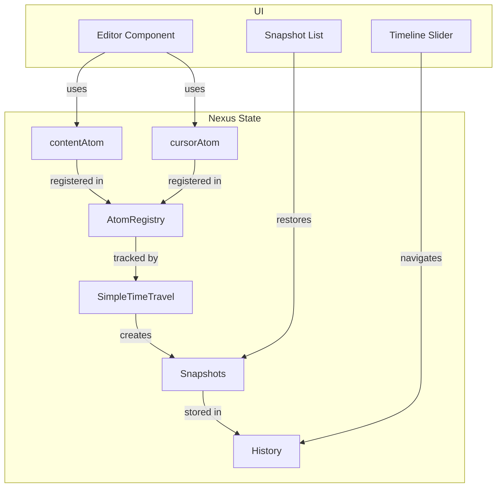
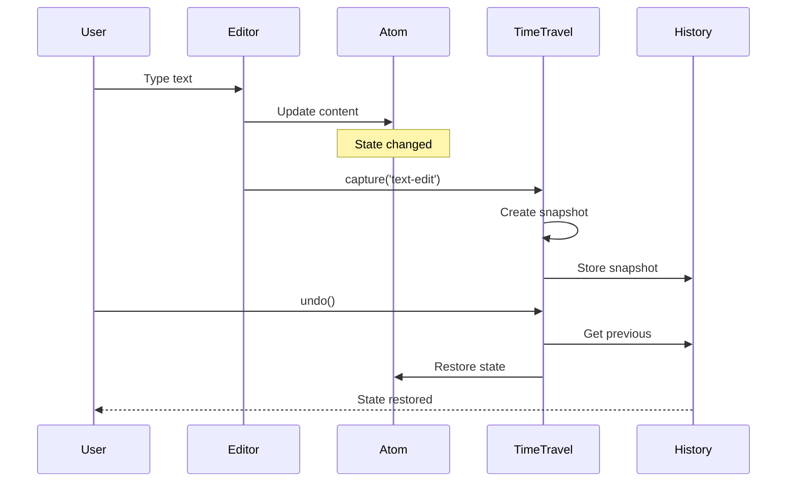

# ART-001: Инструкция по выполнению

## 🎯 Цель
Собрать все необходимые материалы для статьи: скриншоты, GIF, метрики, примеры кода.

## ⏱️ Время: 9-15 часов

---

## 📸 1. Скриншоты интерфейса (1-2 часа)

### Что нужно сделать:

#### Шаг 1.1: Запустить демо-приложение
```bash
cd apps/demo-editor
pnpm dev
# Открыть http://localhost:3005
```

#### Шаг 1.2: Сделать скриншоты

**Список требуемых скриншотов:**

| № | Описание | Как сделать | Статус |
|---|----------|-------------|--------|
| 1.1 | Пустой редактор | Открыть чистую страницу | ⬜ |
| 1.2 | Редактор с текстом | Ввести 2-3 абзаца | ⬜ |
| 1.3 | Timeline с снимками | Создать 5-10 снимков | ⬜ |
| 1.4 | Snapshot list | Открыть панель истории | ⬜ |
| 1.5 | Diff view | Сравнить 2 версии | ⬜ |
| 1.6 | Stress test | Запустить стресс-тест | ⬜ |
| 1.7 | Performance metrics | Открыть метрики | ⬜ |

**Инструменты:**
- **macOS:** `Cmd+Shift+4` (выделение) или `Cmd+Shift+5` (меню)
- **Chrome DevTools:** `Cmd+Shift+P` → "Screenshot" → "Capture full size screenshot"
- **Windows:** `Win+Shift+S`

**Требования:**
- Разрешение: 1920x1080 или выше
- Формат: PNG
- Темная тема
- Без вкладок браузера в кадре

#### Шаг 1.3: Обработать скриншоты
```bash
# Создать папку
mkdir -p planning/phase-06-editor-demo/article/assets/screenshots

# Сохранить файлы с именами:
# 01-empty-editor.png
# 02-editor-with-text.png
# 03-timeline-snapshots.png
# ...
```

---

## 🎬 2. GIF-анимации (2-3 часа)

### Что нужно сделать:

#### Шаг 2.1: Установить инструменты

**Вариант A: OBS Studio (бесплатно)**
```
1. Скачать: https://obsproject.com/
2. Настроить:
   - Canvas: 1920x1080
   - FPS: 10
   - Format: mp4 (конвертируем в GIF потом)
```

**Вариант B: Loom (проще)**
```
1. Установить расширение Chrome
2. Записать экран
3. Скачать видео
```

#### Шаг 2.2: Записать анимации

| № | Описание | Длительность | Сценарий | Статус |
|---|----------|--------------|----------|--------|
| 2.1 | Создание снимка | 5-7 сек | Ввод текста → пауза 1 сек → снимок | ⬜ |
| 2.2 | Undo/Redo | 5-7 сек | Ctrl+Z → Ctrl+Y | ⬜ |
| 2.3 | Drag timeline | 3-5 сек | Перетаскивание слайдера | ⬜ |
| 2.4 | Jump to snapshot | 3-5 сек | Клик на снимке → откат | ⬜ |
| 2.5 | Autoplay | 10-15 сек | Нажать Play → проигрывание | ⬜ |

#### Шаг 2.3: Конвертировать в GIF

**Онлайн (просто):**
1. https://ezgif.com/video-to-gif
2. Загрузить видео
3. Настройки: FPS=10, Scale=800px
4. Скачать GIF

**FFmpeg (локально):**
```bash
ffmpeg -i input.mp4 -vf "fps=10,scale=800:-1" output.gif
```

**Оптимизация:**
```bash
# Уменьшить размер
gifsicle --optimize=3 --colors=128 input.gif > output-optimized.gif
```

#### Шаг 2.4: Сохранить
```bash
mkdir -p planning/phase-06-editor-demo/article/assets/gifs

# Имена файлов:
# 01-creating-snapshot.gif
# 02-undo-redo.gif
# 03-timeline-drag.gif
# ...
```

---

## 📊 3. Метрики производительности (1-2 часа)

### Что нужно сделать:

#### Шаг 3.1: Подготовить скрипт

Создать файл `apps/demo-editor/src/test/metrics.ts`:

```typescript
import { editorTimeTravel } from '@/store/timeTravel'

export async function measurePerformance() {
  const results = {
    snapshotCapture: [] as number[],
    restore: [] as number[],
    memory: [] as number[]
  }

  // Измерение времени захвата
  for (let i = 0; i < 10; i++) {
    const start = performance.now()
    editorTimeTravel.capture(`test-${i}`)
    const end = performance.now()
    results.snapshotCapture.push(end - start)
  }

  // Измерение времени восстановления
  const history = editorTimeTravel.getHistory()
  for (let i = 0; i < history.length; i++) {
    const start = performance.now()
    editorTimeTravel.jumpTo(i)
    const end = performance.now()
    results.restore.push(end - start)
  }

  // Память (если доступно)
  if (performance.memory) {
    results.memory.push(performance.memory.usedJSHeapSize / 1024 / 1024)
  }

  return {
    avgCaptureTime: results.snapshotCapture.reduce((a, b) => a + b) / results.snapshotCapture.length,
    avgRestoreTime: results.restore.reduce((a, b) => a + b) / results.restore.length,
    memoryMB: results.memory[0] || 'N/A'
  }
}
```

#### Шаг 3.2: Запустить измерения

```typescript
// В консоли браузера:
import { measurePerformance } from './test/metrics'
const metrics = await measurePerformance()
console.table(metrics)
```

#### Шаг 3.3: Записать результаты

Создать файл `planning/phase-06-editor-demo/article/metrics/performance-results.json`:

```json
{
  "date": "2026-03-08",
  "environment": {
    "browser": "Chrome 122",
    "os": "macOS",
    "cpu": "M1"
  },
  "results": {
    "avgCaptureTime": 5.2,
    "avgRestoreTime": 12.5,
    "memoryMB": 45.3,
    "snapshotCount": 10
  },
  "targets": {
    "avgCaptureTime": "< 50ms",
    "avgRestoreTime": "< 100ms",
    "memoryMB": "< 50MB"
  }
}
```

---

## 💻 4. Примеры кода (2-3 часа)

### Что нужно сделать:

#### Шаг 4.1: Извлечь примеры из кода

**Файлы для извлечения:**

| Пример | Источник | destination | Статус |
|--------|----------|-------------|--------|
| Store setup | `src/store/store.ts` | `code-examples/01-store-setup.ts` | ⬜ |
| Atoms | `src/store/atoms/*.ts` | `code-examples/02-atoms.ts` | ⬜ |
| Time-travel config | `src/store/timeTravel.ts` | `code-examples/03-time-travel.ts` | ⬜ |
| Debounce hook | `src/hooks/useDebounceSnapshots.ts` | `code-examples/04-debounce.ts` | ⬜ |
| Editor component | `src/components/Editor/*.tsx` | `code-examples/05-editor.tsx` | ⬜ |
| Timeline | `src/components/Timeline/*.tsx` | `code-examples/06-timeline.tsx` | ⬜ |

#### Шаг 4.2: Упростить и добавить комментарии

**Пример:**
```typescript
// ❌ Было (слишком сложно)
const timeTravel = new SimpleTimeTravel(store, {
  maxHistory: 100,
  autoCapture: false,
  deltaSnapshots: { enabled: true, fullSnapshotInterval: 10 }
})

// ✅ Стало (с комментариями)
import { SimpleTimeTravel } from '@nexus-state/core'

// Настраиваем time-travel для редактора
const timeTravel = new SimpleTimeTravel(store, {
  // Максимум 100 снимков в истории
  maxHistory: 100,
  
  // Отключаем авто-снимки — используем debounce
  autoCapture: false,
  
  // Включаем delta-сжатие для экономии памяти
  deltaSnapshots: { 
    enabled: true 
  }
})
```

#### Шаг 4.3: Протестировать примеры

Создать тестовый проект:
```bash
pnpm create vite@latest test-examples --template react-ts
cd test-examples
pnpm add @nexus-state/core @nexus-state/react

# Скопировать каждый пример
# Запустить и проверить без ошибок
```

#### Шаг 4.4: Сохранить
```bash
mkdir -p planning/phase-06-editor-demo/article/code-examples

# Структура:
# code-examples/
# ├── 01-store-setup.ts
# ├── 02-atoms.ts
# ├── 03-time-travel.ts
# ├── 04-debounce.ts
# ├── 05-editor.tsx
# └── 06-timeline.tsx
```

---

## 🎬 5. Демонстрационные сценарии (1-2 часа)

### Что нужно сделать:

#### Шаг 5.1: Подготовить сценарии

**Сценарий 1: Базовое редактирование**
```
1. Открыть редактор
2. Ввести "Hello, World!"
3. Пауза 1 секунда
4. Проверить: снимок создан
5. Ввести ещё текст
6. Проверить: второй снимок создан
```

**Сценарий 2: Undo/Redo**
```
1. Создать 3-5 снимков
2. Нажать Undo 2 раза
3. Проверить: контент откатился
4. Нажать Redo 1 раз
5. Проверить: контент восстановился
```

**Сценарий 3: Jump to snapshot**
```
1. Кликнуть на снимок #3 в списке
2. Проверить: контент откатился к версии #3
3. Проверить: timeline показывает позицию 3
```

#### Шаг 5.2: Протестировать сценарии

Пройти каждый сценарий вручную:
- [ ] Сценарий 1 работает
- [ ] Сценарий 2 работает
- [ ] Сценарий 3 работает

#### Шаг 5.3: Записать результат

Создать файл `planning/phase-06-editor-demo/article/demo-scenarios.md`:

```markdown
# Демонстрационные сценарии

## Сценарий 1: Базовое редактирование
**Статус:** ✅ Работает
**Время:** 10 секунд

## Сценарий 2: Undo/Redo
**Статус:** ✅ Работает
**Время:** 5 секунд

## Сценарий 3: Jump to snapshot
**Статус:** ✅ Работает
**Время:** 3 секунды
```

---

## 📁 6. Диаграммы (2-3 часа)

### Что нужно сделать:

#### Шаг 6.1: Создать диаграммы в Mermaid

**Диаграмма 1: Архитектура**

Создать файл `diagrams/01-architecture.mmd`:


**Диаграмма 2: Поток данных**

Создать файл `diagrams/02-data-flow.mmd`:


#### Шаг 6.2: Конвертировать в PNG

**Онлайн:**
1. https://mermaid.live/
2. Вставить код диаграммы
3. Export → PNG

**Локально:**
```bash
npm install -g @mermaid-js/mermaid-cli
mmdc -i diagrams/01-architecture.mmd -o diagrams/01-architecture.png -w 1200
```

#### Шаг 6.3: Сохранить
```bash
mkdir -p planning/phase-06-editor-demo/article/assets/diagrams

# Файлы:
# 01-architecture.png
# 02-data-flow.png
# 03-snapshot-structure.png
```

---

## ✅ Чек-лист завершения

### Скриншоты (7+)
- [ ] 01-empty-editor.png
- [ ] 02-editor-with-text.png
- [ ] 03-timeline-snapshots.png
- [ ] 04-snapshot-list.png
- [ ] 05-diff-view.png
- [ ] 06-stress-test.png
- [ ] 07-performance-metrics.png

### GIF (6+)
- [ ] 01-creating-snapshot.gif
- [ ] 02-undo-redo.gif
- [ ] 03-timeline-drag.gif
- [ ] 04-jump-to-snapshot.gif
- [ ] 05-autoplay-history.gif
- [ ] 06-diff-update.gif

### Метрики (6+)
- [ ] Время захвата снимка
- [ ] Время восстановления
- [ ] Размер снимка (delta)
- [ ] Потребление памяти
- [ ] FPS при анимации
- [ ] Время загрузки приложения

### Примеры кода (6+)
- [ ] 01-store-setup.ts
- [ ] 02-atoms.ts
- [ ] 03-time-travel.ts
- [ ] 04-debounce.ts
- [ ] 05-editor.tsx
- [ ] 06-timeline.tsx

### Сценарии (5+)
- [ ] Базовое редактирование
- [ ] Undo/Redo
- [ ] Jump to snapshot
- [ ] Timeline drag
- [ ] Stress test

### Диаграммы (2+)
- [ ] 01-architecture.png
- [ ] 02-data-flow.png

---

## 📁 Итоговая структура

```
planning/phase-06-editor-demo/article/
├── assets/
│   ├── screenshots/
│   │   ├── 01-empty-editor.png
│   │   ├── 02-editor-with-text.png
│   │   └── ...
│   ├── gifs/
│   │   ├── 01-creating-snapshot.gif
│   │   ├── 02-undo-redo.gif
│   │   └── ...
│   └── diagrams/
│       ├── 01-architecture.png
│       └── 02-data-flow.png
├── code-examples/
│   ├── 01-store-setup.ts
│   ├── 02-atoms.ts
│   └── ...
├── metrics/
│   └── performance-results.json
└── demo-scenarios.md
```

---

## 🕐 Оценка времени

| Задача | Время |
|--------|-------|
| Скриншоты | 1-2 часа |
| GIF-анимации | 2-3 часа |
| Метрики | 1-2 часа |
| Примеры кода | 2-3 часа |
| Сценарии | 1-2 часа |
| Диаграммы | 2-3 часа |
| **Итого** | **9-15 часов** |

---

## 🚀 Быстрый старт

**Минимальный набор для начала статьи:**

1. **Скриншоты:** 01, 02, 03 (30 минут)
2. **GIF:** 01, 02 (30 минут)
3. **Примеры кода:** 01, 02, 03 (1 час)
4. **Метрики:** базовые (30 минут)

**Всего:** 2.5 часа для MVP

---

*Инструкция подготовлена для ART-001*
