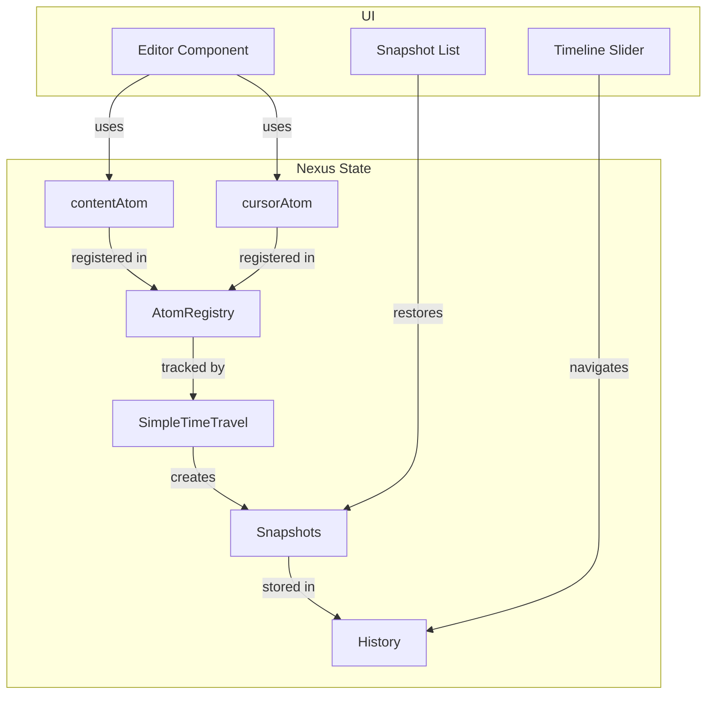
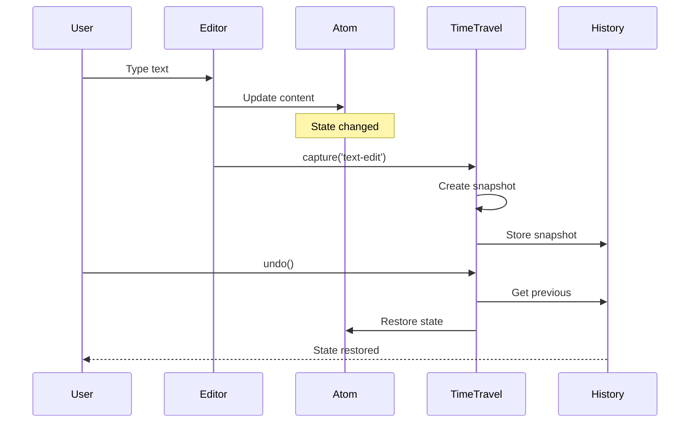

# ART-005: Создание визуальных материалов (Visual Assets)

## 📋 Описание

Создание и подготовка всех визуальных материалов для статьи: скриншоты, GIF-анимации, диаграммы, схемы.

## 🎯 Цель

Подготовить 10-15 визуальных элементов, которые:
- Иллюстрируют ключевые концепции
- Имеют высокое качество
- Оптимизированы для веба
- Консистентны по стилю

## 📦 Категории визуалов

### Категория 1: Скриншоты интерфейса

| № | Описание | Разрешение | Формат | Размер | Статус |
|---|----------|------------|--------|--------|--------|
| 1.1 | Пустой редактор | 1920x1080 | PNG | < 500KB | ⬜ |
| 1.2 | Редактор с текстом | 1920x1080 | PNG | < 500KB | ⬜ |
| 1.3 | Timeline с снимками | 1920x1080 | PNG | < 500KB | ⬜ |
| 1.4 | Snapshot list | 1920x1080 | PNG | < 500KB | ⬜ |
| 1.5 | Diff view (сравнение) | 1920x1080 | PNG | < 500KB | ⬜ |
| 1.6 | Stress test UI | 1920x1080 | PNG | < 500KB | ⬜ |
| 1.7 | Performance metrics | 1920x1080 | PNG | < 500KB | ⬜ |

**Требования:**
- Чистый интерфейс (без вкладок браузера)
- Темная тема (из SPEC)
- Консистентные отступы
- Видимые элементы UI

**Процесс создания:**
```bash
# 1. Открыть приложение
pnpm dev --workspace=demo-editor

# 2. Открыть http://localhost:3005

# 3. Chrome DevTools → Command Menu (Cmd+Shift+P)
#    → "Screenshot" → "Capture full size screenshot"

# 4. Обрезать в Sketch/Figma (если нужно)

# 5. Оптимизировать:
#    pngquant quality=85 input.png --output output.png
```

---

### Категория 2: GIF-анимации

| № | Описание | Длительность | Размер | FPS | Статус |
|---|----------|--------------|--------|-----|--------|
| 2.1 | Создание снимка (ввод текста) | 5-7 сек | < 3MB | 10 | ⬜ |
| 2.2 | Undo/Redo навигация | 5-7 сек | < 3MB | 10 | ⬜ |
| 2.3 | Drag timeline slider | 3-5 сек | < 2MB | 10 | ⬜ |
| 2.4 | Jump to snapshot (клик) | 3-5 сек | < 2MB | 10 | ⬜ |
| 2.5 | Autoplay истории | 10-15 сек | < 5MB | 10 | ⬜ |
| 2.6 | Diff view обновление | 5-7 сек | < 3MB | 10 | ⬜ |

**Требования:**
- Плавная анимация (минимум 10 FPS)
- Зациклено (loop)
- Видимый результат действия
- Оптимизированный размер

**Процесс создания:**
```bash
# 1. Запись экрана
#    Инструменты: OBS Studio, Loom, QuickTime

# 2. Конвертация в GIF
ffmpeg -i input.mp4 -vf "fps=10,scale=800:-1" output.gif

# 3. Оптимизация
#    https://ezgif.com/optimize
#    Или: gifsicle --optimize=3 --colors=128 input.gif > output.gif

# 4. Проверка размера (< 5MB)
```

**Альтернатива: MP4 вместо GIF**
```html
<!-- Для веба лучше использовать video -->
<video autoplay loop muted playsinline>
  <source src="animation.mp4" type="video/mp4">
</video>
```

---

### Категория 3: Диаграммы архитектуры

| № | Описание | Тип | Инструмент | Статус |
|---|----------|-----|------------|--------|
| 3.1 | Архитектура приложения | Блок-схема | Mermaid/Excalidraw | ⬜ |
| 3.2 | Поток данных time-travel | Sequence diagram | Mermaid | ⬜ |
| 3.3 | Структура снимка | ER-диаграмма | Mermaid | ⬜ |
| 3.4 | Delta-сжатие схема | Infographic | Figma/Excalidraw | ⬜ |
| 3.5 | Debounce timeline | Timeline diagram | Mermaid | ⬜ |

**Пример Mermaid — Архитектура:**


**Пример Mermaid — Sequence:**


**Экспорт из Mermaid:**
```bash
# Онлайн: https://mermaid.live/
# Или: mmdc -i input.mmd -o output.png -w 1200
```

---

### Категория 4: Инфографика и схемы

| № | Описание | Формат | Размер | Статус |
|---|----------|--------|--------|--------|
| 4.1 | Сравнение: до/после | PNG/SVG | < 300KB | ⬜ |
| 4.2 | Benchmark таблица | PNG/SVG | < 200KB | ⬜ |
| 4.3 | Memory usage graph | PNG/SVG | < 300KB | ⬜ |
| 4.4 | Performance timeline | PNG/SVG | < 300KB | ⬜ |

---

## 🎨 Стилевые требования

### Цветовая палитра (из SPEC)

```css
/* Основные цвета */
--primary: #6366F1;      /* Indigo */
--secondary: #8B5CF6;    /* Violet */
--accent: #EC4899;       /* Pink */

/* Семантические цвета */
--success: #10B981;      /* Emerald */
--warning: #F59E0B;      /* Amber */
--danger: #EF4444;       /* Red */

/* Фон и текст */
--background: #0F172A;   /* Slate 900 */
--surface: #1E293B;      /* Slate 800 */
--border: #334155;       /* Slate 700 */
--text: #F8FAFC;         /* Slate 50 */
--text-muted: #94A3B8;   /* Slate 400 */
```

### Типографика

```
Заголовки: Inter, SF Pro Display
Код: JetBrains Mono, Fira Code
Текст: Inter, System UI

Размеры:
- Заголовок статьи: 32-40px
- Заголовки разделов: 24-28px
- Подзаголовки: 18-20px
- Текст: 16px
- Код: 14px
```

### Единый стиль

**Для скриншотов:**
- Одинаковые отступы (20px)
- Единая тема (темная)
- Консистентный масштаб

**Для диаграмм:**
- Одинаковая толщина линий (2px)
- Консистентные цвета
- Единый размер шрифта (14px)

**Для GIF:**
- Одинаковая частота кадров (10 FPS)
- Консистентное качество
- Единый стиль зацикливания

## 🔧 Инструменты

### Для скриншотов
| Инструмент | Платформа | Цена |
|------------|-----------|------|
| Built-in (Cmd+Shift+4) | macOS | Бесплатно |
| Chrome DevTools | Все | Бесплатно |
| CleanShot X | macOS | $29 |
| Snagit | Все | $50 |

### Для GIF
| Инструмент | Платформа | Цена |
|------------|-----------|------|
| OBS Studio | Все | Бесплатно |
| Loom | Все | Бесплатно/$ |
| ScreenToGif | Windows | Бесплатно |
| Giphy Capture | macOS | Бесплатно |

### Для диаграмм
| Инструмент | Платформа | Цена |
|------------|-----------|------|
| Mermaid.js | Веб | Бесплатно |
| Excalidraw | Веб | Бесплатно |
| Draw.io | Веб | Бесплатно |
| Figma | Веб | Бесплатно/$ |

### Для оптимизации
| Инструмент | Тип | Команда |
|------------|-----|---------|
| pngquant | PNG | `pngquant quality=85 input.png` |
| gifsicle | GIF | `gifsicle --optimize=3 input.gif` |
| squoosh | Веб | https://squoosh.app |
| tinypng | Веб | https://tinypng.com |

## 📁 Структура хранения

```
planning/phase-06-editor-demo/article/
├── assets/
│   ├── screenshots/
│   │   ├── 01-empty-editor.png
│   │   ├── 02-editor-with-text.png
│   │   ├── 03-timeline-snapshots.png
│   │   ├── 04-snapshot-list.png
│   │   ├── 05-diff-view.png
│   │   ├── 06-stress-test.png
│   │   └── 07-performance-metrics.png
│   ├── gifs/
│   │   ├── 01-creating-snapshot.gif
│   │   ├── 02-undo-redo.gif
│   │   ├── 03-timeline-drag.gif
│   │   ├── 04-jump-to-snapshot.gif
│   │   ├── 05-autoplay-history.gif
│   │   └── 06-diff-update.gif
│   ├── diagrams/
│   │   ├── 01-architecture.mmd
│   │   ├── 01-architecture.png
│   │   ├── 02-sequence-flow.mmd
│   │   ├── 02-sequence-flow.png
│   │   ├── 03-snapshot-structure.mmd
│   │   ├── 03-snapshot-structure.png
│   │   ├── 04-delta-compression.svg
│   │   └── 05-debounce-timeline.svg
│   └── infographics/
│       ├── 01-before-after.svg
│       ├── 02-benchmark-table.png
│       ├── 03-memory-graph.svg
│       └── 04-performance-timeline.svg
└── visual-assets.md (этот файл)
```

## ✅ Критерии приемки

- [ ] 7+ скриншотов
- [ ] 6+ GIF-анимаций
- [ ] 5+ диаграмм
- [ ] 4+ инфографики
- [ ] Все визуалы оптимизированы
- [ ] Стиль консистентен
- [ ] Файлы правильно названы

## 📅 Оценка времени

| Задача | Время |
|--------|-------|
| Скриншоты | 1-2 часа |
| GIF-анимации | 2-3 часа |
| Диаграммы | 2-3 часа |
| Инфографика | 1-2 часа |
| Оптимизация | 1 час |
| **Итого** | **7-11 часов** |

## 🔗 Связанные задачи

- [[ART-001]](./ART-001-material-collection.md) — Сбор материалов
- [[ART-003]](./ART-003-draft-writing.md) — Написание черновика

## 📝 Заметки

- Сохранять исходники (FIG, PSD) для будущих правок
- Использовать @2x для Retina дисплеев
- Проверять контрастность для доступности
