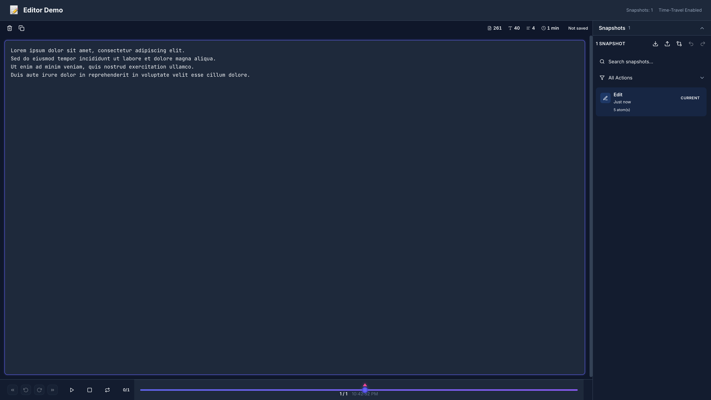

# ART-007: Финальное редактирование (Final Editing)

## 📋 Описание

Финальная полировка статьи: стилистические правки, улучшение читаемости, форматирование, подготовка к публикации.

## 🎯 Цель

Подготовить статью к публикации, устранив все стилистические, грамматические и визуальные недочёты.

## 📝 Области редактирования

### 1. Стиль и тон

**Чек-лист:**
- [ ] Тон консистентен (профессиональный, но доступный)
- [ ] Нет жаргонизмов (или они объяснены)
- [ ] Предложения простые (15-25 слов)
- [ ] Активный залог вместо пассивного
- [ ] Нет воды и повторений

**Примеры правок:**

| Было | Стало | Причина |
|------|-------|---------|
| "В данном разделе мы рассмотрим..." | "Рассмотрим..." | Упрощение |
| "Необходимо отметить, что..." | "Важно:" | Упрощение |
| "Является ли...", "Не является ли..." | "Это..." | Прямой стиль |
| Пассив: "Было создано..." | Актив: "Мы создали..." | Активный залог |

---

### 2. Грамматика и орфография

**Инструменты:**
- **Орфограммка**: https://orfogrammka.ru/
- **Grammarly** (для английских вставок): https://grammarly.com
- **Главред**: https://glvrd.ru/ (для очистки от словесного мусора)

**Чек-лист:**
- [ ] Нет орфографических ошибок
- [ ] Нет пунктуационных ошибок
- [ ] Ё используется консистентно
- [ ] Тире и дефисы правильные (— и -)
- [ ] Кавычки «ёлочки» для русского текста

**Типичные ошибки:**

| Ошибка | Правильно |
|--------|-----------|
| "на счет" (в значении "относительно") | "насчет" |
| "в течении" (времени) | "в течение" |
| "более лучше" | "лучше" |
| "ложить" | "класть" |
| "ихний" | "их" |

---

### 3. Форматирование

**Заголовки:**
```markdown
# Заголовок статьи (H1)

## Раздел (H2)

### Подраздел (H3)

#### Маленький раздел (H4)
```

**Чек-лист заголовков:**
- [ ] Иерархия соблюдена (H1 → H2 → H3)
- [ ] Нет пропуска уровней
- [ ] Заголовки информативные
- [ ] Нет точки в конце заголовков

**Код:**
```markdown
✅ Хорошо:
```typescript
const atom = require('@nexus-state/core')
```

❌ Плохо:
```
const atom = require('@nexus-state/core')
```
```

**Чек-лист кода:**
- [ ] Указан язык для подсветки
- [ ] Отступы консистентны (2 пробела)
- [ ] Длинные строки обернуты
- [ ] Есть комментарии для сложного кода

**Списки:**
```markdown
✅ Хорошо:
- Элемент списка
- Другой элемент

❌ Непоследовательно:
- Элемент списка
* Другой элемент
```

**Чек-лист списков:**
- [ ] Маркеры консистентны (- или *)
- [ ] Отступы одинаковые
- [ ] Пунктуация в конце элементов едина

---

### 4. Визуалы и подписи

**Чек-лист:**
- [ ] Все изображения имеют alt-текст
- [ ] Подписи под визуалами
- [ ] Нумерация рисунков (опционально)
- [ ] Ссылки на источники (если нужно)

**Пример:**
```markdown

*Рисунок 1: Редактор с начальным текстом*


*Рисунок 2: При вводе текста автоматически создаётся снимок через 1 секунду*
```

---

### 5. Ссылки и навигация

**Чек-лист:**
- [ ] Все внешние ссылки работают
- [ ] Внутренние якоря корректны
- [ ] Ссылки открываются в новой вкладке (для внешних)
- [ ] Anchor links для заголовков работают

**Пример:**
```markdown
✅ Хорошо:
Смотрите [документацию](https://nexus-state.dev){target="_blank"}

Вернитесь к [введению](#введение)

❌ Плохо:
Смотрите документацию: https://nexus-state.dev
```

---

### 6. Мета-данные

**Для Хабра:**
```yaml
---
title: "Time-Travel Debugging с Nexus State"
description: "Создаём редактор с возможностью отката состояния"
cover: ./assets/cover.png
tags: [JavaScript, TypeScript, State Management, Debugging]
complexity: Middle
read_time: 12 мин
---
```

**Для Dev.to:**
```yaml
---
title: "Time-Travel Debugging with Nexus State"
published: true
cover_image: ./assets/cover.png
tags: javascript, typescript, debugging, statemanagement
---
```

**Чек-лист:**
- [ ] Заголовок (50-60 символов)
- [ ] Описание (150-160 символов)
- [ ] Cover image (1200x630px)
- [ ] Теги (3-5)
- [ ] Время чтения

---

## 🔧 Процесс редактирования

### Этап 1: Структурное редактирование (1 час)

**Проверка структуры:**
```markdown
1. Введение
   ├── Hook
   ├── Проблема
   ├── Решение
   └── Обзор
   
2-7. Основная часть
   ├── Теория
   ├── Практика
   └── Примеры
   
8. Заключение
   ├── Итоги
   ├── Призыв
   └── Ссылки
```

**Вопросы:**
- Есть ли логический поток?
- Нет ли скачков в сложности?
- Все ли разделы нужны?

### Этап 2: Стилистическое редактирование (1-2 часа)

**Инструменты:**
- Главред: очистка от словесного мусора
- Чтение вслух для проверки ритма

**Что искать:**
- Канцеляризмы ("является", "осуществляется")
- Плеоназмы ("главная мысль", "первый приоритет")
- Параллельные конструкции ("не только..., но и...")

### Этап 3: Косметическое редактирование (30 минут)

**Проверка:**
- [ ] Отступы между абзацами
- [ ] Пробелы после знаков препинания
- [ ] Переносы строк
- [ ] Висячие строки

### Этап 4: Финальная проверка (30 минут)

**Чек-лист:**
- [ ] Прочитать статью целиком
- [ ] Проверить все кликабельные элементы
- [ ] Убедиться в консистентности
- [ ] Сохранить финальную версию

---

## 📊 Версионирование

**Структура:**
```
planning/phase-06-editor-demo/article/drafts/
├── outline.md          # Структура
├── draft-v1.md         # Первый черновик
├── draft-v1-1.md       # После саморевью
├── draft-v2.md         # После тех. ревью
├── draft-v2-1.md       # После бета-чтения
└── final.md            # Финальная версия
```

**Git теги:**
```bash
git tag -a article-draft-v1 -m "Первый черновик статьи"
git tag -a article-draft-v2 -m "После технического ревью"
git tag -a article-final -m "Финальная версия"
```

---

## ✅ Критерии приемки

- [ ] Стиль консистентен
- [ ] Нет грамматических ошибок
- [ ] Форматирование корректно
- [ ] Визуалы подписаны
- [ ] Ссылки работают
- [ ] Мета-данные заполнены
- [ ] Финальная версия сохранена

## 📅 Оценка времени

| Этап | Время |
|------|-------|
| Структурное редактирование | 1 час |
| Стилистическое редактирование | 1-2 часа |
| Косметическое редактирование | 30 мин |
| Финальная проверка | 30 мин |
| **Итого** | **3-4 часа** |

## 🔗 Связанные задачи

- [[ART-006]](./ART-006-technical-review.md) — Техническое ревью
- [[ART-008]](./ART-008-publication.md) — Публикация

## 📝 Заметки

- Сохранять все версии черновиков
- Использовать Track Changes или git diff
- Не бояться удалять лишнее
