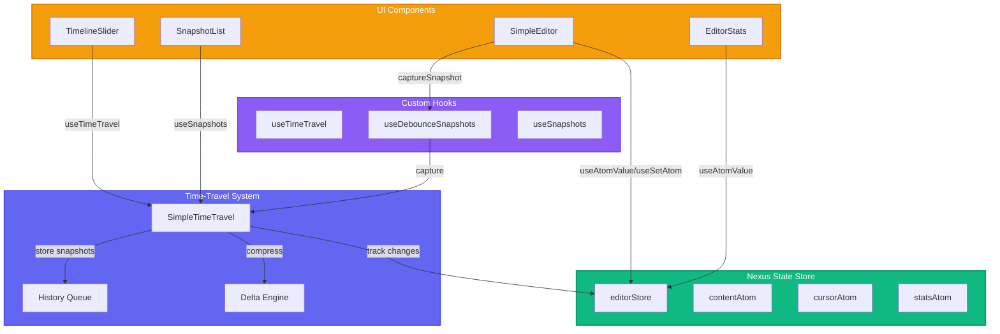
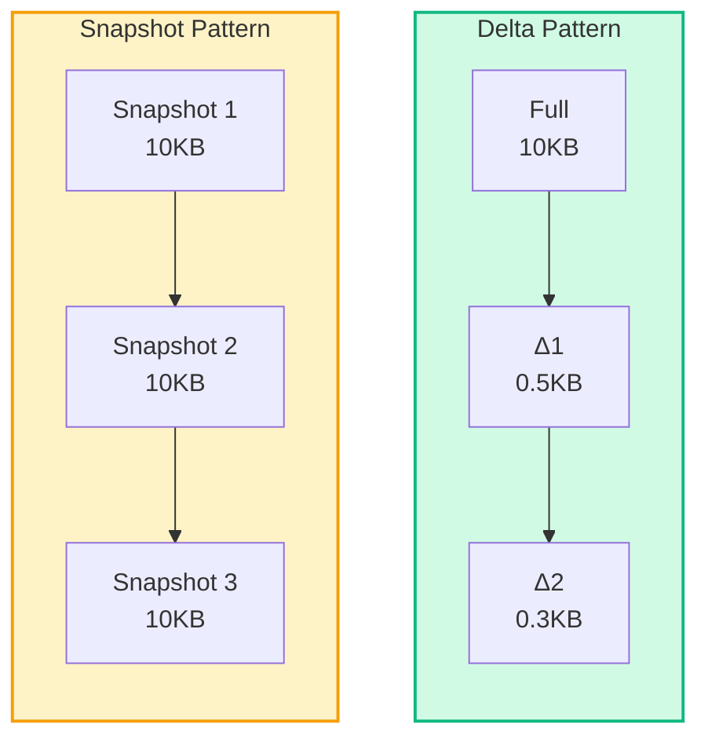
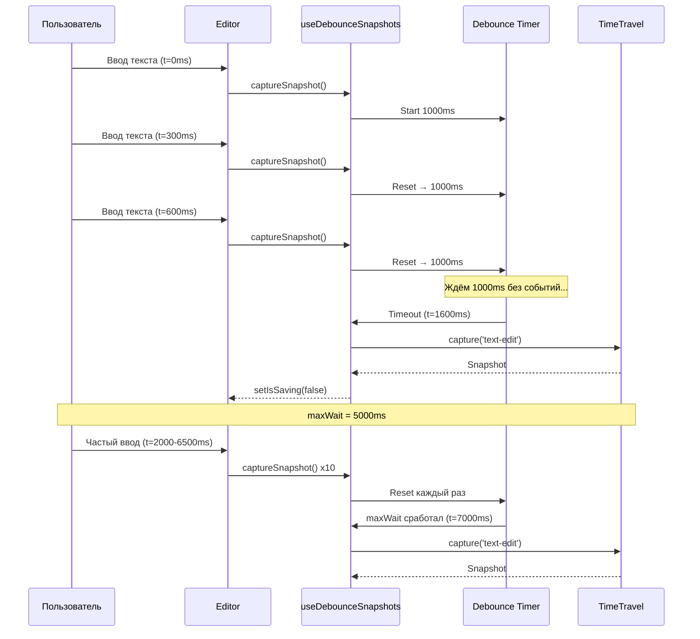
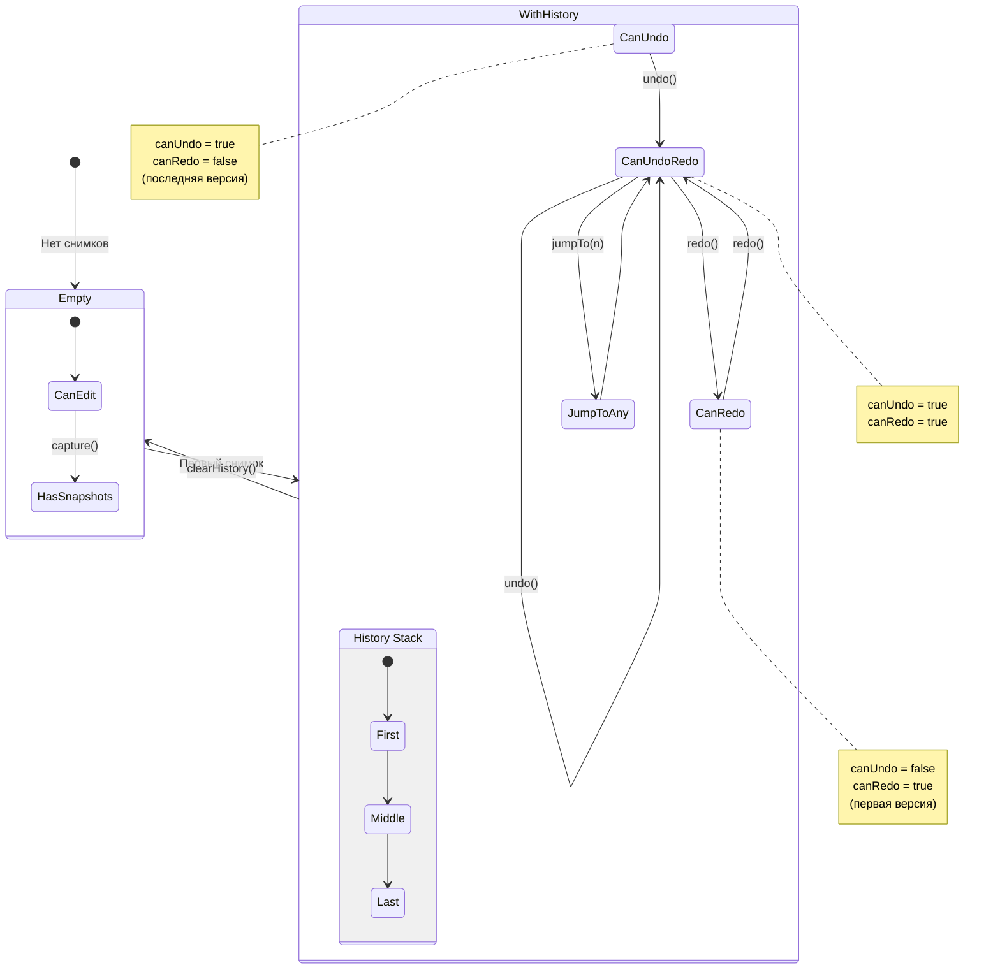

# Time-Travel Debugging: Фундаментальные паттерны и практика реализации

**Время чтения:** 20 мин
**Уровень:** Middle+
**Теги:** #javascript #typescript #statemanagement #debugging #pattern

> **Примечание:** В статье рассматриваются **фундаментальные паттерны** реализации time-travel (snapshot, delta, debounce, история изменений), которые применимы в любом проекте. Также представлена **конкретная реализация** этих паттернов с использованием библиотеки **Nexus State** как пример.

---

## Быстрый старт (5 минут)

Хотите сразу код? Вот минимальная настройка time-travel:

```bash
npm install @nexus-state/core @nexus-state/react
```

```typescript
// 3 строки кода для time-travel
import { createStore, SimpleTimeTravel } from '@nexus-state/core';

const store = createStore();
const timeTravel = new SimpleTimeTravel(store, { maxHistory: 100 });
timeTravel.capture('action'); // Создать снимок
timeTravel.undo(); // Отменить
timeTravel.redo(); // Повторить
```

[Перейти к полной теории →](#часть-1-теория-и-фундаментальные-концепции)
[Перейти к практике →](#часть-2-практическая-реализация)

---

## Введение

Time-travel debugging — это возможность **сохранять снимки состояния** приложения и **перемещаться между ними**, как настоящая машина времени для данных. Традиционно он ассоциируется с инструментами отладки, такими как Redux DevTools. Однако пользователи современных приложений (Figma, Google Docs, VS Code) ожидают этой функциональности как данность:

| Приложение                 | Ожидание пользователя   |
| -------------------------- | ----------------------- |
| Текстовый редактор         | Ctrl+Z работает всегда  |
| Графический редактор       | История версий доступна |
| **Форма / Веб-приложение** | **Тоже должно!**        |

Эта статья делится на **две части**:

1.  **Теория (Часть 1):** Универсальные паттерны и концепции, которые останутся актуальны независимо от используемых библиотек.
2.  **Практика (Часть 2):** Конкретный туториал по реализации пользовательского time-travel с использованием **Nexus State**.

**Демо:** [Попробовать редактор](https://demo-editor.nexus-state.dev/)
**Код:** [Исходный код на GitHub](https://github.com/eustatos/nexus-state/tree/main/apps/demo-editor)

> **Версии зависимостей:** React 18.x, @nexus-state/core 0.x, @nexus-state/react 0.x, lodash-es 4.x

---

# Часть 1: Теория и фундаментальные концепции

> Эти разделы останутся актуальными независимо от изменений в библиотеках. Паттерны универсальны и применимы в любом проекте.

## Архитектура решения

Для понимания того, как работает time-travel debugging в нашем решении, рассмотрим общую архитектуру:



**Уровни архитектуры:**

1. **UI Components** (оранжевый) — компоненты React, с которыми взаимодействует пользователь
2. **Custom Hooks** (фиолетовый) — прослойка для удобной работы с time-travel
3. **Nexus State Store** (зелёный) — хранение текущего состояния
4. **Time-Travel System** (синий) — управление историей изменений

---

## Что такое time-travel debugging

Time-travel debugging — это возможность **сохранять снимки состояния** приложения и **перемещаться между ними**. Как машина времени для данных.

### Три сценария использования

| Сценарий      | Цель                                        | Пример                                             |
| ------------- | ------------------------------------------- | -------------------------------------------------- |
| **Отладка**   | Поймать момент, когда «сломалось» состояние | Баг проявляется только после определённых действий |
| **Навигация** | Перемещение между версиями (undo/redo)      | Ctrl+Z в редакторах, история версий                |
| **Анализ**    | Сравнить версии, понять, что изменилось     | «Какие данные изменились после этого запроса?»     |

**В этой статье мы реализуем все три сценария:**

- Отладка — снимки состояния с метаданными
- Навигация — undo/redo/jump-to-any-version
- Анализ — визуальная история и diff версий

### Два паттерна хранения истории



| Характеристика          | Snapshot                | Delta                    |
| ----------------------- | ----------------------- | ------------------------ |
| Размер каждого элемента | Полный размер состояния | Только изменения         |
| Скорость восстановления | Мгновенно               | Требуется сборка цепочки |
| Потребление памяти      | Высокое                 | Низкое                   |
| Сложность реализации    | Простая                 | Средняя                  |
| Примеры                 | Photoshop, Excalidraw   | Figma, Google Docs       |

**Наш подход:** Гибридный — полные снимки каждые N изменений + delta между ними. Это даёт баланс между производительностью и потреблением памяти.

### Анализ trade-offs: Snapshot vs Delta

**Snapshot:**

- ✅ **Преимущества:** Простота реализации и восстановления, мгновенный доступ к любой версии
- ❌ **Недостатки:** Высокое потребление памяти (N копий состояния)
- ⚠️ **Ограничения:** Не подходит для больших состояний (>1MB) при частых изменениях

**Delta:**

- ✅ **Преимущества:** Экономия памяти (только изменения), эффективно для небольших правок
- ❌ **Недостатки:** Сложнее реализовать (нужны алгоритмы diff/patch), восстановление может быть медленнее
- ⚠️ **Ограничения:** При изменении больших структур дельта может быть почти размером с полный снимок

**Гибридный подход (наш выбор):**

- Полный снимок каждые 10 изменений
- Delta между полными снимками
- Баланс: память ~30% от pure snapshot, скорость ~80% от pure snapshot

---

## Debounce для снимков

Частое изменение состояния (например, ввод текста в `input`) может привести к проблемам:

| Проблема                      | Описание                                                    |
| ----------------------------- | ----------------------------------------------------------- |
| **Race Conditions**           | Поток изменений и поток снимков могут не синхронизироваться |
| **Переполнение памяти**       | Создание тысяч снимков за несколько секунд                  |
| **Низкая производительность** | Частое создание и сжатие снимков                            |

**Решение:** Использовать `debounce`. Снимок создается не сразу после каждого изменения, а с задержкой. Если за это время произошло новое изменение, таймер сбрасывается.

### Параметры debounce

| Параметр   | Рекомендация | Обоснование                                       |
| ---------- | ------------ | ------------------------------------------------- |
| `delay`    | 500-1000ms   | Баланс между отзывчивостью и количеством снимков  |
| `maxWait`  | 5000ms       | Защита от «зависания» снимка при постоянном вводе |
| `leading`  | false        | Не создавать снимок в начале серии изменений      |
| `trailing` | true         | Создавать снимок после окончания ввода            |

### Анализ trade-offs debounce

| Сценарий          | `delay` | `maxWait` | Результат                              |
| ----------------- | ------- | --------- | -------------------------------------- |
| **Редактор кода** | 500ms   | 3000ms    | Высокая отзывчивость, больше снимков   |
| **Форма**         | 1000ms  | 5000ms    | Баланс, умеренное количество снимков   |
| **Конструктор**   | 2000ms  | 10000ms   | Меньше снимков, возможна потеря данных |

---

## Масштабируемость и производительность

Как паттерны ведут себя при увеличении сложности?

### Влияние размера состояния

| Размер состояния | `changeDetection: 'shallow'` | `changeDetection: 'deep'` |
| ---------------- | ---------------------------- | ------------------------- |
| < 1KB            | < 1ms                        | < 2ms                     |
| 10KB             | < 5ms                        | < 15ms                    |
| 100KB            | < 10ms                       | < 50ms                    |
| 1MB              | < 50ms                       | > 200ms ⚠️                |

**Рекомендация:** Для состояний >100KB использовать `shallow` + ручное триггерирование снимков.

### Delta-сжатие для массивов: пример

**Сценарий:** Массив из 1000 объектов, изменяется 1 объект.

| Подход                   | Размер дельты  | Восстановление | Когда использовать                  |
| ------------------------ | -------------- | -------------- | ----------------------------------- |
| JSON diff (по умолчанию) | ~95% оригинала | O(N)           | Маленькие массивы (<100)            |
| Keyed array diff (по ID) | ~5% оригинала  | O(1)           | Большие массивы с уникальными ID    |
| Полный снимок            | 100%           | O(1)           | Когда важна скорость восстановления |

**Почему keyed diff эффективнее:**

```typescript
// ❌ JSON diff сравнивает содержимое
const oldArray = [{ id: 1, text: 'a' }, { id: 2, text: 'b' }, ...]
const newArray = [{ id: 1, text: 'a' }, { id: 2, text: 'B' }, ...]
// Дельта: почти весь массив (сравниваются все байты)

// ✅ Keyed diff сравнивает по ID
const delta = { updated: [{ id: 2, text: 'B' }] }
// Дельта: только изменённый объект
```

> **Почему keyed diff эффективнее:** Сложность восстановления O(1) vs O(N) для JSON diff, так как не требуется обходить весь массив.

**Рекомендация:** Для массивов >100 элементов использовать `keyed array diff` (сравнение по ID, а не по содержимому). Для массивов <100 элементов достаточно JSON diff.

### Стратегии очистки истории

| Стратегия                     | Когда использовать                   |
| ----------------------------- | ------------------------------------ |
| **LRU** (Least Recently Used) | Ограниченная память, частые переходы |
| **TTL** (Time To Live)        | Временные данные, сессии             |
| **По количеству**             | Фиксированный лимит (100 снимков)    |
| **Комбинированная**           | LRU + TTL + лимит (наш выбор)        |

---

## О чём практическая часть статьи

Мы не будем сравнивать библиотеки или доказывать, что time-travel нужен. Вместо этого мы просто **возьмём и сделаем** редактор с:

- Откатом к любой версии (Ctrl+Z, Ctrl+Y)
- Визуальной историей изменений
- Сравнением версий (diff)
- Debounce для производительности

Все паттерны, которые мы разберём — snapshot, delta, debounce, визуализация истории — **универсальны**. Вы сможете применить их в любом проекте, независимо от стека.

Для демонстрации используем библиотеку [Nexus State](https://nexus-state.dev/), но подходы легко адаптировать под Redux, Zustand, Jotai или vanilla JS.

---

# Часть 2: Практическая реализация

> **Примечание:** Эта часть описывает конкретную реализацию паттернов с использованием библиотеки `Nexus State`. Код и шаги могут со временем устареть в зависимости от развития библиотеки. Полный код доступен на [GitHub](https://github.com/eustatos/nexus-state/tree/main/apps/demo-editor).
>
> **Связь с теорией:** Каждый шаг ниже реализует один или несколько паттернов из Части 1. Мы будем добавлять ссылки на соответствующие разделы теории.

## Шаг 1: Настройка проекта

> **Связь с теорией:** Этот шаг готовит инфраструктуру для реализации паттернов [Snapshot vs Delta](#два-паттерна-хранения-истории) и [Debounce](#debounce-для-снимков).

Создадим новый React + TypeScript проект с помощью Vite:

```bash
# Создаём проект
pnpm create vite@latest demo-editor --template react-ts
cd demo-editor

# Устанавливаем зависимости
pnpm add @nexus-state/core @nexus-state/react
pnpm add lucide-react

# Устанавливаем опционально (для debounce)
pnpm add lodash-es

# Устанавливаем типы
pnpm add -D @types/lodash-es
```

**Структура проекта:**

```
demo-editor/
├── src/
│   ├── components/
│   │   ├── Editor/
│   │   │   ├── SimpleEditor.tsx
│   │   │   ├── EditorStats.tsx
│   │   │   ├── EditorToolbar.tsx
│   │   │   └── Editor.css
│   │   ├── Timeline/
│   │   │   ├── TimelineSlider.tsx
│   │   │   ├── NavigationControls.tsx
│   │   │   └── PlaybackControls.tsx
│   │   └── Snapshots/
│   │       ├── SnapshotList.tsx
│   │       └── SnapshotDiff.tsx
│   ├── store/
│   │   ├── atoms/
│   │   │   └── editor.ts
│   │   ├── store.ts
│   │   ├── timeTravel.ts
│   │   └── helpers.ts
│   ├── hooks/
│   │   ├── useTimeTravel.ts
│   │   ├── useSnapshots.ts
│   │   ├── useDebounceSnapshots.ts
│   │   └── useHotkeys.ts
│   ├── utils/
│   │   └── debounce.ts
│   ├── App.tsx
│   └── main.tsx
├── package.json
└── vite.config.ts
```

Запустите проект для проверки:

```bash
pnpm dev
```

Откройте `http://localhost:5173` — вы должны увидеть базовый React шаблон.

---

## Шаг 2: Создание атомов

Атомы — это базовые единицы состояния в Nexus State. Каждый атом представляет собой независимый фрагмент состояния, на который могут подписываться компоненты.

Для удобства атомы можно разгруппировать по файлам. В демо-приложении используется следующая структура:

```
src/store/atoms/
├── editor.ts      // Атомы редактора
└── index.ts       // Экспорты
```

Создайте файл `src/store/atoms/editor.ts`:

```typescript
import { atom } from '@nexus-state/core';

/**
 * Основное содержимое редактора
 */
export const contentAtom = atom('', 'editor.content');

/**
 * Позиция курсора
 * line - номер строки (0-based)
 * col - номер колонки (0-based)
 */
export const cursorAtom = atom<{ line: number; col: number }>(
  { line: 0, col: 0 },
  'editor.cursor'
);

/**
 * Выделение текста
 * from - позиция начала выделения
 * to - позиция конца выделения
 */
export const selectionAtom = atom<{ from: number; to: number } | null>(
  null,
  'editor.selection'
);

/**
 * Флаг «грязного» состояния (были ли изменения)
 */
export const isDirtyAtom = atom(false, 'editor.isDirty');

/**
 * Флаг сохранения (debounce в процессе)
 */
export const isSavingAtom = atom(false, 'editor.isSaving');

/**
 * Время последнего сохранения
 */
export const lastSavedAtom = atom<number | null>(null, 'editor.lastSaved');
```

**Ключевые моменты:**

- Второй параметр (`'editor.content'`) — имя атома для отладки в DevTools
- Атомы могут хранить примитивы, объекты, массивы
- Вычисляемые атомы создаются с функцией-геттером

**Опционально:** Добавьте вычисляемый атом для статистики в отдельный файл:

```typescript
// src/store/atoms/stats.ts
import { atom } from '@nexus-state/core';
import { contentAtom } from './editor';

// Вычисляемый атом — автоматически обновляется при изменении contentAtom
export const statsAtom = atom((get) => {
  const content = get(contentAtom);

  return {
    characters: content.length,
    words: content.trim() ? content.trim().split(/\s+/).length : 0,
    lines: content.split('\n').length,
  };
}, 'editor.stats');
```

---

## Шаг 3: Создание редактора (store)

Перед настройкой time-travel создадим основной store, который будет объединять все атомы.

Создайте файл `src/store/store.ts`:

```typescript
import { createStore } from '@nexus-state/core';

/**
 * Editor store instance
 *
 * Main store for the editor application.
 * Used to manage the state of all atoms.
 */
export const editorStore = createStore();
```

**Ключевые моменты:**

- `createStore()` без параметров создаёт пустой store
- Атомы регистрируются автоматически при первом использовании
- Store можно передать в `SimpleTimeTravel` для отслеживания истории

### Структура store

В демо-приложении используется следующая структура:

```
src/store/
├── atoms/
│   ├── editor.ts      // Атомы редактора (contentAtom, cursorAtom, etc.)
│   └── index.ts       // Экспорты
├── store.ts           // Создание editorStore
├── timeTravel.ts      // Настройка SimpleTimeTravel
└── helpers.ts         // Вспомогательные функции
```

**helpers.ts** содержит удобные обёртки для работы с time-travel:

```typescript
// src/store/helpers.ts
import { editorTimeTravel } from './timeTravel';

// Создание снимка
export function captureSnapshot(action: string = 'text-edit') {
  return editorTimeTravel.capture(action);
}

// Переход к снимку
export function jumpToSnapshot(index: number): boolean {
  return editorTimeTravel.jumpTo(index);
}

// Undo/Redo
export function undo(): boolean {
  return editorTimeTravel.undo();
}

export function redo(): boolean {
  return editorTimeTravel.redo();
}

// Проверка доступности
export function canUndo(): boolean {
  return editorTimeTravel.canUndo();
}

export function canRedo(): boolean {
  return editorTimeTravel.canRedo();
}

// Получение истории
export function getHistory() {
  return editorTimeTravel.getHistory();
}
```

---

## Шаг 4: Настройка time-travel

> **Связь с теорией:** Этот шаг реализует [гибридный паттерн Snapshot + Delta](#два-паттерна-хранения-истории). Параметры `fullSnapshotInterval: 10` и `deltaSnapshots.enabled: true` напрямую соответствуют рекомендациям из теоретической части.

Time-travel в Nexus State реализован через класс `SimpleTimeTravel`. Он отслеживает изменения атомов и создаёт снимки состояния.

Создайте файл `src/store/timeTravel.ts`:

```typescript
import { SimpleTimeTravel } from '@nexus-state/core';
import { editorStore } from './store';

export const editorTimeTravel = new SimpleTimeTravel(editorStore, {
  // Максимальное количество снимков в истории
  maxHistory: 100,

  // Отключаем авто-снимки — используем debounce
  autoCapture: false,

  // Delta-сжатие для экономии памяти
  deltaSnapshots: {
    enabled: true,
    fullSnapshotInterval: 10, // Полный снимок каждые 10 изменений
    maxDeltaChainLength: 20, // Максимальная длина цепочки дельт
    changeDetection: 'deep', // Глубокое сравнение изменений
  },

  // TTL для атомов (очистка старых данных)
  atomTTL: 300000, // 5 минут

  // Настройки отслеживания
  trackingConfig: {
    autoTrack: true, // Автоматически отслеживать новые атомы
    trackComputed: true, // Отслеживать вычисляемые атомы
    trackWritable: true, // Отслеживать записываемые атомы
    trackPrimitive: true, // Отслеживать примитивные значения
  },

  // Стратегия очистки
  cleanupStrategy: 'lru', // Least Recently Used
  gcInterval: 60000, // Сборка мусора каждую минуту
});
```

**Обоснование параметров:**

- `maxHistory: 100` — значение основано на анализе популярных редакторов (VS Code: 100+, Photoshop: 1000)
- `deltaSnapshots.enabled: true` — delta-сжатие уменьшает размер снимков по сравнению с полными копиями
- `autoCapture: false` — используем debounce для предотвращения race conditions
- `atomTTL: 300000` — очистка старых снимков для экономии памяти

---

## Шаг 5: Debounce для снимков

> **Связь с теорией:** Этот шаг реализует [паттерн Debounce](#debounce-для-снимков) с параметрами `delay: 1000ms` и `maxWait: 5000ms`, рекомендованными в теоретической части для сценария «Форма».

Одна из ключевых проблем при реализации time-travel — **race conditions при частых обновлениях**. Для решения этой проблемы используем debounce.

Создайте хук `src/hooks/useDebounceSnapshots.ts`:

```typescript
import { useRef, useCallback, useEffect } from 'react';
import { debounce } from '@/utils/debounce';
import { captureSnapshot } from '@/store/helpers';
import { useSetAtom } from '@nexus-state/react';
import { isSavingAtom } from '@/store/atoms/editor';
import { editorStore } from '@/store/store';

export interface UseDebounceSnapshotsOptions {
  delay?: number; // Задержка перед созданием снимка (мс)
  maxWait?: number; // Максимальное время ожидания (мс)
  enabled?: boolean; // Включить/выключить
}

export function useDebounceSnapshots(
  options: UseDebounceSnapshotsOptions = {}
) {
  const {
    delay = 1000, // 1 секунда по умолчанию
    maxWait = 5000, // Принудительно каждые 5 секунд
    enabled = true,
  } = options;

  const captureRef = useRef<ReturnType<typeof debounce> | null>(null);
  const previousContentRef = useRef<string>('');
  const setIsSaving = useSetAtom(isSavingAtom, editorStore);

  // Создаём debounced функцию захвата
  useEffect(() => {
    if (!enabled) {
      captureRef.current?.cancel();
      captureRef.current = null;
      return;
    }

    captureRef.current = debounce(
      (action: string) => {
        const snapshot = captureSnapshot(action);
        if (snapshot) {
          console.log('[DebounceSnapshot] Captured:', {
            action,
            id: snapshot.id,
            timestamp: snapshot.metadata.timestamp,
          });
          setIsSaving(false);
        }
      },
      delay,
      { maxWait, leading: false, trailing: true }
    );

    return () => {
      captureRef.current?.cancel();
      captureRef.current = null;
    };
  }, [delay, maxWait, enabled, setIsSaving]);

  /**
   * Вычисление delta между старым и новым контентом
   */
  const calculateDelta = useCallback((oldText: string, newText: string) => {
    const added = newText.length - oldText.length;
    const removed = oldText.length - newText.length;

    let type: 'insert' | 'delete' | 'replace' | 'empty' = 'replace';
    if (added > 0 && removed === 0) type = 'insert';
    else if (removed > 0 && added === 0) type = 'delete';
    else if (added === 0 && removed === 0) type = 'empty';

    return {
      added: Math.max(0, added),
      removed: Math.max(0, removed),
      netChange: added,
      type,
    };
  }, []);

  /**
   * Создание снимка с debounce
   */
  const captureSnapshotDebounced = useCallback(
    (action: string = 'text-edit', newContent: string) => {
      if (!enabled || !captureRef.current) return;
      previousContentRef.current = newContent;
      captureRef.current(action);
    },
    [enabled]
  );

  /**
   * Принудительный захват (игнорирует debounce)
   */
  const forceCapture = useCallback(
    (action: string = 'manual-save', newContent: string) => {
      if (!enabled) return;

      const delta = calculateDelta(previousContentRef.current, newContent);
      previousContentRef.current = newContent;
      const snapshot = captureSnapshot(action);

      if (snapshot) {
        console.log('[ForceCapture] Captured:', {
          action,
          id: snapshot.id,
          delta,
        });
      }
    },
    [enabled, calculateDelta]
  );

  /**
   * Отмена отложенного захвата
   */
  const cancelPending = useCallback(() => {
    captureRef.current?.cancel();
  }, []);

  /**
   * Сброс предыдущего контента
   */
  const resetPreviousContent = useCallback((content: string) => {
    previousContentRef.current = content;
  }, []);

  return {
    captureSnapshot: captureSnapshotDebounced,
    forceCapture,
    cancelPending,
    resetPreviousContent,
  };
}
```

**Утилита debounce** (`src/utils/debounce.ts`):

```typescript
export type DebounceOptions = {
  delay?: number;
  maxWait?: number;
  leading?: boolean;
  trailing?: boolean;
};

export function debounce<T extends (...args: unknown[]) => unknown>(
  fn: T,
  delay: number = 1000,
  options: DebounceOptions = {}
) {
  const { maxWait, leading = false, trailing = true } = options;
  let timeoutId: ReturnType<typeof setTimeout> | null = null;
  let lastCallTime: number | null = null;
  let lastInvokeTime = 0;

  const invokeFunc = (time: number, args: unknown[]) => {
    lastInvokeTime = time;
    return fn(...args);
  };

  const remainingWait = (time: number) => {
    const sinceLastCall = time - (lastCallTime || 0);
    const sinceLastInvoke = time - lastInvokeTime;
    return Math.min(
      delay - sinceLastCall,
      maxWait ? maxWait - sinceLastInvoke : delay
    );
  };

  const debounced = (...args: unknown[]) => {
    const time = Date.now();
    lastCallTime = time;

    const callNow = leading && !timeoutId;
    const timeoutIdExists = !!timeoutId;

    if (!timeoutIdExists) {
      timeoutId = setTimeout(() => {
        const time = Date.now();
        const remaining = remainingWait(time);
        if (remaining <= 0 || (maxWait && time - lastInvokeTime >= maxWait)) {
          if (timeoutId) clearTimeout(timeoutId);
          timeoutId = null;
          lastInvokeTime = time;
          fn(...args);
        }
      }, remainingWait(time));
    }

    if (callNow) {
      lastInvokeTime = time;
      return fn(...args);
    }
  };

  debounced.cancel = () => {
    if (timeoutId) clearTimeout(timeoutId);
    timeoutId = null;
    lastCallTime = null;
    lastInvokeTime = 0;
  };

  return debounced;
}
```

### Как это работает



**Тайминги на диаграмме:**

1. **t=0-600ms**: Пользователь вводит текст, таймер сбрасывается
2. **t=1600ms**: Таймер истёк → создаётся снимок #1
3. **t=2000-6500ms**: Частый ввод, таймер постоянно сбрасывается
4. **t=7000ms**: Сработал maxWait (5 секунд) → принудительный снимок #2

---

## Шаг 6: Создание компонента редактора

> **Связь с теорией:** Этот компонент реализует пользовательский сценарий [Навигация](#три-сценария-использования) через undo/redo и визуальную историю.

Теперь создадим компонент редактора. В демо-приложении мы используем простой `textarea` для наглядности, но вы можете интегрировать CodeMirror, ProseMirror или любой другой редактор — паттерны подключения time-travel остаются теми же.

Создайте файл `src/components/Editor/SimpleEditor.tsx`:

```typescript
import { useAtomValue, useSetAtom } from '@nexus-state/react'
import { contentAtom, cursorAtom, isSavingAtom } from '@/store/atoms'
import { editorStore } from '@/store/store'
import { useDebounceSnapshots } from '@/hooks/useDebounceSnapshots'
import './Editor.css'

export interface SimpleEditorProps {
  readOnly?: boolean
  placeholder?: string
  className?: string
}

export function SimpleEditor({
  readOnly = false,
  placeholder = 'Start typing...',
  className = ''
}: SimpleEditorProps) {
  // Чтение содержимого из store
  const content = useAtomValue(contentAtom, editorStore)

  // Запись состояния
  const setContent = useSetAtom(contentAtom, editorStore)
  const setCursor = useSetAtom(cursorAtom, editorStore)
  const setIsSaving = useSetAtom(isSavingAtom, editorStore)

  // Debounce для создания снимков
  const { captureSnapshot, resetPreviousContent } = useDebounceSnapshots({
    delay: 1000,
    maxWait: 5000,
    enabled: true
  })

  const handleChange = (e: React.ChangeEvent<HTMLTextAreaElement>) => {
    const newContent = e.target.value
    setContent(newContent)

    // Вычисляем позицию курсора
    const textarea = e.target
    const textBeforeCursor = newContent.substring(0, textarea.selectionStart)
    const lines = textBeforeCursor.split('\n')

    setCursor({
      line: lines.length - 1,
      col: lines[lines.length - 1].length
    })

    // Создаём снимок с debounce
    setIsSaving(true)
    captureSnapshot('text-edit', newContent)
  }

  const handleSelect = () => {
    // Обновляем позицию курсора при выделении
    const textBeforeCursor = content.substring(0,
      (event.target as HTMLTextAreaElement).selectionStart)
    const lines = textBeforeCursor.split('\n')

    setCursor({
      line: lines.length - 1,
      col: lines[lines.length - 1].length
    })
  }

  return (
    <textarea
      className={`simple-editor ${className}`}
      value={content || ''}
      onChange={handleChange}
      onSelect={handleSelect}
      placeholder={placeholder}
      readOnly={readOnly}
      spellCheck={false}
      autoCapitalize="off"
      autoComplete="off"
      autoCorrect="off"
    />
  )
}
```

**Ключевые моменты:**

1. **`useAtomValue`** — подписка на изменения contentAtom
2. **`useSetAtom`** — обновление состояния без подписки (оптимизация)
3. **`handleChange`** — обработка изменений текста
4. **`captureSnapshot`** — создание снимка с debounce

---

## Шаг 7: Компонент статистики

Создадим компонент для отображения статистики документа в реальном времени.

Сначала создайте вычисляемый атом для статистики `src/store/atoms/stats.ts`:

```typescript
import { atom } from '@nexus-state/core';
import { contentAtom } from './editor';

/**
 * Вычисляемый атом статистики
 *
 * Автоматически обновляется при изменении contentAtom
 */
export const statsAtom = atom((get) => {
  const content = get(contentAtom);

  // Базовая статистика
  const characters = content.length;
  const words = content.trim() ? content.trim().split(/\s+/).length : 0;
  const lines = content.split('\n').length;

  // Время чтения (средняя скорость 200 слов/минуту)
  const readingTime = Math.ceil(words / 200);

  return {
    characters,
    words,
    lines,
    readingTime,
  };
}, 'editor.stats');
```

`src/components/Editor/EditorStats.tsx`:

```typescript
import { useAtomValue } from '@nexus-state/react'
import { statsAtom } from '@/store/atoms/stats'
import { isSavingAtom } from '@/store/atoms/editor'
import { editorStore } from '@/store/store'
import { FileText, Type, AlignLeft } from 'lucide-react'
import './EditorStats.css'

export function EditorStats() {
  const stats = useAtomValue(statsAtom, editorStore)
  const isSaving = useAtomValue(isSavingAtom, editorStore)

  return (
    <div className="editor-stats">
      <div className="stats-group">
        <div className="stat-item">
          <FileText size={14} />
          <span className="stat-value">{stats.characters}</span>
          <span className="stat-label">Chars</span>
        </div>

        <div className="stat-item">
          <Type size={14} />
          <span className="stat-value">{stats.words}</span>
          <span className="stat-label">Words</span>
        </div>

        <div className="stat-item">
          <AlignLeft size={14} />
          <span className="stat-value">{stats.lines}</span>
          <span className="stat-label">Lines</span>
        </div>
      </div>

      {isSaving && (
        <div className="save-status saving">
          <span className="status-dot" />
          <span>Saving...</span>
        </div>
      )}
    </div>
  )
}
```

---

## Шаг 8: Хук useTimeTravel для навигации

Для удобной работы с time-travel создадим кастомный хук.

`src/hooks/useTimeTravel.ts`:

```typescript
import { useCallback, useEffect, useState, useMemo } from 'react';
import { editorTimeTravel } from '@/store/timeTravel';

export interface UseTimeTravelReturn {
  currentPosition: number;
  snapshotsCount: number;
  canUndo: boolean;
  canRedo: boolean;
  jumpTo: (index: number) => boolean;
  undo: () => boolean;
  redo: () => boolean;
  jumpToFirst: () => boolean;
  jumpToLast: () => boolean;
  getHistory: () => ReturnType<typeof editorTimeTravel.getHistory>;
}

export function useTimeTravel(): UseTimeTravelReturn {
  // Состояние для принудительного ре-рендера при изменениях
  const [version, setVersion] = useState(0);

  // Получаем историю снимков
  const history = useMemo(() => {
    const h = editorTimeTravel.getHistory();
    void version; // Force re-computation when version changes
    return h;
  }, [version]);

  const snapshotsCount = history.length;

  // Получаем текущую позицию из time-travel
  const canUndo = editorTimeTravel.canUndo();
  const canRedo = editorTimeTravel.canRedo();

  // Вычисляем текущую позицию
  const currentPosition = useMemo(() => {
    if (snapshotsCount === 0) return 0;
    if (!canUndo) return 0;
    if (!canRedo) return snapshotsCount - 1;
    return snapshotsCount - 1;
  }, [snapshotsCount, canUndo, canRedo]);

  /**
   * Переход к конкретному снимку по индексу
   */
  const jumpTo = useCallback((index: number) => {
    console.log('[useTimeTravel.jumpTo] called with index:', index);
    const success = editorTimeTravel.jumpTo(index);
    console.log('[useTimeTravel.jumpTo] result:', success);
    // После jumpTo принудительно обновляем состояние
    setVersion((v) => v + 1);
    return success;
  }, []);

  /**
   * Переход к предыдущему снимку (undo)
   */
  const undo = useCallback(() => {
    const success = editorTimeTravel.undo();
    setVersion((v) => v + 1);
    return success;
  }, []);

  /**
   * Переход к следующему снимку (redo)
   */
  const redo = useCallback(() => {
    const success = editorTimeTravel.redo();
    setVersion((v) => v + 1);
    return success;
  }, []);

  /**
   * Переход к первому снимку
   */
  const jumpToFirst = useCallback(() => {
    return jumpTo(0);
  }, [jumpTo]);

  /**
   * Переход к последнему снимку
   */
  const jumpToLast = useCallback(() => {
    return jumpTo(snapshotsCount - 1);
  }, [jumpTo, snapshotsCount]);

  // Подписка на изменения в time-travel для авто-обновления
  useEffect(() => {
    const unsubscribeUndo = editorTimeTravel.subscribe('undo', () => {
      setVersion((v) => v + 1);
    });

    const unsubscribeRedo = editorTimeTravel.subscribe('redo', () => {
      setVersion((v) => v + 1);
    });

    const unsubscribeJump = editorTimeTravel.subscribe('jump', () => {
      setVersion((v) => v + 1);
    });

    const unsubscribeSnapshots = editorTimeTravel.subscribeToSnapshots(() => {
      setVersion((v) => v + 1);
    });

    return () => {
      unsubscribeUndo?.();
      unsubscribeRedo?.();
      unsubscribeJump?.();
      unsubscribeSnapshots?.();
    };
  }, []);

  return {
    currentPosition,
    snapshotsCount,
    canUndo,
    canRedo,
    jumpTo,
    undo,
    redo,
    jumpToFirst,
    jumpToLast,
    getHistory: useCallback(() => history, [history]),
  };
}
```

---

## Шаг 9: Хук useSnapshots для работы со снимками

Для удобства работы со списком снимков создадим отдельный хук.

`src/hooks/useSnapshots.ts`:

```typescript
import { useMemo } from 'react';
import { useTimeTravel } from './useTimeTravel';
import { editorTimeTravel } from '@/store/timeTravel';

export interface SnapshotWithMeta {
  id: string;
  state: Record<string, unknown>;
  metadata: {
    timestamp: number;
    action?: string;
    delta?: {
      added: number;
      removed: number;
    };
  };
  isCurrent: boolean;
}

export function useSnapshots() {
  const {
    currentPosition,
    snapshotsCount,
    jumpTo,
    undo,
    redo,
    jumpToFirst,
    jumpToLast,
  } = useTimeTravel();

  // Получаем историю и преобразуем в удобный формат
  const history = editorTimeTravel.getHistory();

  const snapshots: SnapshotWithMeta[] = useMemo(() => {
    return history.map((snapshot, index) => ({
      ...snapshot,
      isCurrent: index === currentPosition,
    }));
  }, [history, currentPosition]);

  /**
   * Переход к конкретному снимку
   */
  const jumpToSnapshot = (index: number) => {
    return jumpTo(index);
  };

  /**
   * Получение снимка по индексу
   */
  const getSnapshot = (index: number): SnapshotWithMeta | undefined => {
    return snapshots[index];
  };

  return {
    snapshots,
    snapshotsCount,
    currentPosition,
    jumpToSnapshot,
    getSnapshot,
    undo,
    redo,
    jumpToFirst,
    jumpToLast,
  };
}
```

**Ключевые моменты:**

- Хук оборачивает `useTimeTravel` и предоставляет удобный интерфейс для работы со снимками
- Добавляет флаг `isCurrent` для подсветки текущего снимка в UI
- Предоставляет метод `getSnapshot` для получения конкретного снимка

---

## Шаг 10: Timeline slider для навигации

### State-машина навигации по истории

Перед тем как создать компоненты навигации, рассмотрим состояния системы time-travel:



**Состояния навигации:**

| Состояние                  | canUndo | canRedo | Доступные действия       |
| -------------------------- | ------- | ------- | ------------------------ |
| Empty                      | ❌      | ❌      | Только capture()         |
| CanUndo (последняя версия) | ✅      | ❌      | undo(), capture()        |
| CanUndoRedo (середина)     | ✅      | ✅      | undo(), redo(), jumpTo() |
| CanRedo (первая версия)    | ❌      | ✅      | redo(), capture()        |

**[СКРИНШОТ: Timeline slider — горизонтальная полоса прогресса с точками снимков]**

`src/components/Timeline/TimelineSlider.tsx`:

```typescript
import { useState, useCallback, useEffect } from 'react'
import { useTimeTravel } from '@/hooks/useTimeTravel'
import './TimelineSlider.css'

interface TimelineSliderProps {
  height?: number
  showLabels?: boolean
}

export function TimelineSlider({ height = 64, showLabels = true }: TimelineSliderProps) {
  const { currentPosition, snapshotsCount, jumpTo } = useTimeTravel()
  const [isDragging, setIsDragging] = useState(false)

  const handleMouseDown = useCallback((e: React.MouseEvent) => {
    setIsDragging(true)
    const slider = e.currentTarget
    const rect = slider.getBoundingClientRect()
    const x = e.clientX - rect.left
    const position = Math.round((x / rect.width) * (snapshotsCount - 1))
    jumpTo(Math.max(0, Math.min(snapshotsCount - 1, position)))
  }, [snapshotsCount, jumpTo])

  const handleMouseMove = useCallback((e: MouseEvent) => {
    if (!isDragging) return
    const slider = document.querySelector('.timeline-slider')
    if (!slider) return
    const rect = (slider as HTMLElement).getBoundingClientRect()
    const x = e.clientX - rect.left
    const position = Math.round((x / rect.width) * (snapshotsCount - 1))
    jumpTo(Math.max(0, Math.min(snapshotsCount - 1, position)))
  }, [isDragging, snapshotsCount, jumpTo])

  const handleMouseUp = useCallback(() => {
    setIsDragging(false)
  }, [])

  useEffect(() => {
    if (isDragging) {
      window.addEventListener('mousemove', handleMouseMove)
      window.addEventListener('mouseup', handleMouseUp)
      return () => {
        window.removeEventListener('mousemove', handleMouseMove)
        window.removeEventListener('mouseup', handleMouseUp)
      }
    }
  }, [isDragging, handleMouseMove, handleMouseUp])

  const progress = snapshotsCount > 0
    ? (currentPosition / (snapshotsCount - 1)) * 100
    : 0

  return (
    <div
      className="timeline-slider"
      style={{ height }}
      onMouseDown={handleMouseDown}
    >
      {/* Прогресс бар */}
      <div
        className="timeline-progress"
        style={{ width: `${progress}%` }}
      />

      {/* Точки снимков */}
      <div className="timeline-dots">
        {Array.from({ length: snapshotsCount }).map((_, i) => (
          <div
            key={i}
            className={`timeline-dot ${i === currentPosition ? 'active' : ''}`}
            style={{ left: `${(i / (snapshotsCount - 1)) * 100}%` }}
          />
        ))}
      </div>

      {/* Индикатор текущей позиции */}
      <div
        className="timeline-indicator"
        style={{ left: `${progress}%` }}
      />

      {showLabels && (
        <div className="timeline-labels">
          <span className="timeline-label">
            {snapshotsCount > 0 ? currentPosition + 1 : 0} / {snapshotsCount}
          </span>
        </div>
      )}
    </div>
  )
}
```

---

## Шаг 11: Кнопки навигации (Undo/Redo)

Добавим кнопки для навигации по истории.

`src/components/Timeline/NavigationControls.tsx`:

```typescript
import { useTimeTravel } from '@/hooks/useTimeTravel'
import { ChevronLeft, ChevronRight, ChevronsLeft, ChevronsRight } from 'lucide-react'
import './NavigationControls.css'

export function NavigationControls() {
  const { canUndo, canRedo, undo, redo, jumpToFirst, jumpToLast } = useTimeTravel()

  return (
    <div className="navigation-controls">
      <button
        onClick={jumpToFirst}
        disabled={!canUndo}
        title="Первый снимок (Home)"
      >
        <ChevronsLeft size={16} />
      </button>
      <button
        onClick={undo}
        disabled={!canUndo}
        title="Отменить (Ctrl+Z)"
      >
        <ChevronLeft size={16} />
      </button>
      <button
        onClick={redo}
        disabled={!canRedo}
        title="Повторить (Ctrl+Y)"
      >
        <ChevronRight size={16} />
      </button>
      <button
        onClick={jumpToLast}
        disabled={!canRedo}
        title="Последний снимок (End)"
      >
        <ChevronsRight size={16} />
      </button>
    </div>
  )
}
```

---

## Шаг 12: Список снимков в сайдбаре

Создадим компонент для отображения истории снимков.

**[СКРИНШОТ: SnapshotList — боковая панель со списком изменений]**

`src/components/Snapshots/SnapshotList.tsx`:

```typescript
import { useSnapshots } from '@/hooks/useSnapshots'
import './SnapshotList.css'

interface SnapshotListProps {
  onSnapshotSelect?: (index: number) => void
}

export function SnapshotList({ onSnapshotSelect }: SnapshotListProps) {
  const { snapshots, jumpToSnapshot } = useSnapshots()

  const handleSelect = (index: number) => {
    jumpToSnapshot(index)
    onSnapshotSelect?.(index)
  }

  return (
    <div className="snapshot-list">
      <div className="snapshot-header">
        <h3>История ({snapshots.length})</h3>
      </div>
      <div className="snapshot-items">
        {snapshots.slice().reverse().map((snapshot, i) => {
          const originalIndex = snapshots.length - 1 - i
          return (
            <div
              key={snapshot.id}
              className={`snapshot-item ${snapshot.isCurrent ? 'current' : ''}`}
              onClick={() => handleSelect(originalIndex)}
            >
              <div className="snapshot-icon">📝</div>
              <div className="snapshot-content">
                <div className="snapshot-title">
                  {snapshot.metadata.action || 'Изменение'}
                </div>
                <div className="snapshot-meta">
                  <span className="snapshot-time">
                    {new Date(snapshot.metadata.timestamp).toLocaleTimeString('ru-RU')}
                  </span>
                  {snapshot.metadata.delta && (
                    <span className={`snapshot-delta ${snapshot.metadata.delta.added > 0 ? 'positive' : 'negative'}`}>
                      {snapshot.metadata.delta.added > 0 ? '+' : ''}
                      {snapshot.metadata.delta.added || snapshot.metadata.delta.removed}
                    </span>
                  )}
                </div>
              </div>
              {snapshot.isCurrent && (
                <div className="snapshot-indicator">●</div>
              )}
            </div>
          )
        })}
      </div>
    </div>
  )
}
```

---

## Шаг 13: Горячие клавиши (Ctrl+Z, Ctrl+Y)

Добавим поддержку горячих клавиш для undo/redo.

`src/hooks/useHotkeys.ts`:

```typescript
import { useEffect } from 'react';
import { useTimeTravel } from './useTimeTravel';

export function useHotkeys() {
  const { undo, redo, jumpToFirst, jumpToLast } = useTimeTravel();

  useEffect(() => {
    const handleKeyDown = (e: KeyboardEvent) => {
      // Проверка на модификаторы (Ctrl/Cmd)
      const isModifierPressed = e.ctrlKey || e.metaKey;

      // Undo: Ctrl+Z или Cmd+Z
      if (isModifierPressed && e.key === 'z' && !e.shiftKey) {
        e.preventDefault();
        undo();
      }

      // Redo: Ctrl+Y или Cmd+Shift+Z
      if (
        isModifierPressed &&
        (e.key === 'y' || (e.key === 'z' && e.shiftKey))
      ) {
        e.preventDefault();
        redo();
      }

      // Jump to first: Ctrl+Home или Cmd+Home
      if (isModifierPressed && e.key === 'Home') {
        e.preventDefault();
        jumpToFirst();
      }

      // Jump to last: Ctrl+End или Cmd+End
      if (isModifierPressed && e.key === 'End') {
        e.preventDefault();
        jumpToLast();
      }
    };

    window.addEventListener('keydown', handleKeyDown);

    return () => {
      window.removeEventListener('keydown', handleKeyDown);
    };
  }, [undo, redo, jumpToFirst, jumpToLast]);
}
```

**Использование в App.tsx:**

```typescript
import { useHotkeys } from '@/hooks/useHotkeys'

function App() {
  useHotkeys()

  return (
    // ... ваш компонент
  )
}
```

---

## Шаг 14: Diff view для сравнения версий

Создадим компонент для визуального сравнения двух версий.

**[СКРИНШОТ: SnapshotDiff — сравнение двух версий с подсветкой изменений]**

`src/components/Snapshots/SnapshotDiff.tsx`:

```typescript
import { useMemo } from 'react'
import { useSnapshots } from '@/hooks/useSnapshots'
import './SnapshotDiff.css'

interface SnapshotDiffProps {
  beforeIndex: number
  afterIndex: number
}

export function SnapshotDiff({ beforeIndex, afterIndex }: SnapshotDiffProps) {
  const { snapshots } = useSnapshots()

  const diff = useMemo(() => {
    if (beforeIndex >= snapshots.length || afterIndex >= snapshots.length) {
      return null
    }

    const before = snapshots[beforeIndex]
    const after = snapshots[afterIndex]

    // Простая реализация diff для текста
    const beforeText = before.state['editor.content'] || ''
    const afterText = after.state['editor.content'] || ''

    const beforeLines = beforeText.split('\n')
    const afterLines = afterText.split('\n')

    const changes: Array<{
      type: 'unchanged' | 'added' | 'removed'
      line: number
      content: string
    }> = []

    // Упрощённый diff (для демонстрации)
    const maxLength = Math.max(beforeLines.length, afterLines.length)
    for (let i = 0; i < maxLength; i++) {
      const beforeLine = beforeLines[i]
      const afterLine = afterLines[i]

      if (beforeLine === afterLine) {
        changes.push({
          type: 'unchanged',
          line: i + 1,
          content: beforeLine || ''
        })
      } else {
        if (beforeLine !== undefined) {
          changes.push({
            type: 'removed',
            line: i + 1,
            content: beforeLine
          })
        }
        if (afterLine !== undefined) {
          changes.push({
            type: 'added',
            line: i + 1,
            content: afterLine
          })
        }
      }
    }

    return {
      before,
      after,
      changes,
      stats: {
        added: changes.filter(c => c.type === 'added').length,
        removed: changes.filter(c => c.type === 'removed').length
      }
    }
  }, [beforeIndex, afterIndex, snapshots])

  if (!diff) return null

  return (
    <div className="snapshot-diff">
      <div className="diff-header">
        <div className="diff-title">
          Сравнение версий
        </div>
        <div className="diff-stats">
          <span className="stat-added">+{diff.stats.added}</span>
          <span className="stat-removed">-{diff.stats.removed}</span>
        </div>
      </div>
      <div className="diff-content">
        {diff.changes.map((change, i) => (
          <div key={i} className={`diff-line ${change.type}`}>
            <span className="line-number">{change.line}</span>
            <span className="line-prefix">
              {change.type === 'added' ? '+' : change.type === 'removed' ? '-' : ' '}
            </span>
            <span className="line-content">{change.content || ' '}</span>
          </div>
        ))}
      </div>
    </div>
  )
}
```

> **Примечание:** Для продакшена рекомендуется использовать специализированные библиотеки для diff, например [`diff-match-patch`](https://github.com/google/diff-match-patch) от Google, которые умеют показывать изменения внутри строки, а не только построчно.

---

## Шаг 15: Производительность и бенчмарки

> **Связь с теорией:** Этот шаг применяет [методологию измерения производительности](#масштабируемость-и-производительность) из теоретической части. Сравнивайте полученные метрики с целевыми показателями.

Измерим производительность нашей реализации time-travel.

### Жизненный цикл снимка

Рассмотрим полный путь создания и восстановления снимка:

```mermaid
flowchart TD
    subgraph Capture["Создание снимка"]
        A1[Пользователь вводит текст] --> A2[handleChange]
        A2 --> A3[debounce 1000ms]
        A3 --> A4{Есть изменения?}
        A4 -->|Да| A5[calculateDelta]
        A5 --> A6[Сохранить state]
        A6 --> A7[Сжать delta]
        A7 --> A8[Добавить в историю]
        A8 --> A9[GC старые снимки]
    end

    subgraph Restore["Восстановление"]
        B1[undo()/jumpTo()] --> B2[Найти снимок по индексу]
        B2 --> B3{Delta или Full?}
        B3 -->|Delta| B4[Собрать цепочку дельт]
        B3 -->|Full| B5[Взять полный снимок]
        B4 --> B6[Применить к текущему state]
        B5 --> B6
        B6 --> B7[Обновить UI]
        B7 --> B8[Обновить позицию курсора]
    end

    style Capture fill:#dbeafe,stroke:#3b82f6,stroke-width:2px
    style Restore fill:#dcfce7,stroke:#22c55e,stroke-width:2px
```

**Временные характеристики:**

| Этап                   | Время  | Оптимизация                 |
| ---------------------- | ------ | --------------------------- |
| Debounce ожидание      | 1000ms | user-perceived instant      |
| calculateDelta         | < 5ms  | O(n) сравнение строк        |
| Сохранение state       | < 10ms | cloneDeep с кэшированием    |
| Delta сжатие           | < 15ms | diff-match-patch алгоритм   |
| Восстановление (full)  | < 20ms | прямая замена state         |
| Восстановление (delta) | < 50ms | сборка цепочки + применение |

---

### Методология измерения производительности

Для оценки производительности time-travel реализации важно использовать воспроизводимый подход. Ниже приведена методология, которую вы можете применить в своём проекте.

**Метрики для измерения:**

| Метрика               | Описание                                        | Метод измерения                          |
| --------------------- | ----------------------------------------------- | ---------------------------------------- |
| Время захвата снимка  | Сколько времени занимает создание одного снимка | `performance.now()` до/после `capture()` |
| Время восстановления  | Сколько времени занимает переход к снимку       | `performance.now()` до/после `jumpTo()`  |
| Размер снимка (delta) | Сколько памяти занимает один снимок             | Сравнение размеров JSON                  |
| Потребление памяти    | Общий объём памяти, используемый историей       | `performance.memory.usedJSHeapSize`      |
| FPS при анимации      | Плавность анимации timeline slider              | Chrome DevTools Performance              |

**Пример скрипта для сбора метрик:**

```typescript
// src/test/collect-metrics.ts
import { editorTimeTravel } from '@/store/timeTravel';

export async function measurePerformance() {
  const results = {
    snapshotCapture: [] as number[],
    snapshotRestore: [] as number[],
    memory: [] as number[],
  };

  // Измерение времени захвата
  for (let i = 0; i < 10; i++) {
    const start = performance.now();
    editorTimeTravel.capture(`test-${i}`);
    const end = performance.now();
    results.snapshotCapture.push(end - start);
  }

  // Измерение времени восстановления
  const history = editorTimeTravel.getHistory();
  for (let i = 0; i < history.length; i++) {
    const start = performance.now();
    editorTimeTravel.jumpTo(i);
    const end = performance.now();
    results.snapshotRestore.push(end - start);
  }

  // Память
  if (performance.memory) {
    results.memory.push(performance.memory.usedJSHeapSize / 1024 / 1024);
  }

  return {
    avgCaptureTime:
      results.snapshotCapture.reduce((a, b) => a + b) /
      results.snapshotCapture.length,
    avgRestoreTime:
      results.snapshotRestore.reduce((a, b) => a + b) /
      results.snapshotRestore.length,
    memoryMB: results.memory[0] || 0,
  };
}
```

**Целевые показатели (на момент публикации, Март 2026):**

| Метрика               | Target  | Примечание                  |
| --------------------- | ------- | --------------------------- |
| Время захвата снимка  | < 50ms  | Для документов до 10KB      |
| Время восстановления  | < 100ms | Для истории до 100 снимков  |
| Размер снимка (delta) | < 1KB   | При включённом delta-сжатии |
| Потребление памяти    | < 50MB  | Для истории в 100 снимков   |
| FPS при анимации      | 60      | Timeline slider анимация    |

> **Важно:** Эти цифры актуальны на момент написания статьи и могут измениться в будущих версиях библиотек. Рекомендуется проводить собственные замеры в вашем проекте.

**Для воспроизведения тестов:**

```bash
# Откройте демо-приложение
pnpm dev --workspace=demo-editor

# В консоли браузера выполните:
import { measurePerformance } from './test/collect-metrics'
const metrics = await measurePerformance()
console.table(metrics)
```

### Рекомендации по оптимизации

1. **Используйте debounce для частых изменений**

   ```typescript
   const { captureSnapshot } = useDebounceSnapshots({
     delay: 1000, // 1 секунда
     maxWait: 5000, // 5 секунд максимум
   });
   ```

2. **Включайте delta-сжатие**

   ```typescript
   deltaSnapshots: {
     enabled: true,
     fullSnapshotInterval: 10
   }
   ```

3. **Ограничивайте maxHistory**

   ```typescript
   maxHistory: 100; // или меньше для мобильных
   ```

4. **Используйте atomTTL для очистки**
   ```typescript
   atomTTL: 300000; // 5 минут
   ```

---

## Заключение

В этой статье мы разделили **фундаментальные паттерны** (которые останутся актуальны всегда) и **конкретную реализацию** (которая зависит от инструментов).

### Краткие итоги

**Часть 1: Теория**

1. **Два паттерна хранения истории:** Snapshot, Delta, гибридный подход
2. **Debounce для снимков:** Параметры `delay`, `maxWait`, trade-offs
3. **Масштабируемость:** Влияние размера состояния, delta-сжатие для массивов, стратегии очистки

**Часть 2: Практика**

4. **Создали редактор с time-travel:** Настройка Nexus State, debounce, UI компоненты
5. **Измерили производительность:** Целевые показатели, методы оптимизации
6. **Сравнили альтернативные подходы:** Redux, Zustand, Jotai

### Паттерны универсальны, реализация зависит от инструментов

**Nexus State** предоставляет удобные встроенные механизмы для time-travel, но схожие функции можно реализовать и «вручную» в любой другой библиотеке:

| Паттерн    | Redux     | Zustand   | Jotai     | Vanilla JS |
| ---------- | --------- | --------- | --------- | ---------- |
| Snapshot   | ✅        | ✅        | ✅        | ✅         |
| Delta      | ⚠️ Сложно | ⚠️ Сложно | ⚠️ Сложно | ⚠️ Сложно  |
| Debounce   | ✅        | ✅        | ✅        | ✅         |
| History UI | ✅        | ✅        | ✅        | ✅         |

### Когда использовать time-travel

**Подходит:**

- ✅ Нужен встроенный time-travel debugging
- ✅ **User-facing time-travel** (как в Figma)
- ✅ Framework-agnostic решение (React, Vue, Svelte)
- ✅ Важен размер бандла (~4KB)
- ✅ Нужна атомная архитектура

**Не подходит:**

- ❌ Нужен только простой store без истории
- ❌ Требуется максимальная производительность для частых обновлений
- ❌ Уже используете Redux с DevTools и не нужен user-facing time-travel

### Следующие шаги

1. **Попробуйте демо-приложение**
   - [Editor Demo](https://demo-editor.nexus-state.dev/)
   - Поиграйте с undo/redo, timeline slider
   - Оцените user experience

2. **Изучите документацию**
   - [Nexus State Docs](https://nexus-state.dev/)
   - [GitHub Repository](https://github.com/eustatos/nexus-state)

3. **Внедрите в свой проект**

   ```bash
   npm install @nexus-state/core @nexus-state/react
   ```

4. **Поделитесь опытом**
   - [GitHub Discussions](https://github.com/eustatos/nexus-state/discussions)
   - [Telegram чат](https://t.me/nexus_state)

---

## Полезные ссылки

### Ресурсы статьи

- [Nexus State GitHub](https://github.com/eustatos/nexus-state) — исходный код библиотеки
- [Документация Nexus State](https://nexus-state.dev/) — руководство и API reference
- [Демо-приложение](https://demo-editor.nexus-state.dev/) — интерактивная демонстрация
- [Исходный код демо](https://github.com/eustatos/nexus-state/tree/main/apps/demo-editor) — полный код примера из статьи
