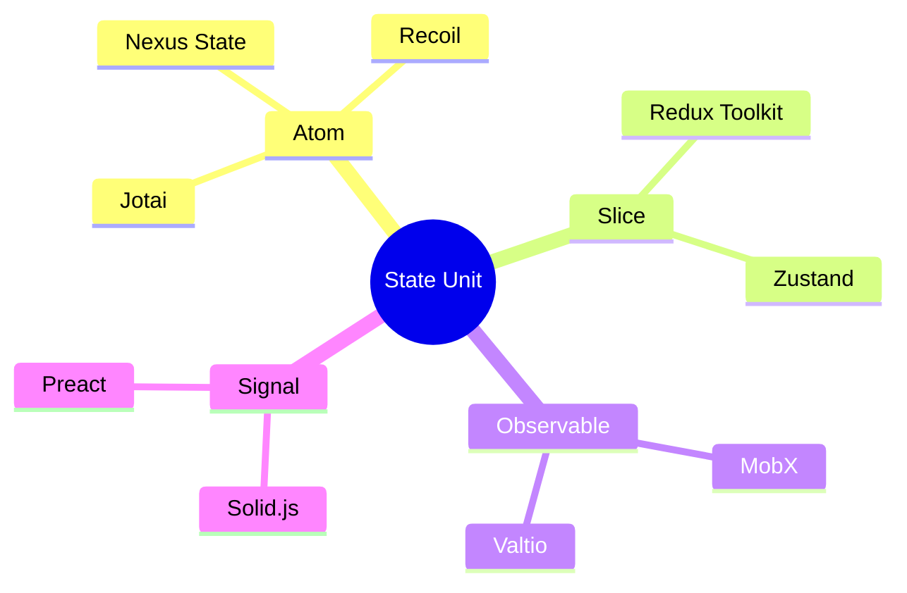
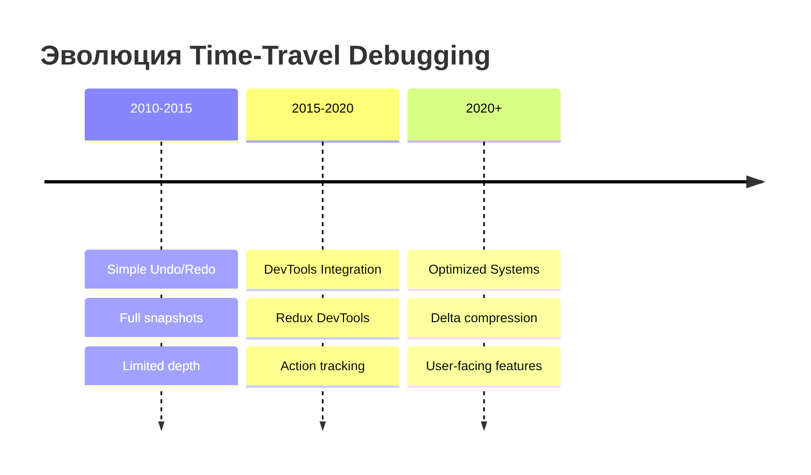
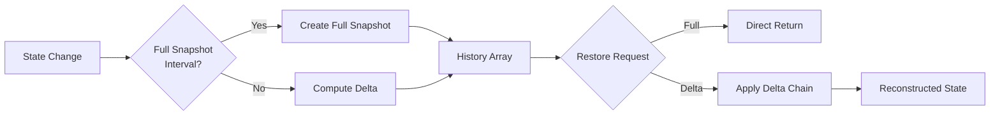

# Time-Travel Debugging в State Management: Часть 1 — Основы и паттерны

> **Серия:** Time-Travel в State Management (Часть 1 из 3)
>
> От инструмента отладки до конкурентного преимущества UX

---

## Введение

**Представьте:** вы тестируете форму оформления заказа. Пользователь заполняет все поля, нажимает «Оплатить»... и получает ошибку.

Вы начинаете отладку. Но вместо того чтобы воспроизводить сценарий заново и заново, вы просто **отматываете состояние назад** — к моменту перед ошибкой. Как в видеоигре, где вы перезапускаете с последнего чекпоинта.

Это и есть **Time-Travel Debugging** — возможность перемещаться между состояниями приложения во времени.

> **💡 Ключевой инсайт:** В современных приложениях time-travel эволюционировал от исключительно инструмента разработчика до **самостоятельной пользовательской функциональности**, которая становится конкурентным преимуществом продукта.

> **💡 Примечание:** Техники и паттерны из этой серии работают в обоих сценариях — и для отладки, и для пользовательского undo/redo.

### Области применения

| Область                      | Примеры              | Глубина истории | Ценность                                |
| ---------------------------- | -------------------- | --------------- | --------------------------------------- |
| 📝 **Текстовые редакторы**   | Google Docs, Notion  | 500-1000 шагов  | История версий, undo/redo               |
| 📋 **Формы и конструкторы**  | Typeform, Tilda      | 50-100 шагов    | Отмена изменений в реальном времени     |
| 🎨 **Графические редакторы** | Figma, Canva         | 50-100 шагов    | Эксперименты с дизайном                 |
| 💻 **IDE и редакторы кода**  | VS Code, CodeSandbox | 500+ шагов      | Локальная история изменений             |
| 🏗️ **Low-code платформы**    | Webflow, Bubble      | 100-200 шагов   | Version control для визуальных проектов |
| 🎬 **Видеоредакторы**        | Premiere Pro, CapCut | 10-20 шагов     | Откат операций монтажа                  |

**В этой статье** мы рассмотрим архитектурные паттерны, которые работают во всех этих областях — от простых форм до сложных мультимедийных систем.

---

## Терминология

В этой статье используются следующие термины:

| Термин                          | Описание                                              | Аналоги в библиотеках                                          |
| ------------------------------- | ----------------------------------------------------- | -------------------------------------------------------------- |
| **Единица состояния**           | Минимальная неделимая часть состояния                 | Универсальная концепция                                        |
| **Атом** (Atom)                 | Единица состояния в atom-based библиотеках            | Jotai: `atom`, Recoil: `atom`, Nexus State: `atom`             |
| **Слайс** (Slice)               | Логически обособленная часть состояния                | Redux Toolkit: `createSlice`, Zustand: `state key`             |
| **Observable**                  | Реактивный объект с авто-отслеживанием изменений      | MobX: `observable`, Valtio: `proxy`, Solid.js: `signal`        |
| **Store**                       | Контейнер для единиц состояния (глобальное состояние) | Zustand: `store`, Redux: `store` |
| **Снимок состояния** (Snapshot) | Копия состояния на определённый момент времени        | Универсальный термин                                           |
| **Дельта** (Delta)              | Разница между двумя снимками состояния                | Универсальный термин                                           |

> **💡 Примечание:** Термин **"единица состояния"** используется как **универсальная абстракция**. В зависимости от библиотеки, это может называться:
>
> - **Атом** (Jotai, Recoil, Nexus State)
> - **Слайс / ключ состояния** (Redux, Zustand)
> - **Observable property** (MobX, Valtio)
> - **Signal** (Solid.js, Preact)

**Визуальная карта терминологии:**



**Пример соответствия:**

```javascript
// Nexus State / Jotai / Recoil
const countAtom = atom(0);

// Zustand (аналог атома)
const useStore = create((set) => ({
  count: 0, // ← единица состояния
}));

// Redux Toolkit (аналог атома)
const counterSlice = createSlice({
  name: 'counter',
  initialState: { value: 0 },
  //              ^^^^^^^^^^^ единица состояния
});

// MobX (аналог атома)
const store = makeObservable({
  count: 0, // ← единица состояния
});
```

**Почему «единица состояния»?**

1. **Универсальность** — подходит для любой библиотеки (не только atom-based)
2. **Точность** — подчёркивает минимальность и неделимость
3. **Нейтральность** — не привязывает к терминологии конкретной библиотеки

> **Примечание:** В примерах кода мы используем термин «атом» для краткости, но подразумеваем любую единицу состояния в вашей библиотеке.

---

## Что такое Time-Travel Debugging?

### Определение

**Time-Travel Debugging** — это метод отладки, при котором система сохраняет историю изменений состояния и позволяет разработчику:

- **Просматривать** предыдущие состояния приложения
- **Перемещаться** между состояниями (вперёд и назад)
- **Анализировать** разницу между состояниями
- **Воспроизводить** последовательности действий

### Ключевые возможности

```typescript
interface TimeTravelAPI {
  // Навигация
  undo(): boolean;
  redo(): boolean;
  jumpTo(index: number): boolean;

  // Проверка доступности
  canUndo(): boolean;
  canRedo(): boolean;

  // История
  getHistory(): Snapshot[];
  getCurrentSnapshot(): Snapshot | undefined;

  // Управление
  capture(action?: string): Snapshot;
  clearHistory(): void;
}
```

### Use Cases

1. **Отладка сложных состояний** — когда баг воспроизводится только после определённой последовательности действий
2. **Анализ регрессий** — понимание, какое изменение привело к проблеме
3. **Обучение и демонстрация** — пошаговое воспроизведение пользовательских сценариев
4. **Автоматическое тестирование** — воспроизведение последовательностей для тестов

---

## Исторический контекст

### Ранние реализации

Концепция time-travel debugging не нова. Первые значимые реализации появились в середине 2000-х:

| Год  | Система                | Описание                                                  |
| ---- | ---------------------- | --------------------------------------------------------- |
| 2004 | **Smalltalk Squeak**   | Одна из первых сред с поддержкой «возврата» состояния     |
| 2010 | **OmniGraffle**        | Undo/redo для графических операций                        |
| 2015 | **Redux DevTools**     | Популяризация time-travel для веб-приложений              |
| 2016 | **Elm Time Travel**    | Встроенная поддержка благодаря immutable архитектуре      |
| 2019 | **Akita (Angular)**    | Встроенная time-travel поддержка для Angular              |
| 2021 | **Elf (Shopify)**      | Reactive state management на RxJS с DevTools              |
| 2020+| **Современные библиотеки** | Jotai, Zustand, MobX с плагинами                      |

### Эволюция подходов



**Поколение 1 (2010-2015): Простые стеки undo/redo**

- Хранение полных копий состояния
- Ограниченная глубина истории
- Нет поддержки асинхронности

**Поколение 2 (2015-2020): Интеграция с DevTools**

- Визуализация изменений
- Поддержка Redux-подобных архитектур
- Action-based tracking

**Поколение 3 (2020+): Оптимизированные системы**

- Delta-сжатие
- Умная очистка памяти
- Поддержка атомарных состояний
- State visualizer tool

---

## Архитектурные паттерны

### 1. Command Pattern (Паттерн Команда)

Классический подход, где каждое изменение состояния инкапсулируется в объект-команду:

```typescript
interface Command<T> {
  execute(): T;
  undo(): void;
  redo(): void;
}

// Для библиотек с атомами (Jotai, Recoil, Nexus State)
class SetAtomCommand<T> implements Command<T> {
  constructor(
    private atom: Atom<T>,
    private newValue: T,
    private oldValue?: T
  ) {}

  execute(): T {
    this.oldValue = this.atom.get();
    this.atom.set(this.newValue);
    return this.newValue;
  }

  undo(): void {
    this.atom.set(this.oldValue!);
  }

  redo(): void {
    this.execute();
  }
}

// Для Redux / Zustand (аналог)
class SetStateCommand<T extends Record<string, any>> implements Command<T> {
  constructor(
    private store: Store<T>,
    private slice: keyof T,
    private newValue: any
  ) {}

  execute(): void {
    this.oldValue = this.store.getState()[this.slice];
    this.store.setState({ [this.slice]: this.newValue });
  }

  undo(): void {
    this.store.setState({ [this.slice]: this.oldValue });
  }

  redo(): void {
    this.execute();
  }
}

// Для Akita (Angular) - entity-based подход
class AkitaEntityCommand<T> implements Command<T> {
  constructor(
    private store: EntityStore<any, T>,
    private entityId: string,
    private updates: Partial<T>
  ) {}

  execute(): void {
    this.oldValue = this.store.getEntity(this.entityId);
    this.store.update(this.entityId, this.updates);
  }

  undo(): void {
    this.store.update(this.entityId, this.oldValue);
  }

  redo(): void {
    this.execute();
  }
}

// Для Elf (RxJS-based) - reactive подход
class ElfSetPropCommand<T> implements Command<T> {
  constructor(
    private store: ObservableStore<T>,
    private prop: keyof T,
    private newValue: any
  ) {}

  execute(): void {
    this.oldValue = this.store.getValue()[this.prop];
    this.store.update((state) => ({ ...state, [this.prop]: this.newValue }));
  }

  undo(): void {
    this.store.update((state) => ({ ...state, [this.prop]: this.oldValue }));
  }

  redo(): void {
    this.execute();
  }
}
```

**Преимущества:**

- Явное представление операций
- Легко расширять новыми командами
- Поддержка макросов (группировка команд)

**Недостатки:**

- Накладные расходы на создание объектов
- Сложность с асинхронными операциями

### 2. Snapshot Pattern (Паттерн Снимков)

Сохранение полных копий состояния в ключевые моменты:

```typescript
interface Snapshot {
  id: string;
  timestamp: number;
  action?: string;
  state: Record<string, AtomState>;
  metadata: {
    label?: string;
    source?: 'auto' | 'manual';
  };
}

class SnapshotManager {
  private history: Snapshot[] = [];

  capture(action?: string): Snapshot {
    const snapshot: Snapshot = {
      id: generateId(),
      timestamp: Date.now(),
      action,
      state: deepClone(this.store.getState()),
      metadata: { label: action },
    };

    this.history.push(snapshot);
    return snapshot;
  }
}
```

**Преимущества:**

- Простота реализации
- Быстрое восстановление (прямая замена состояния)
- Легко сериализовать для экспорта

**Недостатки:**

- Высокое потребление памяти
- Дублирование данных

### 3. Delta Pattern (Паттерн Разниц)

Хранение только изменений между состояниями:

```typescript
interface DeltaSnapshot {
  id: string;
  type: 'delta';
  baseSnapshotId: string;
  changes: {
    [atomId: string]: {
      oldValue: any;
      newValue: any;
    };
  };
  timestamp: number;
}

class DeltaCalculator {
  computeDelta(before: Snapshot, after: Snapshot): DeltaSnapshot {
    const changes: Record<string, any> = {};

    for (const [key, value] of Object.entries(after.state)) {
      const oldValue = before.state[key]?.value;
      if (!deepEqual(oldValue, value)) {
        changes[key] = { oldValue, newValue: value };
      }
    }

    return {
      id: generateId(),
      type: 'delta',
      baseSnapshotId: before.id,
      changes,
      timestamp: Date.now(),
    };
  }
}
```

**Преимущества:**

- Значительная экономия памяти (до 90% для мелких изменений)
- Точное отслеживание изменений
- Возможность «применения» разниц

**Недостатки:**

- Сложность восстановления (требуется применение цепочки delta)
- Риск «разрыва цепочки» (если базовый snapshot удалён)

### 4. Hybrid Approach (Гибридный подход)

Современный подход, сочетающий snapshots и deltas:



```typescript
class HybridHistoryManager {
  private fullSnapshots: Snapshot[] = [];
  private deltaChain: Map<string, DeltaSnapshot> = new Map();

  // Каждые N изменений создаём полный snapshot
  private fullSnapshotInterval = 10;
  private changesSinceFull = 0;

  add(state: State): void {
    if (this.changesSinceFull >= this.fullSnapshotInterval) {
      // Создаём полный snapshot
      const full = this.createFullSnapshot(state);
      this.fullSnapshots.push(full);
      this.changesSinceFull = 0;
    } else {
      // Создаём delta
      const base = this.getLastFullSnapshot();
      const delta = this.computeDelta(base, state);
      this.deltaChain.set(delta.id, delta);
      this.changesSinceFull++;
    }
  }

  restore(index: number): State {
    const full = this.getNearestFullSnapshot(index);
    const deltas = this.getDeltasBetween(full.index, index);

    // Применяем deltas к полному snapshot
    return deltas.reduce(
      (state, delta) => this.applyDelta(state, delta),
      full.state
    );
  }
}
```

**Когда использовать:**

| Паттерн | Используйте когда... | Избегайте когда... |
|---------|---------------------|-------------------|
| **Command** | Сложные операции, макросы | Простые изменения, асинхронность |
| **Snapshot** | Маленькие состояния, нужна простота | Большие состояния, частые изменения |
| **Delta** | Частые мелкие изменения | Редкие крупные изменения |
| **Hybrid** | Универсальный случай | Очень простые приложения |

---

## Стратегии хранения состояния

### 1. Полные копии (Full Snapshots)

```typescript
// Универсальный пример для любой библиотеки
function createFullSnapshot(store: Store): Snapshot {
  return {
    id: uuid(),
    state: JSON.parse(JSON.stringify(store.getState())),
    timestamp: Date.now(),
  };
}

// Для Redux / Zustand
const snapshot = {
  state: {
    counter: { value: 5 },  // Redux slice
    user: { name: 'John' }  // Redux slice
  },
  timestamp: Date.now()
};

// Для Jotai / Nexus State
const snapshot = {
  state: {
    'count-atom-1': { value: 5, type: 'atom' },
    'user-atom-2': { value: { name: 'John' }, type: 'atom' }
  },
  timestamp: Date.now()
};
```

**Характеристики:**

- **Память:** O(n × m), где n — количество snapshots, m — размер состояния
- **Восстановление:** O(1) — прямая замена
- **Сериализация:** Простая

### 2. Разницы (Deltas)

```typescript
// Универсальный пример
function computeDelta(before: State, after: State): Delta {
  const changes: Record<string, Change> = {};

  for (const key of Object.keys(after)) {
    if (!deepEqual(before[key], after[key])) {
      changes[key] = {
        from: before[key],
        to: after[key],
      };
    }
  }

  return { changes, timestamp: Date.now() };
}

// Пример: Redux slice
const delta = {
  changes: {
    'counter.value': { from: 5, to: 6 },
    'user.lastUpdated': { from: 1000, to: 2000 }
  }
};

// Пример: Jotai atoms
const delta = {
  changes: {
    'count-atom-1': { from: 5, to: 6 }
  }
};
```

**Характеристики:**

- **Память:** O(n × k), где k — средний размер изменений (k << m)
- **Восстановление:** O(d) — применение d deltas
- **Сериализация:** Требует контекста (базового snapshot)

### 3. Structural Sharing (на примере Immer)

Использование immutable структур с shared ссылками:

```typescript
// Пример с использованием Immutable.js
import { Map } from 'immutable';

const state1 = Map({ count: 1, user: { name: 'John' } });
const state2 = state1.set('count', 2);

// state1 и state2共享 объект user
// Изменился только count

// Для React + Immer (популярный подход)
import { produce } from 'immer';

const state1 = { count: 1, user: { name: 'John' } };
const state2 = produce(state1, draft => {
  draft.count = 2;
  // user остаётся той же ссылкой
});
```

**Характеристики:**

| Аспект | Immer (Proxy) | Immutable.js |
|--------|---------------|--------------|
| **Память** | O(n + m) в лучшем случае | O(log n) для Persistent Data Structures |
| **Восстановление** | O(1) с ссылками | O(log n) для доступа |
| **Требования** | Proxy API (ES2015+) | Специализированная библиотека |
| **Совместимость** | Высокая (прозрачные объекты) | Средняя (специальные типы) |

> **Примечание:** Характеристики могут отличаться в зависимости от реализации. Для ClojureScript, Mori и других библиотек с persistent data structures сложность будет иной.

### 4. Сравнение стратегий

| Стратегия | Память | Восстановление | Сложность | Use Case |
|-----------|--------|----------------|-----------|----------|
| Full Snapshots | Высокая | Быстрое | Низкая | Маленькие состояния |
| Deltas | Низкая | Среднее | Средняя | Частые мелкие изменения |
| Structural Sharing | Средняя | Быстрое | Высокая | Immutable состояния |
| Hybrid | Средняя | Среднее | Высокая | Универсальное |

---

## Что дальше?

В **Части 2** («Производительность и продвинутые темы») мы рассмотрим:

- **Оптимизация памяти:** Delta Snapshots, сжатие, умная очистка
- **Алгоритмы навигации:** Undo/Redo, jumpTo, оптимизация для больших историй
- **Транзакционность:** Восстановление с откатом, чекпоинты
- **Проблемы производительности:** Benchmark, оптимизации
- **Time-Travel как User-Facing функциональность:** От отладки к UX

---

## 🤔 Вопрос для размышления

> **Какой паттерн вы бы выбрали для своего проекта?**
>
> Подумайте о текущем проекте:
> - Как часто меняется состояние?
> - Какой размер состояния (маленький/средний/большой)?
> - Нужна ли глубокая история (100+ шагов)?
>
> Поделитесь своим выбором в комментариях!

---

**Продолжение следует...**

→ [Часть 2: Производительность и продвинутые темы](part-2-advanced-final.md)

→ [Часть 3: Практическая реализация](part-3-practical.md)

---

**Ресурсы:**

### Библиотеки с time-travel поддержкой

- [Redux DevTools Documentation](https://github.com/reduxjs/redux-devtools)
- [Elm Time Travel](https://guide.elm-lang.org/architecture/)
- [Nexus State Time Travel](https://github.com/astashkin-a/nexus-state)
- [Zustand Middleware](https://github.com/pmndrs/zustand#middlewares)
- [Jotai Documentation](https://jotai.org/)
- [Recoil Documentation](https://recoiljs.org/)

### Immutable структуры данных

- [Immutable.js](https://immutable-js.com/)
- [Immer](https://immerjs.github.io/immer/)

---

*Это Часть 1 из 3 серии статей о Time-Travel Debugging.*

**Теги:** #javascript #typescript #state-management #debugging #architecture #react #redux #performance
