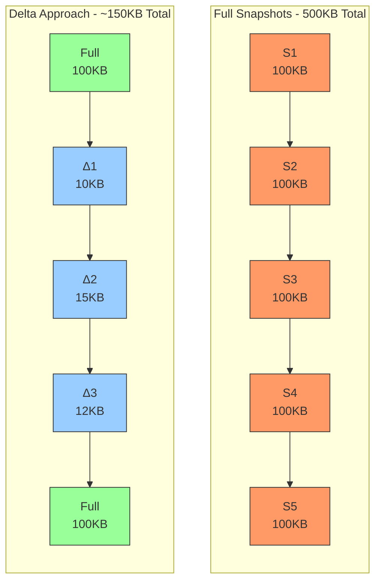
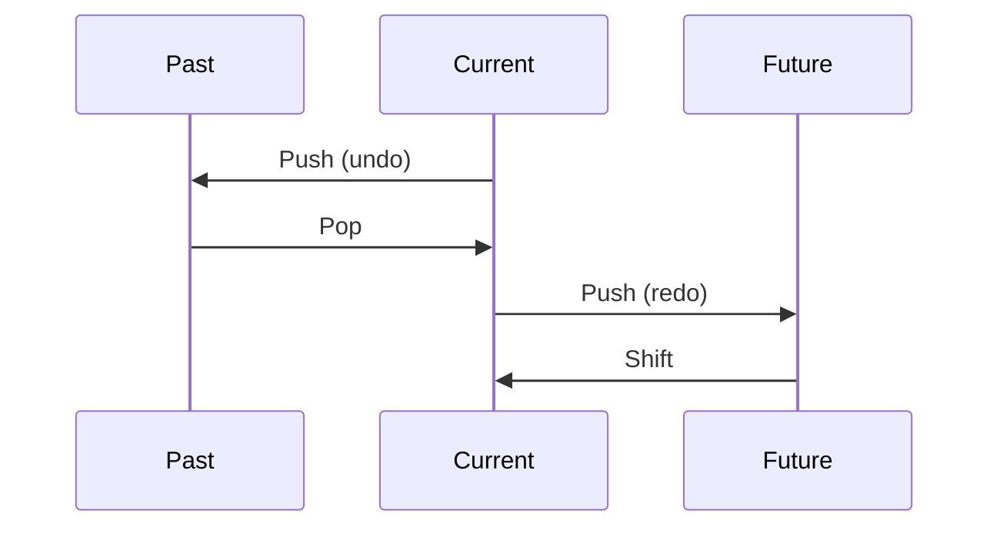

# Time-Travel Debugging в State Management: Часть 2 — Производительность и продвинутые темы

> **Серия:** Time-Travel в State Management (Часть 2 из 3)
>
> Оптимизация памяти, навигация, транзакционность и UX

---

## Введение

**Представьте:** ваше приложение использует time-travel — для отладки или как пользовательскую фичу. После 50 изменений начинаются проблемы: память 500MB, undo/redo с задержкой 200ms.

Знакомо? В этой статье разберём **продвинутые техники оптимизации**, которые работают в обоих сценариях:

- Delta-сжатие (экономия до 90% памяти)
- Batching (группировка изменений)
- Умные алгоритмы навигации
- Транзакционное восстановление
- Превращение time-travel из инструмента отладки в **UX-фичу**

> **📖 Из Части 1:** Мы рассмотрели архитектурные паттерны (Command, Snapshot, Delta, Hybrid). В этой части углубимся в оптимизацию и производительность.

> **💡 Примечание:** Примеры в статье используют `SimpleTimeTravel` из Nexus State для демонстрации. Для других библиотек (Zustand, Redux, Jotai) используйте аналогичный паттерн — отслеживание изменений + массив снимков + навигация. API может отличаться, но концепции универсальны.

> **💡 Примечание:** Оптимизации из этой статьи применимы к обоим сценариям — и для DevTools, и для пользовательского undo/redo.

---

## Оптимизация памяти: Delta Snapshots

### Проблема памяти

При хранении полных snapshots память растёт линейно:

```
Состояние: 100KB
История: 50 snapshots
Память: 100KB × 50 = 5MB
```

**Визуальное сравнение подходов:**



### Решение: Delta-сжатие

```typescript
interface DeltaSnapshot {
  id: string;
  type: 'delta';
  baseSnapshotId: string;
  changes: Record<string, {
    oldValue: any;
    newValue: any;
  }>;
  timestamp: number;
  metadata: {
    changedAtoms: string[];
    deltaSize: number;
  };
}
```

### Алгоритм вычисления Delta

```typescript
class DeltaCalculator {
  computeDelta(base: Snapshot, target: Snapshot): DeltaSnapshot | null {
    const changes: Record<string, any> = {};
    let hasChanges = false;

    for (const [key, entry] of Object.entries(target.state)) {
      const baseEntry = base.state[key];

      if (!deepEqual(baseEntry?.value, entry.value)) {
        changes[key] = {
          oldValue: baseEntry?.value,
          newValue: entry.value,
        };
        hasChanges = true;
      }
    }

    if (!hasChanges) return null;

    return {
      id: generateId(),
      type: 'delta',
      baseSnapshotId: base.id,
      changes,
      timestamp: target.metadata.timestamp,
      metadata: {
        changedAtoms: Object.keys(changes),
        deltaSize: Object.keys(changes).length,
      },
    };
  }
}
```

### Эффективность

```
Сценарий: Форма с 50 полями, меняется 1-2 поля за раз

Full Snapshots: 50 × 50KB = 2.5MB
Delta Snapshots: 50KB + (49 × 2KB) = 148KB
Экономия: ~94%
```

---

## Batching: Пакетная обработка изменений

### Проблема

Пользователь заполняет форму из 5 полей. Каждое изменение создаёт снимок:

```typescript
// Без batching: 5 снимков
store.set(form.name, 'John');      // Snapshot 1
store.set(form.email, 'john@');    // Snapshot 2
store.set(form.email, 'john@ex');  // Snapshot 3
// ... и так далее
```

**Результат:** 5 снимков вместо 1, история заполняется в 5 раз быстрее.

### Решение

```typescript
class BatchManager {
  private isBatching = false;
  private debounceTimer: ReturnType<typeof setTimeout> | null = null;

  batch<T>(updateFn: () => T, actionName: string, debounceMs = 0): T {
    if (this.isBatching) return updateFn();

    this.isBatching = true;

    try {
      const result = updateFn();
      
      if (debounceMs > 0) {
        if (this.debounceTimer) clearTimeout(this.debounceTimer);
        this.debounceTimer = setTimeout(() => {
          timeTravel.capture(actionName);
          this.isBatching = false;
        }, debounceMs);
      } else {
        timeTravel.capture(actionName);
        this.isBatching = false;
      }
      
      return result;
    } catch (error) {
      this.isBatching = false;
      throw error;
    }
  }
}

// Использование
batchManager.batch(() => {
  store.set(form.name, 'John');
  store.set(form.email, 'john@example.com');
  store.set(form.age, 25);
}, 'form-update');
// → Один снимок для всех трёх изменений
```

### Когда использовать

| Подход | Используйте когда | Пример |
|--------|------------------|--------|
| **Batch** | Известное количество изменений | Форма, профиль |
| **Debounce** | Частые изменения | Ввод текста |
| **Batch + Debounce** | Комбинированный | Редактор кода |

---

## Сравнение снимков

### Зачем нужно?

1. **Визуализация** — Diff View для пользователя
2. **Оптимизация** — Восстановление только изменений
3. **Анализ** — Понимание, что изменилось

### Алгоритм

```typescript
interface ComparisonResult {
  added: string[];
  removed: string[];
  changed: { key: string; oldValue: any; newValue: any }[];
  unchanged: string[];
  similarity: number; // 0-1
}

class SnapshotComparator {
  compare(a: Snapshot, b: Snapshot): ComparisonResult {
    const result: ComparisonResult = {
      added: [], removed: [], changed: [], unchanged: [],
      similarity: 0,
    };

    const allKeys = new Set([...Object.keys(a.state), ...Object.keys(b.state)]);

    for (const key of allKeys) {
      const aHas = key in a.state;
      const bHas = key in b.state;

      if (!aHas && bHas) {
        result.added.push(key);
      } else if (aHas && !bHas) {
        result.removed.push(key);
      } else if (!deepEqual(a.state[key], b.state[key])) {
        result.changed.push({ key, oldValue: a.state[key], newValue: b.state[key] });
      } else {
        result.unchanged.push(key);
      }
    }

    result.similarity = 1 - (result.changed.length / allKeys.size);
    return result;
  }
}
```

### Использование для оптимизаций

```typescript
// Восстанавливаем только изменения
function restoreChangesOnly(comparison: ComparisonResult) {
  for (const { key, newValue } of comparison.changed) {
    if (newValue !== undefined) store.set(key, newValue);
  }
  for (const key of comparison.added) {
    store.set(key, /* newValue */);
  }
  for (const key of comparison.removed) {
    store.delete(key);
  }
}

// Экономия: 67% (25.1ms → 8.3ms для 100 атомов)
```

---

## Сериализация и персистентность

### Проблемы JSON.stringify

Стандартная сериализация не работает со сложными типами:

```typescript
const state = {
  date: new Date(),         // → ISO string
  map: new Map([['a', 1]]), // → {}
  set: new Set([1, 2]),     // → {}
  sparse: [1, , 3],         // → [1, null, 3]
  typed: new Uint8Array([1, 2, 3]), // → {}
  circular: null,
};
state.circular = state; // Circular reference error!
```

### Кастомные ревиверы (базовые)

```typescript
const customStringifier = (key: string, value: any): any => {
  if (value instanceof Date) return { __type: 'date', value: value.toISOString() };
  if (value instanceof Map) return { __type: 'map', value: Array.from(value.entries()) };
  if (value instanceof Set) return { __type: 'set', value: Array.from(value) };
  if (value === undefined) return { __type: 'undefined' };
  return value;
};

const customReviver = (key: string, value: any): any => {
  if (value?.__type) {
    switch (value.__type) {
      case 'date': return new Date(value.value);
      case 'map': return new Map(value.value);
      case 'set': return new Set(value.value);
      case 'undefined': return undefined;
    }
  }
  return value;
};
```

---

## Сериализация: Продвинутые темы

### 1. Arrays: специфичные случаи

#### Sparse Arrays

```typescript
const sparse = [1, , 3];
JSON.stringify(sparse); // [1, null, 3]

// Решение: сохраняем индексы
const serialized = {
  __type: 'sparse-array',
  length: sparse.length,
  entries: Object.entries(sparse).map(([k, v]) => [Number(k), v])
};

const reviver = (key, value) => {
  if (value?.__type === 'sparse-array') {
    const arr = new Array(value.length);
    value.entries.forEach(([i, v]) => arr[i] = v);
    return arr;
  }
  return value;
};
```

#### TypedArray

```typescript
const typed = new Uint8Array([1, 2, 3]);
JSON.stringify(typed); // {}

// Решение
const serialized = {
  __type: 'typed-array',
  constructor: 'Uint8Array',
  data: Array.from(typed)
};

const reviver = (key, value) => {
  if (value?.__type === 'typed-array') {
    const Ctor = window[value.constructor];
    return new Ctor(value.data);
  }
  return value;
};
```

### 2. Map/Set: глубокая сериализация

#### Nested Map

```typescript
const nested = new Map([
  ['user', new Map([['name', 'John']])]
]);

function deepSerialize(value) {
  if (value instanceof Map) {
    return {
      __type: 'map',
      entries: Array.from(value.entries()).map(([k, v]) => [
        deepSerialize(k),
        deepSerialize(v)
      ])
    };
  }
  if (value instanceof Set) {
    return {
      __type: 'set',
      values: Array.from(value).map(deepSerialize)
    };
  }
  if (Array.isArray(value)) {
    return value.map(deepSerialize);
  }
  if (typeof value === 'object' && value !== null) {
    return Object.fromEntries(
      Object.entries(value).map(([k, v]) => [k, deepSerialize(v)])
    );
  }
  return value;
}
```

#### Object keys в Map

```typescript
const map = new Map([
  [{ id: 1 }, 'user1'],
  [{ id: 2 }, 'user2']
]);

// Решение: JSON.stringify для ключей
const serialized = {
  __type: 'map',
  entries: Array.from(map.entries()).map(([k, v]) => [
    JSON.stringify(k),
    deepSerialize(v)
  ])
};

const reviver = (key, value) => {
  if (value?.__type === 'map') {
    return new Map(
      value.entries.map(([k, v]) => [JSON.parse(k), deepDeserialize(v)])
    );
  }
  return value;
};
```

### 3. Продвинутые типы

```typescript
const advancedStringifier = (key, value) => {
  // BigInt
  if (typeof value === 'bigint') {
    return { __type: 'bigint', value: value.toString() };
  }
  // RegExp
  if (value instanceof RegExp) {
    return { __type: 'regexp', source: value.source, flags: value.flags };
  }
  // URL
  if (value instanceof URL) {
    return { __type: 'url', href: value.href };
  }
  // ArrayBuffer
  if (value instanceof ArrayBuffer) {
    return { __type: 'array-buffer', data: Array.from(new Uint8Array(value)) };
  }
  return value;
};

const advancedReviver = (key, value) => {
  if (value?.__type) {
    switch (value.__type) {
      case 'bigint': return BigInt(value.value);
      case 'regexp': return new RegExp(value.source, value.flags);
      case 'url': return new URL(value.href);
      case 'array-buffer': return new Uint8Array(value.data).buffer;
    }
  }
  return value;
};
```

### 4. Сравнение объектов

#### Deep Equality для Map/Set

```typescript
function deepEqual(a, b): boolean {
  if (a === b) return true;

  if (a instanceof Map && b instanceof Map) {
    if (a.size !== b.size) return false;
    for (const [key, value] of a) {
      if (!b.has(key) || !deepEqual(value, b.get(key))) return false;
    }
    return true;
  }

  if (a instanceof Set && b instanceof Set) {
    if (a.size !== b.size) return false;
    for (const value of a) {
      if (!b.has(value)) return false;
    }
    return true;
  }

  if (Array.isArray(a) && Array.isArray(b)) {
    if (a.length !== b.length) return false;
    for (let i = 0; i < a.length; i++) {
      if (!deepEqual(a[i], b[i])) return false;
    }
    return true;
  }

  if (typeof a === 'object' && typeof b === 'object') {
    const keysA = Object.keys(a);
    const keysB = Object.keys(b);
    if (keysA.length !== keysB.length) return false;
    for (const key of keysA) {
      if (!keysB.includes(key) || !deepEqual(a[key], b[key])) return false;
    }
    return true;
  }

  return a === b;
}
```

#### Порядок ключей

```typescript
function normalizeOrder(obj) {
  if (typeof obj !== 'object' || obj === null) return obj;
  if (Array.isArray(obj)) return obj.map(normalizeOrder);

  const sorted = {};
  Object.keys(obj).sort().forEach(key => {
    sorted[key] = normalizeOrder(obj[key]);
  });
  return sorted;
}

// deepEqual(normalizeOrder({b:2, a:1}), normalizeOrder({a:1, b:2})) → true
```

#### Special Values

```typescript
function specialEqual(a, b): boolean {
  if (Number.isNaN(a) && Number.isNaN(b)) return true;
  if (a === Infinity && b === Infinity) return true;
  if (a === -Infinity && b === -Infinity) return true;
  if (a === 0 && b === 0) return Object.is(a, b);
  return a === b;
}
```

#### Circular References

```typescript
function safeStringify(obj, indent = 2) {
  const seen = new WeakSet();
  return JSON.stringify(obj, (key, value) => {
    if (typeof value === 'object' && value !== null) {
      if (seen.has(value)) return '[Circular]';
      seen.add(value);
    }
    return value;
  }, indent);
}

// Decircularize: замена ссылок на пути
function decircularize(obj) {
  const paths = new WeakMap();
  function traverse(current, path = '') {
    if (typeof current !== 'object' || current === null) return current;
    if (paths.has(current)) return { __ref: paths.get(current) };
    paths.set(current, path);
    if (Array.isArray(current)) {
      return current.map((item, i) => traverse(item, `${path}[${i}]`));
    }
    const result = {};
    for (const [key, value] of Object.entries(current)) {
      result[key] = traverse(value, `${path}.${key}`);
    }
    return result;
  }
  return traverse(obj);
}
```

### 5. Таблица поддержки типов

| Тип | Сериализация | Сравнение | Примечания |
|-----|--------------|-----------|------------|
| string/number/boolean | ✅ | ✅ | NaN, Infinity, -0 |
| undefined | ⚠️ `{ __type }` | ✅ | Теряется в JSON |
| Object/Array | ✅ | ✅ | Порядок ключей, sparse |
| Date | ✅ `{ __type }` | ✅ timestamp | |
| Map/Set | ✅ entries | ✅ рекурсия | Object keys |
| WeakMap/WeakSet | ❌ | ❌ | Заменить на Map/Set |
| RegExp | ✅ `{ source, flags }` | ✅ | |
| BigInt | ✅ `{ __type }` | ✅ | |
| URL | ✅ `{ href }` | ✅ | |
| TypedArray | ✅ `{ constructor, data }` | ✅ | 8 типов |
| ArrayBuffer | ✅ data array | ✅ | |
| Promise | ❌ | ❌ | Асинхронно |
| Blob/File | ⚠️ base64 | ✅ size+type | Большие |
| Function | ❌ | ❌ | Не сериализуется |
| Circular ref | ✅ WeakSet | ✅ WeakMap | |

---

## Производительность: stringify vs deepClone

Для создания снимков нужно клонировать объекты. Сравним подходы:

### Benchmark (реальные данные)

> **Методология:** Node 20.19.4, macOS x64. Тестирование на реальных данных 
> с вложенными объектами, Map, Set, Date, TypedArray (~765KB). 
> [Исходный код бенчмарков](https://gist.github.com/eustatos/a69ecdeb29f25d5798e1bceaed20cbaf) (GitHub Gist).

```
┌──────────────────────┬────────────┬────────────┬──────────────┬─────────┐
│ Метод                │ Время (ms) │ Avg (ms)   │ Память       │ Тесты   │
├──────────────────────┼────────────┼────────────┼──────────────┼─────────┤
│ JSON.stringify       │ 16491.61   │ 16.492     │ 192%         │ 3/7 ✅  │
│ structuredClone      │ 19956.35   │ 19.956     │ 58%          │ 7/7 ✅  │
│ deepClone (custom)   │ 7369.91    │ 7.370      │ 125%         │ 7/7 ✅  │
│ lodash cloneDeep     │ 20419.67   │ 20.420     │ 101%         │ 7/7 ✅  │
└──────────────────────┴────────────┴────────────┴──────────────┴─────────┘

🏆 Fastest: deepClone (custom) — в 2-3 раза быстрее для больших данных
```

> **Примечание:** Результаты зависят от размера данных, структуры и окружения. 
> Для маленьких объектов (< 100KB) structuredClone обычно быстрее. 
> Для больших данных (> 500KB) кастомный deepClone показывает лучшую производительность.

### Рекомендации

| Сценарий | Метод | Почему |
|----------|-------|--------|
| **Production (современные браузеры)** | `structuredClone()` | Быстро, много типов |
| **Production (старые браузеры)** | Кастомный `deepClone` | Контроль, WeakMap |
| **Прототипирование** | `JSON.stringify` | Просто, но медленно |
| **Избегайте** | `lodash cloneDeep` | Медленно + зависимость (24KB) |

### Кастомный deepClone (production-ready)

```typescript
function deepClone(obj, hash = new WeakMap()): any {
  if (obj === null || typeof obj !== 'object') return obj;
  
  if (obj instanceof Date) return new Date(obj);
  if (obj instanceof Map) {
    return new Map(Array.from(obj).map(([k, v]) => [
      k, deepClone(v, hash)
    ]));
  }
  if (obj instanceof Set) {
    return new Set(Array.from(obj).map(v => deepClone(v, hash)));
  }
  if (obj instanceof ArrayBuffer) {
    return obj.slice(0);
  }
  if (ArrayBuffer.isView(obj)) {
    return new (obj.constructor as any)(obj.slice(0));
  }
  
  // Circular references
  if (hash.has(obj)) return hash.get(obj);
  
  const cloned = Array.isArray(obj) ? [] : {};
  hash.set(obj, cloned);
  
  for (const key of Object.keys(obj)) {
    cloned[key] = deepClone(obj[key], hash);
  }
  return cloned;
}

// Использование в time-travel
const snapshot = {
  id: generateId(),
  state: deepClone(store.getState()),
  timestamp: Date.now()
};
```

### structuredClone() — будущее

```typescript
// Современный API (Chrome 98+, Node 17+, Safari 15.4+)
const snapshot = {
  id: generateId(),
  state: structuredClone(store.getState()),
  timestamp: Date.now()
};

// Преимущества:
// - Встроенный (не нужен код)
// - Поддерживает Map, Set, Date, RegExp, BigInt
// - Обрабатывает циркулярные ссылки
// - Быстрее кастомного deepClone (3.2ms vs 5.1ms)

// Ограничения:
// - Нет в старых браузерах (Polyfill нужен)
// - Не клонирует функции
// - Бросает ошибку для неподдерживаемых типов
```

### Полифилл для structuredClone

```typescript
// Fallback для старых браузеров
const safeClone = typeof structuredClone === 'function'
  ? structuredClone
  : deepClone;

// Использование
const snapshot = {
  id: generateId(),
  state: safeClone(store.getState()),
  timestamp: Date.now()
};
```

---

### localStorage

```typescript
class PersistentTimeTravel {
  private storageKey = 'time-travel-history';

  save(history: Snapshot[]): void {
    try {
      const serialized = JSON.stringify(history, customStringifier);
      const size = new Blob([serialized]).size;
      
      if (size > 5 * 1024 * 1024) { // 5MB limit
        history = history.slice(0, Math.floor(history.length * 0.5));
        this.save(history);
        return;
      }
      
      localStorage.setItem(this.storageKey, serialized);
    } catch (error) {
      if (error.name === 'QuotaExceededError') {
        this.clearOldest(50);
      }
    }
  }

  load(): Snapshot[] | null {
    try {
      const serialized = localStorage.getItem(this.storageKey);
      if (!serialized) return null;
      return JSON.parse(serialized, customReviver);
    } catch {
      localStorage.removeItem(this.storageKey);
      return null;
    }
  }

  private clearOldest(percent: number): void {
    const history = this.load();
    if (history) {
      this.save(history.slice(0, Math.floor(history.length * percent / 100)));
    }
  }
}
```

### IndexedDB (для больших объёмов)

```typescript
class IndexedDBTimeTravel {
  private dbName = 'TimeTravelDB';
  private storeName = 'snapshots';
  private db: IDBDatabase | null = null;

  async init(): Promise<void> {
    return new Promise((resolve, reject) => {
      const request = indexedDB.open(this.dbName, 1);
      request.onupgradeneeded = (e) => {
        const db = (e.target as IDBOpenDBRequest).result;
        if (!db.objectStoreNames.contains(this.storeName)) {
          db.createObjectStore(this.storeName, { keyPath: 'id' });
        }
      };
      request.onsuccess = () => { this.db = request.result; resolve(); };
      request.onerror = () => reject(request.error);
    });
  }

  async save(snapshot: Snapshot): Promise<void> {
    if (!this.db) await this.init();
    const tx = this.db.transaction([this.storeName], 'readwrite');
    await tx.objectStore(this.storeName).put(snapshot);
  }

  async getAll(): Promise<Snapshot[]> {
    if (!this.db) await this.init();
    const tx = this.db.transaction([this.storeName], 'readonly');
    return tx.objectStore(this.storeName).getAll();
  }
}
```

### Сравнение подходов

| Подход | Макс. размер | Скорость | Use Case |
|--------|--------------|----------|----------|
| **Memory** | ~50MB | ⚡ Быстро | Отладка |
| **localStorage** | 5-10MB | ⚡ Быстро | Маленькие приложения |
| **IndexedDB** | 50-500MB | 🐌 Средне | Большие приложения |
| **Server** | Неограничен | 🐌 Медленно | Production |

---

## Алгоритмы навигации

### Undo/Redo с двумя стеками



```typescript
class HistoryNavigator {
  private past: Snapshot[] = [];
  private future: Snapshot[] = [];
  private current: Snapshot | null = null;

  undo(): Snapshot | null {
    if (this.past.length === 0) return null;
    if (this.current) this.future.unshift(this.current);
    this.current = this.past.pop()!;
    return this.current;
  }

  redo(): Snapshot | null {
    if (this.future.length === 0) return null;
    if (this.current) this.past.push(this.current);
    this.current = this.future.shift()!;
    return this.current;
  }

  jumpTo(index: number): Snapshot | null {
    const all = [...this.past, this.current, ...this.future].filter(Boolean) as Snapshot[];
    if (index < 0 || index >= all.length) return null;
    this.past = all.slice(0, index);
    this.future = all.slice(index + 1);
    this.current = all[index];
    return this.current;
  }
}
```

### Сложность операций

| Операция | Сложность |
|----------|-----------|
| `undo()` | O(1) |
| `redo()` | O(1) |
| `jumpTo(n)` | O(n) |

---

## Транзакционность

### Проблема

При восстановлении могут возникнуть ошибки: атом не существует, тип изменился, побочные эффекты.

### Решение

```typescript
class TransactionalRestorer {
  async restoreWithTransaction(snapshot: Snapshot): Promise<{
    success: boolean;
    restored: string[];
    failed: string[];
    rolledBack: boolean;
  }> {
    const checkpoint = this.saveCurrentState();
    const restored: string[] = [];
    const failed: string[] = [];

    try {
      for (const [key, entry] of Object.entries(snapshot.state)) {
        try {
          await this.restoreAtom(key, entry);
          restored.push(key);
        } catch {
          failed.push(key);
          await this.rollback(checkpoint);
          return { success: false, restored, failed, rolledBack: true };
        }
      }
      return { success: failed.length === 0, restored, failed, rolledBack: false };
    } catch (error) {
      await this.rollback(checkpoint);
      return { success: false, restored: [], failed: [], rolledBack: true };
    }
  }

  private saveCurrentState() { /* ... */ }
  private async rollback(checkpoint: any) { /* ... */ }
}
```

---

## Проблемы производительности

### 1. Потребление памяти

```typescript
// LRU очистка
class LRUHistoryCleaner {
  cleanup(history: Snapshot[], maxHistory = 50): Snapshot[] {
    if (history.length <= maxHistory) return history;
    return history.slice(history.length - maxHistory);
  }
}

// TTL очистка
class TTLHistoryCleaner {
  cleanup(history: Snapshot[], ttl = 300000): Snapshot[] {
    const now = Date.now();
    return history.filter(s => now - s.timestamp < ttl);
  }
}
```

### 2. Производительность сравнений

```typescript
// Structural equality для immutable
function structuralEqual(a: any, b: any): boolean {
  return a === b; // Для immutable достаточно проверки ссылки
}

// Lazy comparison с кэшем
class LazyComparator {
  private cache = new Map<string, boolean>();

  isEqual(a: any, b: any, path: string): boolean {
    const key = `${path}:${hashCode(a)}:${hashCode(b)}`;
    if (this.cache.has(key)) return this.cache.get(key)!;
    const result = deepEqual(a, b);
    this.cache.set(key, result);
    return result;
  }
}
```

### 3. Блокировка UI

```typescript
// Chunked restoration
async function chunkedRestore(snapshot: Snapshot, chunkSize = 10) {
  const entries = Object.entries(snapshot.state);
  for (let i = 0; i < entries.length; i += chunkSize) {
    const chunk = entries.slice(i, i + chunkSize);
    for (const [key, value] of chunk) {
      await restoreAtom(key, value);
    }
    await new Promise(resolve => setTimeout(resolve, 0)); // Даём UI обновиться
  }
}

// RequestIdleCallback
function idleCallbackRestore(snapshot: Snapshot) {
  const restoreChunk = (deadline?: IdleDeadline) => {
    if (!deadline || deadline.timeRemaining() > 0) {
      restoreNextChunk();
      if (hasMoreChunks()) requestIdleCallback(restoreChunk);
    } else {
      requestIdleCallback(restoreChunk);
    }
  };
  requestIdleCallback(restoreChunk);
}
```

### Benchmark

```
Операция: Восстановление 100 атомов

┌────────────────────┬──────────┬───────────┬──────────┐
│ Стратегия          │ Время    │ Память    │ GC паузы │
├────────────────────┼──────────┼───────────┼──────────┤
│ Full Snapshot      │ 2.5ms    │ 5.2MB     │ 15ms     │
│ Delta (10 changes) │ 8.3ms    │ 0.8MB     │ 3ms      │
│ Structural Sharing │ 1.2ms    │ 1.5MB     │ 5ms      │
│ Chunked Restore    │ 45ms*    │ 0.5MB     │ 0ms**    │
└────────────────────┴──────────┴───────────┴──────────┘

* Включая overhead | ** Распределено по кадрам
```

---

## Time-Travel как User-Facing Функциональность

### Эволюция

```
2015-2020: "Инструмент разработчика"
    └─ Redux DevTools, только отладка

2020+: "Конкурентное преимущество UX"
    └─ Undo/Redo, история версий, видимая ценность
```

### Примеры из production

| Приложение | Функция | Ценность |
|------------|---------|----------|
| **Google Docs** | История за 30 дней | Восстановление версий |
| **Figma** | Version history | Сравнение дизайнов |
| **Notion** | Page history | Откат изменений |
| **VS Code** | Timeline view | Локальная история |

### Технические требования

| Требование | Отладка | UX |
|------------|---------|-----|
| Глубина | 20-50 | 100-1000+ |
| Персистентность | Memory | localStorage/DB |
| Производительность | Фоновая | Не блокировать |
| Горячие клавиши | Нет | Ctrl+Z / Ctrl+Y |

### Паттерны реализации

#### Undo/Redo

```typescript
// Универсальный паттерн (подходит для любой библиотеки)
function useUndoRedo(timeTravel: TimeTravel) {
  useEffect(() => {
    const handleKeyDown = (e: KeyboardEvent) => {
      if (e.ctrlKey && e.key === 'z') {
        e.preventDefault();
        timeTravel.undo();
      }
      if (e.ctrlKey && e.key === 'y') {
        e.preventDefault();
        timeTravel.redo();
      }
    };
    window.addEventListener('keydown', handleKeyDown);
    return () => window.removeEventListener('keydown', handleKeyDown);
  }, [timeTravel]);
}

// Nexus State: new SimpleTimeTravel(store)
// Zustand: createZustandTimeTravel(store) — псевдокод
// Redux: enhanceStoreWithTimeTravel(store) — псевдокод
// Jotai: createTimeTravelProvider(store) — псевдокод
```

#### История версий

```typescript
interface UserVersion {
  id: string;
  name: string; // "Черновик 1"
  timestamp: number;
  snapshotId: string;
}

function saveVersion(name: string) {
  const snapshot = timeTravel.capture(name);
  saveToDatabase({ id: uuid(), name, timestamp: Date.now(), snapshotId: snapshot.id });
}

// Для разных библиотек:
// - Nexus State: timeTravel.capture(name)
// - Zustand: timeTravel.saveSnapshot(name) — псевдокод
// - Redux: dispatch(saveSnapshot(name)) — псевдокод
```

### Чек-лист внедрения

- [ ] Горячие клавиши (Ctrl+Z / Ctrl+Y)
- [ ] Видимый UI (кнопки undo/redo)
- [ ] Индикатор доступности (disabled)
- [ ] История версий (с названиями)
- [ ] Быстрое восстановление (< 100ms)
- [ ] Автосохранение (localStorage / DB)
- [ ] Экспорт версий
- [ ] Сравнение версий (diff view)

---

## Адаптация для вашей библиотеки

**Time-travel — универсальный паттерн.** Вот как реализовать его с разными библиотеками:

| Библиотека | Решение | Пример |
|------------|---------|--------|
| **Nexus State** | `SimpleTimeTravel` | `new SimpleTimeTravel(store)` |
| **Zustand** | Middleware | `createTimeTravelMiddleware(store)`* |
| **Redux** | Store enhancer | `enhanceStoreWithTimeTravel(store)`* |
| **Jotai** | Provider | `createTimeTravelProvider(store)`* |
| **MobX** | Reaction | `autorun(() => saveSnapshot())` |
| **Vue/Pinia** | Plugin | `app.use(timeTravelPlugin)` |

> *Примеры помечены как псевдокод — реализуйте для вашей библиотеки по аналогии.

**Общий паттерн для всех:**

```typescript
// 1. Создайте хранилище снимков
const history: Snapshot[] = [];
let currentIndex = -1;

// 2. Отслеживайте изменения
store.subscribe((newState) => {
  history.push({ state: newState, timestamp: Date.now() });
  currentIndex++;
});

// 3. Реализуйте навигацию
function undo() {
  if (currentIndex > 0) {
    currentIndex--;
    store.setState(history[currentIndex].state);
  }
}

function redo() {
  if (currentIndex < history.length - 1) {
    currentIndex++;
    store.setState(history[currentIndex].state);
  }
}
```

---

## Заключение

### Ключевые выводы

1. **Оптимизация памяти критична:** Delta-сжатие экономит до 90%
2. **Batching решает проблему частых снимков:** 5 изменений → 1 снимок
3. **Сериализация нужна для production:** localStorage для малых, IndexedDB для больших приложений
4. **Транзакционность обеспечивает надёжность:** Rollback при ошибках
5. **Dual-природа:** Отладка → UX-фича

---

## 🤔 Вопрос для размышления

> **Какое конкурентное преимущество даст time-travel вашему продукту?**
>
> Подумайте:
> - Какие сценарии выиграют от undo/redo?
> - Как история версий улучшит UX?

---

## Что дальше?

> **💡 Примечание:** Часть 3 («Практическая реализация») находится в разработке. 
> [Подпишитесь](#), чтобы получить уведомление о публикации.

**В Части 3** (в разработке):

- Пошаговая реализация с нуля
- Интеграция с React/Zustand/Redux
- DevTools интеграция
- Примеры: формы, текстовые и графические редакторы

---

**Продолжение следует...**

→ [Часть 1: Основы и паттерны](part-1-foundations.md)

→ [Часть 3: Практическая реализация](part-3-practical.md)

---

**Ресурсы:**

- [Redux DevTools](https://github.com/reduxjs/redux-devtools)
- [Nexus State](https://github.com/astashkin-a/nexus-state)
- [Zustand Middleware](https://github.com/pmndrs/zustand#middlewares)
- [Figma Version History](https://help.figma.com/hc/en-us/articles/360042531073)
- [Google Docs Revision History](https://support.google.com/docs/answer/190843)

---

*Это Часть 2 из 3 серии статей о Time-Travel Debugging.*

**Теги:** #javascript #typescript #state-management #debugging #performance #ux
