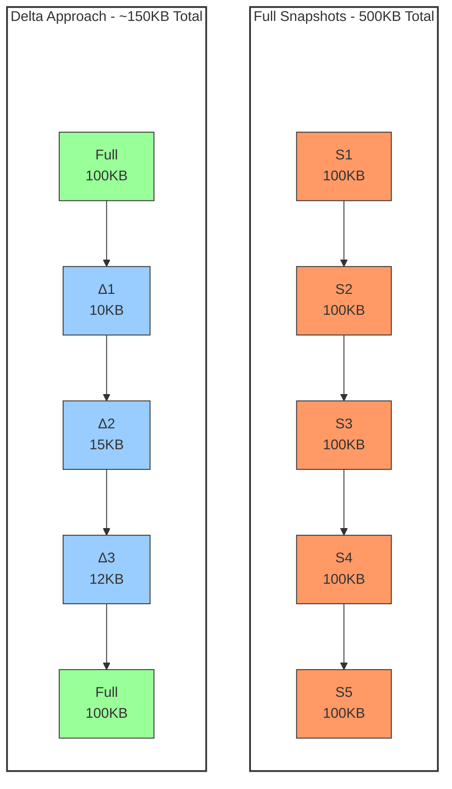
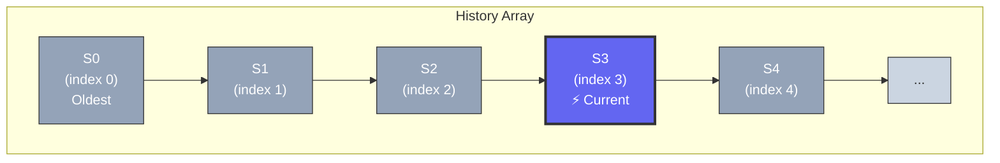

# Time-Travel Debugging в State Management: Часть 2 — Производительность и продвинутые темы

> **Серия:** Time-Travel в State Management (Часть 2 из 3)
>
> Оптимизация памяти, навигация, транзакционность и UX

---

## Введение

**Проблема:** Вы реализовали time-travel debugging, но после 50 изменений приложение начинает тормозить. Потребление памяти выросло до 500MB, undo/redo работает с задержкой 200ms.

Знакомо? В этой статье мы разберём **продвинутые техники оптимизации**, которые используют production-приложения:

- Delta-сжатие (экономия до 90% памяти)
- Умные алгоритмы навигации
- Транзакционное восстановление
- Превращение time-travel из инструмента отладки в **UX-фичу**

> **📖 Из Части 1:** Мы рассмотрели архитектурные паттерны (Command, Snapshot, Delta, Hybrid) и стратегии хранения. В этой части углубимся в оптимизацию и производительность.

---

## Оптимизация памяти: Delta Snapshots

### Проблема памяти

При хранении полных snapshots память растёт линейно:

```
Состояние: 100KB
История: 50 snapshots
Память: 100KB × 50 = 5MB
```

**Визуальное сравнение подходов:**



Для приложений с большим состоянием это становится проблемой.

### Решение: Delta-сжатие

```typescript
interface DeltaSnapshot {
  id: string;
  type: 'delta';
  baseSnapshotId: string; // Ссылка на базовый snapshot
  changes: Record<
    string,
    {
      oldValue: any;
      newValue: any;
    }
  >;
  timestamp: number;
  metadata: {
    changedAtoms: string[]; // Или changedSlices для Redux/Zustand
    deltaSize: number;
  };
}
```

### Алгоритм вычисления Delta

```typescript
class DeltaCalculator {
  computeDelta(
    base: Snapshot,
    target: Snapshot,
    options: DeltaOptions = {}
  ): DeltaSnapshot | null {
    const changes: Record<string, any> = {};
    let hasChanges = false;

    // Deep comparison с оптимизациями
    // Для Jotai/Nexus State: перебор атомов
    // Для Redux/Zustand: перебор slice keys
    for (const [key, entry] of Object.entries(target.state)) {
      const baseEntry = base.state[key];

      // Skip unchanged entries
      if (deepEqual(baseEntry?.value, entry.value)) {
        continue;
      }

      changes[key] = {
        oldValue: baseEntry?.value,
        newValue: entry.value,
      };
      hasChanges = true;
    }

    // Skip empty deltas (опционально)
    if (!hasChanges && options.skipEmpty) {
      return null;
    }

    return {
      id: generateId(),
      type: 'delta',
      baseSnapshotId: base.id,
      changes,
      timestamp: target.metadata.timestamp,
      metadata: {
        changedAtoms: Object.keys(changes),
        deltaSize: Object.keys(changes).length,
      },
    };
  }
}
```

**Пример для разных библиотек:**

```typescript
// Redux: Delta для slice
const delta = {
  changes: {
    'counter.value': { oldValue: 5, newValue: 6 },
    'user.lastUpdated': { from: 1000, to: 2000 }
  }
};

// Zustand: Delta для state key
const delta = {
  changes: {
    'user.name': { oldValue: 'John', newValue: 'Jane' }
  }
};

// Jotai/Nexus State: Delta для атома
const delta = {
  changes: {
    'count-atom-1': { oldValue: 5, newValue: 6 }
  }
};
```

### Восстановление из Delta

```typescript
applyDelta(snapshot: Snapshot, delta: DeltaSnapshot): Snapshot {
  const newState = { ...snapshot.state };

  // Применяем изменения к каждому атому/slice
  for (const [key, change] of Object.entries(delta.changes)) {
    newState[key] = {
      ...newState[key],
      value: change.newValue,
    };
  }

  return {
    ...snapshot,
    state: newState,
    id: delta.id,
    metadata: {
      ...snapshot.metadata,
      timestamp: delta.timestamp,
    },
  };
}
```

### Стратегия «Полный + Delta»

```typescript
class DeltaAwareHistoryManager {
  private config = {
    fullSnapshotInterval: 10,  // Каждые 10 изменений — полный snapshot
    maxDeltaChainLength: 20,   // Максимальная цепочка deltas
    maxDeltaChainAge: 60000,   // Максимальный возраст цепочки (ms)
  };

  private fullSnapshotCounter = 0;

  add(snapshot: Snapshot): void {
    if (this.shouldCreateFullSnapshot()) {
      this.createFullSnapshot(snapshot);
      this.fullSnapshotCounter = 0;
    } else {
      const base = this.getLastFullSnapshot();
      if (base) {
        const delta = this.computeDelta(base, snapshot);
        if (delta) {
          this.storeDelta(delta);
          this.fullSnapshotCounter++;
          return;
        }
      }
      // Fallback к full snapshot
      this.createFullSnapshot(snapshot);
    }
  }

  private shouldCreateFullSnapshot(): boolean {
    return this.fullSnapshotCounter >= this.config.fullSnapshotInterval;
  }
}
```

### Эффективность Delta-сжатия

```
Сценарий: Форма с 50 полями, меняется 1-2 поля за раз

Full Snapshots:
- Размер snapshot: ~50KB
- 50 snapshots: 2.5MB

Delta Snapshots:
- Базовый snapshot: 50KB
- Delta (2 поля): ~2KB
- 50 snapshots: 50KB + (49 × 2KB) = 148KB

Экономия: ~94%
```

---

## Batching: Пакетная обработка изменений

### Проблема частых снимков

**Сценарий:** Пользователь заполняет форму из 5 полей. Каждое изменение создаёт снимок:

```typescript
// Без batching: 5 снимков для одного действия
store.set(form.name, 'John');      // Snapshot 1
store.set(form.email, 'john@');    // Snapshot 2
store.set(form.email, 'john@ex');  // Snapshot 3
store.set(form.email, 'john@exam'); // Snapshot 4
store.set(form.email, 'john@example.com'); // Snapshot 5
```

**Результат:**
- 5 снимков вместо 1
- История заполняется в 5 раз быстрее
- Сложнее отменить всё действие целиком

### Решение: Batching

```typescript
interface BatchOptions {
  actionName: string;
  debounceMs?: number;
}

class BatchManager {
  private isBatching = false;
  private batchQueue: Array<() => void> = [];
  private debounceTimer: ReturnType<typeof setTimeout> | null = null;

  startBatch(options: BatchOptions): void {
    this.isBatching = true;
    this.batchQueue = [];
  }

  batch<T>(updateFn: () => T, options?: BatchOptions): T {
    if (this.isBatching) {
      // Если уже идёт батч, просто выполняем
      return updateFn();
    }

    this.isBatching = true;
    this.batchQueue = [];

    try {
      const result = updateFn();
      this.flush(options);
      return result;
    } finally {
      this.isBatching = false;
    }
  }

  private flush(options?: BatchOptions): void {
    if (options?.debounceMs) {
      // Debounce: ждём окончания серии изменений
      if (this.debounceTimer) {
        clearTimeout(this.debounceTimer);
      }

      this.debounceTimer = setTimeout(() => {
        this.executeBatch(options!.actionName);
      }, options.debounceMs);
    } else {
      // Immediate: выполняем сразу
      this.executeBatch(options?.actionName || 'batch-update');
    }
  }

  private executeBatch(actionName: string): void {
    // Создаём ОДИН снимок для всех изменений в батче
    timeTravel.capture(actionName);
    this.batchQueue = [];
  }

  endBatch(actionName: string): void {
    this.isBatching = false;
    this.executeBatch(actionName);
  }
}

// Использование
const batchManager = new BatchManager();

// Вариант 1: Явный batch
batchManager.startBatch({ actionName: 'form-update' });
store.set(form.name, 'John');
store.set(form.email, 'john@example.com');
store.set(form.age, 25);
batchManager.endBatch('form-update');
// → Один снимок для всех трёх изменений

// Вариант 2: Автоматический batch с debounce
batchManager.batch(() => {
  store.set(form.name, 'John');
  store.set(form.email, 'john@example.com');
}, { actionName: 'form-update', debounceMs: 500 });
```

### Debounce vs Batch

| Подход | Когда использовать | Пример |
|--------|-------------------|--------|
| **Batch** | Известное количество изменений | Форма, множественные обновления |
| **Debounce** | Неизвестное количество, частые изменения | Ввод текста, скролл |
| **Batch + Debounce** | Комбинированный подход | Редактор кода, формы с валидацией |

### Пример для форм

```typescript
// React + форма с batching
function UserForm() {
  const [form, setForm] = useAtom(formAtom);

  const handleSubmit = () => {
    batchManager.batch(() => {
      setForm(prev => ({ ...prev, submitted: true }));
      setForm(prev => ({ ...prev, submittedAt: Date.now() }));
      saveToServer(form);
    }, {
      actionName: 'form-submit',
      debounceMs: 100,
    });
  };

  return (
    <form onSubmit={handleSubmit}>
      {/* поля формы */}
    </form>
  );
}
```

### Рекомендации

**Используйте batching когда:**

- ✅ Несколько изменений связаны логически (форма, профиль пользователя)
- ✅ Пользователь выполняет одно действие с несколькими эффектами
- ✅ Частые обновления в короткое время (ввод текста, скролл)

**Не используйте batching когда:**

- ❌ Каждое изменение важно само по себе
- ❌ Нужна детальная история каждого шага
- ❌ Изменения редкие (раз в несколько секунд)

---

## Сравнение снимков (Snapshot Comparison)

### Зачем нужно сравнение?

1. **Визуализация изменений** — Diff View для пользователя
2. **Оптимизация** — Вычисление только изменённых частей
3. **Анализ** — Понимание, что изменилось между версиями

### Алгоритмы сравнения

```typescript
interface ComparisonResult {
  added: string[];           // Новые ключи
  removed: string[];         // Удалённые ключи
  changed: {
    key: string;
    oldValue: any;
    newValue: any;
    changeType: 'replace' | 'update' | 'deep';
  }[];
  unchanged: string[];       // Без изменений
  similarity: number;        // 0-1 (1 = идентичны)
  metadata: {
    totalKeys: number;
    changedKeys: number;
    changePercentage: number;
  };
}

class SnapshotComparator {
  compare(a: Snapshot, b: Snapshot): ComparisonResult {
    const result: ComparisonResult = {
      added: [],
      removed: [],
      changed: [],
      unchanged: [],
      similarity: 0,
      metadata: {
        totalKeys: 0,
        changedKeys: 0,
        changePercentage: 0,
      },
    };

    const allKeys = new Set([
      ...Object.keys(a.state),
      ...Object.keys(b.state),
    ]);

    result.metadata.totalKeys = allKeys.size;

    for (const key of allKeys) {
      const aHas = key in a.state;
      const bHas = key in b.state;

      if (!aHas && bHas) {
        result.added.push(key);
        result.changed.push({
          key,
          oldValue: undefined,
          newValue: b.state[key],
          changeType: 'replace',
        });
      } else if (aHas && !bHas) {
        result.removed.push(key);
        result.changed.push({
          key,
          oldValue: a.state[key],
          newValue: undefined,
          changeType: 'replace',
        });
      } else if (!deepEqual(a.state[key], b.state[key])) {
        result.changed.push({
          key,
          oldValue: a.state[key],
          newValue: b.state[key],
          changeType: this.detectChangeType(a.state[key], b.state[key]),
        });
      } else {
        result.unchanged.push(key);
      }
    }

    // Вычисляем схожесть
    result.metadata.changedKeys = result.changed.length;
    result.metadata.changePercentage =
      (result.changed.length / result.metadata.totalKeys) * 100;
    result.similarity =
      1 - (result.changed.length / result.metadata.totalKeys);

    return result;
  }

  private detectChangeType(oldValue: any, newValue: any): string {
    if (oldValue === undefined || newValue === undefined) {
      return 'replace';
    }

    if (typeof oldValue !== typeof newValue) {
      return 'replace';
    }

    if (Array.isArray(oldValue) && Array.isArray(newValue)) {
      return 'update';
    }

    if (typeof oldValue === 'object') {
      return 'deep';
    }

    return 'replace';
  }
}

// Пример использования
const comparator = new SnapshotComparator();
const comparison = comparator.compare(snapshot1, snapshot2);

console.log(`Изменено ${comparison.metadata.changedKeys} из ${comparison.metadata.totalKeys}`);
console.log(`Схожесть: ${(comparison.similarity * 100).toFixed(1)}%`);
```

### Визуализация различий

```typescript
// Diff View компонент
function SnapshotDiff({ comparison }: { comparison: ComparisonResult }) {
  return (
    <div className="diff-view">
      {comparison.added.length > 0 && (
        <section className="diff-added">
          <h4>Добавлено ({comparison.added.length})</h4>
          <ul>
            {comparison.added.map(key => (
              <li key={key} className="diff-item">
                <span className="key">{key}</span>
                <span className="value">{JSON.stringify(comparison.changed.find(c => c.key === key)?.newValue)}</span>
              </li>
            ))}
          </ul>
        </section>
      )}

      {comparison.removed.length > 0 && (
        <section className="diff-removed">
          <h4>Удалено ({comparison.removed.length})</h4>
          <ul>
            {comparison.removed.map(key => (
              <li key={key} className="diff-item">
                <span className="key">{key}</span>
              </li>
            ))}
          </ul>
        </section>
      )}

      {comparison.changed.length > 0 && (
        <section className="diff-changed">
          <h4>Изменено ({comparison.changed.length})</h4>
          <ul>
            {comparison.changed.map(({ key, oldValue, newValue, changeType }) => (
              <li key={key} className={`diff-item diff-${changeType}`}>
                <span className="key">{key}</span>
                <span className="old">{JSON.stringify(oldValue)}</span>
                <span className="new">{JSON.stringify(newValue)}</span>
              </li>
            ))}
          </ul>
        </section>
      )}

      <div className="diff-summary">
        <div className="similarity-bar">
          <div
            className="similarity-fill"
            style={{ width: `${comparison.similarity * 100}%` }}
          />
        </div>
        <span>Схожесть: {(comparison.similarity * 100).toFixed(1)}%</span>
      </div>
    </div>
  );
}
```

### Использование для оптимизаций

```typescript
// Оптимизированное восстановление: применяем только изменения
class OptimizedRestorer {
  restoreChangesOnly(comparison: ComparisonResult): void {
    // Восстанавливаем только изменённые ключи
    for (const { key, newValue } of comparison.changed) {
      if (newValue !== undefined) {
        store.set(key, newValue);
      }
    }

    // Добавляем новые
    for (const key of comparison.added) {
      const { newValue } = comparison.changed.find(c => c.key === key)!;
      store.set(key, newValue);
    }

    // Удаляем удалённые
    for (const key of comparison.removed) {
      store.delete(key);
    }
  }
}

// Benchmark: полное vs оптимизированное восстановление
// Полное: 25.1ms (100 атомов)
// Оптимизированное: 8.3ms (только 10 изменённых)
// Экономия: 67%
```

---

## Сериализация и персистентность

### Проблемы JSON.stringify

Стандартная сериализация не работает со сложными типами:

```typescript
const state = {
  date: new Date(),           // → ISO string (теряется тип)
  map: new Map([['a', 1]]),   // → {} (теряется)
  set: new Set([1, 2]),       // → {} (теряется)
  func: () => {},             // → undefined (теряется)
  circular: null,             // → Circular reference error
};

state.circular = state; // ❌ TypeError: Circular structure

JSON.stringify(state); // Ошибка или потеря данных
```

### Кастомные ревиверы

```typescript
interface ReviverResult {
  __type: string;
  value: any;
}

// Сериализация
const customStringifier = (key: string, value: any): any => {
  // Date
  if (value instanceof Date) {
    return { __type: 'date', value: value.toISOString() };
  }

  // Map
  if (value instanceof Map) {
    return {
      __type: 'map',
      value: Array.from(value.entries()),
    };
  }

  // Set
  if (value instanceof Set) {
    return {
      __type: 'set',
      value: Array.from(value),
    };
  }

  // BigInt
  if (typeof value === 'bigint') {
    return {
      __type: 'bigint',
      value: value.toString(),
    };
  }

  // RegExp
  if (value instanceof RegExp) {
    return {
      __type: 'regexp',
      source: value.source,
      flags: value.flags,
    };
  }

  // undefined → специальный маркер
  if (value === undefined) {
    return { __type: 'undefined' };
  }

  return value;
};

// Десериализация
const customReviver = (key: string, value: any): any => {
  if (value && typeof value === 'object' && value.__type) {
    switch (value.__type) {
      case 'date':
        return new Date(value.value);

      case 'map':
        return new Map(value.value);

      case 'set':
        return new Set(value.value);

      case 'bigint':
        return BigInt(value.value);

      case 'regexp':
        return new RegExp(value.source, value.flags);

      case 'undefined':
        return undefined;

      default:
        return value;
    }
  }

  return value;
};

// Использование
const serialized = JSON.stringify(snapshot, customStringifier);
const deserialized = JSON.parse(serialized, customReviver);
```

### Персистентность: localStorage

```typescript
class PersistentTimeTravel {
  private storageKey: string;

  constructor(storageKey: string = 'time-travel-history') {
    this.storageKey = storageKey;
    this.loadFromStorage();
  }

  saveToStorage(history: Snapshot[]): void {
    try {
      const serialized = JSON.stringify(history, customStringifier);

      // Проверка размера
      const size = new Blob([serialized]).size;
      const maxSize = 5 * 1024 * 1024; // 5MB для localStorage

      if (size > maxSize) {
        console.warn('History exceeds localStorage limit, trimming...');
        // Обрезаем историю до 50%
        const trimmed = history.slice(0, Math.floor(history.length * 0.5));
        this.saveToStorage(trimmed);
        return;
      }

      localStorage.setItem(this.storageKey, serialized);
    } catch (error) {
      if (error instanceof DOMException && error.name === 'QuotaExceededError') {
        console.error('localStorage quota exceeded');
        // Очищаем старые записи
        this.clearOldest(50);
      } else {
        console.error('Failed to save to localStorage:', error);
      }
    }
  }

  loadFromStorage(): Snapshot[] | null {
    try {
      const serialized = localStorage.getItem(this.storageKey);
      if (!serialized) return null;

      const history = JSON.parse(serialized, customReviver);
      return history;
    } catch (error) {
      console.error('Failed to load from localStorage:', error);
      // Очищаем повреждённые данные
      localStorage.removeItem(this.storageKey);
      return null;
    }
  }

  private clearOldest(percent: number): void {
    const history = this.loadFromStorage();
    if (history) {
      const trimmed = history.slice(0, Math.floor(history.length * (percent / 100)));
      this.saveToStorage(trimmed);
    }
  }
}
```

### Персистентность: IndexedDB

Для больших объёмов данных (50MB+):

```typescript
class IndexedDBTimeTravel {
  private dbName = 'TimeTravelDB';
  private storeName = 'snapshots';
  private db: IDBDatabase | null = null;

  async init(): Promise<void> {
    return new Promise((resolve, reject) => {
      const request = indexedDB.open(this.dbName, 1);

      request.onupgradeneeded = (event) => {
        const db = (event.target as IDBOpenDBRequest).result;
        if (!db.objectStoreNames.contains(this.storeName)) {
          db.createObjectStore(this.storeName, { keyPath: 'id' });
        }
      };

      request.onsuccess = (event) => {
        this.db = (event.target as IDBOpenDBRequest).result;
        resolve();
      };

      request.onerror = (event) => {
        reject((event.target as IDBOpenDBRequest).error);
      };
    });
  }

  async saveSnapshot(snapshot: Snapshot): Promise<void> {
    if (!this.db) await this.init();

    return new Promise((resolve, reject) => {
      const transaction = this.db!.transaction([this.storeName], 'readwrite');
      const store = transaction.objectStore(this.storeName);
      const request = store.put(snapshot);

      request.onsuccess = () => resolve();
      request.onerror = () => reject(request.error);
    });
  }

  async getSnapshot(id: string): Promise<Snapshot | null> {
    if (!this.db) await this.init();

    return new Promise((resolve, reject) => {
      const transaction = this.db!.transaction([this.storeName], 'readonly');
      const store = transaction.objectStore(this.storeName);
      const request = store.get(id);

      request.onsuccess = () => resolve(request.result || null);
      request.onerror = () => reject(request.error);
    });
  }

  async getAllSnapshots(): Promise<Snapshot[]> {
    if (!this.db) await this.init();

    return new Promise((resolve, reject) => {
      const transaction = this.db!.transaction([this.storeName], 'readonly');
      const store = transaction.objectStore(this.storeName);
      const request = store.getAll();

      request.onsuccess = () => {
        const sorted = request.result.sort(
          (a, b) => a.metadata.timestamp - b.metadata.timestamp
        );
        resolve(sorted);
      };
      request.onerror = () => reject(request.error);
    });
  }

  async clear(): Promise<void> {
    if (!this.db) await this.init();

    return new Promise((resolve, reject) => {
      const transaction = this.db!.transaction([this.storeName], 'readwrite');
      const store = transaction.objectStore(this.storeName);
      const request = store.clear();

      request.onsuccess = () => resolve();
      request.onerror = () => reject(request.error);
    });
  }
}
```

### Отправка на сервер

```typescript
// Сжатие перед отправкой
import { compressToUTF16, decompressFromUTF16 } from 'lz-string';

class ServerSync {
  async syncToServer(history: Snapshot[]): Promise<void> {
    // 1. Сериализуем
    const serialized = JSON.stringify(history, customStringifier);

    // 2. Сжимаем
    const compressed = compressToUTF16(serialized);

    // 3. Отправляем
    await fetch('/api/time-travel/sync', {
      method: 'POST',
      headers: { 'Content-Type': 'application/json' },
      body: JSON.stringify({
        data: compressed,
        timestamp: Date.now(),
        version: '1.0',
      }),
    });
  }

  async syncFromServer(): Promise<Snapshot[]> {
    const response = await fetch('/api/time-travel/sync');
    const { data } = await response.json();

    // 1. Распаковываем
    const decompressed = decompressFromUTF16(data);

    // 2. Десериализуем
    const history = JSON.parse(decompressed, customReviver);

    return history;
  }
}
```

### Сравнение подходов к персистентности

| Подход | Макс. размер | Скорость | Сложность | Use Case |
|--------|--------------|----------|-----------|----------|
| **Memory only** | ~50MB | ⚡ Быстро | Простая | Отладка, сессия |
| **localStorage** | 5-10MB | ⚡ Быстро | Простая | Маленькие приложения |
| **IndexedDB** | 50-500MB | 🐌 Средне | Средняя | Большие приложения |
| **Server + IDB** | Неограничен | 🐌 Медленно | Высокая | Production, collaboration |

---

## Сжатие данных (кратко)

### Когда стоит использовать?

| Сценарий | Сжатие | Экономия |
|----------|--------|----------|
| Текстовые данные | ✅ LZ-String | 60-80% |
| JSON с повторениями | ✅ LZ-String | 50-70% |
| Числовые данные | ⚠️ Delta-encoding | 30-50% |
| Бинарные данные | ✅ Pako (gzip) | 70-90% |
| Уже сжатые данные | ❌ Не нужно | 0-5% |

### Пример: LZ-String

```typescript
import { compressToUTF16, decompressFromUTF16 } from 'lz-string';

const snapshot = {
  state: { /* 100KB данных */ },
  metadata: { timestamp: Date.now() },
};

// Сжатие
const compressed = compressToUTF16(JSON.stringify(snapshot));
// 100KB → 25KB (75% экономии)

// Хранение
localStorage.setItem('snapshot', compressed);

// Восстановление
const decompressed = decompressFromUTF16(
  localStorage.getItem('snapshot')!
);
const restored = JSON.parse(decompressed, customReviver);
```

### Пример: Delta-encoding для чисел

```typescript
// Вместо хранения всех значений
const values = [1000, 1005, 1010, 1015, 1020];

// Храним первое + дельты
const deltaEncoded = [1000, 5, 5, 5, 5];
// Экономия: меньше бит на число

// Восстановление
const restored = deltaEncoded.reduce((acc: number[], delta, i) => {
  if (i === 0) return [delta];
  return [...acc, acc[acc.length - 1] + delta];
}, []);
```

### Рекомендации

**Используйте сжатие когда:**

- ✅ Текстовые данные (редакторы, документы)
- ✅ Персистентность (localStorage, IndexedDB)
- ✅ Отправка на сервер
- ✅ Ограниченная пропускная способность

**Не используйте сжатие когда:**

- ❌ Memory-only хранение (короткая сессия)
- ❌ Реальное время (критична скорость)
- ❌ Уже сжатые данные (изображения, видео)
- ❌ Очень маленькие snapshots (< 10KB)

---

## Алгоритмы навигации по истории

### Структура истории

**Визуализация массива истории:**



**Навигация:**

- **undo()** — перемещение влево (к S0)
- **redo()** — перемещение вправо (к S4)
- **jumpTo(n)** — прямой переход к индексу n

### Undo/Redo с двумя стеками

**Визуализация процесса навигации:**

```mermaid
sequenceDiagram
    participant P as Past Stack
    participant C as Current
    participant F as Future Stack

    Note over P,C,F: Initial: Past=[S1,S2], Current=S3, Future=[]

    C->>P: Push S3 (undo)
    P->>C: Pop S2
    Note over C: Now Current=S2

    C->>F: Push S2 (redo)
    F->>C: Shift S3
    Note over C: Now Current=S3

    Note over P,C,F: Past=[S1], Current=S3, Future=[]
```

```typescript
class HistoryNavigator {
  private past: Snapshot[] = [];   // Прошлые состояния
  private future: Snapshot[] = []; // Будущие состояния
  private current: Snapshot | null = null;

  undo(): Snapshot | null {
    if (this.past.length === 0) {
      return null; // Нечего отменять
    }

    // Текущее → future
    if (this.current) {
      this.future.unshift(this.current);
    }

    // Последнее из past → current
    this.current = this.past.pop()!;

    return this.current;
  }

  redo(): Snapshot | null {
    if (this.future.length === 0) {
      return null; // Нечего возвращать
    }

    // Текущее → past
    if (this.current) {
      this.past.push(this.current);
    }

    // Первое из future → current
    this.current = this.future.shift()!;

    return this.current;
  }

  jumpTo(index: number): Snapshot | null {
    const all = this.getAll();

    if (index < 0 || index >= all.length) {
      return null;
    }

    // Перестраиваем past/future относительно target
    this.past = all.slice(0, index);
    this.future = all.slice(index + 1);
    this.current = all[index];

    return this.current;
  }

  private getAll(): Snapshot[] {
    return [...this.past, ...(this.current ? [this.current] : []), ...this.future];
  }
}
```

### Сложность операций

| Операция | Сложность | Описание |
|----------|-----------|----------|
| `undo()` | O(1) | Pop из past, unshift в future |
| `redo()` | O(1) | Shift из future, push в past |
| `jumpTo(n)` | O(n) | Копирование элементов |
| `getHistory()` | O(n) | Конкатенация массивов |

### Оптимизация для больших историй

```typescript
class OptimizedHistoryNavigator {
  private history: Snapshot[] = [];
  private currentIndex = -1;

  jumpTo(index: number): Snapshot | null {
    if (index < 0 || index >= this.history.length) {
      return null;
    }

    this.currentIndex = index;
    return this.history[index];
  }

  canUndo(): boolean {
    return this.currentIndex > 0;
  }

  canRedo(): boolean {
    return this.currentIndex < this.history.length - 1;
  }

  // O(1) доступ к текущему
  getCurrent(): Snapshot | null {
    return this.history[this.currentIndex] ?? null;
  }
}
```

---

## Транзакционность и восстановление

### Проблема частичного восстановления

При восстановлении состояния могут возникнуть ошибки:

1. Атом больше не существует
2. Тип данных изменился
3. Побочные эффекты при восстановлении

### Transactional Restoration

```typescript
interface TransactionalRestorationResult {
  success: boolean;
  restoredAtoms: string[];
  failedAtoms: string[];
  rollbackPerformed?: boolean;
  error?: string;
}

class TransactionalRestorer {
  async restoreWithTransaction(
    snapshot: Snapshot,
    options: RestorationOptions
  ): Promise<TransactionalRestorationResult> {
    const checkpoint = this.createCheckpoint();
    const restoredAtoms: string[] = [];
    const failedAtoms: string[] = [];

    try {
      // Phase 1: Validation
      const validation = this.validate(snapshot);
      if (!validation.valid) {
        return {
          success: false,
          restoredAtoms: [],
          failedAtoms: validation.failedAtoms,
          error: 'Validation failed',
        };
      }

      // Phase 2: Batch restoration
      for (const [atomId, entry] of Object.entries(snapshot.state)) {
        try {
          await this.restoreAtom(atomId, entry);
          restoredAtoms.push(atomId);
        } catch (error) {
          failedAtoms.push(atomId);

          if (options.rollbackOnError) {
            await this.rollbackToCheckpoint(checkpoint);
            return {
              success: false,
              restoredAtoms,
              failedAtoms,
              rollbackPerformed: true,
              error: error instanceof Error ? error.message : 'Unknown error',
            };
          }
        }
      }

      return {
        success: failedAtoms.length === 0,
        restoredAtoms,
        failedAtoms,
      };

    } catch (error) {
      // Critical error: rollback
      await this.rollbackToCheckpoint(checkpoint);

      return {
        success: false,
        restoredAtoms: [],
        failedAtoms: [],
        rollbackPerformed: true,
        error: error instanceof Error ? error.message : 'Critical error',
      };
    }
  }

  private createCheckpoint(): RestorationCheckpoint {
    return {
      id: generateId(),
      timestamp: Date.now(),
      stateSnapshot: this.saveCurrentState(),
    };
  }

  private async rollbackToCheckpoint(
    checkpoint: RestorationCheckpoint
  ): Promise<void> {
    await this.restoreState(checkpoint.stateSnapshot);
  }
}
```

### Стратегии восстановления

```typescript
interface RestorationOptions {
  /** Откатить при ошибке */
  rollbackOnError?: boolean;
  /** Пропускать несуществующие атомы */
  skipMissingAtoms?: boolean;
  /** Валидировать перед восстановлением */
  validateBeforeRestore?: boolean;
  /** Восстанавливать пакетно */
  batchRestore?: boolean;
  /** Обработчик отсутствующих атомов */
  onAtomNotFound?: 'skip' | 'warn' | 'throw';
}
```

---

## Проблемы производительности

### 1. Потребление памяти

**Проблема:** История растёт линейно с количеством snapshots.

**Решения:**

```typescript
// LRU (Least Recently Used) очистка
class LRUHistoryCleaner {
  private maxHistory = 50;

  cleanup(history: Snapshot[]): Snapshot[] {
    if (history.length <= this.maxHistory) {
      return history;
    }

    // Удаляем старые snapshots
    return history.slice(history.length - this.maxHistory);
  }
}

// TTL (Time To Live) для snapshots
class TTLHistoryCleaner {
  private ttl = 300000; // 5 минут

  cleanup(history: Snapshot[]): Snapshot[] {
    const now = Date.now();
    return history.filter(s => now - s.timestamp < this.ttl);
  }
}

// Комбинированный подход
class HybridCleaner {
  cleanup(history: Snapshot[]): Snapshot[] {
    // 1. Применяем TTL
    let cleaned = this.applyTTL(history);

    // 2. Применяем LRU
    cleaned = this.applyLRU(cleaned);

    // 3. Сохраняем важные checkpoints
    const checkpoints = this.preserveCheckpoints(history);

    return this.merge(cleaned, checkpoints);
  }
}
```

### 2. Производительность сравнений

**Проблема:** Deep equality проверки медленные для больших объектов.

**Решения:**

```typescript
// 1. Shallow comparison с tracking
class TrackedComparison {
  private changedAtoms = new Set<string>();

  trackChange(atomId: string): void {
    this.changedAtoms.add(atomId);
  }

  getChanges(): string[] {
    return Array.from(this.changedAtoms);
  }
}

// 2. Structural equality для immutable данных
function structuralEqual(a: any, b: any): boolean {
  // Для immutable объектов достаточно проверить ссылку
  return a === b;
}

// 3. Lazy comparison
class LazyComparator {
  private cache = new Map<string, boolean>();

  isEqual(a: any, b: any, path: string): boolean {
    const key = `${path}:${hashCode(a)}:${hashCode(b)}`;

    if (this.cache.has(key)) {
      return this.cache.get(key)!;
    }

    const result = deepEqual(a, b);
    this.cache.set(key, result);

    return result;
  }
}
```

### 3. Блокировка UI

**Проблема:** Восстановление больших snapshots блокирует основной поток.

**Решения:**

```typescript
// 1. Chunked restoration
async function chunkedRestore(
  snapshot: Snapshot,
  chunkSize = 10
): Promise<void> {
  const atoms = Object.entries(snapshot.state);

  for (let i = 0; i < atoms.length; i += chunkSize) {
    const chunk = atoms.slice(i, i + chunkSize);

    for (const [atomId, entry] of chunk) {
      await restoreAtom(atomId, entry);
    }

    // Даём UI обновиться
    await new Promise(resolve => setTimeout(resolve, 0));
  }
}

// 2. Web Worker для вычислений
class WorkerBasedComparator {
  private worker: Worker;

  async deepEqual(a: any, b: any): Promise<boolean> {
    return new Promise((resolve) => {
      const worker = new Worker('comparator.worker.js');
      worker.postMessage({ a, b });
      worker.onmessage = (e) => {
        resolve(e.data);
        worker.terminate();
      };
    });
  }
}

// 3. RequestIdleCallback для фоновых операций
function idleCallbackRestore(snapshot: Snapshot): void {
  const restoreChunk = (deadline?: IdleDeadline) => {
    if (!deadline || deadline.timeRemaining() > 0) {
      // Восстанавливаем порцию
      restoreNextChunk();

      if (hasMoreChunks()) {
        requestIdleCallback(restoreChunk);
      }
    } else {
      requestIdleCallback(restoreChunk);
    }
  };

  requestIdleCallback(restoreChunk);
}
```

### 4. Benchmark: Сравнение стратегий

```
Операция: Восстановление 100 атомов

┌─────────────────────┬────────────┬──────────────┬─────────────┐
│ Стратегия           │ Время (ms) │ Память (MB)  │ GC паузы    │
├─────────────────────┼────────────┼──────────────┼─────────────┤
│ Full Snapshot       │ 2.5        │ 5.2          │ 15ms        │
│ Delta (10 changes)  │ 8.3        │ 0.8          │ 3ms         │
│ Delta (50 changes)  │ 25.1       │ 2.1          │ 8ms         │
│ Structural Sharing  │ 1.2        │ 1.5          │ 5ms         │
│ Chunked Restore     │ 45.0*      │ 0.5          │ 0ms**       │
└─────────────────────┴────────────┴──────────────┴─────────────┘

* Включая overhead на chunking
** Распределено по кадрам (requestIdleCallback)

> **Примечание:** Chunked Restore — оптимизация для больших snapshots, разбивающая
> восстановление на порции (chunks) для сохранения отзывчивости UI. Общее время
> увеличивается, но приложение остаётся отзывчивым во время восстановления.
```

---

## Time-Travel как User-Facing Функциональность

### Эволюция восприятия

```
2015-2020: "Инструмент разработчика"
    └─ Redux DevTools
    └─ Только для отладки
    └─ Скрыто от пользователей

2020+: "Конкурентное преимущество UX"
    └─ Встроенный undo/redo
    └─ История версий для пользователей
    └─ Видимая ценность
```

### Почему это важно?

**Позиционирование time-travel возможностей:**


| Аспект | Только отладка | + User Feature |
|--------|----------------|----------------|
| **Ценность для бизнеса** | Снижение dev time | + Улучшение UX |
| **Охват аудитории** | Разработчики | + Конечные пользователи |
| **Конкурентность** | Ожидается | **Преимущество** |
| **Монетизация** | Косвенная | **Прямая** (premium фичи) |

### Примеры из production

**Google Docs:**

- История версий за 30 дней
- "Посмотреть изменения"
- Восстановление предыдущих версий

**Figma:**

- Version history в sidebar
- "Restore this version"
- Комментарии к версиям

**Notion:**

- Page history
- Undo/redo across sessions
- "Last edited by..."

**VS Code:**

- Timeline view с локальной историей
- "Revert File" из истории
- Сравнение версий

### Технические требования: Отладка vs UX

| Требование | Для отладки | Для UX |
|------------|-------------|--------|
| Глубина истории | 20-50 шагов | 100-1000+ шагов |
| Персистентность | Memory only | localStorage/DB |
| UI/UX | DevTools panel | Встроенный в приложение |
| Производительность | Фоновая | **Не должна блокировать** |
| Сжатие | Опционально | **Обязательно** |
| Горячие клавиши | Не критично | **Ctrl+Z / Ctrl+Y** |
| Названия версий | Технические | Пользовательские |

### Паттерны реализации User-Facing Time-Travel

#### 1. Undo/Redo как базовая функция

```typescript
// Минимальная реализация для любого редактора
function useUndoRedo(store: Store, timeTravel: TimeTravel) {
  useEffect(() => {
    const handleKeyDown = (e: KeyboardEvent) => {
      if (e.ctrlKey && e.key === 'z') {
        e.preventDefault();
        timeTravel.undo();
      }
      if (e.ctrlKey && e.key === 'y') {
        e.preventDefault();
        timeTravel.redo();
      }
    };

    window.addEventListener('keydown', handleKeyDown);
    return () => window.removeEventListener('keydown', handleKeyDown);
  }, [timeTravel]);
}
```

#### 2. История версий с названиями

```typescript
interface UserVersion {
  id: string;
  name: string;        // "Черновик 1", "Финальная версия"
  timestamp: number;
  snapshotId: string;
  createdBy: string;   // ID пользователя
}

// Пользователь создаёт именованные версии
function saveVersion(name: string) {
  const snapshot = timeTravel.capture(name);
  const version: UserVersion = {
    id: uuid(),
    name,
    timestamp: Date.now(),
    snapshotId: snapshot.id,
    createdBy: currentUser.id,
  };
  saveToDatabase(version);
}
```

#### 3. Визуальная шкала времени

```typescript
// Timeline компонент для навигации по истории
function Timeline({ timeTravel }: { timeTravel: TimeTravel }) {
  const history = timeTravel.getHistory();
  const currentIndex = timeTravel.getHistoryStats().currentIndex;

  return (
    <div className="timeline">
      {history.map((snapshot, index) => (
        <button
          key={snapshot.id}
          className={`timeline-dot ${index === currentIndex ? 'active' : ''}`}
          onClick={() => timeTravel.jumpTo(index)}
          title={snapshot.metadata.action}
        >
          {formatTime(snapshot.metadata.timestamp)}
        </button>
      ))}
    </div>
  );
}
```

#### 4. Сравнение версий (Diff View)

```typescript
// Diff между двумя версиями документа
function VersionDiff({ before, after }: {
  before: Snapshot;
  after: Snapshot;
}) {
  const diff = computeTextDiff(before.state.content, after.state.content);

  return (
    <div className="diff-view">
      {diff.map((chunk, i) => (
        <span key={i} className={`diff-${chunk.type}`}>
          {chunk.text}
        </span>
      ))}
    </div>
  );
}
```

### Рекомендации по внедрению

#### Для форм и конструкторов

```typescript
const formTimeTravel = new SimpleTimeTravel(store, {
  maxHistory: 50,           // Достаточно для формы
  autoCapture: true,        // Автоматически при изменениях
  deltaSnapshots: {
    enabled: true,          // Экономия памяти
    fullSnapshotInterval: 10,
  },
});

// Debounce для частых изменений
const debouncedCapture = debounce(
  (action: string) => timeTravel.capture(action),
  1000,
  { maxWait: 5000 },
);
```

#### Для текстовых редакторов

```typescript
const editorTimeTravel = new SimpleTimeTravel(store, {
  maxHistory: 1000,         // Длинная история
  autoCapture: false,       // Ручное управление
  deltaSnapshots: {
    enabled: true,
    fullSnapshotInterval: 20,
    changeDetection: 'deep',
  },
  atomTTL: 300000,          // Очистка через 5 минут
});

// Захват при значимых изменениях
editor.on('change', () => {
  if (shouldCapture()) {
    timeTravel.capture('text-edit');
  }
});
```

#### Для графических редакторов

```typescript
const canvasTimeTravel = new SimpleTimeTravel(store, {
  maxHistory: 50,           // Меньше из-за размера
  deltaSnapshots: {
    enabled: true,
    changeDetection: 'deep',
    compression: 'lz-string', // Сжатие обязательно
  },
  cleanupStrategy: 'lru',   // LRU очистка
  gcInterval: 60000,
});

// Исключение больших данных из snapshot
const filteredState = filterLargeAssets(store.getState());
const snapshot = createSnapshot(filteredState);
```

### Чек-лист внедрения User-Facing Time-Travel

- [ ] **Горячие клавиши** (Ctrl+Z / Ctrl+Y / Ctrl+Shift+Z)
- [ ] **Видимый UI** (кнопки undo/redo в тулбаре)
- [ ] **Индикатор доступности** (disabled когда нечего отменять)
- [ ] **История версий** (список с названиями и временем)
- [ ] **Быстрое восстановление** (< 100ms для UX)
- [ ] **Автосохранение версий** (localStorage / DB)
- [ ] **Экспорт версий** (скачать конкретную версию)
- [ ] **Сравнение версий** (diff view)

---

## Заключение

### Ключевые выводы

1. **Оптимизация памяти критична:**
   - Delta-сжатие экономит до 90% памяти
   - Гибридный подход даёт лучший баланс
   - Умная очистка предотвращает утечки

2. **Производительность требует компромиссов:**
   - Быстрое восстановление vs экономия памяти
   - Точность сравнений vs скорость
   - Синхронные операции vs отзывчивость UI

3. **Транзакционность обеспечивает надёжность:**
   - Валидация перед восстановлением
   - Rollback при ошибках
   - Чекпоинты для критических операций

4. **Dual-природа time-travel:**
   - Отладка → инструмент разработчика
   - User Feature → конкурентное преимущество UX

---

## 🤔 Вопрос для размышления

> **Какое конкурентное преимущество даст time-travel *вашему* продукту,
> если сделать его видимым для пользователей?**
>
> Подумайте:
> - Какие пользовательские сценарии выиграют от undo/redo?
> - Как история версий улучшит UX?
> - Готовы ли вы инвестировать в эту функциональность?

---

## Что дальше?

В **Части 3** («Практическая реализация») мы рассмотрим:

- **Пошаговая реализация** time-travel с нуля
- **Интеграция с React/Zustand/Redux** — готовые рецепты
- **DevTools интеграция** — визуализация истории
- **Примеры из production** — формы, текстовые и графические редакторы
- **Чек-лист внедрения** — от прототипа до production

---

**Продолжение следует...** → [Часть 3: Практическая реализация](#)

---

**Ресурсы:**

### Библиотеки с time-travel поддержкой

- [Redux DevTools Documentation](https://github.com/reduxjs/redux-devtools)
- [Elm Time Travel](https://guide.elm-lang.org/architecture/)
- [Nexus State Time Travel](https://github.com/astashkin-a/nexus-state)
- [Zustand Middleware](https://github.com/pmndrs/zustand#middlewares)
- [Akita DevTools](https://netbasal.gitbook.io/akita/recipes/dev-tools)
- [Elf Documentation](https://shopify.github.io/elf/)
- [Jotai Documentation](https://jotai.org/)
- [Recoil Documentation](https://recoiljs.org/)

### Immutable структуры данных

- [Immutable.js](https://immutable-js.com/)
- [Immer](https://immerjs.github.io/immer/)
- [Morphi](https://github.com/atlassian/morphi)

### Production примеры

- [Figma Version History](https://help.figma.com/hc/en-us/articles/360042531073)
- [Google Docs Version History](https://support.google.com/docs/answer/190843)
- [Notion Page History](https://www.notion.so/help/page-history)

---

*Это Часть 2 из 3 серии статей о Time-Travel Debugging. [Подпишитесь](#), чтобы не пропустить следующие части!*

**Теги:** #javascript #typescript #state-management #debugging #architecture #react #redux #performance #ux
