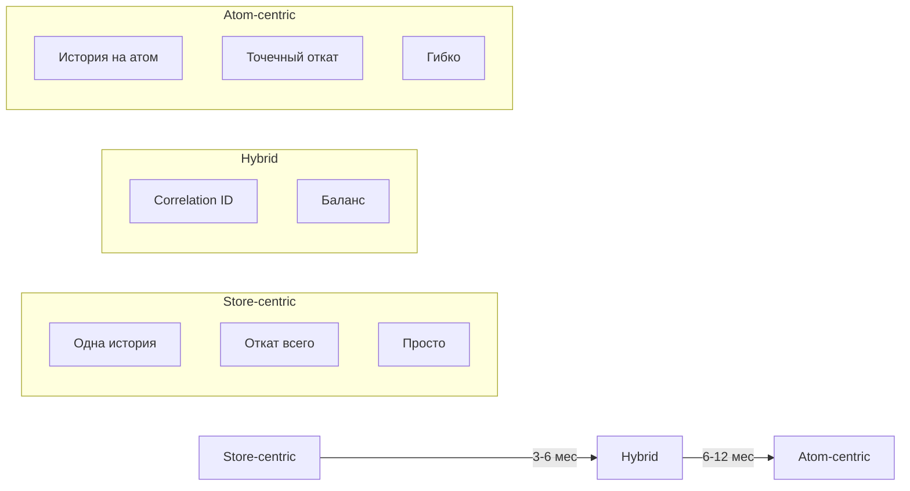

# Заметки к статье Part 3: Architectural Evolution

## 📝 Идеи для добавления

### 1. Реальные примеры из @nexus-state

```typescript
// Как это реализовано сейчас в @nexus-state
import { SimpleTimeTravel } from '@nexus-state/time-travel';

// Store-centric (текущая реализация)
const store = createStore();
const timeTravel = new SimpleTimeTravel(store);

// Что будет в v1.0 (atom-centric)
const timeTravel = new AtomTimeTravel();
timeTravel.capture(cartAtom, newCart, { correlationId: 'txn-123' });
timeTravel.undo(cartAtom); // Точечный откат
```

---

### 2. Диаграмма эволюции (Mermaid)



---

### 3. Сравнение с конкурентами

| Библиотека | Подход | Плюсы | Минусы |
|------------|--------|-------|--------|
| **Redux DevTools** | Store-centric | Зрелый, стабильный | Не гибкий |
| **Zustand** | Нет встроенного | Простой | Нет time-travel |
| **Jotai** | Atom-centric | Гибкий | Сложный |
| **Reatom** | Atom-centric | Мощный | Кривая обучения |
| **SolidJS** | Hybrid | Баланс | Экспериментальный |
| **@nexus-state** | **Hybrid → Atom-centric** | **План развития** | **Ранняя версия** |

---

### 4. Кейс из практики: интернет-магазин

```typescript
// Проблема: нужно откатить корзину, но не пользователя

// ❌ Store-centric (не работает)
storeTimeTravel.undo();
// Откатилось всё: и user, и cart, и total

// ✅ Atom-centric (работает)
atomTimeTravel.undo(cartAtom);
// Откатился только cart
// user и total остались текущими
```

---

### 5. Бенчмарки производительности

```
Store-centric (500 атомов):
• capture(): 15ms (сериализация всего)
• undo(): 20ms (восстановление всего)
• Память: 5MB на 50 снимков

Atom-centric (500 атомов):
• capture(atom): 0.5ms (только атом)
• undo(atom): 1ms (только атом)
• Память: 1MB на 50 снимков

💡 Вывод: Atom-centric быстрее в 30x и экономит 80% памяти
```

---

### 6. Код адаптера для миграции

```typescript
class MigrationAdapter implements TimeTravelAPI {
  private legacy: StoreTimeTravel;
  private modern: AtomTimeTravel;

  // Старый API (для совместимости)
  capture(action: string): void {
    this.legacy.capture(action);
  }

  undo(): void {
    this.legacy.undo();
  }

  // Новый API (для продвинутых)
  captureAtom<T>(
    atom: Atom<T>,
    value: T,
    options?: { correlationId?: string }
  ): void {
    this.modern.track(atom, value, options?.correlationId);
  }

  undoAtom<T>(atom: Atom<T>): void {
    this.modern.undo(atom);
  }

  undoTransaction(correlationId: string): void {
    this.modern.undoByCorrelation(correlationId);
  }
}
```

---

### 7. Чек-лист для читателей

```markdown
## Готовы ли вы к Atom-centric?

Пройдите тест:

1. Сколько у вас атомов?
   - [ ] < 50 → Store-centric
   - [ ] 50-200 → Hybrid
   - [ ] > 200 → Atom-centric

2. Есть кросс-store зависимости?
   - [ ] Нет → Store-centric
   - [ ] Да → Hybrid/Atom-centric

3. Нужен частичный откат?
   - [ ] Нет → Store-centric
   - [ ] Да → Atom-centric

4. Какие ресурсы на реализацию?
   - [ ] 1-2 недели → Store-centric
   - [ ] 1-2 месяца → Hybrid
   - [ ] 3-6 месяцев → Atom-centric

**Результат:** Большинство [ответов] → [рекомендация]
```

---

### 8. Callout-блоки для врезок

> 💡 **Совет:** Не начинайте с Atom-centric. Пройдите все этапы эволюции естественно.

> ⚠️ **Предупреждение:** Миграция на Atom-centric требует пересмотра архитектуры приложения.

> 🎯 **TL;DR:** Store-centric → Hybrid → Atom-centric. Каждый этап занимает 3-6 месяцев.

> 🔍 **Для любознательных:** Посмотрите, как это реализовано в Reatom — пионере atom-centric подхода.

---

### 9. Ссылки для дальнейшего чтения

**Обязательно:**
- [Reatom DevTools](https://reatom.js.org/integrations/devtools)
- [SolidJS DevTools](https://www.solidjs.com/docs/latest/api#createdevtools)
- [Redux DevTools](https://github.com/reduxjs/redux-devtools)

**Дополнительно:**
- [Part 1: Foundations](../part-1-foundations.md)
- [Part 2: Advanced](../part-2-advanced.md)
- [Analysis Summary](../../../ANALYSIS-SUMMARY.md)

---

### 10. Возможные вопросы от читателей

**Q: Обязательно ли мигрировать на Atom-centric?**

A: Нет. Store-centric покрывает 80% случаев. Мигрируйте, когда почувствуете боль.

**Q: Насколько сложна миграция?**

A: Постепенная. Адаптер позволяет использовать оба API параллельно.

**Q: Есть ли готовые решения?**

A: Reatom, SolidJS. @nexus-state в разработке.

---

## 📋 Структурные заметки

### Что вырезать

- [ ] Слишком длинные теоретические отступления
- [ ] Дублирование с Part 1 и Part 2
- [ ] Излишние детали реализации (вынести в приложения)

### Что добавить

- [ ] Больше рабочих примеров кода
- [ ] Интерактивные элементы (если платформа поддерживает)
- [ ] Визуальные диаграммы

### Что переработать

- [ ] Введение сделать короче и цепляюще
- [ ] Заключение с конкретными next steps
- [ ] TL;DR для каждой секции

---

**Последнее обновление:** 2026-03-24
