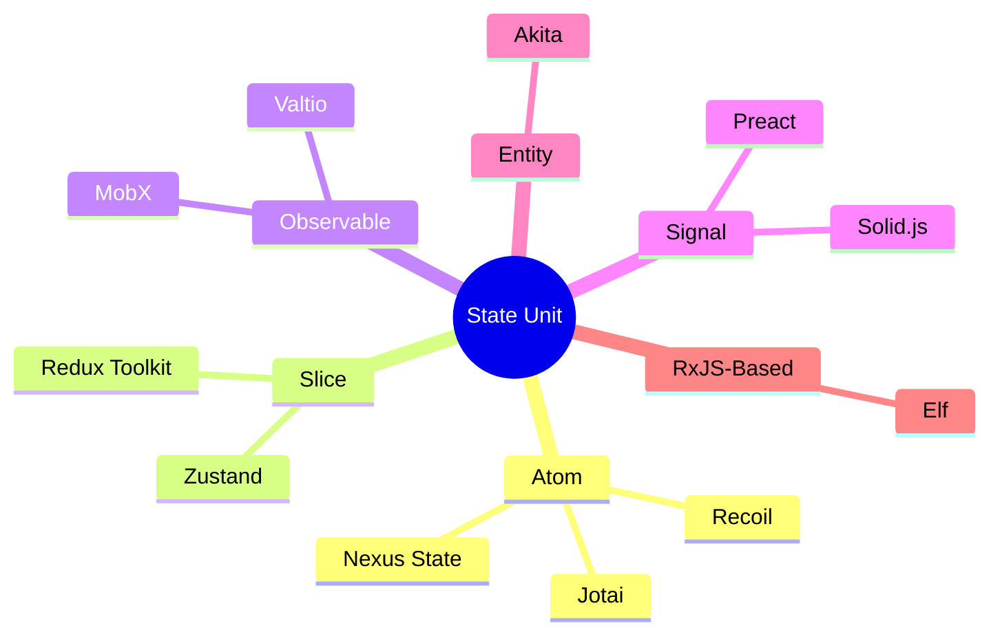
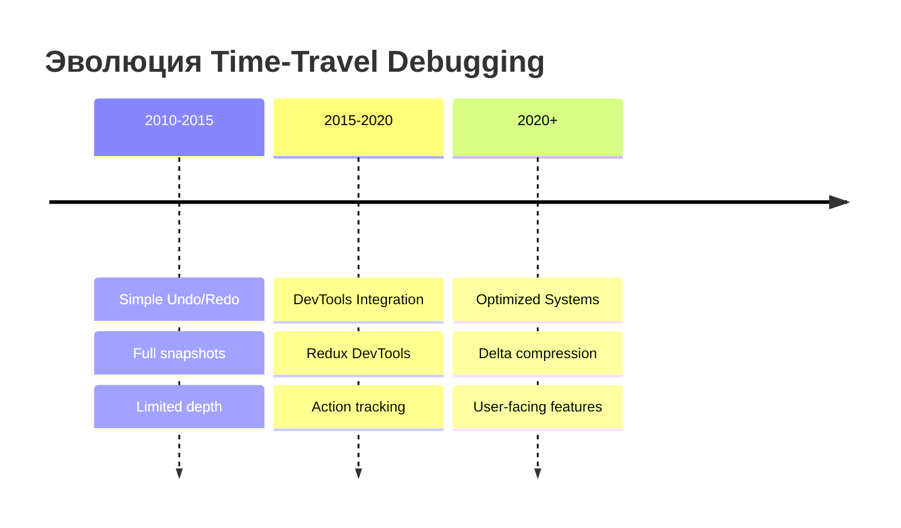
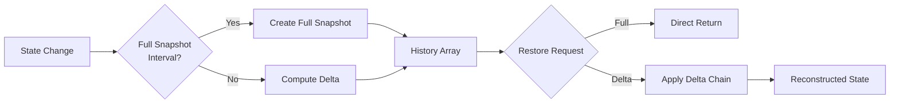
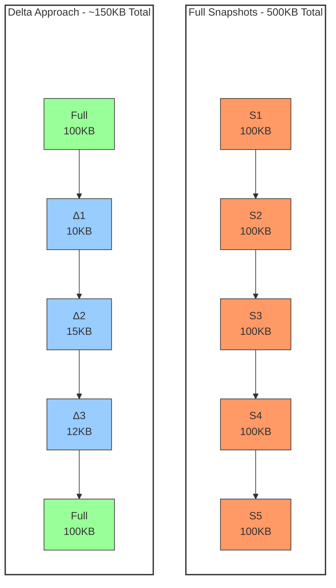
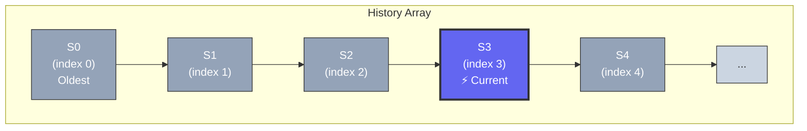
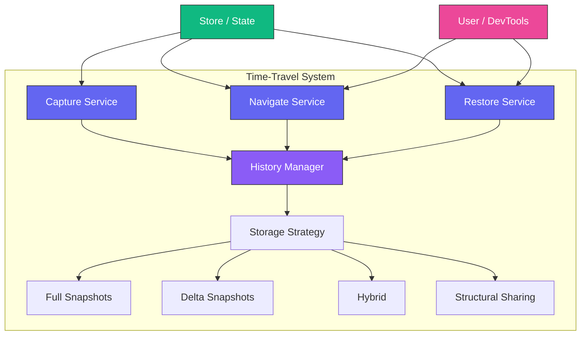

# Time-Travel Debugging в State Management: Полное Руководство

> **Часть 1: Теоретические основы**
>
> От инструмента отладки до конкурентного преимущества UX

---

## Введение

Time-travel debugging (отладка с «путешествием во времени») — это техника отладки, которая позволяет разработчикам перемещаться между различными состояниями приложения во времени. Подобно тому, как вы можете перематывать видео вперёд и назад, time-travel позволяет «отматывать» состояние приложения к предыдущим точкам и «перематывать» вперёд для анализа поведения.

> **💡 Ключевой инсайт:** В современных приложениях time-travel эволюционировал от исключительно инструмента разработчика до **самостоятельной пользовательской функциональности**, которая становится конкурентным преимуществом продукта.

### Области применения

| Область                      | Примеры              | Глубина истории | Ценность                                |
| ---------------------------- | -------------------- | --------------- | --------------------------------------- |
| 📝 **Текстовые редакторы**   | Google Docs, Notion  | 500-1000 шагов  | История версий, undo/redo               |
| 📋 **Формы и конструкторы**  | Typeform, Tilda      | 50-100 шагов    | Отмена изменений в реальном времени     |
| 🎨 **Графические редакторы** | Figma, Canva         | 50-100 шагов    | Эксперименты с дизайном                 |
| 💻 **IDE и редакторы кода**  | VS Code, CodeSandbox | 500+ шагов      | Локальная история изменений             |
| 🏗️ **Low-code платформы**    | Webflow, Bubble      | 100-200 шагов   | Version control для визуальных проектов |
| 🎬 **Видеоредакторы**        | Premiere Pro, CapCut | 10-20 шагов     | Откат операций монтажа                  |

**В этой статье** мы рассмотрим архитектурные паттерны, которые работают во всех этих областях — от простых форм до сложных мультимедийных систем.

---

## Терминология

В этой статье используются следующие термины:

| Термин                          | Описание                                              | Аналоги в библиотеках                                          |
| ------------------------------- | ----------------------------------------------------- | -------------------------------------------------------------- |
| **Единица состояния**           | Минимальная неделимая часть состояния                 | Универсальная концепция                                        |
| **Атом** (Atom)                 | Единица состояния в atom-based библиотеках            | Jotai: `atom`, Recoil: `atom`, Nexus State: `atom`             |
| **Слайс** (Slice)               | Логически обособленная часть состояния                | Redux Toolkit: `createSlice`, Zustand: `state key`             |
| **Observable**                  | Реактивный объект с авто-отслеживанием изменений      | MobX: `observable`, Valtio: `proxy`, Solid.js: `signal`        |
| **Store**                       | Контейнер для единиц состояния (глобальное состояние) | Zustand: `store`, Redux: `store`, Akita: `Store`, Elf: `State` |
| **Снимок состояния** (Snapshot) | Копия состояния на определённый момент времени        | Универсальный термин                                           |
| **Дельта** (Delta)              | Разница между двумя снимками состояния                | Универсальный термин                                           |

> **💡 Примечание:** Термин **"единица состояния"** используется как **универсальная абстракция**. В зависимости от библиотеки, это может называться:
>
> - **Атом** (Jotai, Recoil, Nexus State)
> - **Слайс / ключ состояния** (Redux, Zustand)
> - **Observable property** (MobX, Valtio)
> - **Signal** (Solid.js, Preact)
> - **EntityStore property** (Akita)

**Дополнительные библиотеки:**

| Библиотека | Фреймворк  | Time-Travel       | Особенности                     |
| ---------- | ---------- | ----------------- | ------------------------------- |
| **Akita**  | Angular    | ✅ Встроенная     | Entity-based, stores as classes |
| **Elf**    | React/RxJS | ✅ Через DevTools | Reactive + immutable на RxJS    |

**Визуальная карта терминологии:**



**Пример соответствия:**

```javascript
// Nexus State / Jotai / Recoil
const countAtom = atom(0);

// Zustand (аналог атома)
const useStore = create((set) => ({
  count: 0, // ← это "атом" в нашей терминологии
}));

// Redux Toolkit (аналог атома)
const counterSlice = createSlice({
  name: 'counter',
  initialState: { value: 0 },
  //              ^^^^^^^^^^^ это "атом" в нашей терминологии
});

// MobX (аналог атома)
const store = makeObservable({
  count: 0, // ← это "атом" в нашей терминологии
});
```

**Почему "единица состояния"?**

1. **Универсальность** — подходит для любой библиотеки (не только atom-based)
2. **Точность** — подчёркивает минимальность и неделимость
3. **Нейтральность** — не привязывает к терминологии конкретной библиотеки

> **Примечание:** В примерах кода мы используем термин "атом" для краткости, но подразумеваем любую единицу состояния в вашей библиотеке.

---

## Содержание

1. [Что такое Time-Travel Debugging?](#что-такое-time-travel-debugging)
2. [Исторический контекст](#исторический-контекст)
3. [Архитектурные паттерны](#архитектурные-паттерны)
4. [Стратегии хранения состояния](#стратегии-хранения-состояния)
5. [Оптимизация памяти: Delta Snapshots](#оптимизация-памяти-delta-snapshots)
6. [Алгоритмы навигации по истории](#алгоритмы-навигации-по-истории)
7. [Транзакционность и восстановление](#транзакционность-и-восстановление)
8. [Проблемы производительности](#проблемы-производительности)
9. [Time-Travel как User-Facing Функциональность](#time-travel-как-user-facing-функциональность)
10. [Заключение](#заключение)

---

## Что такое Time-Travel Debugging?

### Определение

**Time-Travel Debugging** — это метод отладки, при котором система сохраняет историю изменений состояния и позволяет разработчику:

- **Просматривать** предыдущие состояния приложения
- **Перемещаться** между состояниями (вперёд и назад)
- **Анализировать** разницу между состояниями
- **Воспроизводить** последовательности действий

### Ключевые возможности

```typescript
interface TimeTravelAPI {
  // Навигация
  undo(): boolean;
  redo(): boolean;
  jumpTo(index: number): boolean;

  // Проверка доступности
  canUndo(): boolean;
  canRedo(): boolean;

  // История
  getHistory(): Snapshot[];
  getCurrentSnapshot(): Snapshot | undefined;

  // Управление
  capture(action?: string): Snapshot;
  clearHistory(): void;
}
```

### Use Cases

1. **Отладка сложных состояний** — когда баг воспроизводится только после определённой последовательности действий
2. **Анализ регрессий** — понимание, какое изменение привело к проблеме
3. **Обучение и демонстрация** — пошаговое воспроизведение пользовательских сценариев
4. **Автоматическое тестирование** — воспроизведение последовательностей для тестов

---

## Исторический контекст

### Ранние реализации

Концепция time-travel debugging не нова. Первые значимые реализации появились в середине 2000-х:

| Год   | Система                    | Описание                                              |
| ----- | -------------------------- | ----------------------------------------------------- |
| 2004  | **Smalltalk Squeak**       | Одна из первых сред с поддержкой «возврата» состояния |
| 2010  | **OmniGraffle**            | Undo/redo для графических операций                    |
| 2015  | **Redux DevTools**         | Популяризация time-travel для веб-приложений          |
| 2016  | **Elm Time Travel**        | Встроенная поддержка благодаря immutable архитектуре  |
| 2019  | **Akita (Angular)**        | Встроенная time-travel поддержка для Angular          |
| 2021  | **Elf (Shopify)**          | Reactive state management на RxJS с DevTools          |
| 2020+ | **Современные библиотеки** | Jotai, Zustand, MobX с плагинами                      |

### Эволюция подходов



**Поколение 1 (2010-2015): Простые стеки undo/redo**
└─ Хранение полных копий состояния
└─ Ограниченная глубина истории
└─ Нет поддержки асинхронности

Поколение 2 (2015-2020): Интеграция с DevTools
└─ Визуализация изменений
└─ Поддержка Redux-подобных архитектур
└─ Action-based tracking

Поколение 3 (2020+): Оптимизированные системы
└─ Delta-сжатие
└─ Умная очистка памяти
└─ Поддержка атомарных состояний
└─ Transactional restoration

````

---

## Архитектурные паттерны

### 1. Command Pattern (Паттерн Команда)

Классический подход, где каждое изменение состояния инкапсулируется в объект-команду:

```typescript
interface Command<T> {
  execute(): T;
  undo(): void;
  redo(): void;
}

// Для библиотек с атомами (Jotai, Recoil, Nexus State)
class SetAtomCommand<T> implements Command<T> {
  constructor(
    private atom: Atom<T>,
    private newValue: T,
    private oldValue?: T
  ) {}

  execute(): T {
    this.oldValue = this.atom.get();
    this.atom.set(this.newValue);
    return this.newValue;
  }

  undo(): void {
    this.atom.set(this.oldValue!);
  }

  redo(): void {
    this.execute();
  }
}

// Для Redux / Zustand (аналог)
class SetStateCommand<T extends Record<string, any>> implements Command<T> {
  constructor(
    private store: Store<T>,
    private slice: keyof T,
    private newValue: any
  ) {}

  execute(): void {
    this.oldValue = this.store.getState()[this.slice];
    this.store.setState({ [this.slice]: this.newValue });
  }

  undo(): void {
    this.store.setState({ [this.slice]: this.oldValue });
  }

  redo(): void {
    this.execute();
  }
}

// Для Akita (Angular) - entity-based подход
class AkitaEntityCommand<T> implements Command<T> {
  constructor(
    private store: EntityStore<any, T>,
    private entityId: string,
    private updates: Partial<T>
  ) {}

  execute(): void {
    this.oldValue = this.store.getEntity(this.entityId);
    this.store.update(this.entityId, this.updates);
  }

  undo(): void {
    this.store.update(this.entityId, this.oldValue);
  }

  redo(): void {
    this.execute();
  }
}

// Для Elf (RxJS-based) - reactive подход
class ElfSetPropCommand<T> implements Command<T> {
  constructor(
    private store: ObservableStore<T>,
    private prop: keyof T,
    private newValue: any
  ) {}

  execute(): void {
    this.oldValue = this.store.getValue()[this.prop];
    this.store.update((state) => ({ ...state, [this.prop]: this.newValue }));
  }

  undo(): void {
    this.store.update((state) => ({ ...state, [this.prop]: this.oldValue }));
  }

  redo(): void {
    this.execute();
  }
}
````

**Преимущества:**

- Явное представление операций
- Легко расширять новыми командами
- Поддержка макросов (группировка команд)

**Недостатки:**

- Накладные расходы на создание объектов
- Сложность с асинхронными операциями

### 2. Snapshot Pattern (Паттерн Снимков)

Сохранение полных копий состояния в ключевые моменты:

```typescript
interface Snapshot {
  id: string;
  timestamp: number;
  action?: string;
  state: Record<string, AtomState>;
  metadata: {
    label?: string;
    source?: 'auto' | 'manual';
  };
}

class SnapshotManager {
  private history: Snapshot[] = [];

  capture(action?: string): Snapshot {
    const snapshot: Snapshot = {
      id: generateId(),
      timestamp: Date.now(),
      action,
      state: deepClone(this.store.getState()),
      metadata: { label: action },
    };

    this.history.push(snapshot);
    return snapshot;
  }
}
```

**Преимущества:**

- Простота реализации
- Быстрое восстановление (прямая замена состояния)
- Легко сериализовать для экспорта

**Недостатки:**

- Высокое потребление памяти
- Дублирование данных

### 3. Delta Pattern (Паттерн Разниц)

Хранение только изменений между состояниями:

```typescript
interface DeltaSnapshot {
  id: string;
  type: 'delta';
  baseSnapshotId: string;
  changes: {
    [atomId: string]: {
      oldValue: any;
      newValue: any;
    };
  };
  timestamp: number;
}

class DeltaCalculator {
  computeDelta(before: Snapshot, after: Snapshot): DeltaSnapshot {
    const changes: Record<string, any> = {};

    for (const [key, value] of Object.entries(after.state)) {
      const oldValue = before.state[key]?.value;
      if (!deepEqual(oldValue, value)) {
        changes[key] = { oldValue, newValue: value };
      }
    }

    return {
      id: generateId(),
      type: 'delta',
      baseSnapshotId: before.id,
      changes,
      timestamp: Date.now(),
    };
  }
}
```

**Преимущества:**

- Значительная экономия памяти (до 90% для мелких изменений)
- Точное отслеживание изменений
- Возможность «применения» разниц

**Недостатки:**

- Сложность восстановления (требуется применение цепочки delta)
- Риск «разрыва цепочки» (если базовый snapshot удалён)

### 4. Hybrid Approach (Гибридный подход)

Современный подход, сочетающий snapshots и deltas:



```typescript
class HybridHistoryManager {
  private fullSnapshots: Snapshot[] = [];
  private deltaChain: Map<string, DeltaSnapshot> = new Map();

  // Каждые N изменений создаём полный snapshot
  private fullSnapshotInterval = 10;
  private changesSinceFull = 0;

  add(state: State): void {
    if (this.changesSinceFull >= this.fullSnapshotInterval) {
      // Создаём полный snapshot
      const full = this.createFullSnapshot(state);
      this.fullSnapshots.push(full);
      this.changesSinceFull = 0;
    } else {
      // Создаём delta
      const base = this.getLastFullSnapshot();
      const delta = this.computeDelta(base, state);
      this.deltaChain.set(delta.id, delta);
      this.changesSinceFull++;
    }
  }

  restore(index: number): State {
    const full = this.getNearestFullSnapshot(index);
    const deltas = this.getDeltasBetween(full.index, index);

    // Применяем deltas к полному snapshot
    return deltas.reduce(
      (state, delta) => this.applyDelta(state, delta),
      full.state
    );
  }
}
```

---

## Стратегии хранения состояния

### 1. Полные копии (Full Snapshots)

```typescript
// Универсальный пример для любой библиотеки
function createFullSnapshot(store: Store): Snapshot {
  return {
    id: uuid(),
    state: JSON.parse(JSON.stringify(store.getState())),
    timestamp: Date.now(),
  };
}

// Для Redux / Zustand
const snapshot = {
  state: {
    counter: { value: 5 }, // Redux slice
    user: { name: 'John' }, // Redux slice
  },
  timestamp: Date.now(),
};

// Для Jotai / Nexus State
const snapshot = {
  state: {
    'count-atom-1': { value: 5, type: 'atom' },
    'user-atom-2': { value: { name: 'John' }, type: 'atom' },
  },
  timestamp: Date.now(),
};
```

**Характеристики:**

- **Память:** O(n × m), где n — количество snapshots, m — размер состояния
- **Восстановление:** O(1) — прямая замена
- **Сериализация:** Простая

### 2. Разницы (Deltas)

```typescript
// Универсальный пример
function computeDelta(before: State, after: State): Delta {
  const changes: Record<string, Change> = {};

  for (const key of Object.keys(after)) {
    if (!deepEqual(before[key], after[key])) {
      changes[key] = {
        from: before[key],
        to: after[key],
      };
    }
  }

  return { changes, timestamp: Date.now() };
}

// Пример: Redux slice
const delta = {
  changes: {
    'counter.value': { from: 5, to: 6 },
    'user.lastUpdated': { from: 1000, to: 2000 },
  },
};

// Пример: Jotai atoms
const delta = {
  changes: {
    'count-atom-1': { from: 5, to: 6 },
  },
};
```

**Характеристики:**

- **Память:** O(n × k), где k — средний размер изменений (k << m)
- **Восстановление:** O(d) — применение d deltas
- **Сериализация:** Требует контекста (базового snapshot)

### 3. Структурное共享 (Structural Sharing)

Использование immutable структур данных для共享 неизменных частей:

```typescript
// Пример с использованием Immutable.js
import { Map } from 'immutable';

const state1 = Map({ count: 1, user: { name: 'John' } });
const state2 = state1.set('count', 2);

// state1 и state2共享 объект user
// Изменился только count

// Для React + Immer (более популярный подход)
import { produce } from 'immer';

const state1 = { count: 1, user: { name: 'John' } };
const state2 = produce(state1, (draft) => {
  draft.count = 2;
  // user остаётся той же ссылкой
});
```

**Характеристики:**

| Аспект             | Immer (Proxy)                | Immutable.js                            |
| ------------------ | ---------------------------- | --------------------------------------- |
| **Память**         | O(n + m) в лучшем случае     | O(log n) для Persistent Data Structures |
| **Восстановление** | O(1) с ссылками              | O(log n) для доступа                    |
| **Требования**     | Proxy API (ES2015+)          | Специализированная библиотека           |
| **Совместимость**  | Высокая (прозрачные объекты) | Средняя (специальные типы)              |

> **Примечание:** Характеристики могут отличаться в зависимости от реализации. Для ClojureScript, Mori и других библиотек с persistent data structures сложность будет иной.

### 4. Сравнение стратегий

| Стратегия          | Память  | Восстановление | Сложность | Use Case                |
| ------------------ | ------- | -------------- | --------- | ----------------------- |
| Full Snapshots     | Высокая | Быстрое        | Низкая    | Маленькие состояния     |
| Deltas             | Низкая  | Среднее        | Средняя   | Частые мелкие изменения |
| Structural Sharing | Средняя | Быстрое        | Высокая   | Immutable состояния     |
| Hybrid             | Средняя | Среднее        | Высокая   | Универсальное           |

---

## Оптимизация памяти: Delta Snapshots

### Проблема памяти

При хранении полных snapshots память растёт линейно:

```
Состояние: 100KB
История: 50 snapshots
Память: 100KB × 50 = 5MB
```

**Визуальное сравнение подходов:**



Для приложений с большим состоянием это становится проблемой.

### Решение: Delta-сжатие

```typescript
interface DeltaSnapshot {
  id: string;
  type: 'delta';
  baseSnapshotId: string; // Ссылка на базовый snapshot
  changes: Record<
    string,
    {
      oldValue: any;
      newValue: any;
    }
  >;
  timestamp: number;
  metadata: {
    changedAtoms: string[]; // Или changedSlices для Redux/Zustand
    deltaSize: number;
  };
}
```

### Алгоритм вычисления Delta

```typescript
class DeltaCalculator {
  computeDelta(
    base: Snapshot,
    target: Snapshot,
    options: DeltaOptions = {}
  ): DeltaSnapshot | null {
    const changes: Record<string, any> = {};
    let hasChanges = false;

    // Deep comparison с оптимизациями
    // Для Jotai/Nexus State: перебор атомов
    // Для Redux/Zustand: перебор slice keys
    for (const [key, entry] of Object.entries(target.state)) {
      const baseEntry = base.state[key];

      // Skip unchanged entries
      if (deepEqual(baseEntry?.value, entry.value)) {
        continue;
      }

      changes[key] = {
        oldValue: baseEntry?.value,
        newValue: entry.value,
      };
      hasChanges = true;
    }

    // Skip empty deltas (опционально)
    if (!hasChanges && options.skipEmpty) {
      return null;
    }

    return {
      id: generateId(),
      type: 'delta',
      baseSnapshotId: base.id,
      changes,
      timestamp: target.metadata.timestamp,
      metadata: {
        changedAtoms: Object.keys(changes),
        deltaSize: Object.keys(changes).length,
      },
    };
  }
}
```

**Пример для разных библиотек:**

```typescript
// Redux: Delta для slice
const delta = {
  changes: {
    'counter.value': { oldValue: 5, newValue: 6 },
  },
};

// Zustand: Delta для state key
const delta = {
  changes: {
    'user.name': { oldValue: 'John', newValue: 'Jane' },
  },
};

// Jotai/Nexus State: Delta для атома
const delta = {
  changes: {
    'count-atom-1': { oldValue: 5, newValue: 6 },
  },
};
```

### Восстановление из Delta

```typescript
applyDelta(snapshot: Snapshot, delta: DeltaSnapshot): Snapshot {
  const newState = { ...snapshot.state };

  // Применяем изменения к каждому атому/slice
  for (const [key, change] of Object.entries(delta.changes)) {
    newState[key] = {
      ...newState[key],
      value: change.newValue,
    };
  }

  return {
    ...snapshot,
    state: newState,
    id: delta.id,
    metadata: {
      ...snapshot.metadata,
      timestamp: delta.timestamp,
    },
  };
}
```

### Стратегия «Полный + Delta»

```typescript
class DeltaAwareHistoryManager {
  private config = {
    fullSnapshotInterval: 10, // Каждые 10 изменений — полный snapshot
    maxDeltaChainLength: 20, // Максимальная цепочка deltas
    maxDeltaChainAge: 60000, // Максимальный возраст цепочки (ms)
  };

  private fullSnapshotCounter = 0;

  add(snapshot: Snapshot): void {
    if (this.shouldCreateFullSnapshot()) {
      this.createFullSnapshot(snapshot);
      this.fullSnapshotCounter = 0;
    } else {
      const base = this.getLastFullSnapshot();
      if (base) {
        const delta = this.computeDelta(base, snapshot);
        if (delta) {
          this.storeDelta(delta);
          this.fullSnapshotCounter++;
          return;
        }
      }
      // Fallback к full snapshot
      this.createFullSnapshot(snapshot);
    }
  }

  private shouldCreateFullSnapshot(): boolean {
    return this.fullSnapshotCounter >= this.config.fullSnapshotInterval;
  }
}
```

### Эффективность Delta-сжатия

```
Сценарий: Форма с 50 полями, меняется 1-2 поля за раз

Full Snapshots:
- Размер snapshot: ~50KB
- 50 snapshots: 2.5MB

Delta Snapshots:
- Базовый snapshot: 50KB
- Delta (2 поля): ~2KB
- 50 snapshots: 50KB + (49 × 2KB) = 148KB

Экономия: ~94%
```

---

## Алгоритмы навигации по истории

### Структура истории

**Визуализация массива истории:**



**Навигация:**

- **undo()** — перемещение влево (к S0)
- **redo()** — перемещение вправо (к S4)
- **jumpTo(n)** — прямой переход к индексу n

### Undo/Redo с двумя стеками

**Визуализация процесса навигации:**

```mermaid
sequenceDiagram
    participant P as Past Stack
    participant C as Current
    participant F as Future Stack

    Note over P,C,F: Initial: Past=[S1,S2], Current=S3, Future=[]

    C->>P: Push S3 (undo)
    P->>C: Pop S2
    Note over C: Now Current=S2

    C->>F: Push S2 (redo)
    F->>C: Shift S3
    Note over C: Now Current=S3

    Note over P,C,F: Past=[S1], Current=S3, Future=[]
```

```typescript
class HistoryNavigator {
  private past: Snapshot[] = []; // Прошлые состояния
  private future: Snapshot[] = []; // Будущие состояния
  private current: Snapshot | null = null;

  undo(): Snapshot | null {
    if (this.past.length === 0) {
      return null; // Нечего отменять
    }

    // Текущее → future
    if (this.current) {
      this.future.unshift(this.current);
    }

    // Последнее из past → current
    this.current = this.past.pop()!;

    return this.current;
  }

  redo(): Snapshot | null {
    if (this.future.length === 0) {
      return null; // Нечего возвращать
    }

    // Текущее → past
    if (this.current) {
      this.past.push(this.current);
    }

    // Первое из future → current
    this.current = this.future.shift()!;

    return this.current;
  }

  jumpTo(index: number): Snapshot | null {
    const all = this.getAll();

    if (index < 0 || index >= all.length) {
      return null;
    }

    // Перестраиваем past/future относительно target
    this.past = all.slice(0, index);
    this.future = all.slice(index + 1);
    this.current = all[index];

    return this.current;
  }

  private getAll(): Snapshot[] {
    return [
      ...this.past,
      ...(this.current ? [this.current] : []),
      ...this.future,
    ];
  }
}
```

### Сложность операций

| Операция       | Сложность | Описание                      |
| -------------- | --------- | ----------------------------- |
| `undo()`       | O(1)      | Pop из past, unshift в future |
| `redo()`       | O(1)      | Shift из future, push в past  |
| `jumpTo(n)`    | O(n)      | Копирование элементов         |
| `getHistory()` | O(n)      | Конкатенация массивов         |

### Оптимизация для больших историй

```typescript
class OptimizedHistoryNavigator {
  private history: Snapshot[] = [];
  private currentIndex = -1;

  jumpTo(index: number): Snapshot | null {
    if (index < 0 || index >= this.history.length) {
      return null;
    }

    this.currentIndex = index;
    return this.history[index];
  }

  canUndo(): boolean {
    return this.currentIndex > 0;
  }

  canRedo(): boolean {
    return this.currentIndex < this.history.length - 1;
  }

  // O(1) доступ к текущему
  getCurrent(): Snapshot | null {
    return this.history[this.currentIndex] ?? null;
  }
}
```

---

## Транзакционность и восстановление

### Проблема частичного восстановления

При восстановлении состояния могут возникнуть ошибки:

1. Атом больше не существует
2. Тип данных изменился
3. Побочные эффекты при восстановлении

### Transactional Restoration

```typescript
interface TransactionalRestorationResult {
  success: boolean;
  restoredAtoms: string[];
  failedAtoms: string[];
  rollbackPerformed?: boolean;
  error?: string;
}

class TransactionalRestorer {
  async restoreWithTransaction(
    snapshot: Snapshot,
    options: RestorationOptions
  ): Promise<TransactionalRestorationResult> {
    const checkpoint = this.createCheckpoint();
    const restoredAtoms: string[] = [];
    const failedAtoms: string[] = [];

    try {
      // Phase 1: Validation
      const validation = this.validate(snapshot);
      if (!validation.valid) {
        return {
          success: false,
          restoredAtoms: [],
          failedAtoms: validation.failedAtoms,
          error: 'Validation failed',
        };
      }

      // Phase 2: Batch restoration
      for (const [atomId, entry] of Object.entries(snapshot.state)) {
        try {
          await this.restoreAtom(atomId, entry);
          restoredAtoms.push(atomId);
        } catch (error) {
          failedAtoms.push(atomId);

          if (options.rollbackOnError) {
            await this.rollbackToCheckpoint(checkpoint);
            return {
              success: false,
              restoredAtoms,
              failedAtoms,
              rollbackPerformed: true,
              error: error instanceof Error ? error.message : 'Unknown error',
            };
          }
        }
      }

      return {
        success: failedAtoms.length === 0,
        restoredAtoms,
        failedAtoms,
      };
    } catch (error) {
      // Critical error: rollback
      await this.rollbackToCheckpoint(checkpoint);

      return {
        success: false,
        restoredAtoms: [],
        failedAtoms: [],
        rollbackPerformed: true,
        error: error instanceof Error ? error.message : 'Critical error',
      };
    }
  }

  private createCheckpoint(): RestorationCheckpoint {
    return {
      id: generateId(),
      timestamp: Date.now(),
      stateSnapshot: this.saveCurrentState(),
    };
  }

  private async rollbackToCheckpoint(
    checkpoint: RestorationCheckpoint
  ): Promise<void> {
    await this.restoreState(checkpoint.stateSnapshot);
  }
}
```

### Стратегии восстановления

```typescript
interface RestorationOptions {
  /** Откатить при ошибке */
  rollbackOnError?: boolean;
  /** Пропускать несуществующие атомы */
  skipMissingAtoms?: boolean;
  /** Валидировать перед восстановлением */
  validateBeforeRestore?: boolean;
  /** Восстанавливать пакетно */
  batchRestore?: boolean;
  /** Обработчик отсутствующих атомов */
  onAtomNotFound?: 'skip' | 'warn' | 'throw';
}
```

---

## Проблемы производительности

### 1. Потребление памяти

**Проблема:** История растёт линейно с количеством snapshots.

**Решения:**

```typescript
// LRU (Least Recently Used) очистка
class LRUHistoryCleaner {
  private maxHistory = 50;

  cleanup(history: Snapshot[]): Snapshot[] {
    if (history.length <= this.maxHistory) {
      return history;
    }

    // Удаляем старые snapshots
    return history.slice(history.length - this.maxHistory);
  }
}

// TTL (Time To Live) для snapshots
class TTLHistoryCleaner {
  private ttl = 300000; // 5 минут

  cleanup(history: Snapshot[]): Snapshot[] {
    const now = Date.now();
    return history.filter((s) => now - s.timestamp < this.ttl);
  }
}

// Комбинированный подход
class HybridCleaner {
  cleanup(history: Snapshot[]): Snapshot[] {
    // 1. Применяем TTL
    let cleaned = this.applyTTL(history);

    // 2. Применяем LRU
    cleaned = this.applyLRU(cleaned);

    // 3. Сохраняем важные checkpoints
    const checkpoints = this.preserveCheckpoints(history);

    return this.merge(cleaned, checkpoints);
  }
}
```

### 2. Производительность сравнений

**Проблема:** Deep equality проверки медленные для больших объектов.

**Решения:**

```typescript
// 1. Shallow comparison с tracking
class TrackedComparison {
  private changedAtoms = new Set<string>();

  trackChange(atomId: string): void {
    this.changedAtoms.add(atomId);
  }

  getChanges(): string[] {
    return Array.from(this.changedAtoms);
  }
}

// 2. Structural equality для immutable данных
function structuralEqual(a: any, b: any): boolean {
  // Для immutable объектов достаточно проверить ссылку
  return a === b;
}

// 3. Lazy comparison
class LazyComparator {
  private cache = new Map<string, boolean>();

  isEqual(a: any, b: any, path: string): boolean {
    const key = `${path}:${hashCode(a)}:${hashCode(b)}`;

    if (this.cache.has(key)) {
      return this.cache.get(key)!;
    }

    const result = deepEqual(a, b);
    this.cache.set(key, result);

    return result;
  }
}
```

### 3. Блокировка UI

**Проблема:** Восстановление больших snapshots блокирует основной поток.

**Решения:**

```typescript
// 1. Chunked restoration
async function chunkedRestore(
  snapshot: Snapshot,
  chunkSize = 10
): Promise<void> {
  const atoms = Object.entries(snapshot.state);

  for (let i = 0; i < atoms.length; i += chunkSize) {
    const chunk = atoms.slice(i, i + chunkSize);

    for (const [atomId, entry] of chunk) {
      await restoreAtom(atomId, entry);
    }

    // Даём UI обновиться
    await new Promise((resolve) => setTimeout(resolve, 0));
  }
}

// 2. Web Worker для вычислений
class WorkerBasedComparator {
  private worker: Worker;

  async deepEqual(a: any, b: any): Promise<boolean> {
    return new Promise((resolve) => {
      const worker = new Worker('comparator.worker.js');
      worker.postMessage({ a, b });
      worker.onmessage = (e) => {
        resolve(e.data);
        worker.terminate();
      };
    });
  }
}

// 3. RequestIdleCallback для фоновых операций
function idleCallbackRestore(snapshot: Snapshot): void {
  const restoreChunk = (deadline?: IdleDeadline) => {
    if (!deadline || deadline.timeRemaining() > 0) {
      // Восстанавливаем порцию
      restoreNextChunk();

      if (hasMoreChunks()) {
        requestIdleCallback(restoreChunk);
      }
    } else {
      requestIdleCallback(restoreChunk);
    }
  };

  requestIdleCallback(restoreChunk);
}
```

### 4. Benchmark: Сравнение стратегий

```
Операция: Восстановление 100 атомов

┌─────────────────────┬────────────┬──────────────┬─────────────┐
│ Стратегия           │ Время (ms) │ Память (MB)  │ GC паузы    │
├─────────────────────┼────────────┼──────────────┼─────────────┤
│ Full Snapshot       │ 2.5        │ 5.2          │ 15ms        │
│ Delta (10 changes)  │ 8.3        │ 0.8          │ 3ms         │
│ Delta (50 changes)  │ 25.1       │ 2.1          │ 8ms         │
│ Structural Sharing  │ 1.2        │ 1.5          │ 5ms         │
│ Chunked Restore     │ 45.0*      │ 0.5          │ 0ms**       │
└─────────────────────┴────────────┴──────────────┴─────────────┘

* Включая overhead на chunking
** Распределено по кадрам (requestIdleCallback)

> **Примечание:** Chunked Restore — оптимизация для больших snapshots, разбивающая
> восстановление на порции (chunks) для сохранения отзывчивости UI. Общее время
> увеличивается, но приложение остаётся отзывчивым во время восстановления.
```

---

## Time-Travel как User-Facing Функциональность

### Эволюция восприятия

```
2015-2020: "Инструмент разработчика"
    └─ Redux DevTools
    └─ Только для отладки
    └─ Скрыто от пользователей

2020+: "Конкурентное преимущество UX"
    └─ Встроенный undo/redo
    └─ История версий для пользователей
    └─ Видимая ценность
```

### Почему это важно?

**Позиционирование time-travel возможностей:**


| Аспект                   | Только отладка    | + User Feature            |
| ------------------------ | ----------------- | ------------------------- |
| **Ценность для бизнеса** | Снижение dev time | + Улучшение UX            |
| **Охват аудитории**      | Разработчики      | + Конечные пользователи   |
| **Конкурентность**       | Ожидается         | **Преимущество**          |
| **Монетизация**          | Косвенная         | **Прямая** (premium фичи) |

### Примеры из production

**Google Docs:**

- История версий за 30 дней
- "Посмотреть изменения"
- Восстановление предыдущих версий

**Figma:**

- Version history в sidebar
- "Restore this version"
- Комментарии к версиям

**Notion:**

- Page history
- Undo/redo across sessions
- "Last edited by..."

**VS Code:**

- Timeline view с локальной историей
- "Revert File" из истории
- Сравнение версий

### Технические требования: Отладка vs UX

| Требование         | Для отладки    | Для UX                    |
| ------------------ | -------------- | ------------------------- |
| Глубина истории    | 20-50 шагов    | 100-1000+ шагов           |
| Персистентность    | Memory only    | localStorage/DB           |
| UI/UX              | DevTools panel | Встроенный в приложение   |
| Производительность | Фоновая        | **Не должна блокировать** |
| Сжатие             | Опционально    | **Обязательно**           |
| Горячие клавиши    | Не критично    | **Ctrl+Z / Ctrl+Y**       |
| Названия версий    | Технические    | Пользовательские          |

### Паттерны реализации User-Facing Time-Travel

#### 1. Undo/Redo как базовая функция

```typescript
// Минимальная реализация для любого редактора
function useUndoRedo(store: Store, timeTravel: TimeTravel) {
  useEffect(() => {
    const handleKeyDown = (e: KeyboardEvent) => {
      if (e.ctrlKey && e.key === 'z') {
        e.preventDefault();
        timeTravel.undo();
      }
      if (e.ctrlKey && e.key === 'y') {
        e.preventDefault();
        timeTravel.redo();
      }
    };

    window.addEventListener('keydown', handleKeyDown);
    return () => window.removeEventListener('keydown', handleKeyDown);
  }, [timeTravel]);
}
```

#### 2. История версий с названиями

```typescript
interface UserVersion {
  id: string;
  name: string; // "Черновик 1", "Финальная версия"
  timestamp: number;
  snapshotId: string;
  createdBy: string; // ID пользователя
}

// Пользователь создаёт именованные версии
function saveVersion(name: string) {
  const snapshot = timeTravel.capture(name);
  const version: UserVersion = {
    id: uuid(),
    name,
    timestamp: Date.now(),
    snapshotId: snapshot.id,
    createdBy: currentUser.id,
  };
  saveToDatabase(version);
}
```

#### 3. Визуальная шкала времени

```typescript
// Timeline компонент для навигации по истории
function Timeline({ timeTravel }: { timeTravel: TimeTravel }) {
  const history = timeTravel.getHistory()
  const currentIndex = timeTravel.getHistoryStats().currentIndex

  return (
    <div className="timeline">
      {history.map((snapshot, index) => (
        <button
          key={snapshot.id}
          className={`timeline-dot ${index === currentIndex ? 'active' : ''}`}
          onClick={() => timeTravel.jumpTo(index)}
          title={snapshot.metadata.action}
        >
          {formatTime(snapshot.metadata.timestamp)}
        </button>
      ))}
    </div>
  )
}
```

#### 4. Сравнение версий (Diff View)

```typescript
// Diff между двумя версиями документа
function VersionDiff({ before, after }: {
  before: Snapshot
  after: Snapshot
}) {
  const diff = computeTextDiff(before.state.content, after.state.content)

  return (
    <div className="diff-view">
      {diff.map((chunk, i) => (
        <span key={i} className={`diff-${chunk.type}`}>
          {chunk.text}
        </span>
      ))}
    </div>
  )
}
```

### Рекомендации по внедрению

#### Для форм и конструкторов

```typescript
// Универсальный пример (подходит для любой библиотеки)
const formTimeTravel = new SimpleTimeTravel(store, {
  maxHistory: 50, // Достаточно для формы
  autoCapture: true, // Автоматически при изменениях
  deltaSnapshots: {
    enabled: true, // Экономия памяти
    fullSnapshotInterval: 10,
  },
});

// Debounce для частых изменений
const debouncedCapture = debounce(
  (action: string) => timeTravel.capture(action),
  1000,
  { maxWait: 5000 }
);

// Для Zustand (аналог)
const useTimeTravel = create((set) => ({
  history: [],
  currentIndex: -1,
  undo: () => {
    /* ... */
  },
  redo: () => {
    /* ... */
  },
}));

// Для Redux Toolkit (аналог)
const timeTravelSlice = createSlice({
  name: 'timeTravel',
  initialState: { history: [], currentIndex: -1 },
  reducers: {
    undo: (state) => {
      /* ... */
    },
    redo: (state) => {
      /* ... */
    },
  },
});
```

#### Для текстовых редакторов

```typescript
const editorTimeTravel = new SimpleTimeTravel(store, {
  maxHistory: 1000, // Длинная история
  autoCapture: false, // Ручное управление
  deltaSnapshots: {
    enabled: true,
    fullSnapshotInterval: 20,
    changeDetection: 'deep',
  },
  atomTTL: 300000, // Очистка через 5 минут
});

// Захват при значимых изменениях
editor.on('change', () => {
  if (shouldCapture()) {
    timeTravel.capture('text-edit');
  }
});
```

#### Для графических редакторов

```typescript
const canvasTimeTravel = new SimpleTimeTravel(store, {
  maxHistory: 50, // Меньше из-за размера
  deltaSnapshots: {
    enabled: true,
    changeDetection: 'deep',
    compression: 'lz-string', // Сжатие обязательно
  },
  cleanupStrategy: 'lru', // LRU очистка
  gcInterval: 60000,
});

// Исключение больших данных из snapshot
const filteredState = filterLargeAssets(store.getState());
const snapshot = createSnapshot(filteredState);
```

### Чек-лист внедрения User-Facing Time-Travel

- [ ] **Горячие клавиши** (Ctrl+Z / Ctrl+Y / Ctrl+Shift+Z)
- [ ] **Видимый UI** (кнопки undo/redo в тулбаре)
- [ ] **Индикатор доступности** (disabled когда нечего отменять)
- [ ] **История версий** (список с названиями и временем)
- [ ] **Быстрое восстановление** (< 100ms для UX)
- [ ] **Автосохранение версий** (localStorage / DB)
- [ ] **Экспорт версий** (скачать конкретную версию)
- [ ] **Сравнение версий** (diff view)

---

## Заключение

### Ключевые выводы

1. **Выбор стратегии зависит от use case:**
   - Маленькие состояния → Full Snapshots
   - Частые мелкие изменения → Delta Snapshots
   - Immutable данные → Structural Sharing

2. **Оптимизация памяти критична:**
   - Delta-сжатие экономит до 90% памяти
   - Гибридный подход даёт лучший баланс
   - Умная очистка предотвращает утечки

3. **Производительность требует компромиссов:**
   - Быстрое восстановление vs экономия памяти
   - Точность сравнений vs скорость
   - Синхронные операции vs отзывчивость UI

4. **Транзакционность обеспечивает надёжность:**
   - Валидация перед восстановлением
   - Rollback при ошибках
   - Чекпоинты для критических операций

5. **Dual-природа time-travel:**
   - Отладка → инструмент разработчика
   - User Feature → конкурентное преимущество UX

### Архитектурные принципы

**Общая архитектура системы Time-Travel:**



### Рекомендации для реализации

1. **Начните с простого:** Full snapshots + базовый undo/redo
2. **Профилируйте память:** Измеряйте реальное потребление
3. **Добавляйте оптимизации постепенно:** Delta → Compression → Smart cleanup
4. **Тестируйте на реальных данных:** Синтетические тесты не показывают проблем памяти
5. **Документируйте ограничения:** Максимальная глубина истории, требования к памяти

---

## 🤔 Вопрос для размышления

> **Какое конкурентное преимущество даст time-travel _вашему_ продукту,
> если сделать его видимым для пользователей?**

Подумайте об этом перед переходом ко второй части, где мы рассмотрим
практическую реализацию.

---

## Что дальше?

Во **второй части** статьи мы рассмотрим:

- Практическую реализацию time-travel системы
- Интеграцию с существующими state management библиотеками
- Создание DevTools для визуализации истории
- Реальные примеры из production-приложений
- Паттерны отладки сложных состояний
- **Готовые рецепты** для форм, текстовых и графических редакторов

---

**Ресурсы:**

### Библиотеки с time-travel поддержкой

- [Redux DevTools Documentation](https://github.com/reduxjs/redux-devtools)
- [Elm Time Travel](https://guide.elm-lang.org/architecture/)
- [Nexus State Time Travel](https://github.com/astashkin-a/nexus-state)
- [Zustand Middleware](https://github.com/pmndrs/zustand#middlewares)
- [Akita DevTools](https://netbasal.gitbook.io/akita/recipes/dev-tools)
- [Elf Documentation](https://shopify.github.io/elf/)
- [Jotai Documentation](https://jotai.org/)
- [Recoil Documentation](https://recoiljs.org/)

### Immutable структуры данных

- [Immutable.js](https://immutable-js.com/)
- [Immer](https://immerjs.github.io/immer/)
- [Morphi](https://github.com/atlassian/morphi)

### Production примеры

- [Figma Version History](https://help.figma.com/hc/en-us/articles/360042531073)
- [Google Docs Version History](https://support.google.com/docs/answer/190843)
- [Notion Page History](https://www.notion.so/help/page-history)

---

## 📖 Глоссарий терминов

| Термин                 | Определение                                                                                     |
| ---------------------- | ----------------------------------------------------------------------------------------------- |
| **Единица состояния**  | Минимальная неделимая часть состояния (универсальная концепция)                                 |
| **Атом** (Atom)        | Единица состояния в atom-based библиотеках (Jotai, Recoil, Nexus State)                         |
| **Слайс** (Slice)      | Логически обособленная часть состояния (Redux Toolkit, Zustand)                                 |
| **Observable**         | Реактивный объект с авто-отслеживанием изменений (MobX, Valtio)                                 |
| **Signal**             | Реактивная примитивная функция с отслеживанием зависимостей (Solid.js, Preact, Angular Signals) |
| **Store**              | Глобальный контейнер для единиц состояния                                                       |
| **Snapshot**           | Полная копия состояния на момент времени                                                        |
| **Delta**              | Разница между двумя snapshots (хранит только изменения)                                         |
| **Time-Travel**        | Навигация между состояниями во времени (undo/redo/jumpTo)                                       |
| **EntityStore**        | Entity-based store в Akita (оптимизирован для коллекций)                                        |
| **ObservableStore**    | Reactive store в Elf (на базе RxJS)                                                             |
| **Structural Sharing** | Техника shared ссылок для immutable структур (Immer, Immutable.js)                              |

> **Примечание:** В этой статье термин **"единица состояния"** используется как универсальная абстракция. В зависимости от вашей библиотеки, заменяйте его на соответствующий термин:
>
> | Библиотека               | Термин                 | Пример                |
> | ------------------------ | ---------------------- | --------------------- |
> | Jotai/Recoil/Nexus State | `atom`                 | `atom(0)`             |
> | Redux Toolkit            | `slice key`            | `state.counter.value` |
> | Zustand                  | `state key`            | `state.count`         |
> | Akita                    | `EntityStore property` | `store.entities[id]`  |
> | Elf                      | `State property`       | `state.count`         |
> | MobX                     | `observable property`  | `observable.count`    |
> | Solid.js                 | `signal`               | `createSignal(0)`     |

---

_Продолжение следует..._
