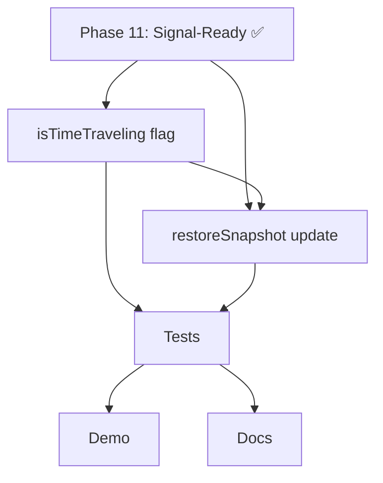

# Phase 10: Time Travel Suppression - REVISED v2

**Last Updated:** 2026-03-24  
**Status:** Revised v2 - удалены неактуальные задачи, сфокусировано на core suppression

---

## 🎯 Phase Overview

**Goal:** Реализовать механизм подавления side-effects при time-travel через интеграцию существующего `setSilently()` из Phase 11.

**Duration:** 1 week  
**Priority:** 🔴 CRITICAL  
**Status:** ⬜ Not Started

**Dependencies:** Phase 11 (Signal-Ready Architecture) ✅ **COMPLETED**

---

## 📊 What's Changed (v2)

### ✅ Completed in Phase 11

Следующие задачи были реализованы в рамках **Phase 11: Signal-Ready Architecture**:

| Task | Status | Location |
|------|--------|----------|
| `setSilently()` метод | ✅ Реализовано | `StoreImpl.ts:245` |
| `AtomContext` для метаданных | ✅ Реализовано | `reactive/types.ts` |
| Поддержка `{ silent: true }` | ✅ Реализовано | `StoreImpl.set()` |

### ❌ Removed (Deferred to Effect API Phase)

| Task | Reason |
|------|--------|
| ~~`effect()` function~~ | Требует отдельного дизайна API |
| ~~`suppressDuringTravel` option~~ | Зависит от effect() |
| ~~Async cancellation~~ | Зависит от effect() |

### ✅ Focused Scope (v2)

| Task | Description | Status |
|------|-------------|--------|
| TT-001 | `isTimeTraveling` флаг | ⬜ Not Started |
| TT-005 | `restoreSnapshot()` → `setSilently()` | ⬜ Not Started |
| TT-007 | Test suite | ⬜ Not Started |
| TT-008 | Demo example | ⬜ Not Started |
| TT-009 | Documentation | ⬜ Not Started |

---

## 📋 Success Criteria

- [ ] `isTimeTraveling` флаг работает в TimeTravelController
- [ ] `restoreSnapshot()` использует `setSilently()` (не обычный `set()`)
- [ ] Subscribers НЕ уведомляются во время undo/redo
- [ ] Все существующие time-travel тесты проходят
- [ ] 90%+ code coverage для нового кода
- [ ] Demo пример показывает suppression в действии

---

## 📋 Task Breakdown

| Task ID | Title | Priority | Estimated Time | Status |
|---------|-------|----------|----------------|--------|
| TT-001 | Add `isTimeTraveling` flag | 🔴 Critical | 2-3 hours | ⬜ Not Started |
| TT-005 | Update `restoreSnapshot()` with `setSilently()` | 🔴 Critical | 1-2 hours | ⬜ Not Started |
| TT-007 | Write comprehensive test suite | 🟡 High | 4-6 hours | ⬜ Not Started |
| TT-008 | Create demo example | 🟢 Medium | 2-3 hours | ⬜ Not Started |
| TT-009 | Update documentation | 🟢 Medium | 2-3 hours | ⬜ Not Started |

**Total:** 11-17 hours (вместо 27-35h в оригинале)

---

## 🔗 Dependencies



**Completed Dependencies:**
- ✅ Phase 11 SR-006: `setSilently()` implementation
- ✅ Phase 11 SR-004: `AtomContext` for metadata

---

## 📈 Implementation Plan

### Этап 1: Core Suppression (4-6 часов)

```bash
# TT-001: Добавить isTimeTraveling флаг
# Files: TimeTravelController.ts, SimpleTimeTravel.ts, types.ts
# Tests: isTimeTraveling-flag.test.ts
```

```bash
# TT-005: Интегрировать setSilently в restoreSnapshot
# Files: TimeTravelController.ts
# Tests: restoreSnapshot-silent.test.ts
```

### Этап 2: Testing (4-6 часов)

```bash
# TT-007: Comprehensive test suite
# Files: suppression/*.test.ts (4 test files)
```

### Этап 3: Documentation & Demo (4-6 часов)

```bash
# TT-008: Demo example
# Files: examples/time-travel-suppression-demo.ts
```

```bash
# TT-009: Documentation
# Files: docs/guides/time-travel-suppression.md
```

---

## 📝 Technical Details

### TT-001: `isTimeTraveling` Flag

```typescript
// packages/time-travel/src/TimeTravelController.ts
export class TimeTravelController implements TimeTravelAPI {
  private isTimeTraveling: boolean = false;

  private restoreSnapshot(snapshot: Snapshot): void {
    this.isTimeTraveling = true;
    try {
      // ... restore logic
    } finally {
      this.isTimeTraveling = false;
    }
  }

  getIsTimeTraveling(): boolean {
    return this.isTimeTraveling;
  }
}
```

### TT-005: `restoreSnapshot()` Integration

```typescript
// packages/time-travel/src/TimeTravelController.ts
private restoreSnapshot(snapshot: Snapshot): void {
  this.isTimeTraveling = true;

  try {
    Object.entries(snapshot.state).forEach(([key, entry]) => {
      const atom = atomRegistry.getByName(key);
      if (atom) {
        // ✅ USE setSilently (already exists from Phase 11)
        if (typeof (this.store as any).setSilently === 'function') {
          (this.store as any).setSilently(atom as never, entry.value as never);
        } else {
          // Fallback
          (this.store as any).set(atom as never, entry.value as never);
        }
      }
    });
    this.flushComputed();
  } finally {
    this.isTimeTraveling = false;
  }
}
```

### Current `setSilently()` (from Phase 11)

```typescript
// packages/core/src/store/StoreImpl.ts:245
setSilently<Value>(
  atom: Atom<Value>,
  update: Value | ((prev: Value) => Value)
): void {
  this.set(atom, update, { silent: true });
}
```

---

## 🧪 Test Requirements

### Test Files to Create

1. `packages/time-travel/src/__tests__/suppression/isTimeTraveling-flag.test.ts`
2. `packages/time-travel/src/__tests__/suppression/restoreSnapshot-silent.test.ts`
3. `packages/time-travel/src/__tests__/suppression/time-travel-suppression-integration.test.ts`
4. `packages/time-travel/src/__tests__/suppression/edge-cases.test.ts`

### Key Test Scenarios

```typescript
// 1. Flag state management
expect(timeTravel.isTraveling()).toBe(false); // Before
timeTravel.undo();
expect(timeTravel.isTraveling()).toBe(false); // After (reset)

// 2. Subscriber suppression
const subscriber = vi.fn();
store.subscribe(atom, subscriber);
timeTravel.undo();
expect(subscriber).not.toHaveBeenCalled(); // Silent

// 3. Computed atoms re-evaluation
timeTravel.undo();
expect(store.get(computedAtom)).toBe(expectedValue); // Re-evaluated
```

---

## 📚 Demo Example

```typescript
// examples/time-travel-suppression-demo.ts
import { atom, createStore } from '@nexus-state/core';
import { SimpleTimeTravel } from '@nexus-state/time-travel';

const store = createStore();
const cartAtom = atom<any[]>([], 'cart');
const timeTravel = new SimpleTimeTravel(store, { autoCapture: false });

const notifications: string[] = [];

// Subscribe (simulating effect)
store.subscribe(cartAtom, (cart) => {
  if (cart.length === 0) {
    notifications.push('Cart is empty');
  }
});

timeTravel.capture('initial');
store.set(cartAtom, [{ id: 1, name: 'Laptop' }]);
timeTravel.capture('add-item');
store.set(cartAtom, []);
timeTravel.capture('remove-item');

console.log(`Notifications before undo: ${notifications.length}`); // 1

timeTravel.undo(); // Should NOT trigger notification

console.log(`Notifications after undo: ${notifications.length}`); // Still 1
```

---

## 🚨 Risks & Mitigation

| Risk | Impact | Mitigation | Status |
|------|--------|------------|--------|
| Breaking existing time-travel | High | Backward-compatible, fallback to `set()` | ✅ Mitigated |
| Computed atoms stale | Medium | `flushComputed()` after restore | ✅ Mitigated |
| Performance overhead | Low | Minimal flag check overhead | ✅ Mitigated |

---

## ✅ Verification Checklist

- [ ] Код компилируется без ошибок
- [ ] Все time-travel тесты проходят
- [ ] 90%+ code coverage для нового кода
- [ ] Demo example работает
- [ ] Документация обновлена
- [ ] Нет breaking changes в публичном API
- [ ] Performance impact <1% (только flag check)

---

## 📚 Related Documents

- [INDEX-REVISED.md](./INDEX-REVISED.md) - Task index
- [TT-001](./TT-001-isTimeTraveling-flag.md) - Flag implementation
- [TT-005](./TT-005-restoreSnapshot-silent.md) - restoreSnapshot integration
- [TT-007](./TT-007-test-suite.md) - Test suite
- [Phase 11 README](../phase-11-signal-ready-architecture/README.md) - Completed dependency

---

**Created:** 2026-03-24 (REVISED)  
**Last Updated:** 2026-03-24 (Revised v2)  
**Phase Owner:** AI Agent  
**Dependencies:** Phase 11 ✅ COMPLETED  
**Replaces:** Original Phase 10 plan
