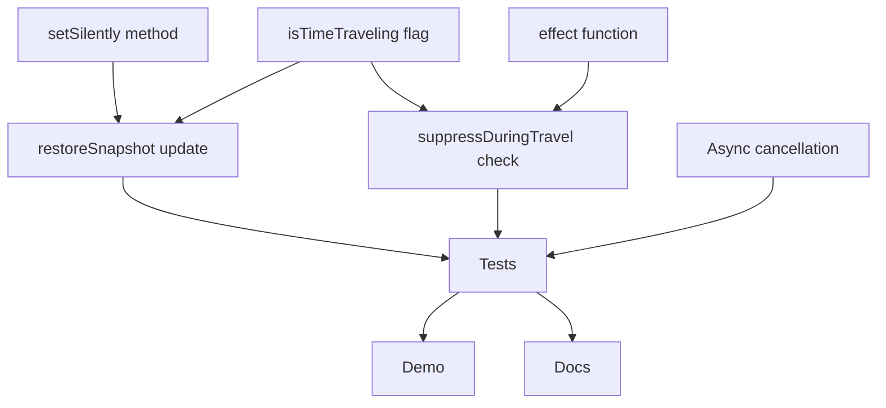

# Phase 10: Time Travel Suppression (Week 1-2)

## 🎯 Phase Overview

**Goal:** Implement critical effect suppression mechanism for time-travel debugging to prevent side effects during state rollback.

**Duration:** 2 weeks
**Priority:** 🔴 CRITICAL
**Status:** ⬜ Not Started

This phase addresses the **critical gap** identified in the Time Travel architecture analysis. Without effect suppression, time-travel debugging causes:
- 📊 Fake analytics events
- 💾 Database pollution with test data
- 📧 Spam notifications to users
- 💰 Financial losses from paid APIs

---

## 📊 Success Criteria

- [ ] `effect()` API implemented with metadata support
- [ ] `suppressDuringTravel` flag working correctly
- [ ] `setSilently()` method in StoreImpl (no effect triggers)
- [ ] `isTimeTraveling` flag in TimeTravelController
- [ ] All existing tests passing + 15+ new tests for suppression
- [ ] Demo example showing effect suppression in action
- [ ] Documentation updated with suppression patterns

---

## 📋 Task Breakdown

| Task ID | Title | Priority | Estimated Time | Status |
|---------|-------|----------|----------------|--------|
| TT-001 | Add `isTimeTraveling` flag to TimeTravelController | 🔴 Critical | 2-3 hours | ⬜ Not Started |
| TT-002 | Implement `setSilently()` in StoreImpl | 🔴 Critical | 3-4 hours | ⬜ Not Started |
| TT-003 | Create `effect()` function with metadata | 🔴 Critical | 4-6 hours | ⬜ Not Started |
| TT-004 | Add `suppressDuringTravel` check in effect wrapper | 🔴 Critical | 2-3 hours | ⬜ Not Started |
| TT-005 | Update `restoreSnapshot()` to use silent updates | 🔴 Critical | 2-3 hours | ⬜ Not Started |
| TT-006 | Implement async effect cancellation | 🟡 High | 4-6 hours | ⬜ Not Started |
| TT-007 | Write comprehensive test suite | 🟡 High | 6-8 hours | ⬜ Not Started |
| TT-008 | Create demo example | 🟢 Medium | 2-3 hours | ⬜ Not Started |
| TT-009 | Update documentation | 🟢 Medium | 2-3 hours | ✅ Completed |

---

## 🔗 Dependencies



---

## 📈 Progress Tracking

### Week 1 Goals: Core Implementation
- [ ] TT-001: Add `isTimeTraveling` flag
- [ ] TT-002: Implement `setSilently()`
- [ ] TT-003: Create `effect()` function
- [ ] TT-004: Add suppression check
- [ ] TT-005: Update `restoreSnapshot()`

### Week 2 Goals: Testing & Documentation
- [ ] TT-006: Async effect cancellation
- [ ] TT-007: Comprehensive tests
- [ ] TT-008: Demo example
- [ ] TT-009: Documentation

---

## 🚨 Blockers & Risks

| Risk | Impact | Mitigation | Status |
|------|--------|------------|--------|
| Breaking existing effect patterns | High | Backward-compatible API with defaults | ⏳ Pending |
| Performance overhead from checks | Medium | Optimize flag checks, benchmark | ⏳ Pending |
| Complex async cancellation | Medium | Use AbortController pattern | ⏳ Pending |
| Edge cases with nested effects | High | Comprehensive test coverage | ⏳ Pending |

---

## 📝 Technical Details

### TT-001: `isTimeTraveling` Flag

```typescript
// packages/time-travel/src/TimeTravelController.ts
export class TimeTravelController implements TimeTravelAPI {
  private isTimeTraveling = false;  // ← Add this

  private restoreSnapshot(snapshot: Snapshot): void {
    this.isTimeTraveling = true;
    try {
      // ... restoration logic
    } finally {
      this.isTimeTraveling = false;
    }
  }

  // Getter for external access
  getIsTimeTraveling(): boolean {
    return this.isTimeTraveling;
  }
}
```

---

### TT-002: `setSilently()` Method

```typescript
// packages/core/src/store/StoreImpl.ts
setSilently<Value>(
  atom: Atom<Value>,
  update: Value | ((prev: Value) => Value)
): void {
  // Get or create state
  const atomState = this.stateManager.getOrCreateState(atom, () => {
    return this.evaluator.evaluate(atom, this.createGetter());
  });

  // Calculate new value
  const newValue =
    typeof update === 'function'
      ? (update as (prev: Value) => Value)(atomState.value)
      : update;

  // Update value WITHOUT notifications
  this.stateManager.setValue(atom, newValue);
  
  // NO notify(), NO dependencyTracker.notifyDependents()
  // NO plugin hooks, NO devTools tracking
}
```

---

### TT-003: `effect()` Function

```typescript
// packages/core/src/effect.ts
import { atomRegistry } from './atom-registry';
import { debugContext } from './debug-context';

export interface EffectOptions {
  name?: string;
  type?: 'side-effect' | 'debug' | 'computed';
  suppressDuringTravel?: boolean;
  id?: string;
}

export interface EffectHandle {
  id: string;
  dispose(): void;
  pause(): void;
  resume(): void;
}

export function effect<T>(
  fn: () => T,
  options: EffectOptions = {}
): EffectHandle {
  const effectId = options.id || `effect-${Math.random().toString(36).substring(2, 9)}`;
  const suppressDuringTravel = options.suppressDuringTravel ?? false;

  const wrapped = () => {
    // Check suppression flag
    if (debugContext.isTimeTraveling && suppressDuringTravel) {
      return; // Skip effect execution
    }
    return fn();
  };

  // Track effect in registry
  const effectHandle = {
    id: effectId,
    dispose: () => { /* cleanup */ },
    pause: () => { /* pause tracking */ },
    resume: () => { /* resume tracking */ }
  };

  // Initial execution
  wrapped();

  return effectHandle;
}
```

---

### TT-004: Suppression Check Integration

```typescript
// packages/core/src/debug-context.ts
export const debugContext = {
  isTimeTraveling: false,
  isRecording: true,
  
  // Effect registry for cancellation
  pendingEffects: new Map<string, AbortController>(),
  
  setTraveling(traveling: boolean): void {
    this.isTimeTraveling = traveling;
    
    if (traveling) {
      // Cancel all pending async effects
      for (const controller of this.pendingEffects.values()) {
        controller.abort();
      }
    }
  }
};
```

---

### TT-005: Updated `restoreSnapshot()`

```typescript
private restoreSnapshot(snapshot: Snapshot): void {
  this.isTimeTraveling = true;
  debugContext.setTraveling(true);
  
  try {
    Object.entries(snapshot.state).forEach(([key, entry]) => {
      const atom = atomRegistry.getByName(key);
      if (atom) {
        // Use silent update to avoid effect triggers
        (this.store as any).setSilently(atom as never, entry.value as never);
      }
    });
    
    // Force computed re-evaluation without effects
    this.flushComputed();
  } finally {
    this.isTimeTraveling = false;
    debugContext.setTraveling(false);
  }
}
```

---

### TT-006: Async Effect Cancellation

```typescript
export function effect<T>(
  fn: () => T | Promise<T>,
  options: EffectOptions = {}
): EffectHandle {
  const effectId = options.id || `effect-${Date.now()}`;
  
  const wrapped = async () => {
    if (debugContext.isTimeTraveling && options.suppressDuringTravel) {
      return;
    }
    
    // Create AbortController for this effect
    const controller = new AbortController();
    debugContext.pendingEffects.set(effectId, controller);
    
    try {
      const result = await fn();
      return result;
    } finally {
      debugContext.pendingEffects.delete(effectId);
    }
  };
  
  return {
    id: effectId,
    dispose: () => {
      debugContext.pendingEffects.get(effectId)?.abort();
    },
    pause: () => { /* pause */ },
    resume: () => { /* resume */ }
  };
}
```

---

## 📚 Reference Materials

- [Analysis Report](../../ANALYSIS-SUMMARY.md)
- [Time Travel Package](../../packages/time-travel/README.md)
- [DevTools Integration](../../packages/devtools/README.md)
- [Original Article Form](../../planning/article-forms/)

---

## 📝 Documentation (TT-009)

### Created Files

1. **User Guide:** [`docs/guides/time-travel-suppression.md`](../../docs/guides/time-travel-suppression.md)
   - Problem description
   - Solution overview
   - How it works
   - Manual suppression pattern
   - Helper functions
   - Best practices
   - Example: E-commerce cart
   - Troubleshooting

2. **API Reference:** [`docs/api/time-travel.md`](../../docs/api/time-travel.md)
   - `SimpleTimeTravel.isTraveling()`
   - `TimeTravelController.getIsTimeTraveling()`
   - `Store.setSilently()`
   - `DebugContext.isTraveling()`
   - Type definitions

3. **FAQ:** [`docs/faq/time-travel.md`](../../docs/faq/time-travel.md)
   - Why effects still fire
   - Manual suppression
   - Computed atoms
   - Async effects
   - Performance overhead
   - Testing
   - Debugging

4. **Package README:** [`packages/time-travel/README.md`](../../packages/time-travel/README.md)
   - Effect suppression section added

### Documentation Structure

```
docs/
├── api/
│   └── time-travel.md          # API reference
├── faq/
│   └── time-travel.md          # FAQ
└── guides/
    └── time-travel-suppression.md  # User guide
```

### Key Topics Covered

- ✅ API reference для time-travel suppression
- ✅ Guide для time-travel suppression
- ✅ FAQ section для common issues
- ✅ Обновлённый README с новой функциональностью
- ✅ TypeScript типы задокументированы

---

**Created:** 2026-03-24
**Last Updated:** 2026-03-24
**Phase Owner:** AI Agent
**Based on:** Time Travel Suppression Analysis Report
