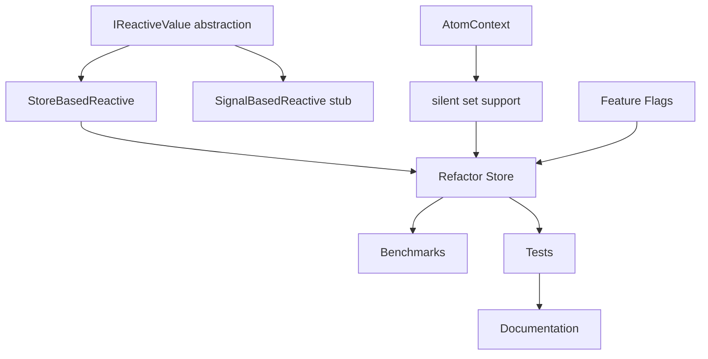

# Phase 11: Signal-Ready Architecture (Week 1-2)

## 🎯 Phase Overview

**Goal:** Подготовить архитектуру к будущей миграции на TC39 Native Signals через абстракции, не делая полный State-in-Atom рефакторинг.

**Duration:** 1.5-2 weeks
**Priority:** 🔴 CRITICAL (Блокирует Phase 10)
**Status:** ⬜ Not Started

---

## 🎯 Стратегия

Вместо полного State-in-Atom рефакторинга (который устареет при Native Signals), создаём **абстрактный слой**, который позволит:

1. ✅ Реализовать Phase 10 (effect suppression) чисто
2. ✅ Плавно мигрировать на TC39 Signals (когда придут в 2027-2028)
3. ✅ Избежать переделок и breaking changes
4. ✅ Сохранить текущий API для пользователей

---

## 📊 Success Criteria

- [ ] `IReactiveValue<T>` интерфейс создан и задокументирован
- [ ] `StoreBasedReactive` реализация работает с текущим Store
- [ ] `SignalBasedReactive` заглушка готова для будущих Signals
- [ ] Feature flag `ENABLE_SIGNAL_BACKEND` добавлен
- [ ] Внутренний `AtomContext` для передачи метаданных (silent, timeTravel)
- [ ] Все существующие тесты проходят
- [ ] Benchmark показывает <5% overhead от абстракции
- [ ] Документация обновлена с migration guide

---

## 📋 Task Breakdown

| Task ID | Title | Priority | Estimated Time | Status |
|---------|-------|----------|----------------|--------|
| SR-001 | Create IReactiveValue abstraction | 🔴 Critical | 3-4 hours | ⬜ Not Started |
| SR-002 | Implement StoreBasedReactive | 🔴 Critical | 4-6 hours | ⬜ Not Started |
| SR-003 | Create SignalBasedReactive stub | 🟡 High | 2-3 hours | ⬜ Not Started |
| SR-004 | Add AtomContext for metadata | 🔴 Critical | 4-5 hours | ⬜ Not Started |
| SR-005 | Implement Feature Flags | 🟡 High | 2-3 hours | ⬜ Not Started |
| SR-006 | Add silent set() support | 🔴 Critical | 3-4 hours | ⬜ Not Started |
| SR-007 | Refactor Store to use abstraction | 🟡 High | 5-7 hours | ⬜ Not Started |
| SR-008 | Performance benchmarks | 🟢 Medium | 2-3 hours | ⬜ Not Started |
| SR-009 | Update tests | 🟡 High | 3-4 hours | ⬜ Not Started |
| SR-010 | Documentation & migration guide | 🟢 Medium | 2-3 hours | ⬜ Not Started |

**Total:** 30-45 hours

---

## 🔗 Dependencies



---

## 📈 Progress Tracking

### Week 1 Goals: Core Abstractions
- [ ] SR-001: IReactiveValue abstraction
- [ ] SR-002: StoreBasedReactive implementation
- [ ] SR-003: SignalBasedReactive stub
- [ ] SR-004: AtomContext for metadata
- [ ] SR-005: Feature Flags

### Week 2 Goals: Integration & Testing
- [ ] SR-006: Silent set() support
- [ ] SR-007: Refactor Store
- [ ] SR-008: Benchmarks
- [ ] SR-009: Update tests
- [ ] SR-010: Documentation

---

## 🚨 Blockers & Risks

| Risk | Impact | Mitigation | Status |
|------|--------|------------|--------|
| Performance overhead | Medium | Benchmark early, optimize hot paths | ⏳ Pending |
| Breaking changes to internal API | High | Keep public API stable, version internal | ⏳ Pending |
| TC39 Signals API changes | Medium | Monitor proposal, use feature flags | ⏳ Pending |
| Complex migration path | Medium | Comprehensive docs, incremental rollout | ⏳ Pending |

---

## 📝 Technical Details

### Architecture Overview

```
┌─────────────────────────────────────────────────────────┐
│                    Public API                            │
│  atom(), createStore(), store.get(), store.set()        │
└─────────────────────────────────────────────────────────┘
                           ↓
┌─────────────────────────────────────────────────────────┐
│              IReactiveValue<T> abstraction               │
│  - getValue(): T                                         │
│  - setValue(value: T, context?: AtomContext): void      │
│  - subscribe(fn: (T) => void): () => void               │
└─────────────────────────────────────────────────────────┘
                           ↓
         ┌─────────────────┴──────────────────┐
         ↓                                     ↓
┌──────────────────────┐          ┌──────────────────────┐
│ StoreBasedReactive   │          │ SignalBasedReactive  │
│ (Current - 2026)     │          │ (Future - 2027+)     │
│                      │          │                      │
│ Uses Store           │          │ Uses Signal.State    │
│ infrastructure       │          │ from TC39            │
└──────────────────────┘          └──────────────────────┘
```

### Key Components

#### 1. IReactiveValue Interface
```typescript
// packages/core/src/reactive/types.ts
export interface IReactiveValue<T> {
  getValue(): T;
  setValue(value: T, context?: AtomContext): void;
  subscribe(fn: (value: T) => void): Unsubscribe;
}

export interface AtomContext {
  silent?: boolean;        // Suppress notifications
  timeTravel?: boolean;    // Time-travel operation
  source?: string;         // Source of change (for debugging)
  metadata?: Record<string, unknown>;
}
```

#### 2. StoreBasedReactive Implementation
```typescript
// packages/core/src/reactive/StoreBasedReactive.ts
export class StoreBasedReactive<T> implements IReactiveValue<T> {
  constructor(
    private store: Store,
    private atom: Atom<T>
  ) {}

  getValue(): T {
    return this.store.get(this.atom);
  }

  setValue(value: T, context?: AtomContext): void {
    if (context?.silent) {
      // Direct state update without notifications
      const state = this.store.getStateManager().getState(this.atom);
      if (state) {
        this.store.getStateManager().setValue(this.atom, value);
      }
      return;
    }

    // Normal set with notifications
    this.store.set(this.atom, value);
  }

  subscribe(fn: (value: T) => void): Unsubscribe {
    return this.store.subscribe(this.atom, fn);
  }
}
```

#### 3. SignalBasedReactive Stub
```typescript
// packages/core/src/reactive/SignalBasedReactive.ts
export class SignalBasedReactive<T> implements IReactiveValue<T> {
  private signal: any; // Signal.State когда появятся

  constructor(initialValue: T) {
    if (typeof (globalThis as any).Signal === 'undefined') {
      throw new Error('Native Signals not available');
    }
    // this.signal = new Signal.State(initialValue);
    throw new Error('SignalBasedReactive not implemented yet');
  }

  getValue(): T {
    // return this.signal.get();
    throw new Error('Not implemented');
  }

  setValue(value: T, context?: AtomContext): void {
    // if (context?.silent) {
    //   // Signals не поддерживают silent напрямую
    //   // Нужен механизм через Watcher
    // }
    // this.signal.set(value);
    throw new Error('Not implemented');
  }

  subscribe(fn: (value: T) => void): Unsubscribe {
    // const watcher = new Signal.subtle.Watcher(() => {
    //   fn(this.getValue());
    // });
    // watcher.watch(this.signal);
    // return () => watcher.unwatch(this.signal);
    throw new Error('Not implemented');
  }
}
```

#### 4. Feature Flags
```typescript
// packages/core/src/reactive/config.ts
export const REACTIVE_CONFIG = {
  // Feature flag для переключения backend
  ENABLE_SIGNAL_BACKEND: false,
  
  // Для A/B тестирования
  SIGNAL_BACKEND_PERCENTAGE: 0, // 0-100%
  
  // Fallback при ошибках
  FALLBACK_TO_STORE: true,
};

// Factory для создания reactive value
export function createReactiveValue<T>(
  store: Store,
  atom: Atom<T>
): IReactiveValue<T> {
  if (REACTIVE_CONFIG.ENABLE_SIGNAL_BACKEND) {
    try {
      if (typeof (globalThis as any).Signal !== 'undefined') {
        // A/B testing
        if (Math.random() * 100 < REACTIVE_CONFIG.SIGNAL_BACKEND_PERCENTAGE) {
          return new SignalBasedReactive(atom.read());
        }
      }
    } catch (error) {
      if (!REACTIVE_CONFIG.FALLBACK_TO_STORE) {
        throw error;
      }
      console.warn('SignalBasedReactive failed, falling back to Store', error);
    }
  }
  
  return new StoreBasedReactive(store, atom);
}
```

#### 5. AtomContext Integration
```typescript
// packages/core/src/store/StoreImpl.ts (updated)
export class StoreImpl implements Store {
  // ... existing code ...

  set<Value>(
    atom: Atom<Value>,
    update: Value | ((prev: Value) => Value),
    context?: AtomContext // ← Новый параметр
  ): void {
    // Создать reactive value
    const reactive = createReactiveValue(this, atom);
    
    // Calculate new value
    const currentValue = reactive.getValue();
    const newValue = typeof update === 'function'
      ? (update as (prev: Value) => Value)(currentValue)
      : update;

    // Set with context
    reactive.setValue(newValue, context);
  }

  setSilently<Value>(
    atom: Atom<Value>,
    update: Value | ((prev: Value) => Value)
  ): void {
    // Просто обёртка для удобства
    this.set(atom, update, { silent: true });
  }
}
```

---

## 🧪 Testing Strategy

### Unit Tests
```typescript
// packages/core/src/reactive/__tests__/StoreBasedReactive.test.ts
describe('StoreBasedReactive', () => {
  it('should get value from store', () => {
    const store = createStore();
    const atom = atom(42, 'test');
    const reactive = new StoreBasedReactive(store, atom);

    expect(reactive.getValue()).toBe(42);
  });

  it('should set value with notifications', () => {
    const store = createStore();
    const atom = atom(0, 'test');
    const reactive = new StoreBasedReactive(store, atom);
    
    const subscriber = vi.fn();
    reactive.subscribe(subscriber);

    reactive.setValue(10);
    expect(subscriber).toHaveBeenCalledWith(10);
  });

  it('should set value silently without notifications', () => {
    const store = createStore();
    const atom = atom(0, 'test');
    const reactive = new StoreBasedReactive(store, atom);
    
    const subscriber = vi.fn();
    reactive.subscribe(subscriber);

    reactive.setValue(10, { silent: true });
    expect(subscriber).not.toHaveBeenCalled();
    expect(reactive.getValue()).toBe(10);
  });
});
```

### Integration Tests
```typescript
// packages/core/src/reactive/__tests__/integration.test.ts
describe('Reactive Integration', () => {
  it('should work with existing Store API', () => {
    const store = createStore();
    const testAtom = atom(0, 'test');

    // Old API still works
    store.set(testAtom, 10);
    expect(store.get(testAtom)).toBe(10);

    // New silent API works
    store.setSilently(testAtom, 20);
    expect(store.get(testAtom)).toBe(20);
  });
});
```

### Benchmarks
```typescript
// packages/core/src/reactive/__tests__/benchmark.test.ts
describe('Reactive Performance', () => {
  it('should have minimal overhead (<5%)', () => {
    const iterations = 10000;
    
    // Baseline: Direct store access
    const baseline = measureTime(() => {
      const store = createStore();
      const atom = atom(0, 'test');
      for (let i = 0; i < iterations; i++) {
        store.set(atom, i);
        store.get(atom);
      }
    });

    // With abstraction
    const withAbstraction = measureTime(() => {
      const store = createStore();
      const atom = atom(0, 'test');
      const reactive = new StoreBasedReactive(store, atom);
      for (let i = 0; i < iterations; i++) {
        reactive.setValue(i);
        reactive.getValue();
      }
    });

    const overhead = (withAbstraction - baseline) / baseline;
    expect(overhead).toBeLessThan(0.05); // <5% overhead
  });
});
```

---

## 📚 Migration Path

### Для разработчиков Nexus State (внутренний API):

**До:**
```typescript
// Прямой доступ к Store internals
const state = store.getStateManager().getState(atom);
store.getStateManager().setValue(atom, value);
```

**После:**
```typescript
// Через абстракцию
const reactive = createReactiveValue(store, atom);
const value = reactive.getValue();
reactive.setValue(newValue, { silent: true });
```

### Для пользователей (публичный API):

**Ничего не меняется!**
```typescript
// Продолжает работать как раньше
const store = createStore();
const testAtom = atom(0, 'test');

store.get(testAtom);
store.set(testAtom, 10);
store.subscribe(testAtom, fn);
```

---

## 🔮 Future: Migration to Native Signals

Когда TC39 Signals достигнут Stage 3-4 (2027-2028):

### Step 1: Enable Feature Flag
```typescript
// packages/core/src/reactive/config.ts
export const REACTIVE_CONFIG = {
  ENABLE_SIGNAL_BACKEND: true, // ← Включить
  SIGNAL_BACKEND_PERCENTAGE: 10, // ← A/B testing на 10% пользователей
};
```

### Step 2: Implement SignalBasedReactive
```typescript
// packages/core/src/reactive/SignalBasedReactive.ts
export class SignalBasedReactive<T> implements IReactiveValue<T> {
  private signal: Signal.State<T>;
  private watcher?: Signal.subtle.Watcher;

  constructor(initialValue: T) {
    this.signal = new Signal.State(initialValue);
  }

  getValue(): T {
    return this.signal.get();
  }

  setValue(value: T, context?: AtomContext): void {
    if (context?.silent) {
      // Для silent нужен механизм через Watcher.pause()
      // (зависит от финального API Signals)
    }
    this.signal.set(value);
  }

  subscribe(fn: (value: T) => void): Unsubscribe {
    this.watcher = new Signal.subtle.Watcher(() => {
      fn(this.getValue());
    });
    this.watcher.watch(this.signal);
    return () => this.watcher!.unwatch(this.signal);
  }
}
```

### Step 3: Gradual Rollout
```
10% users → Monitor errors → 25% → 50% → 100%
```

### Step 4: Deprecate Store-based (2028+)
```typescript
// Major version bump (v2.0)
// Remove StoreBasedReactive
// SignalBasedReactive становится единственной реализацией
```

---

## 📝 Files to Create/Modify

### New Files
1. `packages/core/src/reactive/types.ts`
2. `packages/core/src/reactive/IReactiveValue.ts`
3. `packages/core/src/reactive/StoreBasedReactive.ts`
4. `packages/core/src/reactive/SignalBasedReactive.ts`
5. `packages/core/src/reactive/config.ts`
6. `packages/core/src/reactive/factory.ts`
7. `packages/core/src/reactive/__tests__/StoreBasedReactive.test.ts`
8. `packages/core/src/reactive/__tests__/integration.test.ts`
9. `packages/core/src/reactive/__tests__/benchmark.test.ts`

### Modified Files
1. `packages/core/src/store/StoreImpl.ts` - Add context parameter
2. `packages/core/src/types.ts` - Export AtomContext
3. `packages/core/src/index.ts` - Export reactive abstractions
4. `packages/core/README.md` - Document new APIs

---

## ✅ Acceptance Checklist

- [ ] All interfaces defined and exported
- [ ] StoreBasedReactive fully functional
- [ ] SignalBasedReactive stub compiles
- [ ] Feature flags working
- [ ] AtomContext propagates correctly
- [ ] setSilently() works without notifications
- [ ] All existing tests pass
- [ ] New tests cover abstractions (90%+ coverage)
- [ ] Benchmarks show <5% overhead
- [ ] Documentation complete
- [ ] No breaking changes to public API

---

**Created:** 2026-03-24
**Last Updated:** 2026-03-24
**Phase Owner:** AI Agent
**Dependencies:** None (foundational phase)
**Blocks:** Phase 10 (Time Travel Suppression)
