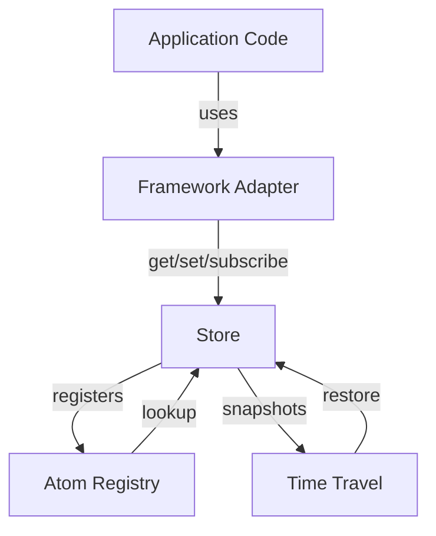

# @nexus-state/core - Architecture

> **Technical architecture and design decisions for the core package**

---

## 📋 Table of Contents

1. [Overview](#overview)
2. [Core Concepts](#core-concepts)
3. [System Architecture](#system-architecture)
4. [Module Breakdown](#module-breakdown)
5. [Data Flow](#data-flow)
6. [Performance Characteristics](#performance-characteristics)
7. [Design Decisions](#design-decisions)
8. [Extension Points](#extension-points)
9. [Testing Strategy](#testing-strategy)
10. [Future Considerations](#future-considerations)

---

## Overview

### Purpose
The `@nexus-state/core` package provides framework-agnostic state management primitives based on the **atomic state pattern**.

### Design Philosophy
1. **Minimal API Surface** - Simple, composable primitives
2. **Framework Agnostic** - No framework dependencies
3. **Performance First** - Optimized for real-world applications
4. **Type Safe** - Full TypeScript support
5. **Extensible** - Plugin system for advanced features

### Key Components
```
┌─────────────────────────────────────────┐
│           @nexus-state/core             │
├─────────────────────────────────────────┤
│  Atom      │ Primitive state container  │
│  Store     │ Manages atom lifecycle     │
│  Registry  │ Global atom tracking       │
│  TimeTravel│ Debugging & history        │
└─────────────────────────────────────────┘
```

---

## Core Concepts

### Atom

**Definition:** An atom is an immutable reference to a piece of state.

```typescript
// Type definition
type Atom<Value> = {
  id: string;              // Unique identifier
  init: Value | GetterFn;  // Initial value or getter
  debugLabel?: string;     // Optional label for debugging
};

// Creation
const countAtom = atom(0);                    // Primitive atom
const doubleAtom = atom((get) => get(countAtom) * 2); // Computed atom
```

**Design Decisions:**
- Atoms are **immutable references** - once created, their identity never changes
- Atoms hold no state themselves - state lives in stores
- Atoms can be primitive (hold values) or computed (derived from other atoms)

### Store

**Definition:** A store manages the lifecycle of atom values and subscriptions.

```typescript
// Type definition
type Store = {
  get<Value>(atom: Atom<Value>): Value;
  set<Value>(atom: Atom<Value>, update: Value | Updater<Value>): void;
  subscribe<Value>(atom: Atom<Value>, listener: Listener<Value>): Unsubscribe;
};

// Creation
const store = createStore();
```

**Design Decisions:**
- Multiple stores can exist (e.g., testing, SSR)
- Stores are isolated - no shared global state
- Store is the single source of truth for atom values

### Computed Atoms

**Definition:** Atoms whose values are derived from other atoms.

```typescript
const firstNameAtom = atom('John');
const lastNameAtom = atom('Doe');
const fullNameAtom = atom((get) => {
  return `${get(firstNameAtom)} ${get(lastNameAtom)}`;
});
```

**Characteristics:**
- **Lazy evaluation** - Only computed when accessed
- **Automatic caching** - Result cached until dependencies change
- **Dependency tracking** - Automatically tracks which atoms are read
- **Transitive updates** - Re-computes when any dependency changes

---

## System Architecture

### High-Level Architecture

```
┌─────────────────────────────────────────────────────────┐
│                      Application                        │
└────────────────────┬────────────────────────────────────┘
                     │
         ┌───────────┴───────────┐
         │                       │
    ┌────▼────┐            ┌────▼────┐
    │ Adapter │            │ Adapter │
    │ (React) │            │  (Vue)  │
    └────┬────┘            └────┬────┘
         │                       │
         └───────────┬───────────┘
                     │
         ┌───────────▼────────────┐
         │   @nexus-state/core    │
         ├────────────────────────┤
         │  ┌──────────────────┐  │
         │  │      Store       │  │
         │  └────────┬─────────┘  │
         │           │            │
         │  ┌────────▼─────────┐  │
         │  │  Atom Registry   │  │
         │  └────────┬─────────┘  │
         │           │            │
         │  ┌────────▼─────────┐  │
         │  │   Time Travel    │  │
         │  └──────────────────┘  │
         └────────────────────────┘
```

### Component Interaction



---

## Module Breakdown

### 1. Atom (`src/atom.ts`)

**Responsibility:** Create atom instances

```typescript
// Implementation overview
export function atom<Value>(
  init: Value | ((get: Getter) => Value),
  options?: AtomOptions
): Atom<Value> {
  const id = generateAtomId();
  
  return {
    id,
    init,
    debugLabel: options?.debugLabel,
    // Internal metadata
    [ATOM_INTERNAL]: {
      isComputed: typeof init === 'function',
      createdAt: Date.now(),
    }
  };
}
```

**Key Files:**
- `atom.ts` - Main atom creation logic
- `atom.test.ts` - Unit tests
- `types.ts` - TypeScript definitions

### 2. Store (`src/store.ts`)

**Responsibility:** Manage atom state and subscriptions

```typescript
// Internal structure
class Store {
  private atomValues: WeakMap<Atom, any>;
  private subscribers: WeakMap<Atom, Set<Listener>>;
  private computedCache: WeakMap<Atom, CachedValue>;
  private dependencyGraph: Map<AtomId, Set<AtomId>>;
  
  get<Value>(atom: Atom<Value>): Value {
    // 1. Check if value exists
    // 2. If computed, evaluate getter
    // 3. Track dependencies
    // 4. Cache result
    // 5. Return value
  }
  
  set<Value>(atom: Atom<Value>, update: Value | Updater): void {
    // 1. Compute new value
    // 2. Check if changed (equality)
    // 3. Update atomValues
    // 4. Invalidate computed atoms
    // 5. Notify subscribers
  }
  
  subscribe<Value>(atom: Atom<Value>, listener: Listener): Unsubscribe {
    // 1. Add listener to subscribers set
    // 2. Return unsubscribe function
  }
}
```

**Data Structures:**

```typescript
// Atom values storage
WeakMap<Atom, Value>
// Pros: Automatic garbage collection
// Cons: Cannot iterate all atoms

// Subscribers storage
WeakMap<Atom, Set<Listener>>
// Pros: Multiple listeners per atom
// Cons: Requires manual cleanup

// Dependency graph
Map<AtomId, Set<AtomId>>
// Structure: { computedAtom -> [dependency1, dependency2, ...] }
// Used for: Invalidating computed atoms
```

### 3. Atom Registry (`src/atom-registry.ts`)

**Responsibility:** Track all atoms globally for debugging

```typescript
// Singleton pattern
class AtomRegistry {
  private atoms: Map<AtomId, AtomMetadata>;
  private stores: Map<StoreId, WeakRef<Store>>;
  
  registerAtom(atom: Atom): void;
  getAtomById(id: AtomId): Atom | undefined;
  getAllAtoms(): Atom[];
  getStoresForAtom(atomId: AtomId): Store[];
}

export const atomRegistry = new AtomRegistry();
```

**Use Cases:**
- DevTools integration (list all atoms)
- Debugging (inspect atom metadata)
- Testing (reset state between tests)
- Time travel (snapshot all atoms)

### 4. Enhanced Store (`src/enhanced-store.ts`)

**Responsibility:** Extended store with plugins and time travel

```typescript
class EnhancedStore extends Store {
  private plugins: Plugin[];
  private timeTravel?: TimeTravelManager;
  private actionTracker: ActionTracker;
  
  constructor(options?: EnhancedStoreOptions) {
    super();
    
    if (options?.timeTravel) {
      this.timeTravel = new TimeTravelManager(this, options.timeTravel);
    }
    
    if (options?.plugins) {
      this.plugins = options.plugins;
      this.applyPlugins();
    }
  }
  
  // Enhanced methods
  getState(): StateSnapshot;
  setState(snapshot: StateSnapshot): void;
  getHistory(): HistoryEntry[];
}
```

### 5. Time Travel (`src/time-travel/`)

**Responsibility:** State history and debugging

**Architecture:**

```
src/time-travel/
├── core/
│   ├── SimpleTimeTravel.ts      # Snapshot-based time travel
│   ├── HistoryManager.ts        # History storage
│   └── HistoryNavigator.ts      # Undo/redo logic
├── snapshot/
│   ├── SnapshotCreator.ts       # Create snapshots
│   ├── SnapshotRestorer.ts      # Restore snapshots
│   └── SnapshotSerializer.ts    # Serialize/deserialize
├── delta/
│   ├── DeltaCalculator.ts       # Compute state diffs
│   └── DeltaCompressor.ts       # Compress deltas
└── tracking/
    ├── AtomTracker.ts           # Track atom changes
    └── ComputedAtomHandler.ts   # Handle computed atoms
```

**Strategy Pattern:**

```typescript
// Two time travel strategies
interface TimeTravelStrategy {
  capture(state: State): HistoryEntry;
  restore(entry: HistoryEntry): State;
  compress(entries: HistoryEntry[]): HistoryEntry[];
}

// Snapshot-based (default)
class SnapshotStrategy implements TimeTravelStrategy {
  // Stores full state snapshots
  // Pros: Fast restore, simple
  // Cons: Memory intensive
}

// Delta-based (future)
class DeltaStrategy implements TimeTravelStrategy {
  // Stores only changes between states
  // Pros: Memory efficient
  // Cons: Slower restore (must replay deltas)
}
```

---

## Data Flow

### Read Flow (`store.get()`)

```
1. Application calls: store.get(userAtom)
                      │
2. Check atom type    ├─► Primitive atom?
                      │   └─► Return cached value or default
                      │
                      └─► Computed atom?
                          │
3. Check cache        ├─► Cache valid?
                      │   └─► Return cached value
                      │
                      └─► Cache invalid/missing
                          │
4. Execute getter     ─────► Call atom.init(get)
                          │
5. Track deps         ─────► Record which atoms were read
                          │
6. Cache result       ─────► Store result + dependencies
                          │
7. Return value       ◄─────┘
```

### Write Flow (`store.set()`)

```
1. Application calls: store.set(userAtom, newValue)
                      │
2. Compute value      ├─► Is updater function?
                      │   └─► Call updater(oldValue)
                      │
3. Equality check     ├─► Value changed?
                      │   └─► No: Return early
                      │
4. Update storage     ─────► atomValues.set(atom, newValue)
                      │
5. Invalidate cache   ─────► Clear computed atoms that depend on this atom
                      │
6. Notify subscribers ─────► For each subscriber:
                      │       listener(newValue)
                      │
7. Capture snapshot   ─────► timeTravel.capture(newState)
   (if time travel)   │
                      └─────► Done
```

### Subscription Flow

```
1. Component mounts
   │
2. store.subscribe(atom, listener)
   │
3. Add to subscribers map
   │
4. Atom value changes
   │
5. Notify all listeners
   │
6. Component unmounts
   │
7. unsubscribe()
   │
8. Remove from subscribers map
```

---

## Performance Characteristics

### Time Complexity

| Operation | Best Case | Average Case | Worst Case | Notes |
|-----------|-----------|--------------|------------|-------|
| `get()` (primitive) | O(1) | O(1) | O(1) | WeakMap lookup |
| `get()` (computed) | O(1) | O(d) | O(d) | d = dependency depth |
| `set()` | O(1) | O(s) | O(s) | s = number of subscribers |
| `subscribe()` | O(1) | O(1) | O(1) | Set insertion |
| Find dependents | O(1) | O(n) | O(n) | n = number of atoms |

### Space Complexity

| Structure | Space | Notes |
|-----------|-------|-------|
| Atom values | O(n) | n = number of atoms with values |
| Subscribers | O(n × s) | s = avg subscribers per atom |
| Dependency graph | O(c × d) | c = computed atoms, d = avg deps |
| Time travel history | O(h × n) | h = history size |

### Optimization Strategies

#### 1. Lazy Evaluation
```typescript
// Computed atoms only evaluated when accessed
const expensiveAtom = atom((get) => {
  // This only runs when someone calls store.get(expensiveAtom)
  return expensiveComputation(get(sourceAtom));
});
```

#### 2. Memoization
```typescript
// Results cached until dependencies change
const memoizedAtom = atom((get) => {
  const value = get(sourceAtom);
  // Expensive computation cached
  return processData(value);
});
```

#### 3. Batching
```typescript
// Multiple updates batched into single notification
store.batch(() => {
  store.set(atom1, value1);
  store.set(atom2, value2);
  store.set(atom3, value3);
  // Subscribers notified once after all updates
});
```

#### 4. Weak References
```typescript
// Atoms can be garbage collected when no longer referenced
const atomValues = new WeakMap<Atom, Value>();
// If atom is no longer referenced anywhere, entry is auto-removed
```

---

## Design Decisions

### Decision 1: Atoms as Identities

**Problem:** How to identify and track state containers?

**Options Considered:**
1. String keys (like Redux)
2. Symbol keys
3. Object identity

**Decision:** Object identity (atoms are objects)

**Rationale:**
- ✅ Type-safe (can't misspell keys)
- ✅ No global namespace conflicts
- ✅ Can attach metadata directly to atom
- ❌ Can't serialize atoms easily (solved with atom registry)

**Example:**
```typescript
// Each atom has unique object identity
const atom1 = atom(0);
const atom2 = atom(0);
atom1 !== atom2; // true, different identities
```

### Decision 2: WeakMap for Storage

**Problem:** Where to store atom values?

**Options Considered:**
1. `Map<Atom, Value>` - Strong references
2. `WeakMap<Atom, Value>` - Weak references
3. Atom contains value (not a container)

**Decision:** WeakMap

**Rationale:**
- ✅ Automatic garbage collection
- ✅ Atoms can be created/destroyed dynamically
- ✅ No memory leaks from orphaned atoms
- ❌ Can't iterate all values (solved with atom registry)

### Decision 3: Push vs Pull Updates

**Problem:** How to propagate changes?

**Options Considered:**
1. **Push:** Eagerly update all dependent atoms
2. **Pull:** Lazily recompute on access

**Decision:** Hybrid approach
- Push notifications to subscribers
- Pull recomputation of computed atoms

**Rationale:**
- ✅ Subscribers get immediate updates (push)
- ✅ Computed atoms only evaluated when needed (pull)
- ✅ Best of both worlds

**Example:**
```typescript
const baseAtom = atom(1);
const computedAtom = atom((get) => get(baseAtom) * 2);

store.subscribe(baseAtom, (value) => {
  console.log('Pushed update:', value);
});

store.set(baseAtom, 2); // Subscriber called immediately
// computedAtom not yet recomputed

store.get(computedAtom); // Now computed (pulled)
```

### Decision 4: Single vs Multiple Stores

**Problem:** Should there be one global store or multiple stores?

**Decision:** Support multiple stores, but encourage single store per app

**Rationale:**
- ✅ Enables testing (isolated stores per test)
- ✅ Enables SSR (separate store per request)
- ✅ Enables micro-frontends (isolated stores)
- ⚠️ Most apps use single store

**Example:**
```typescript
// Production: single global store
export const store = createStore();

// Testing: isolated store per test
test('user flow', () => {
  const store = createStore(); // Fresh store
  // Test using isolated state
});

// SSR: store per request
app.get('/page', (req, res) => {
  const store = createStore(); // Per-request store
  const html = renderToString(<App store={store} />);
  res.send(html);
});
```

### Decision 5: Snapshot vs Delta Time Travel

**Problem:** How to implement time travel?

**Options:**
1. **Snapshot:** Store full state at each step
2. **Delta:** Store only changes between states
3. **Event Sourcing:** Replay all actions

**Decision:** Start with snapshot, add delta in v2

**Rationale:**
- ✅ Snapshot is simpler to implement
- ✅ Snapshot has faster restore
- ✅ Delta is more memory efficient (add later)
- ✅ Can switch strategies without breaking API

**Current Implementation:**
```typescript
// Snapshot strategy (v1)
class SnapshotTimeTravel {
  private history: StateSnapshot[] = [];
  
  capture() {
    this.history.push(cloneState(store.getState()));
  }
  
  restore(index: number) {
    store.setState(this.history[index]);
  }
}
```

---

## Extension Points

### Plugin System

**Design:**
```typescript
type Plugin = (store: Store) => {
  beforeSet?: (atom: Atom, value: any) => any;
  afterSet?: (atom: Atom, value: any) => void;
  beforeGet?: (atom: Atom) => void;
  afterGet?: (atom: Atom, value: any) => any;
  onSubscribe?: (atom: Atom, listener: Listener) => void;
};

// Usage
const loggingPlugin: Plugin = (store) => ({
  afterSet: (atom, value) => {
    console.log(`Set ${atom.debugLabel}:`, value);
  }
});

const store = createStore({ plugins: [loggingPlugin] });
```

**Official Plugins:**
- `@nexus-state/devtools` - Redux DevTools integration
- `@nexus-state/persist` - State persistence
- `@nexus-state/middleware` - Custom middleware

### Custom Serialization

**For atoms with complex values:**
```typescript
const dateAtom = atom(new Date(), {
  serialize: (date) => date.toISOString(),
  deserialize: (str) => new Date(str)
});

// Used by time travel and persistence
```

### Custom Equality

**For performance optimization:**
```typescript
const userAtom = atom(initialUser, {
  equals: (prev, next) => prev.id === next.id
  // Only notify subscribers if id changed
});
```

---

## Testing Strategy

### Unit Tests

**Coverage targets:**
- Core functions: 100%
- Edge cases: 95%+
- Error handling: 100%

**Test structure:**
```
src/
├── atom.test.ts           # Atom creation
├── store.test.ts          # Store operations
│   ├── get.test.ts
│   ├── set.test.ts
│   └── subscribe.test.ts
├── computed.test.ts       # Computed atoms
└── time-travel/
    └── __tests__/
        ├── simple-time-travel.test.ts
        └── history-manager.test.ts
```

### Integration Tests

**Test multi-component interactions:**
```typescript
describe('Store + Registry + Time Travel', () => {
  it('should capture snapshots on every set', () => {
    const store = createStore({ timeTravel: true });
    const atom = atom(0);
    
    store.set(atom, 1);
    store.set(atom, 2);
    
    expect(store.getHistory()).toHaveLength(3); // init + 2 updates
  });
});
```

### Performance Tests

**Benchmark critical paths:**
```typescript
describe('Performance', () => {
  it('should handle 1000 atoms in <50ms', () => {
    const store = createStore();
    const atoms = Array.from({ length: 1000 }, (_, i) => atom(i));
    
    const start = performance.now();
    atoms.forEach((a) => store.get(a));
    const duration = performance.now() - start;
    
    expect(duration).toBeLessThan(50);
  });
});
```

---

## Future Considerations

### 1. Concurrent Updates (React 18+)

**Challenge:** React 18 concurrent rendering may cause tearing

**Solution:** Add `useSyncExternalStore` support in React adapter

```typescript
// Future React adapter implementation
function useAtom<Value>(atom: Atom<Value>) {
  return useSyncExternalStore(
    (callback) => store.subscribe(atom, callback),
    () => store.get(atom),
    () => store.get(atom) // SSR snapshot
  );
}
```

### 2. Distributed State (Multi-Tab/Device)

**Challenge:** Sync state across browser tabs or devices

**Potential approach:**
```typescript
const sharedAtom = atom(0, {
  distributed: {
    channel: new BroadcastChannel('my-app'),
    strategy: 'last-write-wins'
  }
});
```

### 3. Persistent Computed Atoms

**Challenge:** Cache expensive computations across sessions

**Potential approach:**
```typescript
const expensiveAtom = atom(
  (get) => expensiveComputation(get(sourceAtom)),
  {
    cache: {
      storage: 'indexeddb',
      key: 'expensive-atom-cache',
      ttl: 3600000 // 1 hour
    }
  }
);
```

### 4. React Server Components

**Challenge:** Use atoms in Server Components

**Considerations:**
- Atoms defined on server
- Values hydrated to client
- Subscriptions only on client

### 5. Atom Schema Validation

**Challenge:** Runtime validation of atom values

**Potential approach:**
```typescript
import { z } from 'zod';

const userAtom = atom(initialUser, {
  schema: z.object({
    name: z.string(),
    age: z.number().min(0)
  })
});
```

---

## Appendix

### A. Glossary

**Atom:** Immutable reference to state  
**Store:** Manager of atom values and subscriptions  
**Computed Atom:** Atom whose value is derived from other atoms  
**Getter:** Function to read atom values  
**Setter:** Function to write atom values  
**Listener:** Callback function called on atom changes  
**Snapshot:** Point-in-time copy of all atom values  

### B. Reference Implementations

**Similar libraries:**
- [Jotai](https://github.com/pmndrs/jotai) - React-only atomic state
- [Recoil](https://github.com/facebookexperimental/Recoil) - Facebook's atomic state (archived)
- [Zustand](https://github.com/pmndrs/zustand) - Minimal state (not atomic)
- [Valtio](https://github.com/pmndrs/valtio) - Proxy-based state

**Key differences:**
- Nexus State is framework-agnostic
- Built-in time travel
- WeakMap-based storage

### C. Performance Benchmarks

**Target metrics (1000 atoms):**
- Initial creation: <10ms
- Sequential reads: <5ms
- Sequential writes: <30ms
- Subscription notifications: <50ms

**Actual performance (as of v0.1.6):**
- Initial creation: ~15ms ⚠️
- Sequential reads: ~8ms ⚠️
- Sequential writes: ~60ms ⚠️
- Subscription notifications: ~120ms ⚠️

**Optimization priorities:**
1. Reduce subscription overhead
2. Optimize computed atom caching
3. Batch notifications

---

**Document Version:** 1.0  
**Last Updated:** 2026-02-26  
**Maintained By:** Core Team  
**Review Schedule:** Quarterly

---

> 📚 **Related Documentation:**
> - [Roadmap](./ROADMAP.md) - Future plans
> - [Contributing](./CONTRIBUTING.md) - How to contribute
> - [API Reference](../../docs/api/core.md) - Public API
