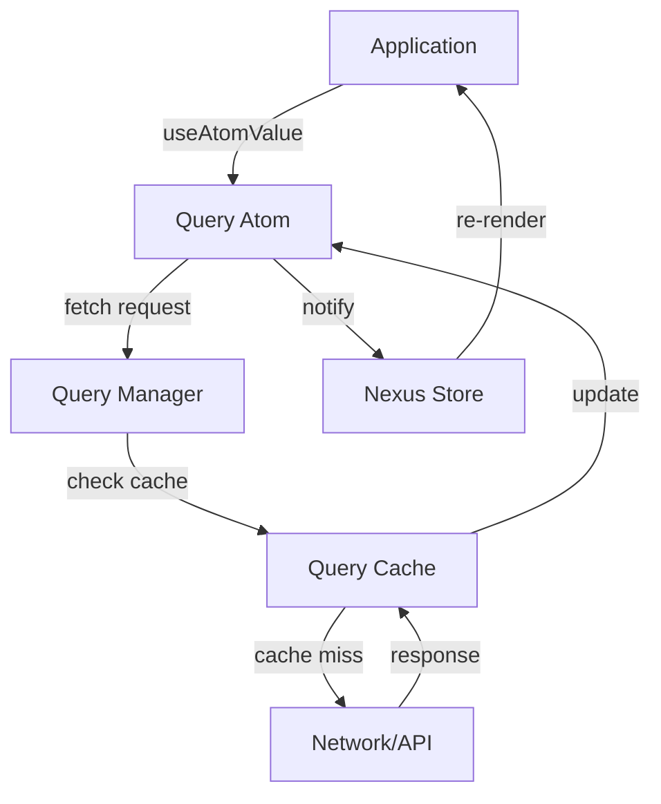

# @nexus-state/query - Architecture

> **Technical architecture for data fetching and caching package**

---

## 📋 Table of Contents

1. [Overview](#overview)
2. [Core Concepts](#core-concepts)
3. [System Architecture](#system-architecture)
4. [Query Lifecycle](#query-lifecycle)
5. [Caching Strategy](#caching-strategy)
6. [Request Deduplication](#request-deduplication)
7. [Background Refetching](#background-refetching)
8. [Optimistic Updates](#optimistic-updates)
9. [Performance Characteristics](#performance-characteristics)

---

## Overview

### Purpose
Build a powerful data fetching layer on top of Nexus State's atomic architecture, providing React Query-like functionality while maintaining framework agnosticism.

### Design Philosophy
1. **Atoms are queries** - Each query is an atom
2. **Composition over configuration** - Queries depend on other atoms
3. **Smart caching** - Automatic cache management
4. **Minimal API** - Simple primitives, powerful combinations

### Core Challenge
**Problem:** How to map asynchronous data fetching to synchronous atomic state?

**Solution:** Query atoms hold query state (data, loading, error) and automatically manage fetching lifecycle.

---

## Core Concepts

### Query Atom

**Definition:** An atom that represents an asynchronous data source.

```typescript
// Type definition
type QueryAtom<Data> = Atom<QueryState<Data>>;

type QueryState<Data> = {
  data: Data | undefined;
  error: Error | undefined;
  status: 'idle' | 'loading' | 'success' | 'error';
  isFetching: boolean;
  isLoading: boolean; // loading AND no data
  dataUpdatedAt: number;
  errorUpdatedAt: number;
};

// Internal metadata
type QueryMetadata = {
  key: string;
  fetcher: Fetcher;
  lastFetchTime: number;
  subscribers: number;
  cacheTime: number;
  staleTime: number;
};
```

### Query Cache

**Purpose:** Global cache for all query results

```typescript
class QueryCache {
  private cache: Map<string, CacheEntry>;
  private gcTimer: NodeJS.Timeout;
  
  get(key: string): CacheEntry | undefined;
  set(key: string, entry: CacheEntry): void;
  invalidate(key: string): void;
  clear(): void;
  gc(): void; // Garbage collect stale entries
}

type CacheEntry = {
  data: any;
  timestamp: number;
  subscribers: Set<Subscriber>;
};
```

---

## System Architecture

### High-Level Architecture

```
┌─────────────────────────────────────────────────────────┐
│                   Application Code                      │
└────────────────────┬────────────────────────────────────┘
                     │
         ┌───────────▼────────────┐
         │    Query Atom API      │
         │  (queryAtom, mutate)   │
         └───────────┬────────────┘
                     │
         ┌───────────▼────────────┐
         │   Query Manager        │
         │  - Request queue       │
         │  - Deduplication       │
         │  - Background refetch  │
         └───────────┬────────────┘
                     │
         ┌───────────▼────────────┐
         │    Query Cache         │
         │  - In-memory cache     │
         │  - Garbage collection  │
         └───────────┬────────────┘
                     │
         ┌───────────▼────────────┐
         │   Nexus Store          │
         │  (atom state storage)  │
         └────────────────────────┘
```

### Component Interaction



---

## Query Lifecycle

### Lifecycle States

```
┌─────────────────────────────────────────────────┐
│              Query Lifecycle                    │
├─────────────────────────────────────────────────┤
│                                                 │
│  idle ──subscribe──> loading ──success──> success
│                         │                       │
│                         └─────error────> error  │
│                                                 │
│  All states can transition to:                 │
│  - loading (refetch)                           │
│  - idle (reset)                                │
└─────────────────────────────────────────────────┘
```

### Lifecycle Flow

```typescript
// 1. Query Creation
const userQuery = queryAtom({
  key: 'user',
  fetcher: fetchUser
});
// State: { status: 'idle', data: undefined, error: undefined }

// 2. First Subscription (component mount)
useAtomValue(userQuery);
// Triggers fetch
// State: { status: 'loading', isFetching: true, ... }

// 3. Fetch Success
// State: { 
//   status: 'success', 
//   data: userData, 
//   isFetching: false,
//   dataUpdatedAt: Date.now()
// }

// 4. Background Refetch (after staleTime)
// State: { 
//   status: 'success', 
//   data: userData, 
//   isFetching: true // Note: still has data
// }

// 5. Refetch Success
// State: { 
//   status: 'success', 
//   data: newUserData, 
//   isFetching: false,
//   dataUpdatedAt: Date.now()
// }
```

---

## Caching Strategy

### Cache Layers

```typescript
// 3-tier caching system
class QueryCacheSystem {
  // Layer 1: In-memory cache (fastest)
  private memoryCache: Map<string, CacheEntry>;
  
  // Layer 2: Session storage (survives navigation)
  private sessionCache: SessionStorage;
  
  // Layer 3: IndexedDB (survives browser restart)
  private persistentCache: IndexedDB;
  
  async get(key: string): Promise<CacheEntry | null> {
    // 1. Check memory
    let entry = this.memoryCache.get(key);
    if (entry) return entry;
    
    // 2. Check session storage
    entry = await this.sessionCache.get(key);
    if (entry) {
      this.memoryCache.set(key, entry);
      return entry;
    }
    
    // 3. Check IndexedDB
    entry = await this.persistentCache.get(key);
    if (entry) {
      this.memoryCache.set(key, entry);
      this.sessionCache.set(key, entry);
      return entry;
    }
    
    return null;
  }
}
```

### Staleness Model

```typescript
// Time-based staleness
type CacheConfig = {
  staleTime: number;  // Data considered fresh
  cacheTime: number;  // Data kept in cache
};

function isStale(entry: CacheEntry, config: CacheConfig): boolean {
  const age = Date.now() - entry.timestamp;
  return age > config.staleTime;
}

function shouldEvict(entry: CacheEntry, config: CacheConfig): boolean {
  const age = Date.now() - entry.timestamp;
  const hasSubscribers = entry.subscribers.size > 0;
  return age > config.cacheTime && !hasSubscribers;
}

// Garbage collection
function garbageCollect() {
  for (const [key, entry] of cache.entries()) {
    if (shouldEvict(entry, config)) {
      cache.delete(key);
    }
  }
}
```

### Cache Invalidation

```typescript
// Invalidation strategies
class QueryInvalidator {
  // 1. Explicit invalidation
  invalidate(queryKey: string): void {
    const entry = cache.get(queryKey);
    if (entry) {
      entry.timestamp = 0; // Mark as stale
      triggerRefetch(queryKey);
    }
  }
  
  // 2. Pattern-based invalidation
  invalidateMatching(pattern: RegExp): void {
    for (const key of cache.keys()) {
      if (pattern.test(key)) {
        this.invalidate(key);
      }
    }
  }
  
  // 3. Time-based invalidation
  invalidateOlderThan(timestamp: number): void {
    for (const [key, entry] of cache.entries()) {
      if (entry.timestamp < timestamp) {
        this.invalidate(key);
      }
    }
  }
  
  // 4. Dependency-based invalidation
  invalidateDependents(queryKey: string): void {
    const dependents = getDependents(queryKey);
    dependents.forEach(dep => this.invalidate(dep));
  }
}
```

---

## Request Deduplication

### Problem
Multiple components requesting same data simultaneously.

```typescript
// Without deduplication:
<UserProfile />  ──> fetch('/api/user')  ┐
<UserHeader />   ──> fetch('/api/user')  ├─> 3 identical requests!
<UserSettings /> ──> fetch('/api/user')  ┘

// With deduplication:
<UserProfile />  ──> fetch('/api/user')  ┐
<UserHeader />   ──────┐                 ├─> 1 request shared
<UserSettings /> ──────┴─────────────────┘
```

### Implementation

```typescript
class RequestDeduplicator {
  private pendingRequests: Map<string, Promise<any>>;
  
  async fetch<Data>(
    key: string, 
    fetcher: () => Promise<Data>
  ): Promise<Data> {
    // Check if request already in flight
    const pending = this.pendingRequests.get(key);
    if (pending) {
      console.log(`Deduplicating request for ${key}`);
      return pending; // Return existing promise
    }
    
    // Start new request
    const promise = fetcher()
      .finally(() => {
        // Clean up when done
        this.pendingRequests.delete(key);
      });
    
    this.pendingRequests.set(key, promise);
    return promise;
  }
}

// Usage in query atom
async function executeQuery(queryAtom: QueryAtom) {
  const key = queryAtom.key;
  const fetcher = queryAtom.fetcher;
  
  return deduplicator.fetch(key, fetcher);
}
```

### Request Queue

```typescript
// Priority-based request queue
class RequestQueue {
  private queue: PriorityQueue<Request>;
  private activeRequests: Set<string>;
  private maxConcurrent: number = 6; // Browser limit
  
  async enqueue(request: Request): Promise<any> {
    // Add to queue
    this.queue.push(request);
    
    // Process queue
    return this.processQueue();
  }
  
  private async processQueue() {
    while (
      this.queue.length > 0 && 
      this.activeRequests.size < this.maxConcurrent
    ) {
      const request = this.queue.pop();
      this.activeRequests.add(request.key);
      
      try {
        const result = await request.execute();
        return result;
      } finally {
        this.activeRequests.delete(request.key);
      }
    }
  }
}

// Priority levels
enum Priority {
  CRITICAL = 0,   // User-initiated, blocking UI
  HIGH = 1,       // Visible on screen
  NORMAL = 2,     // Below fold
  LOW = 3,        // Prefetch, background
  IDLE = 4        // Can wait indefinitely
}
```

---

## Background Refetching

### Refetch Triggers

```typescript
type RefetchTriggers = {
  // 1. Time-based (polling)
  refetchInterval?: number;
  
  // 2. Focus-based
  refetchOnWindowFocus?: boolean;
  
  // 3. Network-based
  refetchOnReconnect?: boolean;
  
  // 4. Manual
  refetchOnMount?: boolean;
  
  // 5. Visibility-based
  refetchOnVisible?: boolean;
};
```

### Background Refetch Manager

```typescript
class BackgroundRefetchManager {
  private intervals: Map<string, NodeJS.Timeout>;
  private observers: Map<string, IntersectionObserver>;
  
  // Polling
  startPolling(queryKey: string, interval: number) {
    const timer = setInterval(() => {
      if (!isStale(queryKey)) return;
      refetch(queryKey);
    }, interval);
    
    this.intervals.set(queryKey, timer);
  }
  
  stopPolling(queryKey: string) {
    const timer = this.intervals.get(queryKey);
    if (timer) {
      clearInterval(timer);
      this.intervals.delete(queryKey);
    }
  }
  
  // Focus refetch
  onWindowFocus(queryKey: string) {
    window.addEventListener('focus', () => {
      if (isStale(queryKey)) {
        refetch(queryKey);
      }
    });
  }
  
  // Visibility refetch
  observeVisibility(element: Element, queryKey: string) {
    const observer = new IntersectionObserver((entries) => {
      if (entries[0].isIntersecting && isStale(queryKey)) {
        refetch(queryKey);
      }
    });
    
    observer.observe(element);
    this.observers.set(queryKey, observer);
  }
}
```

### Smart Refetching

```typescript
// Adaptive refetch intervals
class AdaptiveRefetchManager {
  private updateFrequencies: Map<string, number[]>;
  
  // Learn from update patterns
  recordUpdate(queryKey: string) {
    const now = Date.now();
    const updates = this.updateFrequencies.get(queryKey) || [];
    updates.push(now);
    
    // Keep last 10 updates
    if (updates.length > 10) {
      updates.shift();
    }
    
    this.updateFrequencies.set(queryKey, updates);
  }
  
  // Calculate optimal refetch interval
  getOptimalInterval(queryKey: string): number {
    const updates = this.updateFrequencies.get(queryKey);
    if (!updates || updates.length < 3) {
      return 60000; // Default: 1 minute
    }
    
    // Calculate average time between updates
    const intervals = [];
    for (let i = 1; i < updates.length; i++) {
      intervals.push(updates[i] - updates[i - 1]);
    }
    
    const avgInterval = intervals.reduce((a, b) => a + b) / intervals.length;
    
    // Refetch slightly more frequently than update rate
    return Math.max(avgInterval * 0.8, 5000); // Min 5 seconds
  }
}
```

---

## Optimistic Updates

### Pattern

```typescript
// Optimistic update flow
async function optimisticMutation<Data, Variables>(
  mutation: MutationFn<Data, Variables>,
  options: {
    onMutate: (variables: Variables) => Promise<Context>;
    onError: (error: Error, variables: Variables, context: Context) => void;
    onSuccess: (data: Data, variables: Variables, context: Context) => void;
    onSettled: () => void;
  }
) {
  let context: Context;
  
  try {
    // 1. Run onMutate (optimistic update)
    context = await options.onMutate(variables);
    
    // 2. Execute mutation
    const data = await mutation(variables);
    
    // 3. On success
    options.onSuccess(data, variables, context);
    
    return data;
  } catch (error) {
    // 4. On error (rollback)
    options.onError(error, variables, context);
    throw error;
  } finally {
    // 5. Always run
    options.onSettled();
  }
}
```

### Implementation Example

```typescript
// Add todo optimistically
const addTodoMutation = mutationAtom({
  mutationFn: async (newTodo: Todo) => {
    const response = await fetch('/api/todos', {
      method: 'POST',
      body: JSON.stringify(newTodo)
    });
    return response.json();
  },
  
  onMutate: async (newTodo) => {
    // Cancel outgoing refetches
    await cancelQueries(todosQuery);
    
    // Snapshot current value
    const previousTodos = getQueryData(todosQuery);
    
    // Optimistically update UI
    setQueryData(todosQuery, (old) => {
      return [
        ...old,
        { ...newTodo, id: 'temp-id', optimistic: true }
      ];
    });
    
    // Return context for rollback
    return { previousTodos };
  },
  
  onError: (error, newTodo, context) => {
    // Rollback to previous state
    setQueryData(todosQuery, context.previousTodos);
    
    // Show error toast
    toast.error('Failed to add todo');
  },
  
  onSuccess: (data, newTodo, context) => {
    // Replace temp todo with real one
    setQueryData(todosQuery, (old) => {
      return old.map(todo => 
        todo.id === 'temp-id' ? data : todo
      );
    });
  },
  
  onSettled: () => {
    // Always refetch to ensure consistency
    invalidateQuery(todosQuery);
  }
});
```

---

## Performance Characteristics

### Time Complexity

| Operation | Best Case | Average | Worst Case | Notes |
|-----------|-----------|---------|------------|-------|
| Cache lookup | O(1) | O(1) | O(1) | Map.get() |
| Query fetch | O(1) | O(n) | O(n) | Network dependent |
| Invalidation | O(1) | O(k) | O(k) | k = matching keys |
| Garbage collection | O(1) | O(n) | O(n) | n = cache entries |

### Space Complexity

| Structure | Space | Notes |
|-----------|-------|-------|
| Query cache | O(n × d) | n queries, d data size |
| Request queue | O(r) | r active requests |
| Subscribers | O(q × s) | q queries, s subscribers |

### Optimization Strategies

#### 1. Structural Sharing

```typescript
// Preserve object references for unchanged data
function updateWithStructuralSharing<T>(
  oldData: T,
  newData: T
): T {
  if (oldData === newData) return oldData;
  if (typeof oldData !== 'object') return newData;
  
  const result = { ...oldData };
  let changed = false;
  
  for (const key in newData) {
    const oldValue = oldData[key];
    const newValue = newData[key];
    
    result[key] = updateWithStructuralSharing(oldValue, newValue);
    if (result[key] !== oldValue) {
      changed = true;
    }
  }
  
  return changed ? result : oldData;
}
```

#### 2. Lazy Fetching

```typescript
// Only fetch when subscribed
const lazyQuery = queryAtom({
  key: 'lazy-data',
  fetcher: fetchData,
  enabled: (get) => get(subscriberCountAtom) > 0
});
```

#### 3. Request Batching

```typescript
// Batch multiple requests into one
class RequestBatcher {
  private batch: Request[] = [];
  private timer: NodeJS.Timeout;
  
  add(request: Request) {
    this.batch.push(request);
    
    if (!this.timer) {
      this.timer = setTimeout(() => this.flush(), 10);
    }
  }
  
  private async flush() {
    const requests = this.batch;
    this.batch = [];
    
    // Combine into single request
    const response = await fetch('/api/batch', {
      method: 'POST',
      body: JSON.stringify({
        requests: requests.map(r => r.toJSON())
      })
    });
    
    // Distribute responses
    const results = await response.json();
    results.forEach((result, i) => {
      requests[i].resolve(result);
    });
  }
}
```

---

## Appendix

### A. Comparison with Alternatives

| Feature | Nexus Query | React Query | SWR | Apollo |
|---------|-------------|-------------|-----|--------|
| Framework Agnostic | ✅ | ❌ | ❌ | ✅ |
| Built on Atoms | ✅ | ❌ | ❌ | ❌ |
| Bundle Size | ~5KB | ~13KB | ~4KB | ~30KB |
| TypeScript | ✅ | ✅ | ✅ | ✅ |
| DevTools | ✅ | ✅ | ❌ | ✅ |
| Optimistic Updates | ✅ | ✅ | ✅ | ✅ |

### B. Query Key Design

```typescript
// Hierarchical key structure
const keys = {
  // Users
  users: 'users',
  user: (id: string) => ['users', id],
  userPosts: (id: string) => ['users', id, 'posts'],
  
  // Posts
  posts: 'posts',
  post: (id: string) => ['posts', id],
  
  // Search
  search: (query: string) => ['search', query]
};

// Usage
const userQuery = queryAtom({
  key: keys.user(userId),
  fetcher: () => fetchUser(userId)
});
```

---

**Document Version:** 1.0  
**Last Updated:** 2026-02-26  
**Maintained By:** Query Team  
**Review Schedule:** Quarterly
