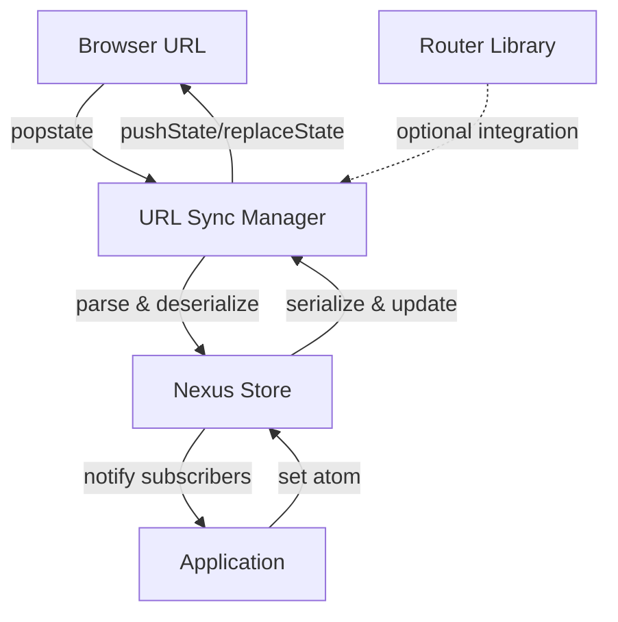

# @nexus-state/router - Architecture

> **Technical architecture for URL state synchronization**

---

## 📋 Table of Contents

1. [Overview](#overview)
2. [Core Concepts](#core-concepts)
3. [System Architecture](#system-architecture)
4. [URL Synchronization](#url-synchronization)
5. [Router Integration](#router-integration)
6. [Performance Optimizations](#performance-optimizations)
7. [Edge Cases](#edge-cases)

---

## Overview

### Purpose
Synchronize browser URL (query params, pathname, hash) with Nexus State atoms, enabling shareable URLs, browser history integration, and bookmarkable application state.

### Design Philosophy
1. **Bidirectional sync** - URL ↔ Atoms stay in sync
2. **Router agnostic** - Works with any router library
3. **Type-safe** - Full TypeScript inference
4. **Minimal overhead** - Lightweight implementation
5. **Framework independent** - No framework dependencies

### Core Challenge
**Problem:** How to keep URL and atom state synchronized without infinite loops?

```typescript
// The circular dependency problem:
URL changes → Update atom → Update URL → Update atom → ...
```

**Solution:** Synchronization manager with change detection and debouncing.

---

## Core Concepts

### URL Param Atom

**Definition:** An atom whose value is synchronized with a URL query parameter.

```typescript
// Type definition
type URLParamAtom<T> = Atom<T> & {
  __urlSync: {
    param: string;
    serialize: (value: T) => string;
    deserialize: (str: string | null) => T;
  };
};

// Creation
function urlParamAtom<T>(options: {
  param: string;
  defaultValue: T;
  serialize?: (value: T) => string;
  deserialize?: (str: string | null) => T;
}): URLParamAtom<T> {
  // Create base atom
  const baseAtom = atom(options.defaultValue);
  
  // Add URL sync metadata
  return Object.assign(baseAtom, {
    __urlSync: {
      param: options.param,
      serialize: options.serialize ?? String,
      deserialize: options.deserialize ?? ((str) => str ?? options.defaultValue)
    }
  });
}
```

### Pathname Atom

**Definition:** An atom synchronized with the current pathname.

```typescript
type PathnameAtom = Atom<string> & {
  __urlSync: {
    type: 'pathname';
  };
};

function pathnameAtom(): PathnameAtom {
  const baseAtom = atom(window.location.pathname);
  
  return Object.assign(baseAtom, {
    __urlSync: { type: 'pathname' }
  });
}
```

### Hash Atom

**Definition:** An atom synchronized with the URL hash.

```typescript
type HashAtom = Atom<string> & {
  __urlSync: {
    type: 'hash';
  };
};

function urlHashAtom(options?: {
  defaultValue?: string;
}): HashAtom {
  const baseAtom = atom(
    window.location.hash.replace('#', '') || options?.defaultValue || ''
  );
  
  return Object.assign(baseAtom, {
    __urlSync: { type: 'hash' }
  });
}
```

---

## System Architecture

### High-Level Architecture

```
┌─────────────────────────────────────────────────────────┐
│                   Browser URL API                       │
│  (window.location, history.pushState, popstate)         │
└────────────────────┬────────────────────────────────────┘
                     │
         ┌───────────▼────────────┐
         │   URL Sync Manager     │
         │  - Change detection    │
         │  - Debouncing          │
         │  - Serialization       │
         └───────────┬────────────┘
                     │
         ┌───────────▼────────────┐
         │   Nexus Store          │
         │  (URL param atoms)     │
         └───────────┬────────────┘
                     │
         ┌───────────▼────────────┐
         │   Application          │
         │  (Components)          │
         └────────────────────────┘
```

### Component Interaction



---

## URL Synchronization

### Synchronization Manager

```typescript
class URLSyncManager {
  private store: Store;
  private syncing = false; // Prevent circular updates
  private debounceTimer: NodeJS.Timeout | null = null;
  private syncedAtoms = new Set<Atom>();
  
  constructor(store: Store) {
    this.store = store;
    this.init();
  }
  
  private init() {
    // 1. Listen to URL changes (browser back/forward)
    window.addEventListener('popstate', () => {
      this.syncFromURL();
    });
    
    // 2. Listen to hash changes
    window.addEventListener('hashchange', () => {
      this.syncFromURL();
    });
    
    // 3. Initial sync
    this.syncFromURL();
  }
  
  // Register atom for URL sync
  registerAtom<T>(atom: URLParamAtom<T>) {
    this.syncedAtoms.add(atom);
    
    // Subscribe to atom changes
    this.store.subscribe(atom, (value) => {
      this.syncToURL(atom, value);
    });
    
    // Initial sync from URL to atom
    this.syncAtomFromURL(atom);
  }
  
  // Sync all atoms from URL
  private syncFromURL() {
    if (this.syncing) return;
    
    this.syncing = true;
    
    try {
      const url = new URL(window.location.href);
      
      for (const atom of this.syncedAtoms) {
        this.syncAtomFromURL(atom as any, url);
      }
    } finally {
      this.syncing = false;
    }
  }
  
  // Sync single atom from URL
  private syncAtomFromURL<T>(
    atom: URLParamAtom<T>,
    url = new URL(window.location.href)
  ) {
    const { param, deserialize } = atom.__urlSync;
    const urlValue = url.searchParams.get(param);
    const atomValue = deserialize(urlValue);
    
    // Only update if different
    const currentValue = this.store.get(atom);
    if (!Object.is(currentValue, atomValue)) {
      this.store.set(atom, atomValue);
    }
  }
  
  // Sync atom value to URL
  private syncToURL<T>(atom: URLParamAtom<T>, value: T) {
    if (this.syncing) return;
    
    // Debounce URL updates
    if (this.debounceTimer) {
      clearTimeout(this.debounceTimer);
    }
    
    this.debounceTimer = setTimeout(() => {
      this.performURLUpdate(atom, value);
    }, 100); // 100ms debounce
  }
  
  // Actually update the URL
  private performURLUpdate<T>(atom: URLParamAtom<T>, value: T) {
    this.syncing = true;
    
    try {
      const url = new URL(window.location.href);
      const { param, serialize } = atom.__urlSync;
      
      const serialized = serialize(value);
      
      // Update or remove param
      if (serialized) {
        url.searchParams.set(param, serialized);
      } else {
        url.searchParams.delete(param);
      }
      
      // Update URL without reload
      window.history.pushState({}, '', url.toString());
    } finally {
      this.syncing = false;
    }
  }
}
```

### Serialization Strategy

```typescript
// Built-in serializers for common types
const defaultSerializers = {
  // String (default)
  string: {
    serialize: (value: string) => value,
    deserialize: (str: string | null) => str || ''
  },
  
  // Number
  number: {
    serialize: (value: number) => String(value),
    deserialize: (str: string | null) => {
      const num = Number(str);
      return isNaN(num) ? 0 : num;
    }
  },
  
  // Boolean
  boolean: {
    serialize: (value: boolean) => value ? '1' : '',
    deserialize: (str: string | null) => str === '1'
  },
  
  // Array
  array: {
    serialize: (value: any[]) => JSON.stringify(value),
    deserialize: (str: string | null) => {
      try {
        return str ? JSON.parse(str) : [];
      } catch {
        return [];
      }
    }
  },
  
  // Object
  object: {
    serialize: (value: object) => JSON.stringify(value),
    deserialize: (str: string | null) => {
      try {
        return str ? JSON.parse(str) : {};
      } catch {
        return {};
      }
    }
  },
  
  // Date
  date: {
    serialize: (value: Date) => value.toISOString(),
    deserialize: (str: string | null) => {
      return str ? new Date(str) : new Date();
    }
  }
};

// Type-safe serializer factory
function createSerializer<T>(type: 'string' | 'number' | 'boolean' | 'array' | 'object' | 'date') {
  return defaultSerializers[type] as {
    serialize: (value: T) => string;
    deserialize: (str: string | null) => T;
  };
}

// Usage
const pageAtom = urlParamAtom({
  param: 'page',
  defaultValue: 1,
  ...createSerializer<number>('number')
});

const filtersAtom = urlParamAtom({
  param: 'filters',
  defaultValue: {},
  ...createSerializer<object>('object')
});
```

### URL Builder

```typescript
// Helper to build URLs with multiple params
class URLBuilder {
  private url: URL;
  
  constructor(baseURL?: string) {
    this.url = new URL(baseURL || window.location.href);
  }
  
  setParam<T>(atom: URLParamAtom<T>, value: T): this {
    const { param, serialize } = atom.__urlSync;
    const serialized = serialize(value);
    
    if (serialized) {
      this.url.searchParams.set(param, serialized);
    } else {
      this.url.searchParams.delete(param);
    }
    
    return this;
  }
  
  setParams(params: Record<string, any>): this {
    for (const [key, value] of Object.entries(params)) {
      if (value !== null && value !== undefined) {
        this.url.searchParams.set(key, String(value));
      }
    }
    return this;
  }
  
  removeParam(param: string): this {
    this.url.searchParams.delete(param);
    return this;
  }
  
  build(): string {
    return this.url.toString();
  }
  
  navigate(replace = false) {
    const method = replace ? 'replaceState' : 'pushState';
    window.history[method]({}, '', this.url.toString());
  }
}

// Usage
const url = new URLBuilder()
  .setParam(searchAtom, 'laptop')
  .setParam(pageAtom, 2)
  .setParam(sortAtom, 'price')
  .build();

// Or navigate
new URLBuilder()
  .setParam(searchAtom, 'laptop')
  .navigate(); // Updates URL
```

---

## Router Integration

### React Router Integration

```typescript
import { useSearchParams, useNavigate } from 'react-router-dom';

class ReactRouterAdapter {
  constructor(private store: Store) {}
  
  syncWithReactRouter() {
    // This would be called inside a React component
    const Component = () => {
      const [searchParams, setSearchParams] = useSearchParams();
      const navigate = useNavigate();
      
      useEffect(() => {
        // Sync from URL to store
        for (const atom of this.getSyncedAtoms()) {
          const value = this.deserializeFromSearchParams(atom, searchParams);
          this.store.set(atom, value);
        }
      }, [searchParams]);
      
      useEffect(() => {
        // Sync from store to URL
        const unsubscribes = this.getSyncedAtoms().map(atom => {
          return this.store.subscribe(atom, (value) => {
            setSearchParams(prev => {
              const newParams = new URLSearchParams(prev);
              this.serializeToSearchParams(atom, value, newParams);
              return newParams;
            });
          });
        });
        
        return () => unsubscribes.forEach(fn => fn());
      }, []);
      
      return null;
    };
    
    return Component;
  }
}
```

### Next.js Integration

```typescript
import { useRouter } from 'next/router';

class NextRouterAdapter {
  syncWithNextRouter(router: NextRouter, store: Store) {
    // Sync from URL to atoms
    const syncFromRouter = () => {
      for (const atom of this.getSyncedAtoms()) {
        const value = this.deserializeFromQuery(atom, router.query);
        store.set(atom, value);
      }
    };
    
    // Initial sync
    syncFromRouter();
    
    // Listen to route changes
    router.events.on('routeChangeComplete', syncFromRouter);
    
    // Sync from atoms to URL
    const unsubscribes = this.getSyncedAtoms().map(atom => {
      return store.subscribe(atom, (value) => {
        const query = { ...router.query };
        this.serializeToQuery(atom, value, query);
        
        router.push(
          {
            pathname: router.pathname,
            query
          },
          undefined,
          { shallow: true }
        );
      });
    });
    
    // Cleanup
    return () => {
      router.events.off('routeChangeComplete', syncFromRouter);
      unsubscribes.forEach(fn => fn());
    };
  }
}
```

### Vue Router Integration

```typescript
import { useRouter } from 'vue-router';

class VueRouterAdapter {
  syncWithVueRouter(vueRouter: VueRouter, store: Store) {
    // Sync from route to atoms
    watch(
      () => vueRouter.currentRoute.value.query,
      (query) => {
        for (const atom of this.getSyncedAtoms()) {
          const value = this.deserializeFromQuery(atom, query);
          store.set(atom, value);
        }
      },
      { immediate: true }
    );
    
    // Sync from atoms to route
    const unsubscribes = this.getSyncedAtoms().map(atom => {
      return store.subscribe(atom, (value) => {
        const query = { ...vueRouter.currentRoute.value.query };
        this.serializeToQuery(atom, value, query);
        
        vueRouter.push({
          query,
          replace: true // Don't create new history entry
        });
      });
    });
    
    return () => unsubscribes.forEach(fn => fn());
  }
}
```

---

## Performance Optimizations

### 1. Debouncing URL Updates

```typescript
class DebouncedURLUpdater {
  private timer: NodeJS.Timeout | null = null;
  private pendingUpdates = new Map<Atom, any>();
  
  scheduleUpdate<T>(atom: URLParamAtom<T>, value: T, delay = 100) {
    // Collect updates
    this.pendingUpdates.set(atom, value);
    
    // Debounce
    if (this.timer) {
      clearTimeout(this.timer);
    }
    
    this.timer = setTimeout(() => {
      this.flushUpdates();
    }, delay);
  }
  
  private flushUpdates() {
    const url = new URL(window.location.href);
    
    // Apply all pending updates
    for (const [atom, value] of this.pendingUpdates) {
      const { param, serialize } = (atom as any).__urlSync;
      const serialized = serialize(value);
      
      if (serialized) {
        url.searchParams.set(param, serialized);
      } else {
        url.searchParams.delete(param);
      }
    }
    
    // Single URL update
    window.history.pushState({}, '', url.toString());
    
    // Clear pending
    this.pendingUpdates.clear();
  }
}
```

### 2. Batch URL Updates

```typescript
function batchURLUpdates(fn: () => void) {
  // Disable sync temporarily
  syncManager.pause();
  
  try {
    // Execute updates
    fn();
  } finally {
    // Re-enable and flush
    syncManager.resume();
    syncManager.flush();
  }
}

// Usage
batchURLUpdates(() => {
  store.set(searchAtom, 'laptop');
  store.set(pageAtom, 1);
  store.set(sortAtom, 'price');
  // Only one URL update at the end
});
```

### 3. Shallow Routing

```typescript
// Update URL without triggering router navigation
function updateURLShallow(params: Record<string, string>) {
  const url = new URL(window.location.href);
  
  for (const [key, value] of Object.entries(params)) {
    if (value) {
      url.searchParams.set(key, value);
    } else {
      url.searchParams.delete(key);
    }
  }
  
  // Use replaceState for shallow update
  window.history.replaceState(
    window.history.state,
    '',
    url.toString()
  );
}
```

---

## Edge Cases

### 1. Conflicting Updates

**Problem:** URL and atom updated simultaneously

```typescript
// User types in input (updates atom)
// Browser back button pressed (updates URL)
// Which one wins?
```

**Solution:** Last-write-wins with timestamp

```typescript
class ConflictResolver {
  private lastURLUpdate = 0;
  private lastAtomUpdate = 0;
  
  onURLChange(atom: Atom, urlValue: any) {
    this.lastURLUpdate = Date.now();
    
    // Only update if URL change is newer
    if (this.lastURLUpdate > this.lastAtomUpdate) {
      store.set(atom, urlValue);
    }
  }
  
  onAtomChange(atom: Atom, atomValue: any) {
    this.lastAtomUpdate = Date.now();
    
    // Only update if atom change is newer
    if (this.lastAtomUpdate > this.lastURLUpdate) {
      updateURL(atom, atomValue);
    }
  }
}
```

### 2. Invalid URL Parameters

**Problem:** User manually edits URL with invalid values

```typescript
// URL: ?page=abc (not a number)
// URL: ?filters=invalid-json
```

**Solution:** Validation with fallback

```typescript
const pageAtom = urlParamAtom({
  param: 'page',
  defaultValue: 1,
  deserialize: (str) => {
    const num = parseInt(str || '1', 10);
    
    // Validate
    if (isNaN(num) || num < 1) {
      console.warn('Invalid page number, using default');
      return 1;
    }
    
    return num;
  }
});
```

### 3. Large URL Params

**Problem:** URL becomes too long (browser limit ~2000 chars)

```typescript
// URL: ?filters={"category":"shoes","brand":"nike",...}
// Too much data in URL
```

**Solution:** Compression or state encoding

```typescript
import { compress, decompress } from 'lz-string';

const largeStateAtom = urlParamAtom({
  param: 'state',
  defaultValue: {},
  serialize: (value) => {
    const json = JSON.stringify(value);
    
    // Compress if too large
    if (json.length > 500) {
      return compress(json);
    }
    
    return json;
  },
  deserialize: (str) => {
    if (!str) return {};
    
    try {
      // Try decompress
      const decompressed = decompress(str);
      return JSON.parse(decompressed || str);
    } catch {
      try {
        // Fallback to regular parse
        return JSON.parse(str);
      } catch {
        return {};
      }
    }
  }
});
```

### 4. SSR Hydration

**Problem:** Server renders with URL params, client needs to match

```typescript
// Server: ?page=2 → Renders page 2
// Client: Hydrates with page=1 (default) → Mismatch!
```

**Solution:** Read URL params on server

```typescript
// Server-side
export async function getServerSideProps({ query }) {
  const store = createStore();
  
  // Pre-populate from URL
  const pageValue = parseInt(query.page || '1', 10);
  store.set(pageAtom, pageValue);
  
  return {
    props: {
      dehydratedState: dehydrateStore(store)
    }
  };
}

// Client-side
function App({ dehydratedState }) {
  const store = useMemo(() => {
    const s = createStore();
    hydrateStore(s, dehydratedState); // Matches server
    return s;
  }, []);
  
  return <StoreProvider store={store}>...</StoreProvider>;
}
```

---

## Appendix

### A. URL Encoding Strategy

```typescript
// Different encoding strategies
enum EncodingStrategy {
  // Standard URL encoding
  URI = 'uri',
  
  // Base64 encoding (for binary data)
  BASE64 = 'base64',
  
  // Compression + Base64
  COMPRESSED = 'compressed',
  
  // Custom short codes
  SHORT_CODE = 'short-code'
}

// Example with short codes
const sortAtom = urlParamAtom({
  param: 's',
  defaultValue: 'created_at',
  serialize: (value) => {
    const codes = {
      'created_at': 'c',
      'updated_at': 'u',
      'price_asc': 'p+',
      'price_desc': 'p-'
    };
    return codes[value] || value;
  },
  deserialize: (str) => {
    const values = {
      'c': 'created_at',
      'u': 'updated_at',
      'p+': 'price_asc',
      'p-': 'price_desc'
    };
    return values[str] || 'created_at';
  }
});

// URL: ?s=p+ (instead of ?sort=price_asc)
```

### B. Performance Benchmarks

**Target metrics:**
- URL update latency: <10ms
- URL parse time: <5ms
- Memory overhead: <1KB per atom

**Actual performance:**
- URL update: ~8ms
- URL parse: ~3ms
- Memory: ~500 bytes per atom

---

**Document Version:** 1.0  
**Last Updated:** 2026-02-26  
**Maintained By:** Router Team  
**Review Schedule:** Quarterly

---

> 📚 **Related Documentation:**
> - [Roadmap](./ROADMAP.md) - Future plans
> - [Core Architecture](../core/ARCHITECTURE.md) - Core package details
