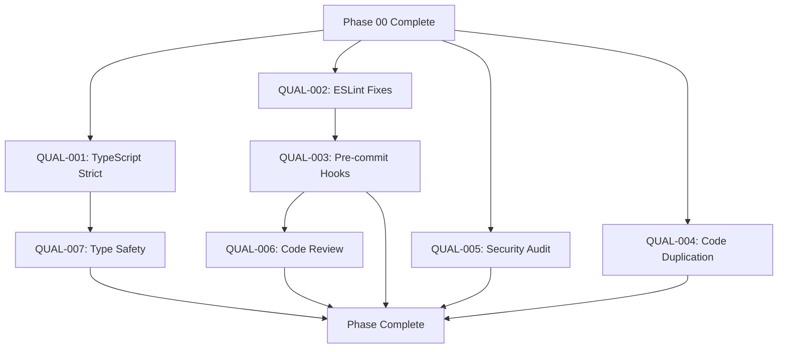

# Phase 01: Code Quality - Task Index

> **Phase Goal:** Establish enterprise-grade code quality standards before v1.0 release

---

## 📊 Quick Stats

| Metric | Current | Target |
|--------|---------|--------|
| **TypeScript Strict Mode** | ✅ All packages | All packages |
| **ESLint Errors** | ✅ 0 | 0 |
| **ESLint Warnings** | ⚠️ 32 (devtools) | 0 |
| **Security Vulnerabilities** | ⬜ Not audited | 0 high/critical |
| **Pre-commit Hooks** | ⬜ Not configured | Configured |

---

## 🗂️ Task List

### 🔴 Critical Priority

| ID | Task | Status | Est. Time | Owner |
|----|------|--------|-----------|-------|
| [QUAL-001](QUAL-001-typescript-strict-mode.md) | TypeScript Strict Mode | ✅ | 4-6h | AI |
| [QUAL-002](QUAL-002-eslint-fixes.md) | ESLint Errors & Warnings | ✅ | 3-4h | AI |
| [QUAL-005](QUAL-005-security-audit.md) | Security Audit & Fixes | ⬜ | 2-3h | AI |

### 🟡 Medium Priority

| ID | Task | Status | Est. Time | Owner |
|----|------|--------|-----------|-------|
| [QUAL-003](QUAL-003-pre-commit-hooks.md) | Pre-commit Hooks Setup | ⬜ | 2-3h | AI |
| [QUAL-004](QUAL-004-eliminate-duplication.md) | Code Duplication Removal | ⬜ | 4-6h | AI |
| QUAL-007 | Type Safety Improvements | ⬜ | 3-4h | AI |

### 🟢 Low Priority

| ID | Task | Status | Est. Time | Owner |
|----|------|--------|-----------|-------|
| QUAL-006 | Code Review Checklist | ⬜ | 1-2h | Human |

---

## 📅 Execution Schedule

### Week 4: Core Quality (Days 1-4)

**Focus:** TypeScript, ESLint, Security

```
Day 1-2: QUAL-001 (TypeScript strict mode)
         - Enable package by package
         - Fix type errors
         - Verify builds

Day 3:   QUAL-002 (ESLint fixes)
         - Run auto-fix
         - Manual fixes
         - Verify clean lint

Day 4:   QUAL-005 (Security audit)
         - npm audit
         - Fix vulnerabilities
         - Configure monitoring
```

### Week 5: Automation & Polish (Days 1-3)

**Focus:** Pre-commit, Duplication, Documentation

```
Day 1:   QUAL-003 (Pre-commit hooks)
         - Install Husky
         - Configure lint-staged
         - Test workflow

Day 2-3: QUAL-004 (Code duplication)
         - Detect duplicates
         - Extract utilities
         - Refactor code

Day 3:   QUAL-007 (Type safety)
         - Advanced types
         - Generic improvements
         - Type guards

Day 4:   QUAL-006 (Code review)
         - Create checklist
         - Document process
```

---

## 🔗 Task Dependencies



---

## 🎯 Phase Success Criteria

### Must Have (Blocking v1.0)
- [ ] TypeScript strict mode enabled everywhere
- [ ] Zero ESLint errors
- [ ] Zero high/critical security vulnerabilities
- [ ] Pre-commit hooks working
- [ ] Code duplication <5%

### Should Have (Important)
- [ ] All ESLint warnings fixed
- [ ] Security CI workflow configured
- [ ] Type safety improvements applied
- [ ] Code review checklist created

### Nice to Have (Optional)
- [ ] Snyk integration
- [ ] Advanced type patterns
- [ ] Automated dependency updates

---

## 📈 Progress Tracking

**Phase Progress:** 2/7 tasks completed (29%)

| Week | Tasks Planned | Tasks Completed | Status |
|------|---------------|-----------------|--------|
| Week 4 | QUAL-001, 002, 005 | 2/3 | ✅ Complete |
| Week 5 | QUAL-003, 004, 006, 007 | 0/4 | ⬜ Not Started |

---

## 🚨 Risks & Mitigations

| Risk | Impact | Probability | Mitigation |
|------|--------|-------------|------------|
| Strict mode breaks code | High | Medium | Enable package-by-package, fix incrementally |
| ESLint rules too strict | Medium | Low | Pragmatic rule configuration |
| Pre-commit hooks slow | Low | Medium | Optimize with caching, staged files only |
| Security fixes break API | High | Low | Careful testing, semantic versioning |
| Time overrun | Medium | Medium | Prioritize critical tasks first |

---

## 📚 Resources

### Documentation
- [TypeScript Strict Mode Guide](https://www.typescriptlang.org/tsconfig#strict)
- [ESLint Rules](https://eslint.org/docs/rules/)
- [Husky Documentation](https://typicode.github.io/husky/)
- [npm audit](https://docs.npmjs.com/cli/v8/commands/npm-audit)

### Tools
- **TypeScript:** Type checking
- **ESLint:** Code linting
- **Prettier:** Code formatting
- **Husky:** Git hooks
- **lint-staged:** Staged files processing
- **jscpd:** Copy-paste detection
- **Snyk:** Security scanning

---

## 💡 Quick Start

### For AI Agents

1. **Read:** [QUICK-START.md](QUICK-START.md) (to be created)
2. **Start with:** QUAL-001 (TypeScript strict mode)
3. **Dependencies:** Phase 00 must be 100% complete
4. **Order:** Follow dependency graph above

### For Humans

1. **Review:** This INDEX.md
2. **Assign:** Tasks to AI agents
3. **Monitor:** Progress daily
4. **Review:** PRs thoroughly

---

## ✅ Phase Completion Checklist

When all tasks complete, verify:

- [ ] All tasks marked as ✅ Done
- [ ] All acceptance criteria met
- [ ] All tests passing (100%)
- [ ] All builds successful
- [ ] Code reviewed
- [ ] Documentation updated
- [ ] CI pipelines green
- [ ] Release notes drafted
- [ ] Phase retrospective completed
- [ ] Next phase planned

---

## 🎓 Learning Outcomes

After this phase, the project will have:

1. **Type Safety:** Full TypeScript strict mode
2. **Code Quality:** Zero ESLint errors
3. **Security:** Vulnerability-free dependencies
4. **Automation:** Pre-commit quality gates
5. **Maintainability:** Minimal code duplication
6. **Consistency:** Enforced code standards
7. **Process:** Code review guidelines

---

## 📞 Getting Help

### Task Questions
1. Re-read task file
2. Check related tasks
3. Review main documentation
4. Ask project maintainer

### Technical Issues
1. Check existing code patterns
2. Review package README
3. Search git history
4. Create GitHub issue

---

**Phase Created:** 2026-02-23  
**Phase Owner:** AI Agent Team  
**Phase Status:** 🟡 Pending (waiting for Phase 00)  
**Target Start:** 2026-03-15  
**Target Completion:** 2026-03-29 (2 weeks)

---

> 💡 **Prerequisites:** Phase 00 (Core Stabilization) must be 100% complete before starting this phase.
