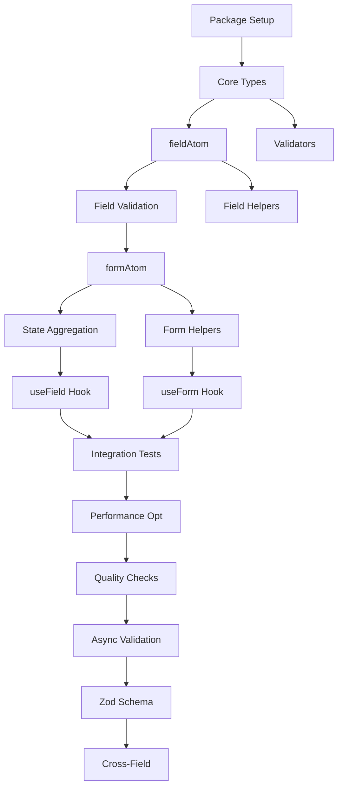

# Phase 10: Forms Package Implementation

## 🎯 Phase Overview

**Goal:** Build `@nexus-state/forms` - a type-safe, atomic form state management library with validation support.

**Duration:** 8-10 weeks  
**Priority:** 🟡 Medium  
**Status:** ⬜ Not Started

---

## 📊 Success Criteria

- [ ] Core form atoms (fieldAtom, formAtom) implemented
- [ ] Basic validation system working
- [ ] React integration (useField, useForm hooks)
- [ ] Bundle size < 3KB (core, gzipped)
- [ ] Test coverage ≥ 95%
- [ ] Full TypeScript support (no `any` types)
- [ ] Schema validation (Zod, Yup) support
- [ ] Comprehensive documentation
- [ ] Working demo application

---

## 📋 Task Breakdown

### Phase 10.1: Project Setup & Core Types (Week 1-2)

| Task ID | Title | Priority | Estimated Time | Status |
|---------|-------|----------|----------------|--------|
| FORM-001 | Initialize Package Structure | 🔴 High | 0.5 hours | ⬜ Not Started |
| FORM-002 | Define Core TypeScript Types | 🔴 High | 1 hour | ⬜ Not Started |

### Phase 10.2: Field Atom Implementation (Week 2-3)

| Task ID | Title | Priority | Estimated Time | Status |
|---------|-------|----------|----------------|--------|
| FORM-003 | Implement fieldAtom Factory | 🔴 High | 2 hours | ⬜ Not Started |
| FORM-004 | Implement Field Validation Logic | 🔴 High | 2 hours | ⬜ Not Started |
| FORM-005 | Implement Field Helper Functions | 🟡 Medium | 1.5 hours | ⬜ Not Started |

### Phase 10.3: Form Atom Implementation (Week 3-4)

| Task ID | Title | Priority | Estimated Time | Status |
|---------|-------|----------|----------------|--------|
| FORM-006 | Implement formAtom Factory | 🔴 High | 3 hours | ⬜ Not Started |
| FORM-007 | Implement Form State Aggregation | 🔴 High | 2 hours | ⬜ Not Started |
| FORM-008 | Implement Form Helper Functions | 🟡 Medium | 2 hours | ⬜ Not Started |

### Phase 10.4: Core Validation System (Week 4-5)

| Task ID | Title | Priority | Estimated Time | Status |
|---------|-------|----------|----------------|--------|
| FORM-009 | Implement Built-in Validators | 🟡 Medium | 2 hours | ⬜ Not Started |
| FORM-010 | Implement Validator Composition | 🟡 Medium | 1.5 hours | ⬜ Not Started |

### Phase 10.5: React Integration (Week 5-6)

| Task ID | Title | Priority | Estimated Time | Status |
|---------|-------|----------|----------------|--------|
| FORM-011 | Implement useField Hook | 🔴 High | 2 hours | ⬜ Not Started |
| FORM-012 | Implement useForm Hook | 🔴 High | 2.5 hours | ⬜ Not Started |
| FORM-013 | Create React Entry Point | 🟡 Medium | 0.5 hours | ⬜ Not Started |

### Phase 10.6: Testing & Documentation (Week 6-7)

| Task ID | Title | Priority | Estimated Time | Status |
|---------|-------|----------|----------------|--------|
| FORM-014 | Create Integration Tests | 🟡 Medium | 3 hours | ⬜ Not Started |
| FORM-015 | Write API Documentation | 🟡 Medium | 2 hours | ⬜ Not Started |
| FORM-016 | Create Demo Application | 🟢 Low | 2 hours | ⬜ Not Started |

### Phase 10.7: Package Finalization (Week 7-8)

| Task ID | Title | Priority | Estimated Time | Status |
|---------|-------|----------|----------------|--------|
| FORM-017 | Performance Optimization | 🟡 Medium | 2 hours | ⬜ Not Started |
| FORM-018 | Final Quality Checks | 🔴 High | 1 hour | ⬜ Not Started |

### Phase 10.8: Advanced Validation (Week 8-9)

| Task ID | Title | Priority | Estimated Time | Status |
|---------|-------|----------|----------------|--------|
| FORM-019 | Implement Async Validation | 🔴 High | 2.5 hours | ⬜ Not Started |
| FORM-020 | Implement Zod Schema Support | 🔴 High | 3 hours | ⬜ Not Started |
| FORM-021 | Implement Yup Schema Support | 🟡 Medium | 2.5 hours | ⬜ Not Started |
| FORM-022 | Implement Cross-Field Validation | 🟡 Medium | 2.5 hours | ⬜ Not Started |
| FORM-023 | Implement Validation Strategies | 🟡 Medium | 2 hours | ⬜ Not Started |

### Phase 10.9: Advanced Testing & Docs (Week 9-10)

| Task ID | Title | Priority | Estimated Time | Status |
|---------|-------|----------|----------------|--------|
| FORM-024 | Comprehensive Validation Tests | 🔴 High | 3 hours | ⬜ Not Started |
| FORM-025 | Update Documentation for v0.2.0 | 🟡 Medium | 2 hours | ⬜ Not Started |
| FORM-026 | Performance Testing & Optimization | 🟡 Medium | 2 hours | ⬜ Not Started |

---

## 🔗 Dependencies

---

## 📈 Progress Tracking

**Overall Progress:** 0/26 tasks completed (0%)

### Milestone 1: v0.1.0 - Core Functionality (Weeks 1-7)
- [ ] FORM-001 to FORM-018 (18 tasks)
- Target: Basic form management with validation

### Milestone 2: v0.2.0 - Advanced Validation (Weeks 8-10)
- [ ] FORM-019 to FORM-026 (8 tasks)
- Target: Schema integration and advanced validation

---

## 🚨 Critical Path

The following tasks are on the critical path and must be completed in order:

1. **FORM-001**: Package Setup (blocks everything)
2. **FORM-002**: Core Types (blocks all implementation)
3. **FORM-003**: fieldAtom (blocks React integration)
4. **FORM-006**: formAtom (blocks React integration)
5. **FORM-011/012**: React Hooks (blocks demos and docs)
6. **FORM-018**: Quality Checks (blocks v0.1.0 release)

---

## 🚨 Blockers & Risks

| Risk | Impact | Mitigation | Status |
|------|--------|------------|--------|
| Type inference complexity | High | Use established patterns from Jotai/Zustand | ⬜ Monitoring |
| Bundle size creep | Medium | Regular size checks, tree-shaking tests | ⬜ Monitoring |
| Schema library compatibility | Medium | Support multiple schemas (Zod, Yup, Joi) | ⬜ Monitoring |
| Performance with large forms | High | Benchmark with 100+ fields, optimize early | ⬜ Monitoring |

---

## 📝 Best Practices & Guidelines

### Code Quality
- ✅ **No `any` types** - Use `unknown` or proper generics
- ✅ **Single Responsibility Principle** - Each function has one job
- ✅ **Immutability** - Never mutate state directly
- ✅ **Pure functions** - Especially for validators
- ✅ **Type inference** - Leverage TypeScript's type system

### Testing Requirements
- ✅ **95%+ coverage** - All code paths tested
- ✅ **Integration tests** - Test real-world scenarios
- ✅ **Type tests** - Use `test-d.ts` files
- ✅ **Edge cases** - Test boundary conditions
- ✅ **Performance tests** - Benchmark critical paths

### Documentation Standards
- ✅ **JSDoc** - All public APIs documented
- ✅ **Code examples** - Every API has usage examples
- ✅ **Type signatures** - Show TypeScript types
- ✅ **Migration guides** - Document breaking changes

---

## 📚 Reference Documentation

- **Architecture:** `packages/forms/ARCHITECTURE.md`
- **Roadmap:** `packages/forms/ROADMAP.md`
- **Core Types:** `packages/core/src/types.ts`
- **Store API:** `packages/core/src/store.ts`

---

## 🎯 Performance Targets

### v0.1.0 Targets
- Bundle size: < 3KB (core, gzipped)
- Field update latency: < 5ms
- Form (100 fields) render: < 50ms
- Sync validation: < 10ms

### v0.2.0 Targets
- Bundle size: < 4KB (core, gzipped)
- Async validation: < 100ms (with network)
- Schema validation: < 15ms
- No memory leaks

---

**Created:** 2026-02-28  
**Last Updated:** 2026-02-28  
**Phase Owner:** AI Agent  
**Target Release:** v0.1.0 (July 2026), v0.2.0 (September 2026)
